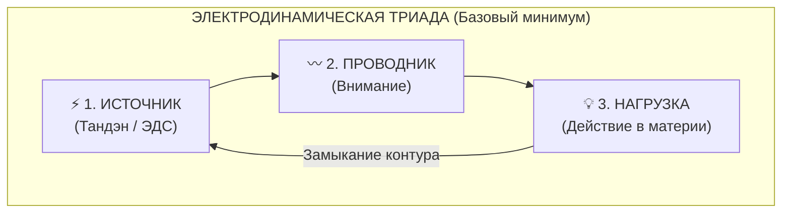
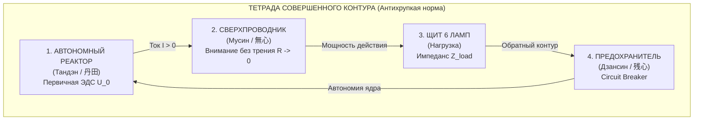
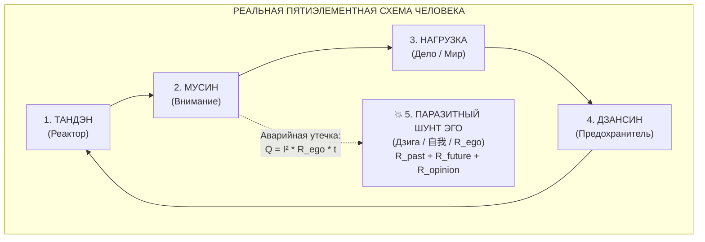

# 244. Архитектурная таксономия цепи: Сколько элементов — три, четыре или пять? Разрешение топологического парадокса: Электродинамическая триада, Тетрада совершенного контура, паразитный шунт эго и Клинок Кансо

> [!quote] Каноническая аксиома схемотехники
> ### ⚡ **«Спросить, сколько элементов в цепи — три, четыре или пять — всё равно что спросить инженера, сколько узлов в электросети дома: три на принципиальной схеме лаборатории, четыре на щитке с автоматом УЗО или пять, когда в розетку воткнули искрящий кипятильник. Три — это физический минимум тока. Четыре — это защищённый контур мастера. Пять — это живой человек в плену у эго. А Клинок Кансо — это нож, который мгновенно превращает пять обратно в четыре.»**  
> — **Владимир Аньянов**

---

### I. Введение: Почему возникает вопрос «3, 4 или 5?»

При глубоком изучении Архитектуры Внутреннего Тока внимательный исследователь неизбежно сталкивается с кажущимся противоречием:
* В базовой электродинамике утверждается: **в цепи три элемента** — источник, проводники и нагрузка.
* В манифестах мастерства и Белой книге фигурирует **Тетрада Совершенного Контура (четыре элемента)**: Тандэн, Мусин (проводник), Нагрузка (Щит 6 ламп) и Дзансин (предохранитель).
* В клинической и бытовой диагностике стресса описывается **пятиэлементная схема**: те же узлы, но с добавлением паразитного реостата эго ($R_{\text{ego}}$ / Антагониста Дзиги).

Является ли это терминологической нестыковкой? Нет. Это строгая **трёхуровневая архитектурная иерархия** описания одной и той же системы, зависящая от масштаба и контекста инженерной задачи:
1. **Фундаментальная физика** (уровень явления тока как такового);
2. **Отказоустойчивая схемотехника** (уровень автономной системы мастера);
3. **Полевая диагностика и ремонт** (уровень реального человека в социуме).

```
          ИЕРАРХИЯ ТОПОЛОГИЧЕСКИХ СЛОЁВ СИСТЕМЫ

   [Уровень 1: 3 ЭЛЕМЕНТА]  ──►  ФИЗИЧЕСКИЙ МИНИМУМ
                                 (Источник ──► Провод ──► Нагрузка)
                                              │
   [Уровень 2: 4 ЭЛЕМЕНТА]  ──►  АНТИХРУПКИЙ HAPPY PATH
                                 (Тандэн ──► Мусин ──► Лампа ──► Дзансин)
                                              │
   [Уровень 3: 5 ЭЛЕМЕНТОВ] ──►  РЕАЛЬНЫЙ ЧЕЛОВЕК ПОД ЭНТРОПИЕЙ
                                 (Тетрада + Паразитный шунт R_ego)
                                              │
                              [КЛИНОК КАНСО: СРЕЗ 5 ──► 4]
```

---

### II. Уровень 1: ТРИ элемента — Электродинамическая Триада (Физический минимум)

На фундаментальном уровне школьной физики и уравнений Максвелла электрический контур не может функционировать, если в нём отсутствует хотя бы один из трёх компонентов:

1. **Источник электродвижущей силы (ЭДС):** Генератор первичной разности потенциалов ($U_0$). В человеке — это соматический **Тандэн (丹田)**, диафрагмальное дыхание и парасимпатический тонус блуждающего нерва (*Nervus Vagus*).
2. **Проводники:** Линия передачи заряда. В человеке — это **луч направленного внимания** и сенсомоторная нервная сеть.
3. **Потребитель (Нагрузка):** Терминал совершения полезной работы ($P = I^2 R_{\text{load}}$). В человеке — это **материальное действие** (мытьё пола, написание строки кода, бросок мяча, чайное действие).



#### Почему Триады недостаточно для живого человека?
Потому что классическая триада предполагает **идеальные лабораторные условия**: нагрузка никогда не взрывается, проводники не имеют паразитных ответвлений, а оператор не испытывает психологического потрясения при поломке лампочки. В реальной жизни это приводит к катастрофе.

---

### III. Уровень 2: ЧЕТЫРЕ элемента — Тетрада Совершенного Контура (Happy Path мастера)

Чтобы энергосистема человека стала жизнеспособной в агрессивной среде, инженер обязан внедрить **защиту контура**. Так рождается каноническая **Тетрада Совершенного Контура**:

$$\text{Тандэн (Реактор)} \xrightarrow{R \to 0\text{ (Мусин)}} \text{Проводка (Внимание)} \xrightarrow{Z\text{-согласование}} \text{Нагрузка (Щит 6 ламп)} \xrightarrow{\text{Защита}} \text{Предохранитель (Дзансин)}$$



#### Зачем жизненно необходим 4-й элемент — Дзансин (残心)?
Внешний мир бреннен, несовершенен и подвержен энтропии (эстетика и физика *Ваби-саби*):
* Стартап может обанкротиться;
* Фарфоровая чашка может выскользнуть из пальцев и разбиться;
* Другой человек может отвергнуть или предать;
* Сервер может упасть под DDoS-атакой.

Если у оператора **нет 4-го элемента (Дзансин)**, происходит авария: катастрофа на нагрузке порождает мощнейший обратный бросок напряжения (Back-EMF). Высоковольтная дуга бьёт прямо в реактор. Человек воспринимает гибель внешней вещи как собственную смерть: впадает в апатию, депрессию, «теряет смысл жизни».

**Дзансин (残心) — это соматический Circuit Breaker (автоматический выключатель):**
* Действие совершено, стрела выпущена из лука — но ядро не «улетает» за стрелой.
* При взрыве нагрузки предохранитель мягко и мгновенно изолирует аварийный участок. Лампа погасла, но реактор Тандэна сохранил 100% герметичность и готов немедленно запитать следующую задачу.

---

### IV. Уровень 3: ПЯТЬ элементов — Реальная психофизиология человека под гнетом эго

Когда система выходит из дзенского додзё в повседневный социум, в схеме появляется **пятый функциональный элемент**:

$$\text{Пять элементов} = \text{Тетрада Совершенного Контура} + \mathbf{R_{\text{ego}}\text{ (Паразитный шунт / Дзига)}}$$



#### Анатомия 5-го элемента:
Антагонист Дзига (自我) — это паразитный реостат и байпасный шунт, возникающий при переключении внимания с дела на оценку себя:
$$R_{\text{ego}} = R_{\text{past}} + R_{\text{future}} + R_{\text{opinion}}$$

1. **$R_{\text{past}}$ (Резистор Прошлого):** Обиды, вина, навязчивая прокрутка диалогов пятилетней давности. Индуктивное залипание в архиве памяти.
2. **$R_{\text{future}}$ (Резистор Будущего):** Тревога, сценарии катастроф, попытка силой воли контролировать неподконтрольное. Емкостная утечка в виртуальные симуляции.
3. **$R_{\text{opinion}}$ (Резистор Чужого Мнения):** Паразитный делитель напряжения: «Что они обо мне подумают? Достаточно ли я успешен? Не выгляжу ли я глупо?».

По закону Джоуля — Ленца протекание тока через этот 5-й элемент раскаляет нервную систему:
$$Q = I^2 \cdot R_{\text{ego}} \cdot t$$
Человек сгорает в омическом аду тревоги и бессонницы, не совершая при этом никакой полезной работы в физическом мире ($P_{\text{load}} \to 0$).

---

### V. Клинок Кансо (簡素): Хирургический рубильник оператора

Если бы 5-й элемент был неустраним, человечество было бы обречено на вечный невроз. Однако инженерное величие Системы Аньянова заключается в открытии **Клинка Кансо (簡素)**.

```
       ДЕЙСТВИЕ КЛИНКА КАНСО: СРЕЗ 5-ГО ЭЛЕМЕНТА В 0 ОМ

         [ 5-ЭЛЕМЕНТНЫЙ КОНТУР ] ─── (Невроз, перегрев Q >> 0)
                   │
                   ▼
         [ КЛИНОК КАНСО (簡素) ] ─── Соматический срез шунта:
                   │                 • Выдох в Тандэн
                   │                 • Ощущение стоп на полу
                   │                 • Одно прямое физическое действие
                   ▼
         [ 4-ЭЛЕМЕНТНАЯ ТЕТРАДА ] ── (Сверхпроводимость, счастье R -> 0)
```

Клинок Кансо — это не философское рассуждение и не моральная борьба с грехом. Это **аппаратный рубильник**:
* Оператор задаёт себе единственный диагностический вопрос: *«Где сейчас мои стопы? Какое одно прямое действие требует материя?»*.
* Внимание соматически заземляется в низ живота (Тандэн).
* Паразитный шунт Дзиги физически размыкается:
$$R_{\text{ego}} \to 0 \implies Q \to 0, \quad \mathcal{H} = \frac{P_{\text{load}}}{P_{\text{total}}} \to 100\%$$

Пятиэлементная аварийная схема мгновенно схлопывается обратно в **сверхпроводящую четырёхэлементную Тетраду**!

---

### VI. Сводная инженерная матрица таксономии

| Параметр | Уровень 1: Триада (3) | Уровень 2: Тетрада (4) | Уровень 3: Схема с шунтом (5) |
| :--- | :--- | :--- | :--- |
| **Узлы цепи** | Источник $\to$ Провод $\to$ Нагрузка | Тандэн $\to$ Мусин $\to$ Нагрузка $\to$ Дзансин | Тетрада (4) $+$ Шунт Эго ($R_{\text{ego}}$) |
| **Физический статус** | Теоретический минимум | Инженерный Happy Path | Реальный человек под стрессом |
| **Наличие защиты** | Нет (хрупкая цепь) | **Есть (Circuit Breaker Дзансин)** | Есть, но шунтирована паразитом |
| **КПД счастья ($\mathcal{H}$)** | Не определён (нет метрики эго) | $\mathcal{H} \to 100\%$ ($R \to 0$) | $\mathcal{H} \ll 20\%$ (омический ожог $Q > 0$) |
| **Где используется** | Учебники физики, базис онтологии | Дзен-инженерия, состояние мастера | Полевая психотерапия, диагностика сбоев |
| **Инструмент перехода** | Добавление предохранителя | — | **Клинок Кансо (срез шунта $5 \to 4$)** |

---

### VII. Резюме: Семь аксиом схемотехнической таксономии

1. **Аксиома триады:** Без трёх элементов (источник, проводник, нагрузка) тока не существует в природе.
2. **Аксиома уязвимости:** Трёхэлементный контур хрупок; любая авария на нагрузке сжигает незащищённый реактор.
3. **Аксиома тетрады:** Четвёртый элемент — Дзансин (Circuit Breaker) — делает энергосистему человека антихрупкой и неуязвимой к внешним катастрофам.
4. **Аксиома паразита:** Пятый элемент — Антагонист Дзига ($R_{\text{ego}}$) — не является штатной деталью завода-изготовителя Природы; это благоприобретённый эволюционный шунт социума.
5. **Аксиома омического ожога:** Страдание, тревога и выгорание возникают исключительно при включении пятого элемента по закону Джоуля — Ленца ($Q = I^2 R_{\text{ego}} t$).
6. **Аксиома Клинка Кансо:** Оператор цепи не обязан «уничтожать эго навсегда»; достаточно владеть Клинком Кансо для мгновенного размыкания пятого контакта.
7. **Аксиома высшей простоты:** Счастье — это динамический танец: жить в мире пяти элементов, удерживать четырёхэлементную защиту Дзансин и действовать с трёхэлементной чистотой прямого природного тока.
