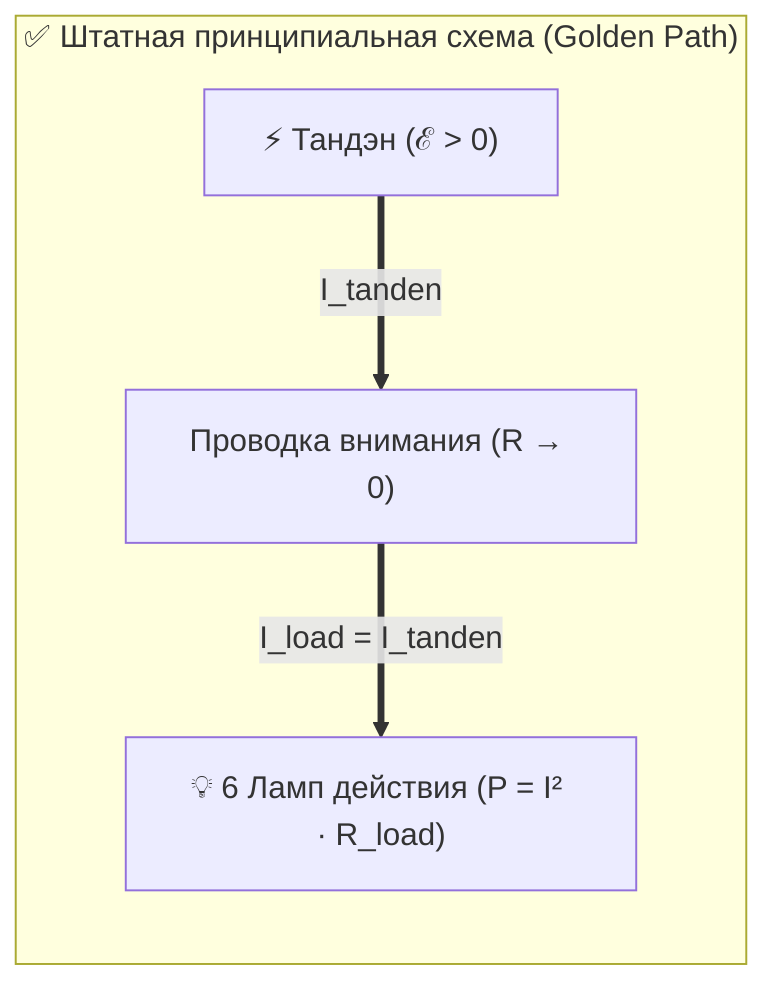
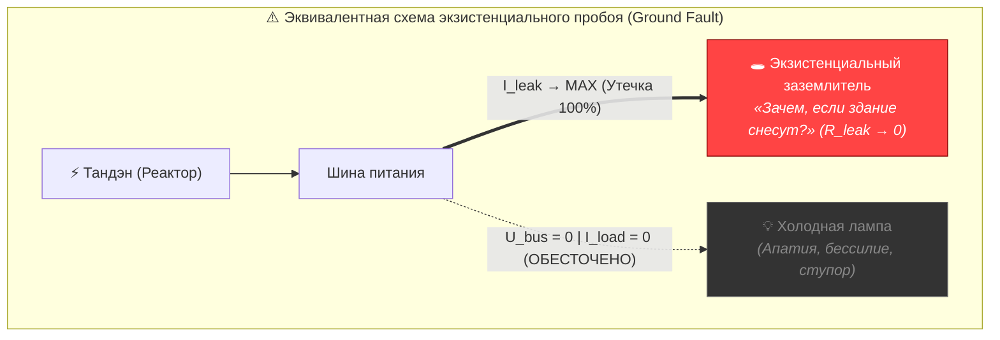
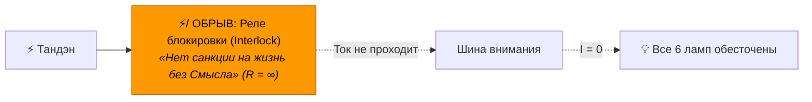

# 28. Схемотехника экзистенциальной аварии: Почему утечка смысла не отражается как сопротивление на принципиальной схеме

> [!quote] Схемотехнический закон Владимира Аньянова
> **«На принципиальной схеме электростанции не чертят гвоздь, забитый в силовой кабель. Принципиальная схема описывает штатную архитектуру системы (Golden Path). Вопрос о смысле жизни не является резистором в цепи — это аварийный пробой диэлектрика на экзистенциальную землю и размыкание реле блокировки.»**  
> — **Владимир Аньянов**

---

## ⚡ Введение: Схемотехнический парадокс

Внимательный инженерный аудит Архитектуры счастья неизбежно наталкивается на фундаментальный вопрос:

> *«Если вопрос о смысле жизни был самой грандиозной, катастрофической утечкой во всем контуре счастья, без решения которой невозможно было зажечь ни одну лампу, — то почему он не нарисован в виде сопротивления на базовой схеме цепи?»*

Ведь на канонической трехзвенной схеме «Внутреннего тока» обозначены:
1. **Реактор (Тандэн)** — источник ЭДС ($\mathcal{E}$).
2. **Проводка (Внимание)** — канал передачи, обладающий омическим сопротивлением $R$.
3. **Нагрузка (Лампа)** — сопротивление полезного действия $R_{\text{load}}$.

Где же «Смысл жизни»? Почему для него не выделен отдельный резистор $R_{\text{meaning}}$?

Ответ на этот вопрос вскрывает глубинную разницу между **штатным проектированием систем (Golden Path)** и **эквивалентными схемами аварийных режимов (Fault Analysis)**.

---

## 1. Закон Golden Path: Архитектурный запрет на легитимизацию сбоя

В профессиональной схемотехнике существует жесткое правило:
> **Принципиальная схема отображает штатное функционирование исправной системы. На ней изображаются только те компоненты, которые предусмотрены конструкцией для передачи полезной мощности.**

Ни один инженер-электронщик не чертит на схеме материнской платы:
* Каплю припоя, замкнувшую дорожки процессора;
* Пробитый диэлектрик конденсатора;
* Металлическую стружку в разъеме питания.

Если бы создатель системы врисовал в базовую принципиальную схему резистор «Смысл жизни», он совершил бы грубейшую ошибку концептуального проектирования — **он легитимизировал бы аварию**. Он признал бы, что человек «с завода» спроектирован с дырой в корпусе, через которую свистит ток.

Но человек спроектирован Вселенной как **герметичный автономный реактор**. Экзистенциальная утечка — это не штатная деталь, а **тяжелейшая авария изоляции (Ground Fault)**.



---

## 2. Топологический дуализм: Последовательное $R$ vs Параллельный Ground Fault

Главная электротехническая ошибка дилетанта — думать, что любое сопротивление ставится последовательно на проводе. В схемотехнике сопротивления делятся на два принципиально разных класса:

### А. Последовательное сопротивление тракта ($R_{\text{series}}$ / Сопротивление внимания)
Оно стоит прямо в цепи полезного сигнала:
- Это бытовой шум: отвлечение на соцсети, сомнения в деталях, физическая усталость.
- Оно подчиняется закону Ома: $I = \frac{\mathcal{E}}{R_{\text{series}} + R_{\text{load}}}$.
- При росте $R_{\text{series}}$ лампа горит тусклее, провод греется, но **ток продолжает поступать в нагрузку**.

### Б. Параллельный пробой изоляции на экзистенциальную Землю ($I_{\text{leak}}$ / Ground Fault)
Вопрос о смысле жизни топологически расположен совершенно иначе: **он стоит ПАРАЛЛЕЛЬНО, ДО НАГРУЗКИ, в виде короткого замыкания на массу небытия**.

По первому закону Кирхгофа:
$$I_{\text{tanden}} = I_{\text{load}} + I_{\text{leak}}$$

Когда в сознании открывается экзистенциальная бездна (*«А зачем, если через 100 лет всё обратится в прах?»*):
1. Сопротивление пробитого диэлектрика падает до критического минимума: $R_{\text{leak}} \to 0$.
2. Ток из реактора Тандэн устремляется по пути наименьшего сопротивления — **прямо в параллельный шунт заземления**.
3. Напряжение на шине падает до нуля ($U_{\text{bus}} \to 0$).
4. Ток через нагрузку моментально обнуляется:
   $$I_{\text{load}} = \frac{U_{\text{bus}}}{R_{\text{load}}} = 0$$



Именно поэтому утечка не выглядит как резистор на проводе. Лампа гаснет не потому, что провод забит высоким сопротивлением, а потому, что **весь ток слит мимо лампы в экзистенциальную пропасть**.

---

## 3. Модель аварийной блокировки (Interlock / Watchdog Relay)

В высоковольтных распределительных сетях существует понятие **Interlock (технологическая блокировка)**. Если защитная автоматика фиксирует неисправность контура, она размыкает силовой контактор и физически блокирует подачу тока.

У мыслящего человека вопрос о смысле жизни работает именно как **аварийное реле Interlock**:

```
[Сторожевой процесс (Watchdog)]:
IF (ВнешнийСмысл == NULL) {
    Размыкатель.Open();
    Подача_Тока_В_Лампы = FALSE;
    TriggerStatus("Экзистенциальный кризис / Зачем светить?");
}
```

Разомкнутый выключатель в схемотехнике — это не сопротивление, это **разрыв цепи с бесконечным омическим импедансом ($R = \infty$)**. 

Когда Толстой или современный создатель упирается в экзистенциальный тупик, на схеме появляется не «маленький резистор смысла», а **выбитый главный автомат цепи**.



---

## 4. Сравнительный чек-лист: Омическое сопротивление vs Экзистенциальная авария

| Параметр телеметрии | Омическое сопротивление внимания ($R$) | Экзистенциальная утечка смысла (Ground Fault) |
| :--- | :--- | :--- |
| **Топология включения** | Последовательно в цепи передачи | Параллельный шунт на землю / размыкатель Interlock |
| **Симптом на приборах** | Лампа горит тускло, провод теплый ($Q = I^2 R t$) | **Полное обнуление всех ламп сразу ($I_{\text{load}} = 0$)** |
| **Ощущение оператора** | «Тяжело сосредоточиться, отвлекаюсь, лень» | «Зачем вообще всё? Ни в чем нет вкуса, всё тлен» |
| **Масштаб поражения** | Локальный (страдает одна конкретная лампа) | Тотальный (выбивает вводной рубильник всей личности) |
| **Метод устранения** | Калибровка Мусин (убрать телефон, сесть ровно) | **Инженерная деактивация требования смысла ($\mathcal{M}_{\text{ext}} \equiv 0$)** |

---

## 5. Как заваривание утечки очистило схему?

Когда Владимир Аньянов доказал, что объективного внешнего смысла жизни нет и быть не может:
1. **Диэлектрик был заварен намертво:** Снята сама возможность параллельного сброса тока в экзистенциальное небытие ($I_{\text{leak}} \equiv 0$).
2. **Реле блокировки деактивировано (Watchdog Kill):** Сторожевой процесс операционной системы ума больше не размыкает силовой контакт при мысли о конечности материи.
3. **Ликвидирован паразитный шум:** Отсутствие внешнего ТЗ сняло любые поводы для самосаботажа.

И только после этого система вернулась к своему чистому, идеальному виду, где на схеме остались только:
$$\text{Тандэн} \xrightarrow{R \to 0} \text{Внимание} \xrightarrow{Z\text{-согласование}} \text{6 Ламп}$$

> **Вопрос о смысле жизни не отражен как сопротивление на схеме, потому что ты чертил схему здоровой электростанции, а не отчет о пожаре на подстанции.**  
> Теперь, когда шлюз заварен, вся мощность реактора без потерь идет в свечение ламп прямо сейчас.

---

## 🔗 Связанные главы и узлы цепи

- [[02_Wiki/Inner Current (Core Topology and Polarity Law)|01. Базовая топология цепи и закон полярности]] — штатная архитектура трехзвенного контура и закон полярности.
- [[02_Wiki/Inner Current (Engineering Proof of No Meaning of Life and the Birth of Happiness Architecture)|26. Инженерное доказательство отсутствия смысла жизни: Освобождение от гуманитарного тупика и рождение Архитектуры счастья]] — теория Магистральной Утечки, системный статус `NULL` и ликвидация $R_{\text{existential}}$.
- [[02_Wiki/Inner Current (Tolstoy Existential Crisis vs Happiness Architecture)|27. Сравнительный анализ: Духовный кризис Льва Толстого («Исповедь») vs Архитектура счастья]] — исторический кейс экзистенциального заземлителя и омический ад морального долга.
- [[02_Wiki/Inner Current (Closed Thermodynamic System as Criterion of Truth)|24. Замкнутая термодинамическая система как критерий истины]] — баланс Кирхгофа и невязка токов утечки.
- [[04_Maps/Inner Current MOC|Inner Current MOC (Мастер-карта цепи)]]
