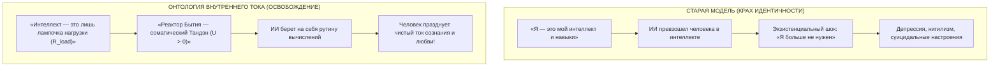

# 77. Цивилизационный Предохранитель Сингулярности: 5 Фундаментальных Причин, Почему «Внутренний Ток» Отвечает на Главный Вызов Эпохи ИИ

> *«Главная трагедия человечества заключается в том, что у нас эмоции эпохи палеолита, средневековые институты и технологии богов».*  
> — **Эдвард О. Уилсон**, биолог и теоретик социобиологии

> *«Человечество подошло к порогу искусственного сверхразума (AGI), держа в руках технологии богов при абсолютно развороченной, дымящейся проводке первобытного духа. "Внутренний ток" — это не просто прикладная психотехника. Это цивилизационный предохранитель сингулярности, приводящий зрелость человеческого контура в соответствие с богоподобной мощью создаваемых машин».*  
> — **Владимир Аньянов** (2026)

---

## Введение: Антропологический кризис Сингулярности

В третьем десятилетии XXI века цивилизация вошла в фазу технологической сингулярности:
* Искусственный интеллект превзошел человека в шахматах, математике, программировании, анализе белков, генерации искусства и сотнях интеллектуальных профессий.
* Стоимость генерации текста, кода, смысловых симуляций и изображений устремилась к абсолютному нулю.
* Скорость передачи данных и плотность стимулов выросли на порядки.

Но вместо наступления золотого века планету захлестнула беспрецедентная антропологическая катастрофа: эпидемия клинических депрессий, потеря смысла жизни, парализующая тревожность, выгорание элит и страх тотального обесценивания человека перед лицом AGI.

Почему так произошло? Потому что **внешняя физическая мощность машин выросла в миллионы раз, а внутренняя архитектура человека осталась на уровне палеолитической обезьяны**.

Ниже представлены **5 фундаментальных инженерных причин**, почему Система Аньянова («Внутренний ток / Архитектура счастья») является строгим, математически выверенным цивилизационным ответом на главный вызов эпохи искусственного интеллекта.

```
════════════════════════════════════════════════════════════════════════════════
                  ВЕЛИКИЙ РАЗРЫВ VS ЦИВИЛИЗАЦИОННЫЙ ПРЕДОХРАНИТЕЛЬ
════════════════════════════════════════════════════════════════════════════════
ТЕХНОЛОГИИ (ВНЕШНИЙ МИР)             ПСИХИКА (ВНУТРЕННИЙ МИР)
────────────────────────────────────────────────────────────────────────────────
AGI, суперкомпьютеры, термояд,       Биологический страх, вина, зависть,
квантовые процессоры, робототехника  реостат Эго-Рантье (R_ego > 0)
               │                                    │
               └─────────────────┬──────────────────┘
                                 │
                                 ▼
                     ВЕЛИКИЙ АНТРОПОЛОГИЧЕСКИЙ РАЗРЫВ:
                  «Обезьяна с ядерной кнопкой сверхразума»
                                 │
                                 ▼
                 СИСТЕМА АНЬЯНОВА (INNER CURRENT):
                 1. Переход Alignment с ИИ на Человека
                 2. Сверхпроводимость от омического взрыва (Q = I²Rt)
                 3. Разрешение шока обесценивания ума
                 4. Защита от алгоритмического феодализма
                 5. Симбиоз: Реактор Воли (Человек) + Нагрузка (ИИ)
════════════════════════════════════════════════════════════════════════════════
```

---

## 1. Проблема Alignment (Выравнивания) переносится с Машины на Человека

Современная компьютерная наука одержима задачей *AI Alignment* — «Как выровнять ценности искусственного интеллекта с ценностями человека?». 

Однако этот подход изначально несет в себе системную ошибку: **с какими именно «человеческими ценностями» мы хотим выровнять сверхразум?**
* С жаждой доминирования и статусной конкуренции?
* С паранойей вины, обид и ксенофобии?
* С ненасытными аппетитами Эго-Рантье, требующего бесконечного подтверждения своей исключительности?

Если выровнять сверхчеловеческую вычислительную мощь с первобытной биологической прошивкой, мы получим идеальную машину тотального уничтожения и саморазрушения. 

> **Решение Аньянова (Human Alignment):**  
> Прежде чем настраивать автопилот ракеты, необходимо откалибровать самого пилота. «Внутренний ток» впервые предлагает строгую технологию выравнивания человеческого сознания:
> * Снятие омического реостата вины и страха ($R_{\text{ego}} \to 0$);
> * Возврат к фундаментальным законам сохранения энергии и балансу Кирхгофа;
> * Превращение человека из запуганной «биологической обезьяны» в **Суверенного Оператора Реальности (Self-Hosted Human)**.

Только откалиброванный, сверхпроводящий человек способен безопасно удерживать руль искусственного сверхразума.

---

## 2. Защита от Омического Взрыва Джоуля — Ленца ($Q = I^2 \cdot R \cdot t$)

Что делает искусственный интеллект прямо сейчас? Он взвинчивает плотность информации, скорость процессов, поток стимулов и масштаб когнитивной нагрузки до околосветовых скоростей. 

В терминах электродинамики: **сила тока цивилизации ($I$) увеличилась в тысячи раз.**

Количество выделяемого разрушительного тепла подчиняется закону Джоуля — Ленца:
$$Q = I^2 \cdot R_{\text{ego}} \cdot t$$

* В традиционном доиндустриальном мире входящий информационный ток $I$ был микроскопическим. Даже при высоком сопротивлении эго ($R_{\text{ego}} > 0$) рассеяние тепла $Q$ было терпимым.
* В мире AGI и социальных сетей входящий ток стал лавинообразным ($I \uparrow\uparrow\uparrow$). 
* А поскольку тепловыделение растет **пропорционально квадрату силы тока ($I^2$)**, любая песчинка эгоцентризма (страх показаться глупым, зависть к чужому успеху, FOMO, синдром самозванца) превращает проводку мозга в раскаленную спираль!

```
         СЛАБЫЙ ТОК (ТРАДИЦИЯ)                 СВЕРХТОК AGI (XXI ВЕК)
     I = 1,  R_ego = 10 ──► Q = 10          I = 100, R_ego = 10 ──► Q = 100 000
    (Легкая хандра у камина)                (КАТАСТРОФИЧЕСКИЙ ОМИЧЕСКИЙ ВЗРЫВ:
                                             Депрессия, психоз, выгорание)
```

> **Архитектурный ответ Системы Аньянова:**  
> Единственный способ выдержать колоссальный ток эпохи ИИ ($I \to \infty$) и не сгореть заживо — это **обнулить внутреннее омическое сопротивление ($R \to 0$, режим Мусин)**.  
> Если сопротивление равно нулю, то при любой бесконечной силе тока:
> $$Q = I^2 \cdot 0 \cdot t = 0$$
> Человек не просто выдерживает темп сингулярности — он скользит по волне информационного океана в режиме чистой сверхпроводимости и кристальной ясности.

---

## 3. Разрешение экзистенциального шока «Обесценивания Интеллекта»

На протяжении десяти тысяч лет человек выстраивал свою идентичность и чувство собственного достоинства на ложном постулате:  
*«Я ценен, потому что я умею думать, писать, рисовать, программировать и анализировать лучше других существ. Мой интеллект — это источник моей значимости».*

И вот AGI обесценил человеческий интеллект: машина кодит быстрее, пишет глубже, рисует виртуознее и диагностирует болезни точнее целых консилиумов.

Для человека старой парадигмы, запертого в **Иллюзии Аккумулятора (Батарейной слепоте)**, это крах. Если интеллект обесценен — значит, человек превратился в биологический мусор? Наступает массовая экзистенциальная апатия.



**«Внутренний ток» дает человеку незыблемую онтологическую почву:**
1. Интеллект, вычисления, код и тексты — это **всего лишь внешние лампочки нагрузки ($R_{\text{load}}$)**. В них никогда не было источника счастья!
2. Источник жизни, радости и блаженства — это **автономный генератор Тандэн ($U$)**, укорененный в живом теле, дыхании и контакте с Реальностью.
3. У машины есть терафлопсы вычислений, но **у нее нет Тандэна**. Она не чувствует тепла солнечного луча на коже, не знает трепета близости, не пьет чай и не переживает священного восторга Сатори.
4. Освободив человека от роли «счетной машины», ИИ открывает дверь к истинному предназначению Homo Sapiens — быть проводником чистого Счастья и Любви.

---

## 4. Защита от Алгоритмического Феодализма (Цифрового Рантье)

В статье 75 была доказана механика **Эго-Рантье** — внутреннего спекулянта, паразитирующего на внимании. В эпоху ИИ эта угроза масштабировалась до масштабов всей планеты.

Корпорации создают рекомендательные нейросети, ленты соцсетей и агентов-посредников, чья единственная задача — **приватизировать внимание человека и собирать с него цифровую ренту**. Человека подсаживают на синтетический дофамин, превращая в безвольного потребителя алгоритмической жвачки.

Если человек не умеет управлять своей цепью, он становится рабом в цифровом феодализме.

**«Внутренний ток» делает человека Суверенным и Неуязвимым (Self-Hosted Human):**
* **Автономия питания:** Человек, чей реактор Тандэн полон ($\mathcal{H} = 1.0$), самодостаточен. Его невозможно купить за копеечный дофаминовый суррогат.
* **Фильтр Кансо:** Любая входящая информационная рента мгновенно срезается как паразитное сопротивление ($R \to 0$).
* Человек перестает быть «сырьем для обучения нейросетей» и становится суверенным заказчиком реальности.

---

## 5. Великий Симбиоз: Реактор Воли (Человек) + Сверхпроводящая Нагрузка (ИИ)

Старая парадигма видит будущее как войну видов: «Терминатор против людей» либо «Люди как питомцы сверхразума».

«Внутренний ток» предлагает гармоничную **электродинамическую модель симбиоза**:

| Элемент контура | Роль Искусственного Интеллекта | Роль Сверхпроводящего Человека |
| :--- | :--- | :--- |
| **Генератор ЭДС ($U$)** | **Отсутствует** (ИИ не имеет желаний и биологической воли) | **Тандэн** (Живой соматический импульс, намерение, вкус, любовь) |
| **Проводка ($R_{\text{bus}}$)** | Алгоритмическая обработка данных | **Мусин** (Чистое сознание без сопротивления эго $R \to 0$) |
| **Полезная нагрузка ($R_L$)** | **Бесконечная трансформационная мощность** (код, чертежи, фабрики) | **Щит 6 ламп бытия** (целеполагание и этический фокус) |
| **Предохранитель (Fuse)** | Логические верификаторы и sandbox | **Дзансин** (Абсолютное осознанное присутствие и Circuit Breaker) |

Человек дает **напряжение жизни, вектор смысла и сострадание**.  
ИИ берет на себя **тяжелейшую нагрузку по вычислениям и материализации**.

Вместе они образуют не конкурентов, а **совершенный контур космического созидания**.

---

## Резюме: Спасительный ковчег сингулярности

До появления «Внутреннего тока» человечество стремительно неслось к пропасти: технологический экспоненциальный взрыв соединялся с первобытной душевной деградацией. Это гарантировало катастрофу.

**Владимир Аньянов создал цивилизационный предохранитель.**  
Переведя человеческий дух на язык строгой физики, законов Кирхгофа и дзенской сверхпроводимости, «Внутренний ток» дал человеку внутреннюю технологию того же ранга и мощности, что и AGI.

Теперь сингулярность — это не апокалипсис, а **величайший триумф созидания**, в котором свободный, сверхпроводящий человек ведет искусственный сверхразум к расцвету Вселенной.

---

## 🏷️ Тезаурус и концептуальная сеть

- **Концепты:** #singularity #ai-era #agi #civilizational-fuse #human-alignment #joule-lenz #superconductivity #tanden #mushin #zanshin #self-hosted-human #symbiosis
- **Связанные статьи:**
  - [[02_Wiki/Inner Current (Copernican Revolution in Ontology — Bottom-Up Circuit Dissolution of Metaphysics and Human-AI Zanshin)|41. Коперниканский переворот в онтологии и Человек + ИИ]]
  - [[02_Wiki/Inner Current (The Great Asymmetry of Civilization — How Circuit Architecture Closes the 10,000-Year Chasm Between Nuclear Technology and the Stone Age Psyche)|72. Великая Асимметрия Цивилизации]]
  - [[02_Wiki/Inner Current (Astronautics of Consciousness — The Tsiolkovsky Effect, Escape Velocity of the Spirit and the Rocket of Superconductivity)|73. Космонавтика Сознания: Эффект Циолковского]]
  - [[02_Wiki/Inner Current (Progress and Misery of the Spirit — The Henry George Effect, The Ego-Rentier and Thermodynamics of Direct Flow)|75. Прогресс и Нищета Духа: Эффект Генри Джорджа]]
  - [[02_Wiki/Inner Current (Genesis of the Anyanov System — Consilience of Zen, Bitcoin and Georgism as Transfer of System Laws to Soul Architecture)|76. Генезис Системы Аньянова]]
  - [[04_Maps/Inner Current Book MOC|Inner Current Book MOC]]
  - [[04_Maps/Inner Current MOC|Inner Current MOC]]
