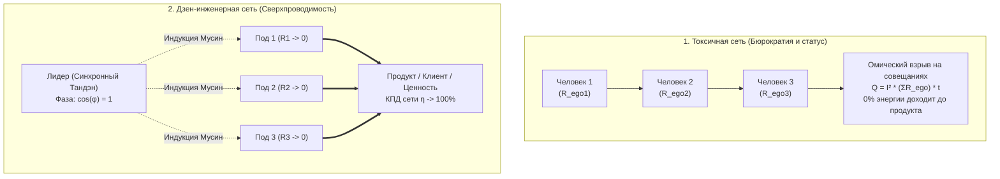

# 31. Схемотехника коллективов: Параллельное и последовательное включение, токсичный омический перегрев совещаний и фазовая индукция лидера

> [!quote] Цитата Канона
> ### ⚡ **«Любая команда или компания — это составная электрическая сеть. Если сотрудники заняты борьбой за статус, их $R_{\text{ego}}$ зашкаливает: совещания раскаляются, бюджеты сгорают в омическом перегреве, а клиенту достается ноль энергии. Роль истинного лидера — быть не надсмотрщиком, а синхронным компенсатором частоты: удерживать Тандэн и обнулять сопротивление сети.»**  
> — **Владимир Аньянов**

---

## 🏢 1. От индивидуального контура к групповой электросети

До сих пор мы рассматривали индивидуальный контур человека. Но в реальном мире люди объединяются в стартапы, корпорации, семьи и творческие союзы. 

Каковы законы электродинамики, когда в одну цепь включаются десятки или сотни автономных генераторов?

---

## ⛓️ 2. Топология включения: Последовательная бюрократия vs Параллельные ячейки

### 1. Последовательное включение (Бюрократический ад):
В классической иерархической корпорации согласования идут строго последовательно: *Специалист $\to$ Тимлид $\to$ ПМ $\to$ Директор $\to$ Безопасность $\to$ Юристы*.

Эквивалентное сопротивление цепи равно сумме всех сопротивлений:
$$R_{\text{total}} = R_1 + R_2 + R_3 + \dots + R_n$$

- Если хотя бы один человек в цепочке охвачен страхом ошибки, обидой или саботажем ($R_k \to \infty$), **ток во всей компании падает до нуля**. 
- Один испуганный бюрократ полностью парализует запуск инновационного продукта.

### 2. Параллельное включение (Автономные ячейки Аньянова):
В высокоэффективных командах созидателей контуры подключаются параллельно к единой шине миссии (нагрузки):
$$\frac{1}{R_{\text{total}}} = \sum_{k=1}^m \frac{1}{R_k}$$

- Общее сопротивление параллельной сети **всегда меньше сопротивления самого слабого звена**.
- Если один узел временно вышел из строя, ток продолжает течь через остальные ветви без потери напряжения в системе.

---

## 🔥 3. Физика токсичных совещаний: Омический перегрев статусной борьбы

Почему двухчасовое корпоративное совещание выматывает сильнее, чем 10 часов непрерывного написания кода?

Ответ дает **закон Джоуля — Ленца**:
$$Q_{\text{meeting}} = I^2 \cdot \left(\sum R_{\text{ego}}\right) \cdot t$$

Когда на совещании люди обсуждают не реальную проблему продукта, а:
- *«Чья идея была первой?»*
- *«Как выставить себя в выгодном свете перед боссом?»*
- *«Как свалить вину за факап на соседний отдел?»*

— сопротивление проводки $R_{\text{ego}}$ каждого участника подскакивает в сотни раз. Огромный совокупный ток внимания упирается в глухую стену эго. Выделяется колоссальное тепло $Q$: учащаются пульсы, повышается голос, разливается ядовитый сарказм. Люди выходят из переговорки выжатыми досуха, а для клиента не сделано абсолютно ничего.

> **Правило Дзен-инженера для совещаний:**  
> Любое совещание обязано начинаться с **синхронизации нагрузки ($R_{\text{load}}$)**. Доска делится на две колонки: *«Физический факт»* и *«Ментальная интерпретация (DMN)»*. Все вопросы статуса аппаратно блокируются реле Дзансин.

---

## 🧲 4. Фазовая индукция лидера: Лидер как синхронный генератор 50 Гц

В энергосистеме стабильность всей национальной сети обеспечивают массивные роторы синхронных турбогенераторов. Их кинетическая инерция подавляет любые локальные колебания частоты.

**Истинный лидер — это не тот, кто громче всех кричит или раздает KPI. Лидер — это самый мощный и стабильный Тандэн в помещении.**

1. **Закон электромагнитной индукции в группе:** Когда в разгоряченную, паникующую переговорную комнату входит человек с абсолютно непоколебимым Тандэном и нулевым сопротивлением Мусин ($R \to 0$), окружающие физиологически перестраиваются:
   - Активируются зеркальные нейроны.
   - Снижается частота дыхания команды.
   - Затухает активность DMN (дефолт-системы) у участников.
   - Коэффициент мощности $\cos(\varphi)$ подскакивает к единице.
2. **Лидер держит фазу:** В момент кризиса (кассовый разрыв, срыв дедлайна) команда смотрит на Тандэн лидера. Если его контур не ушел в омический перегрев паники, энергосистема мгновенно возвращается в режим нормальной проводимости.

---

## 📊 5. Индекс командного КПД ($\eta_{\text{team}}$)

$$\eta_{\text{team}} = \frac{P_{\text{product}}}{P_{\text{total}}} = \frac{I^2 R_{\text{load}}}{I^2 R_{\text{load}} + \sum I_k^2 R_{\text{ego}, k}} \cdot 100\%$$

- **Традиционная компания:** $\eta_{\text{team}} \approx 10–15\%$ (85% энергии сгорает в интригах, страхах и бессмысленной отчетности).
- **Команда Системы Аньянова:** $\eta_{\text{team}} \ge 85\%$ (прямая сверхпроводимость от Тандэна каждого инженера в ценность для мира).

---

## 🔗 Связи
- [[04_Maps/Inner Current MOC|Inner Current MOC]]
- [[02_Wiki/Inner Current (Scale Invariance and Tea Ceremony)|03. Инвариантность масштаба нагрузки: от чая до империи]]
- [[02_Wiki/Inner Current (Safety, Antifragility and Zanshin)|04. Предохранители цепи, ваби-саби и антихрупкость]]
- [[02_Wiki/Inner Current (Neurobiology of Superconductivity — DMN, TPN and Vagus Grounding)|29. Нейробиология сверхпроводимости]]

---
*Created: 2026-09-23 | Author: Vladimir Anyanov & Antigravity*
