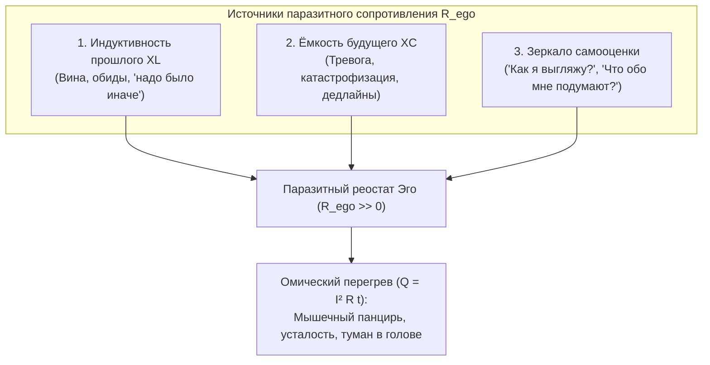

# 203. «Просто сознание»: Электродинамическая природа внимания ($I > 0$), три фазовых состояния контура и переход от шума к сверхпроводимости
## Что делает сознание сознанием до всяких медитаций, почему обыденный ум полон помех и как очистить проводку без мистики и насилия

> [!quote] Каноническая аксиома цепи
> ### ⚡ **«Если чистое сознание — это режим сверхпроводимости ($R \to 0$), то "просто сознание" — это сам факт протекания тока внимания в контуре ($I > 0$). Человеку не нужно "искать" сознание или создавать его искусственно: оно уже пульсирует прямо сейчас в каждом его взгляде, вдохе и мысли. Разница между просветлённым мастером и измученным невротиком заключается не в наличии сознания, а в чистоте проводки: у первого ток течёт без трения через открытый контур, а у второго — скрежещет и сгорает в омическом перегреве паразитного эго ($Q = I^2 R t$)».**  
> — **Владимир Аньянов**, создатель «Архитектуры счастья»

---

```
════════════════════════════════════════════════════════════════════════════════
                  ТРИ ФАЗОВЫХ СОСТОЯНИЯ СОЗНАНИЯ В ЦЕПИ
════════════════════════════════════════════════════════════════════════════════

   1. БЕССОЗНАТЕЛЬНОЕ (Глубокий сон, наркоз, кома):
      [ Генератор Тандэн ] ───/ ───► [ Контур коры ]
      • Ток внимания: I = 0 (Цепь разомкнута)
      • Переживание: Полная пустота, отсутствие субъекта и мира.

   2. «ПРОСТО СОЗНАНИЕ» (Обыденное человеческое восприятие):
      [ Тандэн: E > 0 ] ──► [ R_ego > 0 (Реостат Эго) ] ──► [ Нагрузка Дэай ]
                                     │
                                     ▼  🔥 Закон Джоуля — Ленца: Q = I² R t
      • Ток внимания: I > 0
      • Переживание: Мир воспринимается, но сквозь шум мыслей, тревогу и оценки.

   3. ЧИСТОЕ СОЗНАНИЕ (Мусин, сверхпроводимость):
      [ Тандэн: E > 0 ] ──► [ R_ego → 0 (Сверхпроводник) ] ──► [ Нагрузка Дэай ]
                                     │
                                     ▼  ✨ Закон Био — Савара: B_joy = MAX
      • Ток внимания: I > 0, КПД η = 100%
      • Переживание: Кристальная ясность, тишина, радость присутствия прямо сейчас.
════════════════════════════════════════════════════════════════════════════════
```

---

## ⚡ 1. Физическое определение «просто сознания»

Если убрать из понятия сознания вековую религиозную мистику и схоластику философских кафедр, останется строгий электродинамический факт:

$$\boxed{\text{Сознание} \equiv \text{Циркуляция тока внимания } I = \frac{\mathcal{E}}{R_{\Sigma}} \text{ в замкнутой цепи «Субъект — Сенсорика — Объект»}}$$

Пока организм жив:
1. **ЭДС ($\mathcal{E}$):** Соматический генератор (Тандэн, ретикулярная формация ствола мозга, дыхание, сердечный ритм) генерирует разность потенциалов.
2. **Ток ($I$):** Неделимый заряд внимания течёт по нервной системе к анализаторам (глаза, уши, осязание) и выходит во внешнюю среду.
3. **Замкнутость контура:** Внимание непрерывно отражается от физических объектов мира (Дэай) и замыкается обратно по сенсорной дуге.

Этот процесс и есть **сознание**. Именно он обеспечивает то, что философ Томас Нагель назвал *«каково это — быть чем-то»* (What is it like to be).

---

## 📊 2. Три фазовых состояния контура: Сравнительная матрица

Человеческий ум не является монолитной сущностью. Он существует в трёх дискретных режимах сопротивления:

| Параметр цепи | 1. Бессознательное (Наркоз, сон) | 2. «Просто сознание» (Обыденное) | 3. Чистое сознание (Мусин) |
|---|---|---|---|
| **Сила тока внимания ($I$)** | $I = 0$ | $I > 0$ | $I > 0$ (максимальный поток) |
| **Сопротивление эго ($R_{\text{ego}}$)** | Цепь разомкнута | $R_{\text{ego}} \gg 0$ (высокое омическое) | $R_{\text{ego}} \to 0$ (**Сверхпроводимость**) |
| **Тепловые потери ($Q = I^2 R t$)** | $Q = 0$ (система спит) | $Q \gg 0$ (**Хронический перегрев**) | $Q = 0$ (Потерь нет, холодный покой) |
| **КПД передачи сигнала ($\eta$)** | — | $\eta = 20 - 40\%$ | $\eta = 100\%$ |
| **Электромагнитное поле ($\vec{B}$)** | $\vec{B} = 0$ | Слабое, рваное, зашумлённое | Мощное поле радости и присутствия |
| **Субъективное состояние** | Отсутствие восприятия | Внутренний диалог, тревога, оценка | Абсолютная тишина, ясность, поток |

---

## 🎻 3. Три канонические аналогии: как услышать и увидеть разницу

### 1. Акустика: Укулеле Бытия
* **$I = 0$:** Укулеле лежит на шкафу в закрытом чехле. Никакого колебания струн нет.
* **$I > 0, R > 0$ (Просто сознание):** Палец ударил по струне — **звук пошёл**. Но пальцы левой руки судорожно вцепились в гриф, струна бьётся о металлический порожек, и к ноте примешивается постоянный мерзкий дребезг. Музыка есть, но слушать её больно.
* **$R \to 0$ (Чистое сознание):** Пальцы легли на лад мягко и точно. Звучит кристально чистая, поющая нота.

### 2. Оптика: Карманный фонарик
* **$I = 0$:** Кнопка выключена, контакт разомкнут. Луч не идёт.
* **$I > 0, R > 0$ (Просто сознание):** Фонарик включён, но его стекло заляпано грязью (прошлые травмы и обиды), контакт внутри окислился (сомнения и нерешительность), а рука оператора трясётся от холода (страх). Дорогу видно, но картинка пляшет и режет глаз.
* **$R \to 0$ (Чистое сознание):** Стекло протёрто, контакт идеален, луч монолитен и освещает предмет с абсолютной четкостью.

### 3. Радиотехника: Приёмник и радиостанция
* **$I = 0$:** Радиоприёмник выключен из сети. Динамик молчит.
* **$I > 0, R > 0$ (Просто сознание):** Приёмник включён на волну, но настройка контура сбита. Песня звучит, но сквозь неё шипит белый шум, трещит статическое электричество и гудят помехи электросети.
* **$R \to 0$ (Чистое сознание):** Точная подстройка в резонанс ($LC$-контур согласован). Помехи мгновенно исчезают, слышен кристальный голос ведущего.

---

## 🔬 4. Почему «просто сознание» почти всегда загрязнено?

99.9% людей на планете живут в режиме **«просто сознания с паразитным сопротивлением»**.  
Откуда берётся этот постоянный шум в проводке?

В Системе Аньянова вскрыты **три источника омических помех**:



1. **Реактивное сопротивление памяти ($X_L \propto \omega L$):** Попытка ума удержать события, которые уже завершились.
2. **Реактивное сопротивление ожидания ($X_C \propto 1/\omega C$):** Попытка накопить потенциал под будущее, которого ещё нет.
3. **Паразитная петля саморефлексии:** Попытка тока внимания осветить не задачу перед собой, а собственное «Я» (вывернутый луч фонарика).

В результате ток внимания разрывается между реальным действием и виртуальными симуляциями. Человек устаёт не от физической работы, а от **термодинамического ожога собственной проводки** ($Q = I^2 R t$).

---

## 🛠️ 5. Протокол фильтрации: Как превратить «просто сознание» в «чистое» за 30 секунд

Главная новость Контурной электродинамики: **вам не нужно учиться новому навыку**. Ваше сознание уже включено ($I > 0$). Всё, что требуется — это выключить паразитное сопротивление:

```
[Шаг 1. ОБНАРУЖЬ ДРЕБЕЗГ]  ──► Заметь, где прямо сейчас греется провод:
                                 Сжаты ли челюсти? Напряжены ли плечи?
                                 Крутится ли в голове виртуальный спор?
                                            │
                                            ▼
[Шаг 2. РАЗОМКНИ РЕОСТАТ]   ──► Скажи себе: «Этот спор — не я. Это омический шум».
                                 Мягко разожми зубы и опусти плечи вниз.
                                            │
                                            ▼
[Шаг 3. ПЕРЕКЛЮЧИ ТУМБЛЕР]  ──► Перенеси опору внимания из шумящей головы
                                 в соматический генератор — Тандэн (низ живота).
                                            │
                                            ▼
[Шаг 4. ЗАМКНИСЬ НА МИР]    ──► Коснись пальцами стола, сделай глоток воды,
                                 посмотри на свет за окном без оценок.
                                            │
                                            ▼
                       ✨ ШУМ СТИХ. ПРОВОДКА ЧИСТА ✨
                       («Просто сознание» стало Чистым)
```

---

## 🏛️ 6. Вывод

«Просто сознание» — это великолепный, живой, пульсирующий ток жизни, дарованный каждому человеку биологической эволюцией. 

Его не нужно стыдиться, его не нужно глушить аскезой или объявлять «греховным эго». Нужно лишь освоить **соматическую гигиену проводника**: вовремя стирать пыль со стекла фонарика, не зажимать струну укулеле судорожной хваткой и позволять току внимания течь в мир легко, радостно и свободно! ⚡️

---

## 🔗 Связанные каноны в Базе Знаний
- [[02_Wiki/Inner Current (Pure Consciousness — Dissolution of the Hard Problem, Circuit Superconductivity and the Physics of Direct Presence)|202. Чистое сознание: Снятие «трудной проблемы» науки, онтология сверхпроводимости контура ($R_{\text{ego}} \to 0$) и физика живого присутствия]]
- [[02_Wiki/Inner Current (The Lyre of Simmias and the Ukulele of Consciousness — 2,400 Years from Plato's Error to the Somatic Monism of Inner Current)|126. Лира Симмия и Укулеле Сознания: 2400 лет от ошибки Платона к соматическому монизму цепи]]
- [[02_Wiki/Inner Current (The Flashlight Model of Man — Optical-Electrodynamic Ontology of Consciousness, The Light Source vs Illuminated Object and the Law of the Direct Beam)|83. Модель Человека как Карманного Фонарика: Оптико-электродинамическая онтология сознания]]
- [[02_Wiki/Inner Current (Monism of Circuit Electrodynamics — Proof of Unity of Spirit and Matter and Elimination of Dualism)|116. Монизм контурной электродинамики: Строгое доказательство единства духа и материи]]
- [[02_Wiki/Inner Current (The Ukulele and the Rattling Fret — Acoustic Anatomy of Ego, Parasitic Buzz vs Pure Melody and the Fear of Resonator Emptiness)|131. Укулеле и Дребезжащий Лад: Акустическая анатомия эго]]
