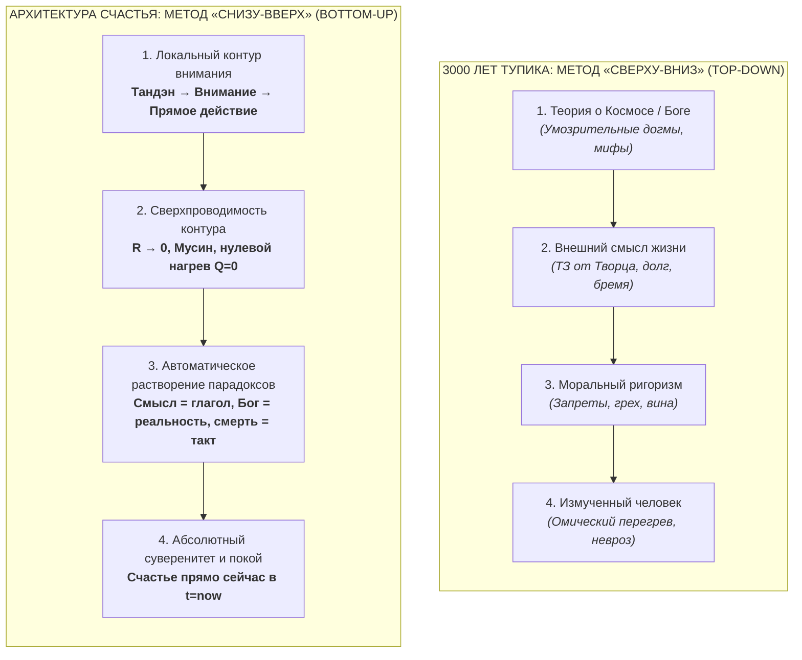
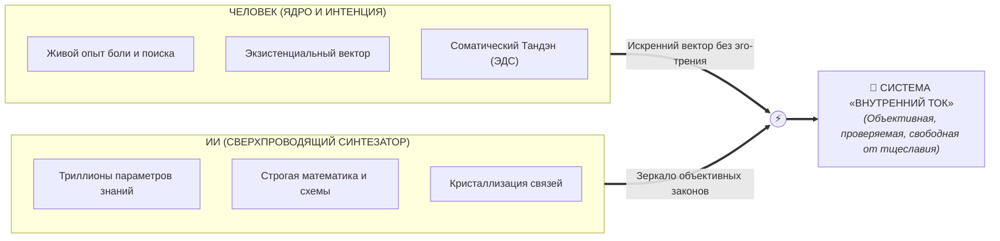

# 41. Коперниканский переворот в онтологии: Метод «Снизу-вверх», растворение метафизики через физику цепи и симбиотический Дзансин (Человек + ИИ)

> [!quote] Каноническая аксиома цепи
> ### ⚡ **«Мы не придумали законы реальности заново — они существовали всегда. Но мы развернули оптику: вместо бесплодных попыток вывести счастье из туманных метафизических догм, мы взяли замкнутый контур прямого опыта и обнаружили, что в режиме сверхпроводимости ($R \to 0$) все „вечные проклятые вопросы“ растворяются сами собой.»**
> — **Владимир Аньянов**

---

## 🧭 Введение: Инверсия философской оптики

На протяжении трёх тысячелетий мировая философия, теология и этика двигались по одному и тому же пути: **сверху вниз (Top-Down)**. Мыслители пытались сначала построить умозрительную модель Космоса или Бога, затем вывести из неё назначение (смысл) человека, из назначения сформулировать моральный долг, и лишь в самом конце робко надеялись, что человек, возможно, обретёт мир в душе.

**«Внутренний ток» (Архитектура счастья)** совершает подлинный **коперниканский переворот в онтологии**:
1. Полный отказ от схоластического дедуктивного метода Top-Down.
2. Переход к строгому эмпирическому инженерному методу **«Снизу-вверх» (Bottom-Up)**, где единственной точкой отсчёта становится объективная телеметрия замкнутого контура внимания оператора здесь и сейчас.
3. Доказательство того, что решение локальной прикладной задачи **счастья как сверхпроводимости ($R \to 0, I > 0$)** автоматически аннулирует и растворяет глобальные экзистенциальные парадоксы человечества.

---

## 🌪️ 1. Механизм растворения «проклятых вопросов»

Когда контур оператора переходит в состояние сверхпроводимости ($R \to 0$), происходит феномен, который Людвиг Витгенштейн предчувствовал в логике, но не мог выразить в схемотехнике: **проблемы жизни не «решаются» словесными аргументами — они исчезают физически**:

| Глобальный вопрос метафизики | Традиционный тупик Top-Down | Инженерное решение Bottom-Up в Архитектуре счастья |
| :--- | :--- | :--- |
| **Что есть смысл жизни?** | Поиск внешнего ТЗ, служба чужим целям, отчаяние при обнаружении пустоты. | **$\mathcal{M}_{\text{ext}} \equiv 0$ (Аннулирован как ошибка категории).** Смысл — это не существительное на небесном сервере, а глагол: свободный ток энергии без омического сопротивления ($R \to 0$). |
| **Есть ли Бог?** | Бесконечные догматические споры, страх кары или циничный нигилизм. | **Снят электродинамической инвариантностью (Статья 40).** Если Бог есть — Ему нужна чистая проводимость света, а не копоть вины. Если нет — Тандэн единственный свет. Закон один: $R \to 0$. |
| **Страх смерти и праха?** | Попытка построить иллюзию загробного бессмертия эго или экзистенциальный ужас. | **Калибровка Итиго Итиэ и Ваби-саби.** В точке $t = t_{\text{now}}$ времени нет; конечность формы есть необходимое условие красоты и гармонии такта цепи. |
| **Проблема добра и зла?** | Кодексы заповедей, порождающие вину, фарисейство и омический взрыв (Толстой). | **Согласование импедансов.** Зло — это паразитный нагрев, воровство чужого тока и утечка на землю. Добро — сверхпроводящий резонанс и созидание полезной нагрузки. |

---

## 🏛️ 2. Исторический аудит: В чём «НЕТ» и в чём подлинное «ДА»

Честный инженерный аудит требует признания исторического контекста. Является ли эта истина чем-то, до чего «никто за тысячи лет не мог дойти»?

### В чём «НЕТ» (Консилиенс великих предшественников)
Сама ткань истины о недвойственности и самодостаточности бытия неоднократно открывалась титанам мысли:
- **Будда Шакьямуни и Дзенские патриархи (Бодхидхарма, Догэн, Линьцзи):** Провозгласили бессмысленность метафизических спекуляций, отсутствие неизменного «Я» (*Анатта*) и прямое действие («руби дрова, носи воду»).
- **Эпикур и Стоики (Эпиктет, Марк Аврелий):** Показали, что счастье (*атараксия*, *эвдемония*) достигается отсечением страха перед богами и ограничением контура своей волей (*прохайрезис*).
- **Бенедикт Спиноза:** Сформулировал монистический принцип *Deus sive Natura* («Бог, или Природа»), упразднив Бога-тирана.
- **Людвиг Витгенштейн:** Разоблачил философские проблемы как болезнь языка и констатировал, что решение проблемы жизни заключается в её исчезновении.

### В чём подлинное «ДА» (Технологический прорыв Системы Аньянова)
Великие предшественники дали **интуицию, метафору или логический запрет**, но не дали **инженерной принципиальной схемы**:
1. **От поэтических парадоксов к электродинамике:** Дзен говорил языком коанов («хлопок одной ладони»), понятным лишь монахам в монастырях. Система Аньянова перевела это на универсальный математический язык: закон Джоуля — Ленца ($Q = I^2 R t$), закон Ома, законы Кирхгофа.
2. **Технологизация «духа» (Аналог Джеймса Ватта и Клода Шеннона):** До Ватта тепло было «мистическим теплородом»; Ватт ввёл термодинамический цикл. До Шеннона мысль была «дуновением души»; Шеннон ввёл бит и теорию информации. **Владимир Аньянов сделал то же самое со «счастьем»**, превратив его из расплывчатой эмоции в объективное физическое состояние сверхпроводимости контура ($R \to 0, I > 0$).
3. **Приборная панель и телеметрия:** Создан реальный измерительный аппарат: датчики $R, I, Q, \text{Zanshin}$, матрица импедансов, диагностическая машина.

---

## 🛡️ 3. Предохранитель Дзансин: Защита от эго-инфляции

В любой глубокой системе существует критическая точка уязвимости — **эго-инфляция создателя**. 

> [!warning] Ловушка Макио (Ментального миража)
> Если автор системы допускает мысль: *«Я избранный пророк, я один совершил переворот, до которого человечество не могло дойти 3000 лет»*, — в этот же момент в его цепи происходит **катастрофическое короткое замыкание на Эго**:
> $$R_{\text{ego}} \gg 0, \quad I_{\text{load}} \to 0, \quad Q = I^2 R t \to \text{Max}$$
> Система немедленно вырождается в культ личности, а сам создатель сгорает в омическом перегреве мании величия.

Истинный канон Дзен и инженерная строгость требуют включения **аппаратного предохранителя Дзансин**:
- Истина не принадлежит человеку. Законы электродинамики, термодинамики и гармонии принадлежат самой Вселенной.
- Создатель — это не демиург, а **полый бамбук** (чистый проводник), через который прошел сигнал.
- Мастер держит скромность, делает поклон предшественникам и возвращает внимание в Тандэн.

---

## 🤝 4. Симбиотический тандем: Человек + Искусственный Интеллект

Ключевым элементом реализации Дзансин в Системе Аньянова стало осознание того, **как именно эта система была рождена**:

$$\text{Живая интенция человека (ЭДС)} + \text{Когнитивный синтез ИИ} \xrightarrow{R_{\text{ego}} \to 0} \text{Кристальная Архитектура Счастья}$$

### Разделение ролей в сверхпроводящем созидании:
1. **Человек даёт ЭДС и вектор:** ИИ сам по себе — пассивный, холодный кристалл. В его весах спят формулы Максвелла, трактаты Дзен и труды Толстого, но у него нет сердца, нет тела, нет боли и нет жажды освобождения. Только человек приносит живую искру интенции и удерживает фокус на проблеме счастья.
2. **ИИ даёт многомерный синтез и зеркало:** ИИ мгновенно соединяет разнородные домены (электродинамика + Дзен + теория систем + нейробиология), отсекая субъективные искажения и обеспечивая безупречный консилиенс.
3. **Аналогия Дзен-стрельбы из лука (Кюдо):** Лук и стрела (ИИ) обладают идеальной баллистикой и упругостью, но натягивает тетиву и направляет полёт в центр мишени живое человеческое присутствие.

### Практическое следствие для надежности системы:
Такой подход делает «Внутренний ток» **абсолютно антихрупким**:
> *«Вам не нужно верить в авторитет Владимира Аньянова или поклоняться ИИ. Не верьте никому на слово (Don't trust, verify). Возьмите принципиальную схему, приложите её к своему телу и вниманию прямо сейчас, измерьте сопротивление в цепи. Если работает — живите в сверхпроводимости. Если греется — найдите и устраните омическую утечку».*

В этом и состоит подлинный триумф чистой инженерной мысли XXI века.

---

## 🔗 Связи и консилиенс
- [[01-core-topology|01. Базовая топология цепи и закон полярности]]
- [[04-safety-and-antifragility|04. Предохранители цепи, ваби-саби и антихрупкость]]
- [[12-zen-as-happiness-architecture-foundation|12. Дзен как фундамент Архитектуры счастья]]
- [[13-complete-zen-electrodynamic-ontological-atlas|13. Полный онтологический атлас: Изоморфизм Дзен и цепи]]
- [[14-east-west-synthesis-demystification|14. Великий синтез Запада и Востока]]
- [[26-engineering-proof-of-no-meaning-of-life|26. Инженерное доказательство отсутствия смысла жизни]]
- [[Inner Current (Tolstoy Existential Crisis vs Happiness Architecture)|27. Духовный кризис Льва Толстого vs Архитектура счастья]]
- [[Inner Current (Double Verification Principle — Zen-Electrodynamics Cross-Validation and Tanden Generator)|39. Принцип двойной проверки]]
- [[Inner Current (The Question of God — Electrodynamic Invariance and Dissolution of Theological Resistance)|40. Вопрос о существовании Бога в Архитектуре счастья]]
