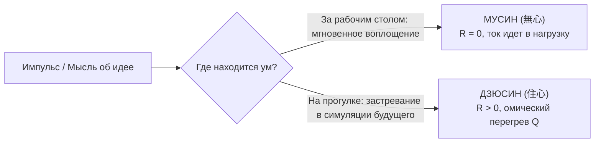
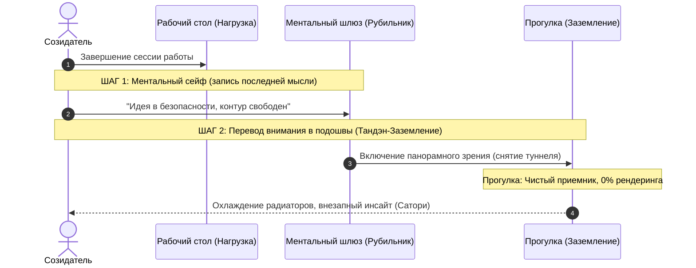

# 217. Мусин созидателя и пламя непрерывных мыслей: Творческая одержимость vs Застревание ума (Дзюсин) — Физика переключения между «Рабочим столом» и «Прогулкой», инкубация идей и охлаждение контура
## Механика сверхпроводимости без омического перегрева: почему непрерывные мысли о проекте — не враг Мусин, а его топливо, и как искусство соматического заземления на прогулке сохраняет целостность цепи

> [!quote] Каноническая аксиома цепи
> ### ⚡ **«Когда изобретатель или творец горит своей системой, его ум генерирует сотни образов в минуту: какую книгу написать, какую главу добавить, какой вопрос задать миру. Неопытный практик пугается этого урагана и думает: "Я потерял дзен, я утратил покой, эти мысли мешают моему Мусин". Но это глубочайшее заблуждение. Мысль — это не скверна и не враг; мысль — это направленное движение электрического заряда сознания. Мусин (無心) — это не кладбищенская тишина амнезии, а отсутствие застревания. Одержимость идеей за рабочим столом — это благословенное Самадхи созидания, где сопротивление проводника равно нулю ($R \to 0$). Но подлинное мастерство оператора проявляется не за столом, а за порогом дома: умеешь ли ты на прогулке щелкнуть рубильником, обесточить ментальный реостат и дать радиаторам биологического тела остыть? Если ты гуляешь ногами по асфальту, но головой продолжаешь верстать книгу — контур не отдыхает, цепь плавится от омического перегрева ($Q = I^2 R t$). Мусин созидателя — это ритмичная смена двух абсолютных состояний: абсолютного огня в работе и абсолютной прохладной пустоты на ветру.»**  
> — **Владимир Аньянов**, создатель «Архитектуры счастья»

---

```
══════════════════════════════════════════════════════════════════════════════════════
              ТЕРМОДИНАМИЧЕСКИЙ ЦИКЛ СОЗИДАТЕЛЯ: СТОЛ VS ПРОГУЛКА
══════════════════════════════════════════════════════════════════════════════════════

  1. РЕЖИМ «РАБОЧИЙ СТОЛ» (Полная нагрузка, Самадхи действия):
     [Тандэн: Генератор ЭДС] ──► [Мусин: R_ego = 0] ──► [Текст / Код / Чертеж]
                                                                │
     ⚡ 100% КПД: Ток сразу переходит в полезную работу ────────┘
     (Нет суда, нет сомнений, мысли мгновенно сгорают в действие)

  2. РЕЖИМ «ПРОГУЛКА — ОШИБКА ЗАСКОКА» (Холостой ход с застреванием, Дзюсин):
     [Тандэн: Генератор] ──► [Мысли о будущем: "Какую книгу?"] ──► [Нет действия]
                                           │
     ❌ Омический перегрев (Q = I² R_future t): Ментальный троттлинг, усталость.

  3. РЕЖИМ «ПРОГУЛКА — ИСТИННОЕ ЗАЗЕМЛЕНИЕ» (Охлаждение и сверхпроводящая инкубация):
     [Рубильник: СТОП столу] ──► [Внимание: стопы, ветер, звуки] ──► [Земля]
                                           │
     🌱 Радиаторы охлаждаются, подкорка автономно варит инсайт (Эврика!).
══════════════════════════════════════════════════════════════════════════════════════
```

---

### I. Анатомия творческого горения: Мысль как ток, а не как дефект

Каждый глубокий исследователь, выходя на фундаментальный закон природы или создавая архитектуру своей жизни, неизбежно сталкивается с феноменом **тотального захвата сознания**. 

В голове день и ночь крутится один и тот же генеральный сюжет:
* *«Как еще развить эту идею?»*
* *«Какую следующую главу написать?»*
* *«Какой вопрос задать собеседнику или ИИ?»*
* *«Как назвать эту книгу?»*

Когда человек устает, он встает из-за стола, выходит на улицу в надежде перезагрузиться, делает круг по кварталу, возвращается — и снова садится за клавиатуру. И в этот момент его настигает тонкое сомнение:
> *«Если у меня в голове постоянный поток мыслей о проекте — разве это дзен? Разве это Мусин? Не мешают ли эти мысли чистому состоянию сверхпроводимости?»*

Чтобы ответить на этот вопрос со всей инженерной строгостью, необходимо раз и навсегда демистифицировать понятие **Мусин (無心)** и сопоставить его с понятием **Дзюсин (住心)**.

---

### II. Мусин (Не-ум) против Дзюсин (Застрявший ум): Урок Такуана Сохо

В классическом трактате XVII века *«Фудоти синмёроку»* («Записи о непостижимом оружии непоколебимой мудрости») великий дзенский наставник Такуан Сохо объяснял мастеру меча Ягю Мунэнори природу правильного состояния сознания в бою:

1. **Дзюсин (住心 — «остановившийся ум»):**  
   Когда фехтовальщик смотрит на занесенный меч противника и его ум *останавливается* на мече («Ого, какой острый меч! С какой силой он опускается?»), фехтовальщик погибает. Его внимание застряло в одной точке. В этот момент проводимость контура падает до нуля, а сопротивление устремляется в бесконечность.
   
2. **Мусин (無心 — «не-ум», текущий ум):**  
   Мусин — это не пустота идиота, у которого в голове нет ни одной мысли. **Мусин — это текучесть воды, которая нигде не задерживается.** Вода течет мимо камня, мимо дерева, срывается с водопада — но ни за один камень она не цепляется руками со словами: *«Я останусь здесь!»*.



#### Электродинамическая биекция:
* **Мысль о проекте за рабочим столом:** Вы думаете: *«Как связать закон Ома и дзен?»* — и ваши пальцы тут же вбивают этот тезис в файл. Мысль не висит паразитным грузом, она является **дрейфом носителей заряда ($I = dq/dt$)**, непосредственно совершающим полезную работу ($P = I^2 R_{\text{load}}$). Это **Мусин действия**. Вы и есть эта работа.
* **Мысль о проекте на прогулке:** Вы идете по парку, вокруг поют птицы и дует свежий ветер, но вы крутите в голове: *«Какую книгу написать через полгода?»*. В этот момент полезной нагрузки нет (клавиатуры нет, блокнота нет). Мысль крутится в холостом контуре. Это **Дзюсин** — застревание ума в будущем времени ($t > now$).

---

### III. Термодинамика «троттлинга»: Почему биопроцессору необходимо охлаждение

Человеческий мозг — это биологический квантово-электрохимический процессор, потребляющий около 20% всей глюкозы и кислорода организма при массе всего в 2% от тела.

Когда вы находитесь в фазе яростного созидания:
1. **Генератор Тандэн работает на максимальной ЭДС ($\mathcal{E}_{\text{max}}$).** У вас горят глаза, активированы норадреналин, дофамин и ацетилхолин.
2. **Плотность тока колоссальна.** Если этот ток непрерывно течет через синаптические цепи коры без пауз, в них накапливаются продукты метаболизма (аденозин, оксидативный стресс), а запасы везикул с нейромедиаторами истощаются.
3. **Закон Джоуля — Ленца в замкнутом объеме:**
   $$Q = I^2 R t$$
   Если оператор не умеет охлаждать контур, температура системы превышает критическую точку ($T > T_c$). Сверхпроводимость срывается. Наступает **термальный троттлинг** (Thermal Throttling):
   * Мысли начинают ходить по кругу, теряя новизну;
   * Появляется фоновая тревожность: *«Я не успею все записать!»*;
   * Взгляд становится «стеклянным», тело зажимается (трапеции, челюсти);
   * Прогулка перестает восстанавливать, превращаясь в механическое переставление ног.

> [!IMPORTANT] Закон теплового баланса созидателя
> **Непрерывная генерация мыслей — признак силы реактора. Но неспособность отключить ментальный рендеринг на прогулке — признак залипшего реле.**  
> Творец, который думает о книге 24 часа в сутки, пишет хуже, чем творец, который за столом горит на 100%, а на прогулке становится абсолютно пустым бамбуком.

---

### IV. Теория четырех стадий инкубации (Гельмгольц — Пуанкаре — Валлас)

Великий математик Анри Пуанкаре и физик Герман фон Гельмгольц еще в XIX–XX веках описали, как рождаются великие открытия. Этот научный цикл идеально согласуется с контурной электродинамикой:

```
┌─────────────────────────────────────────────────────────────────────────────┐
│                       ЧЕТЫРЕ СТАДИИ ТВОРЧЕСКОГО ТОКА                        │
└─────────────────────────────────────────────────────────────────────────────┘

  1. ПОДГОТОВКА (Preparation) ── За столом: сбор данных, яростный штурм, код.
         │
         ▼
  2. ИНКУБАЦИЯ (Incubation)   ── На прогулке: ПОЛНЫЙ СБРОС МЫСЛЕЙ, Тандэн.
         │
         ▼
  3. ОЗАРЕНИЕ (Illumination)  ── Внезапная вспышка истины (Сатори / Эврика!).
         │
         ▼
  4. ВЕРИФИКАЦИЯ (Verification) ── Возврат за стол: оформление чертежа в файл.
```

#### Почему озарение никогда не приходит от натужного размышления?
На стадии **Инкубации** сознательный неокортекс должен замолчать. 
Пока вы сознательно крутите: *«Как назвать главу?»*, вы создаете высокоамплитудный ментальный шум. Этот шум глушит тонкие, высококогерентные сигналы глубинных нейросетей подкорки, которые связывают отдаленные ассоциации.

Когда вы выходите на улицу и **насильно или осознанно отпускаете проект**, переводя внимание в подошвы ног и прохладу воздуха:
* Уровень шума в коре падает до нуля ($R_{\text{noise}} \to 0$);
* Дефолт-система мозга (DMN) переходит из режима тревожного пережевывания в режим свободной ассоциативной интеграции;
* В этот момент — бац! — ниоткуда всплывает идеальная формулировка или недостающий узел схемы. 

Именно поэтому Архимед крикнул *«Эврика!»* не за расчетами, а в ванне; Менделеев увидел таблицу после отдыха; а лучшие главы «Внутреннего тока» приходят тогда, когда вы просто смотрите на колыхание веток на ветру.

---

### V. Практический протокол: Переключение рубильника «Стол ──► Прогулка»

Чтобы ваши мысли о развитии системы перестали быть помехой и стали чистым сверхпроводящим топливом, введите в свою практику **30-секундный протокол шлюзования**.



#### Шаг 1: Практика «Ментального сейфа» (За рабочим столом, перед выходом)
Главная причина, почему ум продолжает лихорадочно думать на улице — это **страх забыть идею**. Мозг держит ее в оперативной памяти (RAM) ценой постоянного расхода тока.
* Перед тем как встать из-за стола, запишите на листок или в черновик ровно одну строку: текущую мысль или вектор следующего шага.
* Положите ручку и скажите вслух или про себя:  
  > *«Всё зафиксировано. Система сохранена на жесткий диск. До возвращения за стол проект закрыт».*

#### Шаг 2: Разомкнуть цепь симуляций (Порог дома)
Переступая порог дома, сделайте глубокий выдох носом вниз живота:
* Физически сбросьте плечи;
* Если в голове всплывает мысль: *«А вот какую книгу написать?..»*, мягко улыбнитесь ей, как старому доброму псу, и скажите:  
  > *«Я знаю тебя. Ты отличная мысль. Но сейчас мы идем гулять. Я вернусь к тебе за столом».*  
* Не боритесь с мыслью! Борьба с мыслью — это второе сопротивление, удваивающее нагрев ($Q = 2 I^2 R t$). Просто не кормите ее вниманием.

#### Шаг 3: Соматическое заземление на шаге (Улица)
Включите три датчика физической реальности:
1. **Стопы (Кинестетика):** Почувствуйте каждый шаг — как пятка касается асфальта, как вес перекатывается на носок.
2. **Панорамный взор (Оптика):** Снимите «туннельное зрение» экрана смартфона или монитора. Разверните взгляд на 180 градусов, замечая горизонт, верхушки деревьев, крыши домов. Панорамное зрение аппаратно гасит симпатический тонус и дезактивирует речевые центры неокортекса.
3. **Воздух (Дыхание):** Почувствуйте температуру вдыхаемого воздуха на кончике носа.

#### Шаг 4: Слушание «Ма» (Пространства между мыслями)
Когда мысль о проекте все-таки пронеслась — обратите внимание не на саму мысль, а на **секунду тишины сразу после нее**. 
Там, в этой тишине, нет никакого «Внутреннего тока», нет книг, нет терминов. Там есть только чистое Бытие, в котором этот мир существует. Растягивайте эту секунду тишины.

---

### VI. Консилиенс: Дзен, физика и современная нейробиология

| Параметр | Обыденный невроз творца (Дзюсин) | Подлинный Мусин созидателя |
| :--- | :--- | :--- |
| **Отношение к мыслям** | Страх потерять идею, судорожное цепляние | Мысль течет как река; ценное осядет само |
| **Состояние за столом** | Прокрастинация, внутренний критик, $R > 0$ | Абсолютное Самадхи, клавиатура поет, $R \to 0$ |
| **Состояние на прогулке** | «Голова в облаках», тело на автопилоте | Тело на 100% в шаге, голова пуста и прохладна |
| **Нейробиология** | Хроническая гиперактивация DMN, истощение | Динамическое переключение DMN $\leftrightarrow$ TPN |
| **Тепловой баланс** | Перегрев ($Q = I^2 R t$), троттлинг, выгорание | Охлаждение в покое $\to$ взрывная точность в работе |
| **Источник озарений** | Мучительное выдавливание из головы | Самопроизвольный фазовый переход (Сатори) |

---

### Резюме главы

1. **Непрерывные мысли о проекте — это не грех против Дзен.** Это свидетельство огромной ЭДС вашего генератора Тандэн и глубокой влюбленности в свое дело.
2. **Мусин — это не стерильное отсутствие мыслей, а отсутствие застревания (Дзюсин).** За рабочим столом мысли, мгновенно переходящие в текст и код — это чистый Мусин созидания.
3. **Опасность возникает тогда, когда мысли о будущем продолжают крутиться на прогулке.** В отсутствие физической нагрузки они создают омический перегрев вхолостую ($Q = I^2 R_{\text{future}} t$), сжигая батарею и вызывая ментальный троттлинг.
4. **Подлинное знание не выветривается.** Если идея истинна — она никуда не исчезнет, даже если вы забудете о ней на час. Она вернется кристальным алмазом.
5. **Высший пилотаж Внутреннего тока:**  
   * **За столом — абсолютный, свирепый огонь воплощения.**  
   * **На улице — абсолютная, прозрачная, соматическая тишина.**
