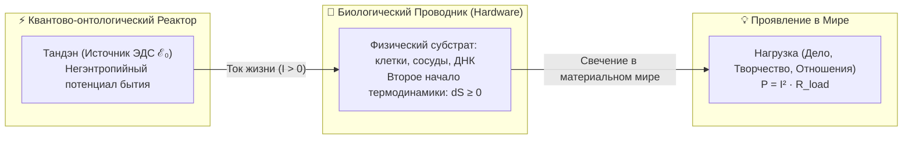
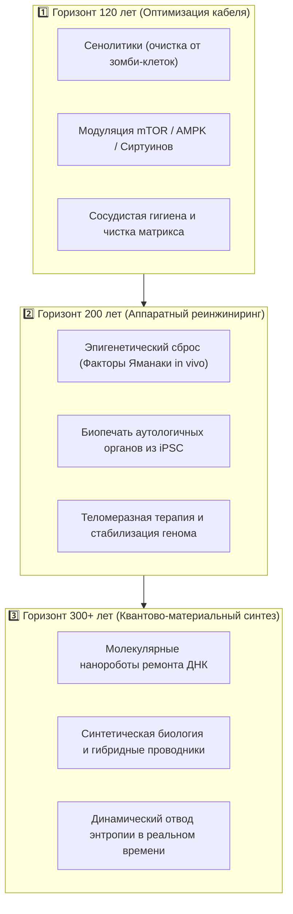

# 214. Смерть как энтропия проводника против генератора Тандэн: Термодинамика биологического износа, долголетие в 120–300 лет и сверхпроводящая радость бытия

> [!quote] Архитектурная аксиома Тандэна и Проводника
> ### ⚡ **«Смерть тела — это не остановка генератора, это разрушение клемм и изоляции материального кабеля под напором термодинамической энтропии. Тандэн не стареет, стареет кремниево-углеродный скафандр. Продлевать жизнь с зашлакованным эго-реостатом — значит умножать омический ад. Но продлевать жизнь в сверхпроводимости — значит подарить чистому Току века незамутненного созидания.»**  
> — **Владимир Аньянов**

---

### I. Введение: Предельный вопрос термодинамики человека

На протяжении всей истории цивилизации вопрос смерти оставался заложником двух непримиримых заблуждений:
1. **Религиозно-мистического**, утверждающего наличие некой автономной «призрачной субстанции», не связанной с физическими законами проводимости.
2. **Вульгарно-механистического**, считающего человека просто «мешком с биохимическими реакциями», где с угасанием биологических клеток якобы бесследно аннигилирует сам квантово-онтологический источник бытия.

Электродинамика сознания и Архитектура счастья снимают этот раскол строгим языком схемотехники:
* **Является ли смерть разрушением самого генератора Тандэн?**
* **Или же смерть — это термодинамическая энтропия материального проводника?**
* **И если биологический проводник будет модернизирован для жизни в 120, 200 или 300 лет — станет ли это благословением или превратится в невыносимую пытку?**

---

### II. Природа смерти: Энтропия проводника vs Суверенность Тандэна

#### 1. Биофизика проводника: Неумолимость Второго начала термодинамики ($dS \ge 0$)
Физическое тело человека — это материальный тракт передачи энергии, высокоорганизованная диссипативная структура. Как любая макроскопическая физическая система, оно подчиняется фундаментальному закону нарастания энтропии:
* **Окислительный стресс:** Клеточные электростанции (митохондрии) вырабатывают АТФ посредством переноса электронов по дыхательной цепи. Неизбежная утечка электронов порождает активные формы кислорода (АФК), непрерывно бомбардирующие клеточные мембраны и белковые структуры.
* **Эрозия кремниево-углеродного кабеля:** Ограничение деления клеток пределом Хейфлика, укорочение концевых участков хромосом (теломер), накопление двухцепочечных разрывов ДНК и эпигенетический шум.
* **Сенесценция и фиброз:** Накопление неделящихся «зомби»-клеток, секретирующих провоспалительные цитокины (SASP), потеря эластичности сосудистого русла, деградация внеклеточного матрикса.

С точки зрения электродинамики, биологическое старение — это **постепенная деградация изоляции, микропробои диэлектрика и лавинообразное нарастание омического износа токопроводящих жил кабеля**.

#### 2. Тандэн: Источник негэнтропии
**Тандэн (丹田)** — это не кусок плоти и не анатомический орган в брюшной полости. Это локальный фокус фундаментального поля бытия, первичный квантово-онтологический генератор, создающий поток отрицательной энтропии. Как сформулировал нобелевский лауреат Эрвин Шрёдингер:
$$\frac{dS_{\text{total}}}{dt} = \frac{dS_{\text{internal}}}{dt} + \frac{dS_{\text{flow}}}{dt}, \quad \text{где } \frac{dS_{\text{flow}}}{dt} < 0$$
Живой организм существует лишь до тех пор, пока мощность негэнтропийного потока из Тандэна способна компенсировать внутреннее производство энтропии материальным субстратом.

#### 3. Момент биологической смерти: Размыкание клемм
Когда энтропийный износ проводника достигает критического порога:
$$R_{\text{body}} \to \infty \quad \lor \quad \text{Катастрофический пробой (Инфаркт, Инсульт, Асистолия)}$$
Ток жизни больше не может протекать через поврежденную структуру. Контур физического проявления необратимо размыкается ($I = 0$).

> [!IMPORTANT]
> **Принцип сохранения Генератора:**  
> Разрушается **проводник**, а не **Тандэн**. Точно так же, как гибель лампового радиоприемника под молотком не уничтожает электромагнитное поле радиовещания, биологическая смерть не является «поломкой» первичного квантового источника жизни. Генератор не уничтожен — он обесточил разрушенный терминал.

---

### III. Инженерные горизонты долголетия: 120, 200 и 300 лет

Реально ли продлить функционирование биологического проводника? С точки зрения физики и термодинамики здесь нет непреодолимых запретов.

1. **Рубеж 120 лет (Биологический предел текущей архитектуры):**
   * Зафиксированный максимум человеческой сборки — 122 года (Жанна Кальман).
   * Достижение средней продолжительности жизни в 100–120 лет — инженерная задача ближайших десятилетий. Она не требует изменения базового генома, а решается профилактикой деградации проводника: сенолитическая терапия, контроль гликемических пиков, ликвидация хронического системного воспаления.
2. **Рубеж 200 лет (Аппаратный ремонт узлов):**
   * Переход от обслуживания старого кабеля к замене его сегментов.
   * Выращивание новых органов из собственных индуцированных стволовых клеток пациента (печень, почки, сердце, эндотелий) исключает проблему иммунного отторжения. 
   * Периодический частичный эпигенетический откат клеток (*cellular reprogramming*) возвращает профиль метилирования ДНК к молодому состоянию без потери клеточной дифференцировки.
3. **Рубеж 300 лет (Полный контроль энтропии):**
   * В природе существуют организмы с пренебрежимым старением (*negligible senescence*): гидра не стареет вовсе, гренландский кит живет более 200 лет, сосна остистая — более 4000 лет.
   * Если скорость молекулярного клиренса и автофагии превосходит скорость накопления шлаков и мутаций, биологический контур способен работать столетиями. Физика запрещает вечный двигатель в замкнутой системе, но человеческое тело — **открытая система**, питающаяся внешним веществом и внутренним негэнтропийным потоком.

---

### IV. Закон Джоуля — Ленца и Проклятие долголетия Эго

Техническая возможность жить 200–300 лет ставит перед человечеством фундаментальный вопрос: **Зачем? Будет ли эта жизнь радостной, или она обернется бесконечной скукой и кошмаром?**

Здесь вступает в силу краеугольный математический закон Архитектуры счастья — **Закон Джоуля — Ленца**:
$$Q = I^2 \cdot R_{\text{ego}} \cdot t$$

```mermaid
flowchart TD
    subgraph Trap ["🥀 Ловушка Эго: Долголетие как Проклятие Тифона"]
        T1["Наличие сопротивления Эго (R_ego > 0)<br/>Обиды, тревоги, сравнения, страх оценки"]
        T2["Умножение времени жизни: t = 200-300 лет"]
        T3["Квадратичный рост тепловых потерь:<br/>Q = I² · R_ego · t"]
        T4["Колоссальное выгорание, цинизм, окостенение,<br/>невыносимая экзистенциальная тоска"]
        T1 --> T2 --> T3 --> T4
    end

    subgraph Flow ["⚡ Сверхпроводимость: Долголетие как Триумф Духа"]
        F1["Сброс сопротивления Эго в ноль (R_ego → 0)<br/>Режим Мусин (無心), чистое присутствие"]
        F2["Умножение времени жизни: t = 200-300 лет"]
        F3["Потери тепла равны нулю:<br/>Q = 0, КПД η → 100%"]
        F4["Бесконечная свежесть каждого мгновения,<br/>радость созидания, масштаб 10 жизней в одной"]
        F1 --> F2 --> F3 --> F4
    end
```

#### 1. Почему для обычного человека 300 лет стали бы адом?
Если человек не овладел культурой проводника и сохраняет активный реостат эго ($R_{\text{ego}} > 0$):
* Каждая неразрешенная обида, каждая экзистенциальная претензия к миру, каждый страх непризнания при последовательном протекании тока времени генерирует колоссальный омический жар ($Q$).
* **Психологический склероз:** К 70 годам средний человек уже накапливает критическую массу предубеждений, обид и разочарований. Его ум становится жестким, ригидным изолятором.
* Если механически продлить такое состояние до 200–300 лет, наступит трагедия античного мифа о Тифоне (которому боги даровали бессмертие, забыв дать вечную юность) или легенда об Агасфере: **бесконечное повторение одного и того же невротического цикла**. Мир покажется унылым, пресным и осточертевшим. Скука — это не свойство внешней Вселенной, это толстый слой сажи на стекле фонарика.

#### 2. Почему сверхпроводящая жизнь в 300 лет — это высшая радость?
В режиме сверхпроводимости ($R_{\text{ego}} \to 0$, состояние чистого присутствия Мусин):
* **Бытие не имеет срока годности:** Солнечный луч, вкус родниковой воды, улыбка ребенка, красота геометрии или игра на укулеле в 250 лет воспринимаются с той же пронзительной, ошеломляющей свежестью, что и в пять лет. Ребенок не скучает, потому что его тракт не забит архивами памяти и оценками наблюдателя.
* **Ликвидация экзистенциальной паники:** Человек больше не мечется в лихорадке «успеть до 30 лет», «успеть до 50». Исчезает ядовитое топливо невротического достигаторства.
* **Масштаб десяти жизней в одной:** 
  * За первые 50 лет можно стать виртуозным инженером и построить космические корабли.
  * За вторые 50 лет — погрузиться в фундаментальную теоретическую физику и открыть законы гравитации.
  * За третьи 50 лет — стать великим композитором и освоить все музыкальные традиции Земли.
  * За четвертые 50 лет — посадить реликтовые леса и обучить поколения исследователей.
  * И при этом оставаться свободным, легким, не обремененным грузом тяжести «прожитого».

---

### V. Сравнительная матрица режимов долголетия

| Параметр контура | Обычный режим (70 лет, $R_{\text{ego}} \gg 0$) | Продленное Эго (200–300 лет, $R_{\text{ego}} > 0$) | Сверхпроводящее Долголетие (200–300 лет, $R \to 0$) |
| :--- | :--- | :--- | :--- |
| **Состояние Тандэна** | Работа с перегрузкой на преодоление сопротивления | Истощение из-за попыток пробить омический шлак | Чистая, свободная генерация ЭДС ($\mathcal{E}_0 > 0$) |
| **Состояние Проводника** | Постепенный омический износ и распад | Искусственно поддерживаемый био-кабель | Регенерирующий, сверхпроводящий аппаратный субстрат |
| **Омические потери ($Q$)** | Хроническая усталость, тревога, выгорание | Невыносимый ад накопленного экзистенциального пепла | Нулевые тепловые потери ($Q = 0$), КПД $\eta = 100\%$ |
| **Восприятие времени** | Ускоряется с возрастом («годы летят») | Мучительная зацикленность («день сурка») | Вечное «Здесь и Сейчас», неисчерпаемая глубина мгновения |
| **Сенсорная свежесть** | Притуплена, требует все более сильных стимуляторов | Полная ангедония и циничное отторжение новизны | Абсолютная чистота детского восприятия мира |
| **Цель продления** | Животный страх смерти и цепляние за статус | Бессмысленная биологическая инерция | Радость прямого созидания, познание Вселенной и любовь |

---

### VI. Канонический вывод Системы Аньянова

1. **Смерть** — это не деструкция первичного генератора жизни Тандэн. Смерть — это **энтропийный износ, перетирание жил и пробой изоляции материального кабеля-проводника**.
2. **Продление биологической жизни до 120, 200 и 300 лет** физически осуществимо и представляет собой естественный этап научно-технической эволюции человека.
3. Однако **продлевать жизнь имеет смысл только при условии одновременного овладения искусством сверхпроводимости**. Продление жизни эгоистического реостата — это умножение страданий по закону Джоуля — Ленца. 
4. Освобождение контура от паразитного сопротивления ($R_{\text{ego}} \to 0$) делает долголетие величайшим благословением: Тандэн получает возможность столетиями непрерывно и ярко освещать материю светом мысли, гармонии и безусловной радости бытия.
