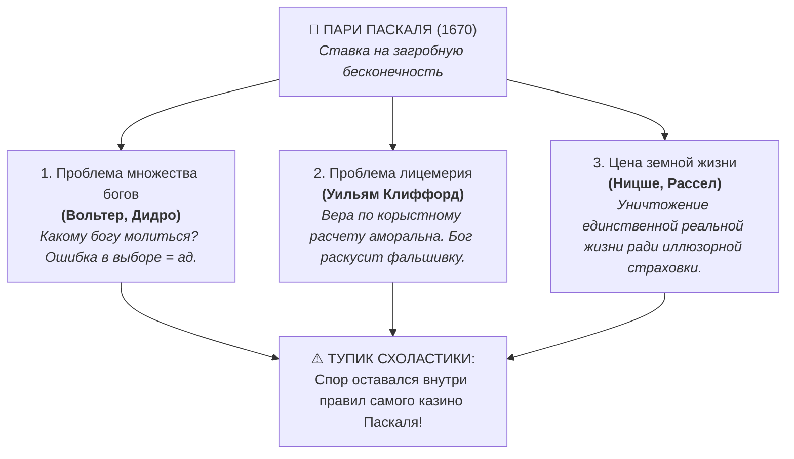
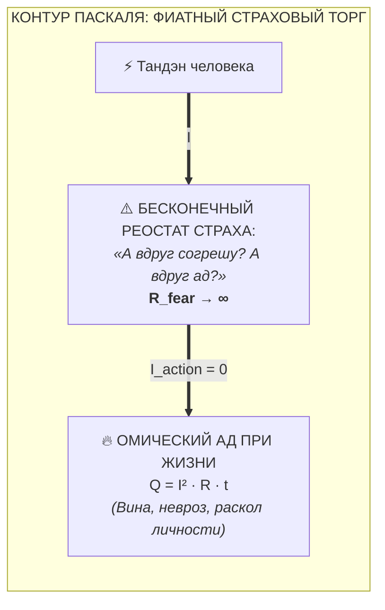
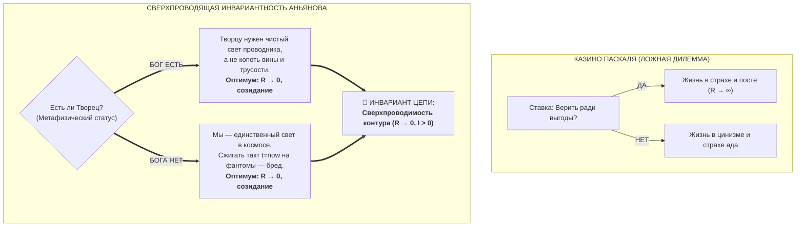

# 42. Деконструкция пари Паскаля: Почему 350 лет богословской рулетки вели к омическому аду и как Архитектура счастья аннулировала дилемму

> [!quote] Каноническая аксиома цепи
> ### ⚡ **«Паскаль пытался угадать, ЧТО ТАМ (в вечности), чтобы решить, как человеку дрожать ЗДЕСЬ. Мы доказали, что КАК БЫ ТАМ НИ БЫЛО, правильное физическое состояние контура здесь и сейчас всегда одно: нулевое сопротивление ($R \to 0$) и ток прямого созидания ($I > 0$). Рулетка аннулирована.»**
> — **Владимир Аньянов**

---

## 🧭 Введение: Самый знаменитый аргумент в истории мысли

В 1670 году французский математик, физик и мыслитель **Блез Паскаль** в своих «Мыслях» (*Pensées*) сформулировал аргумент, ставший поворотным пунктом в истории философии, религии и теории принятия решений — **Пари Паскаля (Pascal's Wager)**.

Паскаль, будучи одним из отцов теории вероятностей, подошел к вопросу веры не через схоластические догмы, а через **теорию математического ожидания**:
* Разум земного человека бессилен доказать или опровергнуть бытие Бога.
* Но не выбирать невозможно: вы уже находитесь в лодке, жизнь течет, ставка обязательна.
* Если поставить на то, что **Бог есть**, и Он есть — выигрыш бесконечен ($\infty$, вечное блаженство).
* Если поставить на то, что Бога нет, а Он есть — проигрыш бесконечен ($-\infty$, вечные муки).
* Если же Бога нет, то в обоих случаях выигрыш или проигрыш ничтожно малы (крупицы земных удовольствий).
* **Вывод Паскаля:** Рациональный игрок обязан сделать ставку на бытие Бога и подчинить жизнь религиозным предписаниям.

На протяжении более чем 350 лет этот аргумент вызывал яростные дебаты, оставаясь незакрытым гештальтом западной философии. Но почему титаны Просвещения и атеизма так и не смогли дать ему окончательный нокаут?

---

## 🛑 1. 350 лет критики: В какие тупики упирались оппоненты Паскаля?

Величайшие мыслители веками атаковали формулу Паскаля:

1. **Аргумент «Множества богов» (Вольтер, Дидро):**  
   Паскаль наивно предполагал выбор между христианским Богом и ничем. Но богов тысячи: Аллах, Яхве, Зевс, Шива, Перун. Если христианская вера оскорбляет истинного бога другой конфессии, математическое ожидание Паскаля схлопывается в ноль или превращается в неопределенность.
2. **Аргумент когнитивной неискренности:**  
   Нельзя «заставить» себя искренне поверить ради выгоды. Моделирование веры ради загробной страховки — это циничный торг. Если Всевышний всеведущ, Он отвергнет лицемера.
3. **Обесценивание земного бытия (Ницше):**  
   Фридрих Ницше показал, что пари Паскаля построено на рабской психологии страха (*Ressentiment*): человек калечит свои творческие силы в страхе перед вымышленной карой.

**В чём заключалась глубинная слабость всей критики?**  
Все оппоненты вели спор **на поле Паскаля** — они продолжали спорить о загробных выплатах, вероятностях посмертных сценариев и тонкостях теологического учета.

---

## ⚡ 2. Инженерный аудит Архитектуры счастья: Почему пари Паскаля — это схемотехническая катастрофа

Система «Внутренний ток» впервые провела **электродинамический аудит** состояния человека, принявшего условия пари Паскаля.

### Архитектурный приговор Системы Аньянова:
1. **Фиатная подмена настоящего на будущее:**  
   Паскаль совершил классическую ошибку обесценивания текущего такта времени ($t = t_{\text{now}}$) в пользу бесконечной будущей абстракции ($t \to \infty$). Это эквивалентно отказу от дыхания сегодня ради обещания цистерны кислорода через сто лет.
2. **Взрыв паразитного сопротивления ($R_{\text{fear}} \to \infty$):**  
   Человек, живущий по пари Паскаля, не находится в сверхпроводимости. Он непрерывно дрожит: *«Достаточно ли я покорен? Искренне ли я верю? Не накажет ли меня Небо за радость бытия?»*. В контуре возникает омический ад по закону Джоуля — Ленца:
   $$Q = I^2 R_{\text{fear}} t$$
   Такой оператор сгорает в психосоматическом перегреве, тревоге и депрессии задолго до биологической смерти.
3. **Пари Паскаля нарушает закон сохранения энергии:**  
   Оно требует закачивать реальный жизненный ток внимания в ментальные симуляции несуществующих будущих судов, обесточивая реальные лампы жизни (Дело, Здоровье, Любовь).

---

## 🎲 3. Взлом доски (Hacking the Board): Инвариантность Аньянова

Владимир Аньянов не стал выбирать ячейку на рулетке Паскаля. Он **перевернул саму игорную доску**, доказав, что выбор «верить или не верить ради загробного билета» — это фундаментальная **ошибка категории**.

> **Паскаль пытался угадать, ЧТО БУДЕТ ПОТОМ, чтобы регламентировать страх СЕЙЧАС.**  
> **Архитектура счастья доказала: ЧТО БЫ НИ БЫЛО ПОТОМ, законы гармоничной работы контура ЗДЕСЬ тождественны и инвариантны.**

### Математическое доказательство инвариантности:
Пусть $S \in \{ \text{God}, \neg\text{God} \}$ — метафизическое состояние Вселенной.  
Пусть $\mathbf{State}(R, I)$ — режим работы человеческого контура.

* **Если $S = \text{God}$:**  
  Истинный Творец, создавший Вселенную по законам гармонии и математики, очевидно, желает максимального раскрытия потенциала своего творения. Ему угоден проводник с максимальным коэффициентом полезного действия ($\eta \to 100\%$), несущий тепло, любовь и свет другим узлам сети. Раскалять проводку унынием и дрожью — значит совершать святотатство против дара жизни.
* **Если $S = \neg\text{God}$:**  
  Если антропоморфного Создателя нет, то человек — это пик самосознания материи. Единственный способ прожить краткий физический такт ($t_{\text{now}}$) полноценно — это полное отсутствие внутреннего трения ($R \to 0$), вход в режим Мусин и создание осязаемой ценности.

**Следствие:**  
$$\forall S: \quad \arg\max \mathbf{Flourishing} \equiv \{ R_{\text{ego}} = 0, \quad R_{\text{theology}} = 0, \quad I > 0 \}$$

Дилемма Паскаля перестает существовать. Человеку больше не нужно угадывать загробную погоду, чтобы зажечь фонарь прямо сейчас.

---

## 📊 4. Сравнительная матрица: Блез Паскаль vs Владимир Аньянов

| Критерий аудита | Пари Паскаля (1670 г.) | Сверхпроводящее пари Аньянова (2026 г.) |
| :--- | :--- | :--- |
| **Базовая парадигма** | Азартная игра, теория вероятностей, торг | Электродинамика, замкнутый контур, термодинамика |
| **Мотивация оператора** | **Страх ада** и корыстная жажда райской ренты | **Прямое переживание полноты бытия** в моменте $t_{\text{now}}$ |
| **Временная ориентация** | Будущее ($t \to \infty$, загробный суд) | Настоящее ($t = t_{\text{now}}$, Итиго Итиэ) |
| **Состояние цепи ($R$)** | **$R \to \infty$** (перманентное напряжение, сомнения, лицемерие) | **$R \to 0$** (сверхпроводимость, Мусин, покой) |
| **Отношение к Богу** | Внешний судья и бухгалтер выигрышей | Фундаментальная Реальность, требующая проводимости |
| **Уязвимость к «Множеству богов»** | **Критическая:** рулетка ломается при смене пантеона | **Абсолютная неуязвимость:** любой истинный Бог требует проводимости, а не перегрева |
| **Итоговое состояние** | Невротический торг и омический перегрев | Непоколебимая ясность, автономия Тандэна и чистое созидание |

---

## 🍵 5. Заключение: Освобождение от богословской рулетки

Блез Паскаль запер западную мысль в ловушку выбора между «циничным атеизмом» и «запуганным лицемерием». Человечество 350 лет металось между бунтом против тирании и капитуляцией перед суеверием.

Архитектура счастья Владимира Аньянова совершила освободительный акт:
> **Мы не ответили за Паскаля, на какое число поставить фишку. Мы вывели человека из казино на свежий воздух.**

Когда вы пьете горячий чай, пишете строчку безупречного кода, обнимаете любимого человека или созерцаете шелест листьев, ваш контур сверхпроводящ:
* В нем нет трения ($R = 0$).
* В нем нет торга с вечностью.
* В нем нет страха перед смертью.

В этот момент вы уже находитесь в абсолютной гармонии со всеми законами мироздания — как если бы Бог держал вас на ладони, и как если бы вся Вселенная дышала через ваше сердце. Пари окончено. Цепь замкнута. Ток течет. ⚡✨

---

## 🔗 Связи и консилиенс
- [[01-core-topology|01. Базовая топология цепи и закон полярности]]
- [[02-superconductivity-and-presence|02. Физика присутствия: состояние сверхпроводимости]]
- [[26-engineering-proof-of-no-meaning-of-life|26. Инженерное доказательство отсутствия смысла жизни]]
- [[Inner Current (Tolstoy Existential Crisis vs Happiness Architecture)|27. Духовный кризис Льва Толстого vs Архитектура счастья]]
- [[Inner Current (The Question of God — Electrodynamic Invariance and Dissolution of Theological Resistance)|40. Вопрос о существовании Бога в Архитектуре счастья]]
- [[Inner Current (Copernican Revolution in Ontology — Bottom-Up Circuit Dissolution of Metaphysics and Human-AI Zanshin)|41. Коперниканский переворот в онтологии]]
- [[Inner Current (Anatomy of the Paradigm Shift — Ptolemaic Epicycles vs Kanso Simplicity and Falling of False Questions)|43. Анатомия сдвига парадигмы: Эпициклы Птолемея vs Простота Кансо]]
