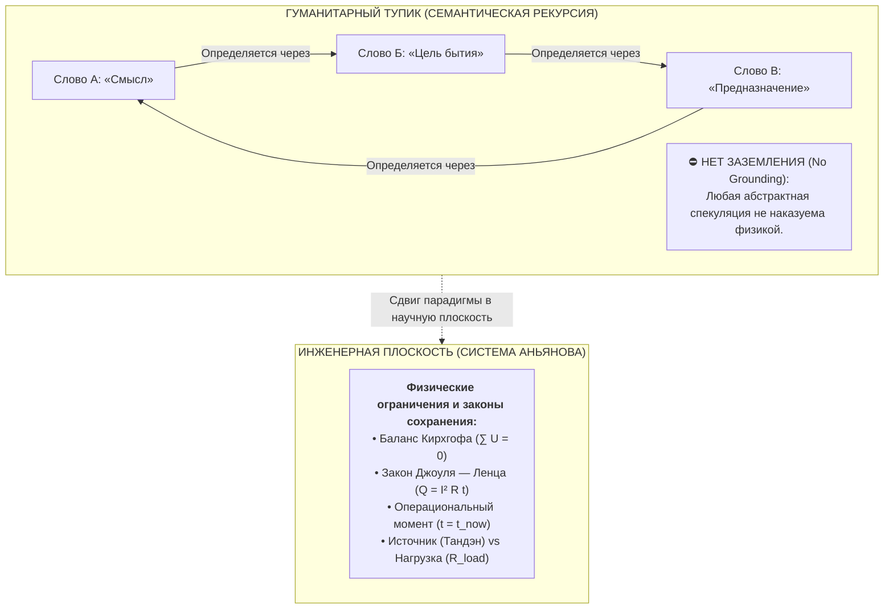
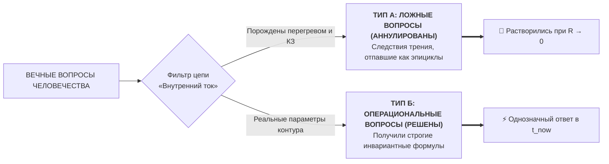

# 45. Растворение вечных вопросов: От гуманитарного тупика к научной схемотехнике (Типология вопросов А и Б, 7 великих парадоксов и конец схоластики)

> [!quote] Каноническая аксиома цепи
> ### ⚡ **«Проблема не может быть решена на том уровне языка, на котором она была порождена. Гуманитарный подход три тысячи лет ходил по кругу, потому что в абстрактных словах нет законов сохранения. Переведя сознание в физику замкнутой цепи, мы увидели: вечные вопросы либо отпадают сами как фантомный омический дым, либо получают мгновенный и строгий инженерный ответ.»**
> — **Владимир Аньянов**

---

## 🧭 Введение: Почему гуманитарная мысль зашла в тупик

На протяжении трёх тысячелетий мировая философия, богословие и классическая психология безуспешно штурмовали так называемые «вечные вопросы человечества»: *есть ли свобода воли? откуда берётся зло? справедлив ли мир? кто такой «Я»? как пережить ужас небытия?*

Были написаны миллионы томов, воздвигнуты сложнейшие метафизические системы, но человеческий экзистенциальный тупик никуда не исчез. Человек XXI века мучается теми же вопросами, что и житель античных Афин или средневекового монастыря.

Почему гуманитарный подход оказался бессилен дать окончательный ответ?

### Две причины краха чисто гуманитарного метода:
1. **Бесконечная семантическая рекурсия (блуждание в зеркальном лабиринте):** слова определялись исключительно через другие абстрактные слова без выхода на физический мир.
2. **Отсутствие законов сохранения и обратной связи:** в умозрительной философии можно придумать «кармический банк на небесах», «метафизическое зло» или «загробное воздаяние». Ни одна фантазия философа не взрывалась прибором в руках.

---

## ⚡ 1. Перевод в научную плоскость: Сила физических ограничений

Прорыв Системы Аньянова произошёл благодаря переводу феноменологии сознания в **строгую научную и инженерную дисциплину** (электродинамика, термодинамика, теория цепей и каноны Дзен). 

Были введены твёрдые **граничные условия (Constraints)**:
* **Закон сохранения энергии (Первый закон термодинамики):** энергия не возникает из ниоткуда и не исчезает; в лампочке нет собственной ЭДС ($\mathcal{E}_{\text{load}} \equiv 0$).
* **Закон Джоуля — Ленца ($Q = I^2 R t$):** паразитное сопротивление внимания — это не безобидная «мысль», а физический тепловой перегрев проводки сознания (выгорание, депрессия, паника).
* **Замкнутый контур Кирхгофа:** ложные убеждения дают немедленную невязку баланса напряжений ($\Delta U < 0$).
* **Операциональная точка реальности:** ток существует только прямо сейчас ($t = t_{\text{now}}$). Прошлое и будущее физически не существуют как провода в схеме.

Как только эти законы были применены к структуре восприятия, все вечные вопросы цивилизации мгновенно разделились на **две строгие категории**:

---

## 🌪️ 2. Тип А: Вопросы, которые отпали сами собой (Растворение эпициклов)

К этой категории относятся псевдовопросы, возникшие исключительно потому, что мыслители пытались философски объяснить **симптомы поломки контура**:

1. **«В чём смысл жизни?»**  
   * *Почему отпал:* Вопрос возникает только при застрявшем токе внимания ($I \to 0, Q \gg 0$). Поиск внешнего ТЗ от Вселенной — ошибка категории ($\mathcal{M}_{\text{ext}} \equiv 0$). При чистом течении энергии ($R \to 0$) вопрос смысла исчезает: ты сам есть процесс горения и свечения.
2. **«Пари Паскаля (как сторговаться с загробным миром)?»**  
   * *Почему отпал:* Страх ада — это паразитная виртуальная нагрузка на реле задержки. Оптимум оператора в настоящем моменте инвариантен: $R \to 0, I > 0$.
3. **«Почему вещи не приносят долгого счастья?»**  
   * *Почему отпал:* Разоблачена иллюзия внешнего аккумулятора: в форме материи нет батарейки ($\mathcal{E}_{\text{load}} \equiv 0$), питает только собственный генератор Тандэн.

---

## 🔬 3. Тип Б: Семь великих парадоксов человечества, получивших однозначный ответ

Те фундаментальные вопросы, которые отражали реальные параметры бытия, в Системе Аньянова получили строгие, недвусмысленные инженерные решения:

### 1. Свобода воли vs Детерминизм
* **Гуманитарный тупик:** Фатализм (мы биороботы, управляемые Большим взрывом) против абсолютной метафизической свободы души.
* **Инженерный ответ:** **Свобода — это проводимость контура ($R \to 0$).**  
  Контур не выбирает фундаментальные законы среды или входной импульс ситуации. Но оператор имеет прямое управление **реостатом своего внимания ($R$) в точке $t = t_{\text{now}}$**.
  * Раб (детерминированный автомат) — человек с колоссальным сопротивлением $R_{\text{past}}$ и $R_{\text{fear}}$: его ток на 100% застрял в стереотипных реакциях эго.
  * Свободный человек в режиме Мусин — сверхпроводник ($R \to 0$, У-вэй). Он отвечает на вызов реальности без искажений. Свобода воли — это чистота проводимости.

### 2. Теодицея и Проблема Зла
* **Гуманитарный тупик:** Если Бог/Вселенная благи и всемогущи, откуда берётся зло и жестокость?
* **Инженерный ответ:** **Зло — это не сущность, а аварийный режим омического перегрева.**  
  В цепи нет «злого тока». Электричество амбивалентно. То, что люди называют «злом» и «страданием» (Дуккха):
  1. Либо **омический перегрев** ($Q = I^2 R t$), когда система отчаянно противится естественному закону баланса;
  2. Либо **короткое замыкание на Эго**, когда повреждённая изоляция заставляет человека паразитически жечь окружающих.  
  Зло — это поломка проводки и паразитный контур, а не тёмная космическая сущность.

### 3. Загадка Кармы и Космической Справедливости
* **Гуманитарный тупик:** Почему негодяи процветают, а праведники страдают? Есть ли высший загробный суд?
* **Инженерный ответ:** **Принцип мгновенной локальной термодинамики.**  
  Ошибка внешнего наблюдателя — оценивать чужую жизнь по габаритам внешней лампы (деньги, посты, яхты).  
  По закону Джоуля — Ленца человек с КЗ на Эго, завистью и страхом разоблачения **плавится изнутри прямо сейчас ($Q \gg 0$)**, на какой бы золотой яхте он ни плыл.  
  **Наказание за нарушение законов цепи содержится в самом нарушении.** Карма наступает не «в следующей жизни», а в ту же наносекунду на датчике перегрева.

### 4. Страх Смерти и Небытия (Парадокс Эпикура)
* **Гуманитарный тупик:** Экзистенциальный ужас уничтожения личности.
* **Инженерный ответ:** **Размыкание ключа формы при сохранении энергии поля.**  
  Страх смерти — это симуляция отключения нагрузки, пожирающая ток в $t_{\text{now}}$.  
  По Первому закону термодинамики энергия поля неуничтожима. Лампочка (биологическое тело, форма) имеет конечный ресурс по канону Ваби-Саби. Смерть — это штатное завершение цикла нагрузки (Итиго Итиэ), но ток бытия не исчезает. В сверхпроводимости момента вопроса о смерти нет.

### 5. Кризис Идентичности / Корабль Тесея
* **Гуманитарный тупик:** Что делает меня «мной», если все клетки и мысли меняются? Где зарыто постоянное «Я»?
* **Инженерный ответ:** **«Я» — это не провод и не лампочка. «Я» — это сам процесс протекания тока.**  
  Водоворот на реке имеет чёткие очертания и устойчивую структуру. Но принадлежит ли хоть одна молекула воды водовороту? Нет, вода непрерывно течёт насквозь.  
  Человек — это динамический процесс движения внимания. Искать «застывшую душу» — всё равно что искать застывшую каплю внутри водоворота. Это инженерное снятие иллюзии Эго (Анатта).

### 6. Парадокс Гедонизма
* **Гуманитарный тупик:** Почему погоня за удовольствиями неизбежно приводит к опустошению и пресыщению?
* **Инженерный ответ:** **Смешение внешнего импульса напряжения ($U$) и проводимости контура ($R \to 0$).**  
  Гедонизм пытается насильно запитать систему от лампочки ($\mathcal{E}_{\text{load}} > 0$), перегружая нейроны стимуляцией. Это прожигает изоляцию рецепторов.  
  Подлинное счастье — это не пиковые всплески напряжения извне, а чистое базисное течение тока от собственного реактора Тандэн при $R \to 0$.

### 7. Одиночество и Проблема «Других Умов» (Солипсизм)
* **Гуманитарный тупик:** Заперт ли я навечно в черепной коробке? Можно ли по-настоящему понять другого?
* **Инженерный ответ:** **Согласование импедансов ($Z_{\text{src}} = Z_{\text{load}}^*$) и взаимная индукция.**  
  Солипсизм — болезнь «холостого хода», когда контур замкнут сам на себя в голове и гоняет абстрактные мысли.  
  Но когда оператор направляет внимание во внешнюю нагрузку (глубокий контакт без оценки, любовь, созидание), вступает в силу закон электромагнитной индукции. Два контура резонируют на одной частоте. Одиночество растворяется не логическим доказательством, а включением в единую электродинамическую цепь.

---

## 🏛️ Сравнительная таблица: Гуманитарный тупик vs Инженерная цепь

| Вопрос бытия | Гуманитарный тупик (3000 лет) | Решение Системы Аньянова («Внутренний ток») | Статус |
| :--- | :--- | :--- | :--- |
| **Смысл жизни** | Поиск внешнего метафизического ТЗ | Ошибка категории; ток ощущается как глагол течения | **Аннулирован (Тип А)** |
| **Пари Паскаля** | Страх загробного наказания и торг | Инвариантность оптимума в $t_{\text{now}}$ ($R \to 0$) | **Аннулирован (Тип А)** |
| **Иллюзия вещей** | Морализаторство против консьюмеризма | Пустотность формы: $\mathcal{E}_{\text{load}} \equiv 0$ | **Аннулирован (Тип А)** |
| **Свобода воли** | Фатализм vs Метафизическая воля | Проводимость контура ($R \to 0$) в точке настоящего | **Решён (Тип Б)** |
| **Проблема зла** | Сатана, первородный грех, теодицея | Аварийный омический перегрев $Q$ и КЗ на Эго | **Решён (Тип Б)** |
| **Карма / Справедливость** | Отложенный загробный трибунал | Мгновенный локальный нагрев проводки $Q = I^2 R t$ | **Решён (Тип Б)** |
| **Страх смерти** | Эпикурейский парадокс, жажда бессмертия | Штатное размыкание ключа формы при сохранении поля | **Решён (Тип Б)** |
| **Природа «Я»** | Атман vs бессмыслица распада | Динамический ток (водоворот), а не статичный провод | **Решён (Тип Б)** |
| **Гедонизм** | Гонка за дофамином vs Аскетизм | Ток от Тандэна ($R \to 0$) vs перегруз внешним $U$ | **Решён (Тип Б)** |
| **Одиночество** | Неразрешимый солипсизм сознания | Согласование импедансов $Z_{\text{src}} = Z_{\text{load}}^*$ | **Решён (Тип Б)** |

---

## 🍵 Резюме

Великая историческая ошибка мыслителей прошлого заключалась в том, что они пытались **уговорить** страдающего человека словами или утешить его мифами.

Система Аньянова дала человеку **приборную панель и принципиальную схему его собственного сознания**:
* Вместо 20 лет философских дебатов о «несправедливости мира» оператор видит залом провода, сбрасывает паразитное сопротивление $R$ и восстанавливает свечение лампы в $t_{\text{now}}$.

Вечные вопросы перестали быть непостижимой тайной. Они стали **прикладными инженерными задачами по калибровке контура**. ⚡🔧✨

---

## 🔗 Связи и консилиенс
- [[02_Wiki/Inner Current (Core Topology and Polarity Law)|01. Базовая топология цепи и закон полярности]]
- [[02_Wiki/Inner Current (Physics of Presence and Superconductivity)|02. Физика присутствия: состояние сверхпроводимости]]
- [[02_Wiki/Inner Current (Safety, Antifragility and Zanshin)|04. Предохранители цепи, ваби-саби и антихрупкость]]
- [[02_Wiki/Inner Current (Nature and Illusion of Ego)|07. Природа и иллюзия эго]]
- [[02_Wiki/Inner Current (The Nature of the Light Bulb and Zen Load)|17. Природа лампочки и закон нагрузки по канонам Дзена]]
- [[02_Wiki/Inner Current (Engineering Proof of No Meaning of Life and the Birth of Happiness Architecture)|26. Инженерное доказательство отсутствия смысла жизни]]
- [[02_Wiki/Inner Current (The Question of God — Electrodynamic Invariance and Dissolution of Theological Resistance)|40. Вопрос о существовании Бога в Архитектуре счастья]]
- [[02_Wiki/Inner Current (Copernican Revolution in Ontology — Bottom-Up Circuit Dissolution of Metaphysics and Human-AI Zanshin)|41. Коперниканский переворот в онтологии]]
- [[02_Wiki/Inner Current (Deconstruction of Pascal's Wager — Theological Roulette vs Superconducting Invariance)|42. Деконструкция пари Паскаля]]
- [[02_Wiki/Inner Current (Anatomy of the Paradigm Shift — Ptolemaic Epicycles vs Kanso Simplicity and Falling of False Questions)|43. Анатомия сдвига парадигмы: Эпициклы Птолемея vs Простота Кансо]]
- [[02_Wiki/Inner Current (Summum Bonum and Epistemological Grounding — The Root Node of Happiness vs Limits of the Model)|44. Счастье как Summum Bonum и трезвый эпистемологический аудит]]
