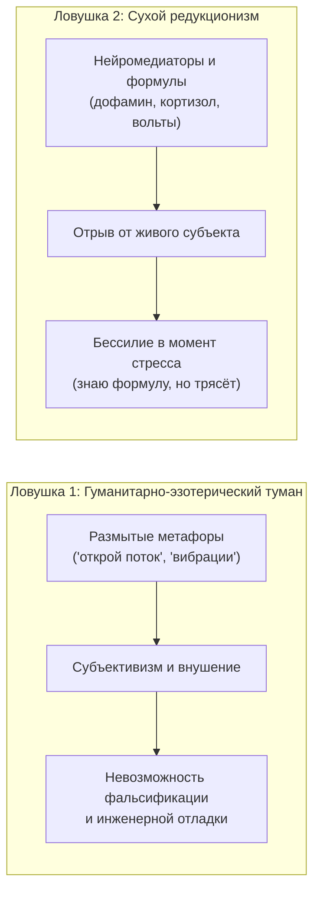
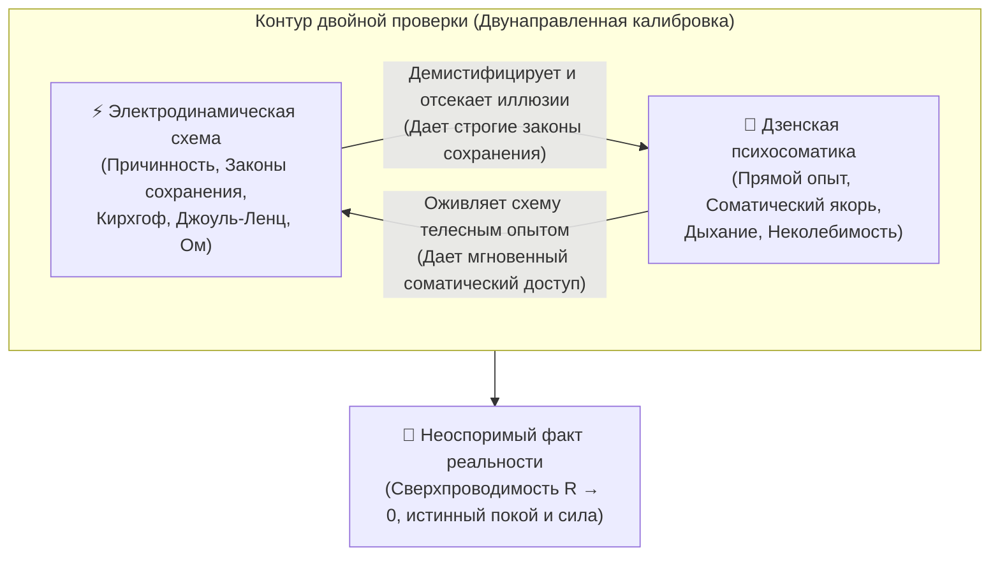
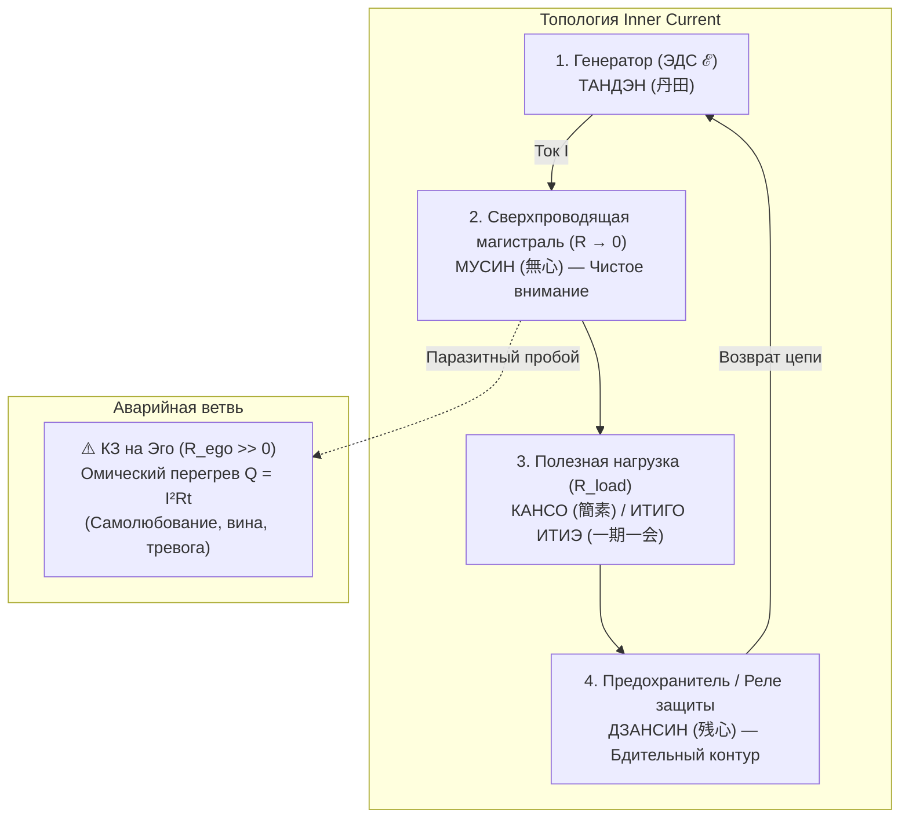
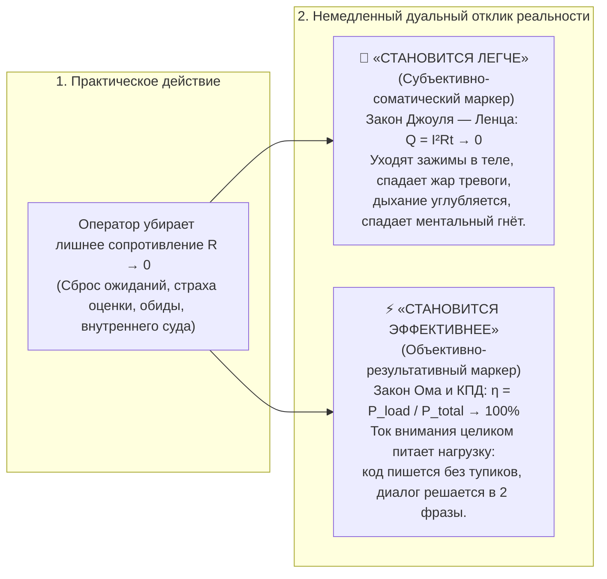

# 39. Принцип двойной проверки: Дзен-электродинамическая кросс-калибровка и Тандэн как генератор

> [!quote] Каноническая аксиома Системы Аньянова
> ### **⚡ «Человек смотрит на схему. Он видит электротехническую схему, он понимает, что такое генератор, но называет его не "генератор", а Тандэн. Он смотрит, что такое Тандэн, и понимает: да, в дзене это то же самое, что электрический генератор. И так идёт двойная проверка.»**  
> — **Владимир Аньянов**

> «Главная слабость большинства систем самопознания — опора лишь на один изолированный язык. Эзотерика тонет в тумане произвольных толкований, а академическая физиология превращает человека в безжизненную кучу формул и графиков.  
> **Принцип двойной проверки (Double Verification Principle)** Системы Аньянова решает эту проблему через взаимное зеркалирование: электротехническая схема даёт объективную причинно-следственную строгость, а дзенская традиция даёт прямой телесный опыт переживания. Когда оба прибора показывают одно и то же — сомнения исчезают.»

---

## 1. Онтологический тупик изолированных систем: Туман vs Механицизм

На протяжении тысячелетий человечество пыталось описать природу душевного равновесия и высокой продуктивности, неизменно сваливаясь в одну из двух ловушек:



1. **Эзотерический тупик:** понятия «энергия», «поток», «осознанность» лишены законов сохранения. Если у человека нет строгой топологии цепи, он не понимает, почему после часа медитации его мгновенно выбивает из колеи грубое слово коллеги. В эзотерике нет закона Джоуля — Ленца: непонятно, куда делась энергия и почему контур вспыхнул омическим пожаром.
2. **Технократический тупик:** биохимические или физические описания дают формулы, но не дают соматического рычага управления. Человек может знать всё о симпатической нервной системе и ЭДС, но в момент панической атаки это знание мертво — у него нет интуитивного интерфейса доступа к собственному телу.

**Решение Системы Аньянова:** соединить строгую электродинамическую топологию цепи с многовековой психофизиологической практикой Дзен в режиме **непрерывной взаимной верификации**.

---

## 2. Механизм двойной проверки (The Double Verification Principle)

Принцип двойной проверки утверждает:  
**Каждый узел ментального контура человека обязан иметь строгое физическое соответствие на электротехнической схеме и одновременный проверяемый соматический аналог в практике дзен.**



### Вектор 1: Электродинамика $\to$ Дзен (Аппаратная демистификация)
Когда практик обращается к дзенскому термину через электросхему:
* Он видит, что **Тандэн — это генератор**. А значит, закон сохранения энергии $\sum \mathcal{E} = \sum I R$ непреложен: генератор не может отдавать мощность, если цепь разомкнута или закорочена на внутреннее сопротивление.
* Дзен перестаёт быть «восточной экзотикой». Он становится прикладной инженерной инструкцией по эксплуатации электромагнитной природы человека.
* Отсекаются любые фантазии: нельзя «надышать энергию впрок» — генератор вырабатывает ток только в момент замыкания на реальную нагрузку.

### Вектор 2: Дзен $\to$ Электродинамика (Телесный соматический якорь)
Когда инженер смотрит на схему через дзенский термин:
* Он понимает, что обозначение источника питания — это не мёртвый кружок с плюсом и минусом на бумаге. Это его собственный **Тандэн** — физический центр тяжести внизу живота (точка *Кикай*, «Океан дыхания»).
* Схема мгновенно превращается в **навигатор ощущений**: *«Если мой генератор — это Тандэн, то где сейчас моё внимание? Не улетело ли оно в мыслительную жвачку головы? Опущен ли корень дыхания в живот?»*.
* Схема обретает интерфейс мгновенного ручного управления через тело.

---

## 3. Анатомия главного узла: Тандэн (丹田) как электрический генератор

Центральный пример принципа двойной проверки — ключевой узел любого контура: **источник энергии**.

```
    Электротехнический символ             Дзенская локализация
        ┌───[ + ]───┐                           ○ Голова (Омический перегрев)
        │     ~     │                           │
        │ Генератор │  <═══════════════>        │ Грудь (Эмоциональные помехи)
        └───[ - ]───┘                           │
          (ЭДС ℰ)                           ● ТАНДЭН (Ядро / Реактор)
                                           / \
                                          Заземление через стопы
```

### Что делает генератор в электротехнике?
1. **Создает электродвижущую силу (ЭДС $\mathcal{E}$):** выполняет работу по разделению зарядов за счёт внутренних (сторонних) сил, создавая разность потенциалов.
2. **Обладает автономностью:** исправный генератор не зависит от капризов подключённых потребителей; его задача — стабильно держать базовую частоту (например, 50 Гц) и заданное напряжение.
3. **Требует замкнутого контура:** на холостом ходу генератор не совершает полезной работы, а при коротком замыкании ($R \to 0$ внутри источника) сгорает от собственного тока.

### Что делает Тандэн в дзене?
1. **Генерирует жизненный импульс (Ки / Ци):** нижний даньтянь (на 3–5 см ниже пупка) является гравитационным и соматическим резервуаром человека. Отсюда исходит усилие в боевых искусствах, отсюда центрируется сидение в дзадзэн.
2. **Держит автономный покой (Фудосин — непоколебимый дух):** истинный практик дзэна укоренён в Тандэне. Что бы ни происходило снаружи (крики, кризис, провокации), частота реактора остаётся невозмутимой.
3. **Требует направления в действие (Итиго Итиэ):** запертая в себе энергия застаивается; истинный Тандэн раскрывается только при направлении внимания на конкретное дело прямо сейчас.

### Матрица биекции: Генератор $\leftrightarrow$ Тандэн

| Инженерный параметр | Электродинамическая роль | Соматический эквивалент в Дзене | Маркер поломки (Авария контура) |
| :--- | :--- | :--- | :--- |
| **ЭДС ($\mathcal{E}$)** | Способность совершать работу по переносу заряда | Внутренняя автономная витальность, импульс к бытию | Апатия, ощущение «севшей батарейки», поиск внешних костылей |
| **Частота сети ($f = 50\text{ Гц}$)** | Стабильность оборотов ротора генератора | Ровное абдоминальное дыхание, устойчивый ритм присутствия | Тахикардия, суетливость, паника, сбивчивое дыхание верхом груди |
| **Внутреннее сопротивление ($r_{\text{in}}$)** | Омические потери внутри самого источника питания | Сомнения в себе, внутренний диалог, самосаботаж | Самоедство: энергия сгорает внутри тела до выхода в действие |
| **Клемма заземления (GND)** | Сброс паразитных статических потенциалов в землю | Опора на стопы, физическая осанка, контакт с полом | «Подвешенность» в облаках абстракций, потеря чувства почвы под ногами |

---

## 4. Сквозная кросс-калибровка всей топологии цепи

Принцип двойной проверки не ограничивается генератором. Он прошивает всю топологию «Внутреннего тока»:



### 1. Проводник $\leftrightarrow$ Мусин (無心, «Не-ум»)
* **В физике:** идеальный проводник обладает нулевым удельным сопротивлением ($R \to 0$). На нём не падает напряжение, он не греется, он передаёт 100% энергии к нагрузке.
* **В дзене:** состояние Мусин — это ум без зацепок и предвзятых суждений. Сознание пропускает реальность сквозь себя без искажений и оценочного трения.
* **Двойная проверка:** если вы чувствуете раздражение или обиду — замерьте сопротивление. Раздражение означает, что проводник внимания забился мусором концепций ($R > 0$). Сбросьте концепции до нуля — вернётся сверхпроводимость.

### 2. Нагрузка $\leftrightarrow$ Кансо (簡素, «Простота») и Итиго Итиэ (一期一会)
* **В физике:** нагрузка потребляет ток для совершения полезной работы (свет лампы, вращение вала). Важно согласование импедансов: нагрузка должна соответствовать мощности генератора.
* **В дзене:** принцип Итиго Итиэ («одна встреча — одна жизнь») предписывает тотально отдаваться тому, что делаешь прямо сейчас — завариванию чая, написанию кода, разговору. Принцип Кансо отсекает всё лишнее, оставляя чистую функциональность.
* **Двойная проверка:** если делаешь дело, но думаешь о результате — лампа мигает, ток раздваивается. Полное присутствие в одном действии даёт чистое свечение вольфрамовой нити.

### 3. Реле защиты $\leftrightarrow$ Дзансин (残心, «Непрерывное присутствие»)
* **В физике:** автоматический выключатель (Circuit Breaker) мгновенно размыкает цепь при аварийном токе, спасая генератор от выгорания.
* **В дзене:** Дзансин — это мягкая бдительность после удара мечом или завершения действия. Сознание не «залипает» в триумфе или поражении, а остаётся готовым к любому развитию событий.
* **Двойная проверка:** если успех вскружил голову или неудача разбила сердце — предохранитель не сработал, контур расплавился. Дзансин удерживает оператора в нейтрали.

---

## 5. Практический протокол: Метод двух приборов

Как обычный человек применяет принцип двойной проверки в реальной жизни за 30 секунд?

```
          ШАГ 1 (ФИЗИКА)                       ШАГ 2 (ДЗЕН)
      Аудит цепи по схеме                  Соматическая сверка
 ┌───────────────────────────┐         ┌───────────────────────────┐
 │ 1. Где падает напряжение? │         │ 1. Внимание опустилось    │
 │ 2. Греется ли контур?     │ <═════> │    в Тандэн (живот)?      │
 │ 3. Замкнута ли цепь на    │         │ 2. Чисто ли дыхание?      │
 │    реальное действие?     │         │ 3. Есть ли тишина ума?    │
 └───────────────────────────┘         └───────────────────────────┘
               │                                     │
               └─────────────────┬───────────────────┘
                                 ▼
                     СИНТЕЗ (ДВОЙНАЯ ПРОВЕРКА)
          Цепь замкнута + Тело устойчиво = СВЕРХПРОВОДИМОСТЬ
```

1. **Взгляд инженера (Диагностика):**
   * *«Я чувствую истощение и злость. Закон Джоуля — Ленца говорит: тепло выделяется там, где велико $R$. Где моё сопротивление? Я сопротивляюсь факту, что задача сложнее, чем я думал. Моё Эго хочет выглядеть умным. Это паразитное сопротивление $R_{\text{ego}}$. Я шунтирую его — принимаю реальность как есть ($R \to 0$).»*
2. **Взгляд мастера дзен (Калибровка тела):**
   * *«Я назвал генератор Тандэном. Проверяю физическое тело: плечи задраны? Дыхание застряло в горле? Да. Переношу точку внимания на 4 сантиметра ниже пупка. Делаю длинный мягкий выдох животом. Стопы чувствуют пол. Генератор вернулся на станину.»*
3. **Итог проверки:**
   * Схема показала причину (паразитное $R$).
   * Дзен дал тумблер возврата (Тандэн).
   * **Результат:** мгновенное восстановление рабочего режима без многочасовых психотерапевтических бесед.

---

## 6. Главный критерий истины — проверка на практике: Дуальный маркер «Легче» и «Эффективнее»

Любая философская концепция разбивается о простой вопрос: *«Что это даёт в реальной жизни?»*.  
В Системе Аньянова проверка на практике является **абсолютным и окончательным судьёй**. Человеку не нужно «верить» в дзен или заучивать электротехнику — он ставит прямой физический эксперимент над собственной цепью:

$$\boxed{\text{Человек убирает лишнее сопротивление } (R \to 0) \implies \begin{cases} \mathbf{«Легче»} & \text{(Падение тепловых потерь: } Q \to 0\text{)} \\ \mathbf{«Эффективнее»} & \text{(Рост полезного КПД: } \eta \to 100\%\text{)} \end{cases}}$$



### 1. Почему становится «легче»? (Физика снятия омического перегрева)
Когда человек накручивает важность, защищает своё эго, спорит с очевидными фактами или боится осуждения — он выкручивает внутренний реостат сопротивления на максимум ($R_{\text{loss}} \gg 0$).  
По закону Джоуля — Ленца ($Q = I^2 R t$) энергия не может исчезнуть бесследно: она преобразуется в паразитное тепло:
* **В теле:** сжатые челюсти, поднятые плечи, спазм диафрагмы, поверхностное дыхание, головная боль от напряжения.
* **В психике:** чувство тяжести, выгорание, раздражительность, ощущение, будто «тащишь вагон на гору».

Как только человек осознанно убирает сопротивление (принимает ситуацию как есть, отпускает статусное тщеславие, входит в режим Мусин) — $R$ падает до нуля. Паразитное выделение тепла $Q$ **мгновенно прекращается**.  
Человек буквально выдыхает: физиологически и психологически ему становится **легче**. Это не «чудо», это термодинамика.

### 2. Почему становится «эффективнее»? (Закон полезной мощности нагрузки)
В замкнутой цепи с источником ЭДС $\mathcal{E}$ ток равен:
$$I = \frac{\mathcal{E}}{R_{\text{load}} + R_{\text{loss}}}$$

Полезная мощность, выделяемая на лампе (на деле, в коде, в переговорах), составляет:
$$P_{\text{load}} = I^2 R_{\text{load}} = \frac{\mathcal{E}^2 \cdot R_{\text{load}}}{(R_{\text{load}} + R_{\text{loss}})^2}$$

* Пока $R_{\text{loss}}$ огромно — почти вся мощность реактора сгорает внутри человека в виде нервозности и сомнений. До реальной работы доходят лишь крохи ($P_{\text{load}} \to 0$). Дела делаются часами, с муками и переделками.
* Когда лишнее сопротивление убрано ($R_{\text{loss}} \to 0$), сила тока возрастает, а полезная мощность $P_{\text{load}}$ стремится к проектному максимуму.  
  Человек садится за сложнейшую задачу и решает её играючи за 40 минут вместо 3 дней прокрастинации. Он становится **объективно эффективнее**.

### Эмпирический критерий фальсифицируемости:
Если предложенная практика или мысль делает вас «напряжённее, тяжелее и запутаннее» — перед вами ложное сопротивление, брак схемы.  
Если действие делает вас одновременно **легче (соматически)** и **эффективнее (практически)** — вы находитесь в режиме **сверхпроводимости цепи**.

---

## 7. Эпистемологический вывод: Почему это работает

Принцип двойной проверки превращает систему «Внутренний ток» в **самокалибрирующуюся истину**:

> **«Если физическая модель верна, но не имеет телесного переживания — она бесполезна для жизни.**  
> **Если духовная практика глубока, но не подчиняется законам сохранения энергии — она иллюзорна и ненадежна.**  
> **Но когда формула электродинамики до миллиметра совпадает с вековой традицией дзен — перед нами объективный закон природы человека.»**

Человек перестаёт блуждать в догадках. Он смотрит на принципиальную схему, видит генератор, касается своего Тандэна — и замыкает цепь счастья.

---

## 🔗 Связанные материалы в LLM Wiki

- [[02_Wiki/Inner Current (Core Topology and Polarity Law)|01. Базовая топология цепи и закон полярности]] — фундаментальный контур «Тандэн $\to$ Мусин $\to$ Нагрузка».
- [[02_Wiki/Inner Current (Physics of Presence and Superconductivity)|02. Физика присутствия: состояние сверхпроводимости]] — закон Джоуля — Ленца и математика $R \to 0$.
- [[02_Wiki/Inner Current (Zen as Happiness Architecture Foundation)|12. Дзен как фундамент Архитектуры счастья]] — исторический контекст и истоки канонов.
- [[02_Wiki/Inner Current (Complete Zen-Electrodynamic Ontological Atlas)|13. Полный онтологический атлас]] — биекция 23 дзенских понятий в электродинамические эквиваленты.
- [[02_Wiki/Inner Current (Ontology of the Circuit — Human vs State and the Triad of Terms)|37. Онтология схемы: Человек или его состояние?]] — Блокнотный канон и разбор рукописного чертежа автора.
- [[04_Maps/Inner Current MOC|Inner Current MOC]] — генеральная карта смыслов и архитектурный реестр цепи.
