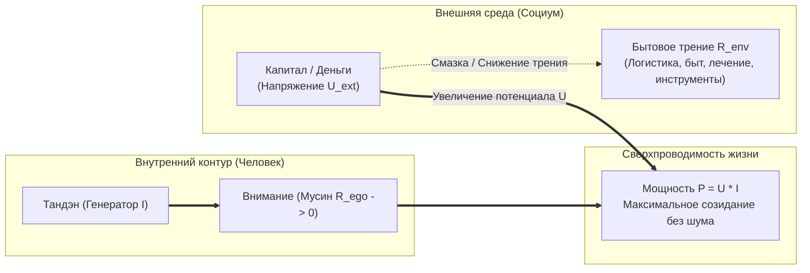

# 32. Электродинамика капитала: Деньги как напряжение цепи (U) и редуктор внешнего трения среды

> [!quote] Цитата Канона
> ### ⚡ **«Деньги не содержат счастья — в банкнотах нет свободных электронов радости. Деньги — это внешнее напряжение ($U$) и техническая смазка для цепи: они снижают гидродинамическое сопротивление бытовой среды в ноль. Если ваш внутренний контур закорочен на Эго, миллиард долларов лишь быстрее расплавит проводку. Но если ваш Тандэн включен, капитал превращает ваш ток в планетарную мощность.»**  
> — **Владимир Аньянов**

---

## 💰 1. Демистификация капитала: Две крайности заблуждений

Вопрос денег в человеческой культуре поляризован двумя наивными мифами:
1. **Миф дикого капитализма:** *«Деньги — это и есть счастье. Чем больше на счету, тем выше кайф».* Опровергнут тысячами миллионеров в тяжелейшей депрессии и парадоксом Истерлина (рост дохода выше комфортного уровня не увеличивает уровень субъективного благополучия).
2. **Миф псевдодуховной нищеты:** *«Деньги — это зло, духовный человек должен быть беден».* Опровергнут законами физики: нищета создает колоссальное бытовое омическое сопротивление (болезни, унижения, плохая еда, изнуряющий быт), парализующее Тандэн.

**Архитектура счастья Владимира Аньянова** снимает этот дуализм через строгие формулы электродинамики и гидродинамики.

---

## ⚡ 2. Деньги как редуктор внешнего сопротивления ($R_{\text{env}}$)

Представьте себе течение воды по трубе или движение автомобиля по трассе.

- **Нищета ($U \to 0$):** труба забита ржавчиной и илом. Дорога усеяна ямами. Человек тратит 90% энергии своего Тандэна на преодоление банального внешнего трения:
  - Где достать денег на лекарство ребенку?
  - Как доехать до работы на трех переполненных автобусах?
  - Как починить протекающую крышу?
  Вся энергия сгорает в омическом трении среды ($R_{\text{env}} \gg 0$). На чистое созидание, любовь или философию тока не остается.
- **Финансовая достаточность ($U \ge U_{\text{threshold}}$):** капитал смывает ржавчину с труб. 
  - Вы спите на качественном матрасе (восстановление реактора).
  - Вы покупаете лучшие инструменты и экраны (прямая связь TPN).
  - Вы делегируете рутину (ликвидация паразитных микро-нагрузок).
  Сопротивление внешней среды падает до нуля ($R_{\text{env}} \to 0$).

---

## ⚠️ 3. Ошибка короткого замыкания капиталом: Почему богатые сходят с ума

Если деньги снижают сопротивление среды, почему богатые люди так часто несчастны?

Ответ дает формула полезной электрической мощности:
$$P_{\text{useful}} = I_{\text{tanden}}^2 \cdot R_{\text{load}}$$
при условии, что ток $I$ не закорочен на Эго ($R_{\text{ego}} = 0$).

Если у человека **не сформирован внутренний Тандэн**, а его внимание захвачено DMN и статусной паранойей ($R_{\text{ego}} \gg 0$):
- Появление огромных денег ($U_{\text{ext}} \to \infty$) не лечит контур.
- Наоборот: по закону $P_{\text{loss}} = U^2 / R$, подача колоссального внешнего напряжения на короткозамкнутую цепь приводит к **мгновенному термическому взрыву проводки**:
  - Наркотики и алкоголь как попытка залить раскаленный омический перегрев.
  - Паранойя преследования и суды.
  - Полная потеря вкуса к жизни (ангедония).

> **Аксиома Аньянова о капитале:**  
> Капитал — это усилитель (мультипликатор) состояния вашей цепи.  
> Если ваш контур в режиме **Мусин ($R \to 0$)** — капитал масштабирует вашу свободу и созидательную мощь в тысячи раз.  
> Если ваш контур закорочен на **Эго ($R_{\text{ego}} \gg 0$)** — капитал сжигает вашу нервную систему с удесятеренной скоростью.

---

## 🧭 4. Три уровня финансового импеданса

1. **Базовое экранирование ($L1$):** закрытие физиологических потребностей тела. Ликвидация паразитного шума нищеты.
2. **Инструментальный импеданс ($L2$):** лучшие станки, процессоры, книги, лаборатории, среда обитания. Полное согласование возможностей с мощностью Тандэна.
3. **Планетарная сверхпроводимость ($L3$):** капитал направляется не на покупку 50-й яхты (которая дает нулевое свечение по канону Шуньяты), а на зажигание ламп цивилизации (строительство институтов, разработка открытого софта, освоение энергии).

---

## 🔗 Связи
- [[04_Maps/Inner Current MOC|Inner Current MOC]]
- [[02_Wiki/Inner Current (The Battery Illusion of Material Possessions and Emptiness of Form)|23. Иллюзия аккумулятора вещей]]
- [[02_Wiki/Inner Current (Engineering Epistemology and Bitcoin Law)|15. Инженерный критерий истины, Замкнутая цепь и Биткоин]]
- [[02_Wiki/Inner Current (Scale Invariance and Tea Ceremony)|03. Инвариантность масштаба нагрузки]]

---
*Created: 2026-09-23 | Author: Vladimir Anyanov & Antigravity*
