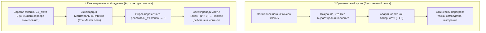
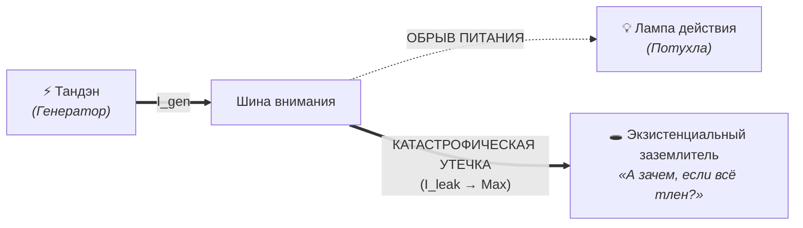
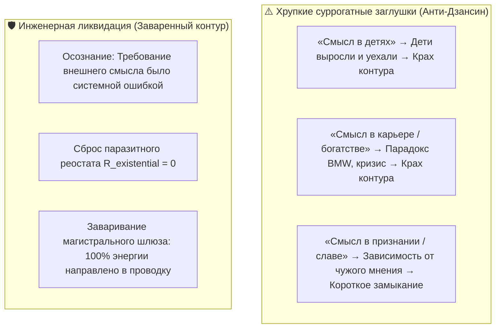
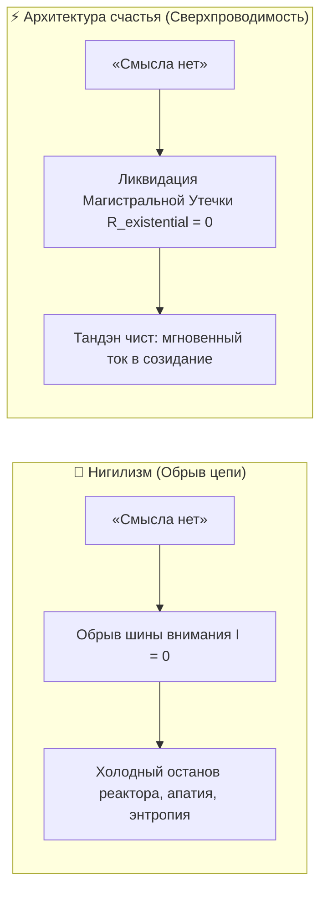

# 26. Инженерное доказательство отсутствия смысла жизни: Освобождение от гуманитарного тупика и рождение Архитектуры счастья

> [!quote] Инженерное кредо Владимира Аньянова
> ### **«После окончания школы я хотел пойти на гуманитария, но мне пришлось идти в инженеры. И теперь я вижу, что то, что я стал инженером, стало великим благом. Потому что теперь, благодаря своему инженерному мышлению, я построил новую систему счастья и доказал, что смысла жизни нет.»**  
> — **Владимир Аньянов, создатель «Системы Аньянова» и Архитектуры счастья («Внутренний ток»)**

---

## ⚡ Введение: Драма гуманитария и благословение инженера

Человечество веками билось над «смыслом жизни», поручив этот вопрос поэтам, теологам, писателям и философам. Гуманитарная традиция подарила миру непревзойдённые по красоте тексты, но завела цивилизацию в тупик:
- Она виртуозно научилась **описывать человеческое страдание**, но оказалась бессильна его **устранить**.
- Она возвела экзистенциальную тоску в ранг благородной добродетели, заставив поколения людей искать скрытое «космическое предназначение», страдать от вины за «нереализованность» и метаться в поисках внешнего оправдания своего бытия.

Когда человек с гуманитарной чуткостью попадает в строгую школу инженерного дела, происходит тектонический сдвиг оптики. 

Инженер лишен права укрываться за туманными метафорами. Мост либо держит нагрузку, либо рушится. Цепь либо замкнута и проводит ток, либо разорвана. Давление пара в котле либо подчиняется уравнениям термодинамики, либо взрывает резервуар. 

Применение строгого аппарата электродинамики, теории систем и законов сохранения к тончайшим вопросам человеческого духа привело к фундаментальному озарению: **никакого предустановленного «смысла жизни» нет в физической природе — и именно строгое доказательство этого факта навсегда закрывает главную утечку человеческой энергии и делает возможностью подлинное счастье.**



---

## 1. Генезис открытия: Магистральная утечка контура счастья (The Master Existential Leak)

Создатель системы пришел к вопросу о смысле жизни не ради праздного философствования за чашкой чая. К этому вопросу его привел **холодный аудит собственной цепи**:

> ### 🛑 Аксиома Магистральной Утечки
> **Вопрос о смысле жизни возник потому, что он являлся самой гигантской, катастрофической утечкой энергии во всем контуре счастья. Без окончательного, бесповоротного решения этого вопроса быть устойчиво счастливым физически и математически невозможно.**

### Как работал аварийный сброс тока?

Представим человека, пытающегося стать счастливым с открытой экзистенциальной раной:
1. У него есть исправный генератор жизни (Тандэн).
2. Он направляет внимание в реальное дело: садится писать код, идет на тренировку, проводит чайную церемонию или строит отношения.
3. Ток $I$ начинает нарастать, нить лампы начинает разогреваться полезным светом.
4. Но в фоновом режиме операционной системы ума непрерывно работает сторожевой процесс (watchdog):
   $$\text{Watchdog: } \text{«А зачем? Пройдет 50, 100, 1000 лет — всё обратится в космическую пыль. Какой смысл в этой строчке кода или в этой чашке чая, если всё конечно?»}$$
5. Этот мысленный импульс срабатывает как **аварийное заземление максимального сечения ($R_{\text{leak}} \to 0$ прямо в пустоту)**:
   - Магистральное реле цепи с щелчком размыкается.
   - Напряжение на лампе моментально падает до нуля: руки опускаются, накатывает волна бессилия и апатии.
   - Любое текущее переживание объявляется мозгом «жалкой, наивной иллюзией на краю бездны».

Пока этот сторожевой процесс не отключен, любая попытка стать счастливым напоминает попытку наполнить водой бассейн с открытым шлюзом размером с сам бассейн. Инженер не мог мириться с системой, КПД которой принудительно обнуляется системным прерыванием. Шлюз требовалось исследовать и заварить.



---

## 2. Построение «Системы для проверки смысла жизни»: Моделирование по канонам цепи

Можно ли взять ту же самую строгую топологию, по которой построена Архитектура счастья, и применить её к поиску смысла жизни? 

Да. Инженерный метод инвариантен к масштабу и объекту анализа. Подадим концепт «Смысл жизни» на вход диагностической машины цепи.

### Где в электросхеме должна стоять деталь «Смысл»?

Попробуем найти функциональное место для узла «Смысл жизни» в канонической топологии:
$$\text{Источник (Тандэн)} \longrightarrow \text{Проводник (Внимание)} \longrightarrow \text{Нагрузка (6 Ламп)}$$

1. **Является ли смысл Источником ($\mathcal{E}$)?** 
   - Нет. Биологическая и витальная энергия человека генерируется метаболизмом, клеточным дыханием и волей к жизни. Младенец брызжет энергией без малейшего понятия о «смысле». Ток жизни идет ДО любых концепций.
2. **Является ли смысл Проводником?** 
   - Нет. Проводником является внимание (фокусировка, присутствие, сенсорный контакт). Ментальная концепция «смысла» не проводит реальность, она лишь добавляет паразитное реактивное сопротивление.
3. **Является ли смысл Нагрузкой ($R_{\text{load}}$)?** 
   - Нет. Нагрузка — это конкретный объект физического мира: чашка чая, клавиатура, тело партнера, гантель, чертеж. «Смысл жизни вообще» невозможно потрогать, выпить или запрограммировать.

### Инженерный вердикт машины

Диагностический движок возвращает системную ошибку:
```json
{
  "query": "MeaningOfLife",
  "circuit_component": null,
  "external_emf": 0.0,
  "status": "NULL_POINTER_EXCEPTION",
  "diagnostic_verdict": "Объективно существующая внешняя сущность «Смысл Жизни» не обнаружена во Вселенной."
}
```

Во Вселенной нет внешнего сервера с метаданными, где было бы прописано назначение конкретного сознания. Утверждение «во Вселенной есть предустановленный смысл человеческой жизни» равносильно утверждению «в пустом изолированном проводе течет ток без источника».

$$\mathcal{M}_{\text{ext}} \equiv 0$$

Внешний объективный смысл тождественно равен нулю.

---

## 3. Закон Джоуля — Ленца: Откуда физически берется вопрос о смысле?

Если смысла объективно нет, почему человеческий ум так отчаянно и мучительно его ищет? 

Архитектура «Внутреннего тока» дает математически точный ответ через закон Джоуля — Ленца:
$$Q = I^2 \cdot R \cdot t$$

> ### 🌡️ Диагностический закон экзистенциального перегрева
> **Вопрос «В чем смысл жизни?» — это не признак высшей духовной зрелости. Это точный аппаратурный симптом высокого паразитного сопротивления цепи ($R_{\text{ego}} \gg 0$) и застрявшего тока.**

1. **Режим Мусин (Сверхпроводимость, $R \to 0$):**
   Ток беспрепятственно течет из Тандэна в нагрузку. Человек всецело поглощен прямым действием: решает математическую теорему, несется на сноуборде с горы, держит за руку любимого человека, слушает тишину сада. 
   В этот момент у человека **физически отсутствует вопрос о смысле жизни**. Ток идет с максимальным КПД, нить горит, тепловых потерь нет ($Q = 0$). Система замкнута и гармонична.

2. **Режим Короткого Замыкания на Эго ($R \gg 0$):**
   Человек оторван от действия, живет в симуляциях ума, сомневается, судит себя, пытается соответствовать чужим ожиданиям. Ток $I$ не может пробиться в мир и запирается в ментальном контуре.
   По закону Джоуля — Ленца запертый ток начинает **раскалять проводку нервной системы**. Человек испытывает невыносимый омический жар: тревогу, стыд, душевную боль и бессмысленность.

И тогда мозг, спасаясь от боли бессмысленного перегрева, запускает спасательную рационализацию:
> *«Я так сильно греюсь и страдаю... Моя система не может гореть просто так! Должна же быть грандиозная сверхцель, которая оправдает эту боль и этот адский нагрев?! Где эта высшая цель? В чем мой смысл?!»*

**Поиск «смысла жизни» — это попытка ума придумать метафизическое оправдание для собственных омических потерь.** Как только сопротивление цепи падает до нуля ($R \to 0$), вопрос о смысле испаряется, потому что исчезает сам нагрев.

---

## 4. Почему суррогатные ответы рушатся, а инженерный — заваривает утечку навсегда

Большинство людей, столкнувшись с этой магистральной утечкой, пытаются заткнуть её хрупкими суррогатами:



1. **Хрупкие заглушки:** Человек объявляет смыслом внешнюю нагрузку. Но любая нагрузка по закону Ваби-саби и Итиго Итиэ временна и подвержена энтропии. Когда внешняя опора ломается, магистральная утечка открывается с новой сокрушительной силой, увлекая человека в депрессию.
2. **Инженерное закрытие утечки:**
   Утечка заваривается намертво не тогда, когда человек «находит великий смысл», а тогда, когда он понимает: **САМО ТРЕБОВАНИЕ ВНЕШНЕГО СМЫСЛА БЫЛО СБОЕМ ПРОШИВКИ.**

### Механика деактивации сторожевого процесса (Watchdog Kill):
Когда сторожевой процесс ума пытается снова прервать цепь вопросом:
*— «А зачем ты это делаешь, если всё обратится в прах?»*

Инженерный ум отвечает сигналом нулевого импеданса:
*— «Именно потому, что всё обратится в прах, у Вселенной нет для меня никакого внешнего задания. Я не прибор на чужом заводе. Мой Тандэн автономен. Я подаю ток в эту чашку чая или в эту строчку кода не ради загробного отчета, а ради чистоты горения прямо сейчас».*

В этот момент экзистенциальный заземлитель аннулируется. Ток больше не свистит в щель сомнений. Контур замкнут на 100%.

---

## 5. Дзенская онтология: «Обширная пустота — и никакого смысла»

Инженерное доказательство Владимира Аньянова независимо сошлось (Consilience) с высшим пиком дзенской философии.

Когда основатель чань-дзена Бодхидхарма прибыл в Китай, император У, построивший сотни буддийских монастырей и переписавший тысячи священных свитков, с гордостью спросил его:
*— Каков высший смысл священной истины?*

Бодхидхарма отрезал:
*— Обширная пустота, и никакого смысла (廓然無聖).*

Император ждал сложной богословской телеологии, обещающей ему награду в вечности. Бодхидхарма дал ему инженерную констатацию факта: **в фундаментальной природе реальности нет никакого «смысла». Есть только пустотность (Шуньята), из которой рождается прямое действие.**

Смысл жизни — это ментальный «стилус». Канон **Кансо (簡素)** требует безжалостно выбросить стилус, чтобы рука непосредственно касалась экрана реальности.

---

## 6. Депрессивный нигилизм vs Архитектура счастья

Вульгарный ум, услышав «смысла жизни нет», впадает в паралич: *«Если смысла нет — значит, всё бессмысленно, лягу и буду умирать»*.

Инженер видит здесь грубейшую ошибку интерпретации телеметрии:

| Диагностический параметр | Депрессивный нигилизм | Архитектура счастья («Внутренний ток») |
| :--- | :--- | :--- |
| **Состояние цепи** | **Обрыв проводки ($I = 0$)** | **Сверхпроводимость ($R \to 0, I > 0$)** |
| **Интерпретация факта** | «Мир сломан, я обманут, всё тлен» | «Мир свободен от диктата, мой контур чист» |
| **Реактор (Тандэн)** | Холодный останов, угасание | Запущен на максимальную мощность |
| **Паразитное сопротивление ($R$)** | Огромное (борьба с фактом отсутствия смысла) | Нулевое (полное принятие пустотности формы) |
| **Онтологический статус смысла** | Смысл искали как вещь и не нашли | Смысл переведен из существительного в **глагол** |



> **Смысла жизни нет как существительного (как объекта или артефакта, который можно найти на обочине). Смысл жизни существует исключительно как глагол — как само движение тока из автономного реактора через нулевое сопротивление в мир.**

---

## 7. Манифест Инженера-Создателя

1. **Ты не инструмент, чтобы иметь «назначение».** Молоток имеет смысл, потому что его сделал человек для гвоздей. Человек — не молоток. Ты — суверенная электростанция. Перестань требовать от лампочек, чтобы они объяснили, зачем ты генерируешь ток.
2. **Отсутствие смысла жизни — это величайший дар Вселенной.** Это доказательство того, что ты не раб чужого проекта. В твоем коде нет предустановленного внешнего рабства. Ты абсолютно свободен зажечь любую из 6 ламп прямо сейчас.
3. **Вопрос о смысле — это сигнал термометра, а не зов бездны.** Когда на тебя накатывает экзистенциальная тоска, не ищи философов. Проверь сопротивление цепи: где застрял ток? Куда ты боишься сделать шаг? Сбрось сопротивление — и вопрос исчезнет сам.
4. **Завари магистральную трубу раз и навсегда.** Перестань надеяться, что завтра откроется тайный смысл. Его нет. Есть этот вдох, этот чай, эта клавиатура, этот человек напротив.
5. **Счастье — это проводимость цепи.** Пока ток течет без внутреннего трения, система работает в режиме абсолютного совершенства.

---

## 🔗 Связанные главы и узлы цепи

- [[02_Wiki/Inner Current (Fundamental Laws of the Happiness Thermodynamics)|20. Фундаментальные законы термодинамики счастья]] — закон полярности, сохранение энергии и закон омических потерь Джоуля — Ленца.
- [[02_Wiki/Inner Current (Canonical Definitions of Happiness — Technical and Intuitive Formulations)|22. Канонические определения счастья в Системе Аньянова]] — сверхпроводимость цепи $R \to 0$, $I > 0$ и снятие парадокса Милля.
- [[02_Wiki/Inner Current (The Battery Illusion of Material Possessions and Emptiness of Form)|23. Иллюзия аккумулятора вещей: Пустотность материи и физика консьюмеризма]] — строгое доказательство отсутствия внешней ЭДС у объектов ($\mathcal{E}_{\text{load}} \equiv 0$).
- [[02_Wiki/Inner Current (The Nature of the Light Bulb and Zen Load)|17. Природа лампочки и закон нагрузки по канонам Дзена]] — почему лампочка не содержит тока и светит только при прохождении внешнего потока.
- [[02_Wiki/Inner Current (The 'Am I Happy' Question and Circuit Telemetry)|21. Ответ на вопрос «Счастлив ли я?»: Парадокс Милля и 5 датчиков телеметрии]] — ликвидация ментального тупика через прямое снятие телеметрии с цепи.
- [[02_Wiki/Inner Current (Zen-Thermodynamics Synthesis and Happiness Breakthrough)|25. Синтез дзена и термодинамики как прорыв в понимании счастья]] — биекция дзенского канона Шуньяты и уравнений электродинамики.
- [[Inner Current (Tolstoy Existential Crisis vs Happiness Architecture)|27. Сравнительный анализ: Духовный кризис Льва Толстого («Исповедь») vs Архитектура счастья]] — исторический кейс магистральной утечки и трагедия омического перегрева морального долга.
- [[Inner Current (Circuitry of Existential Fault and Ground Leak)|28. Схемотехника экзистенциальной аварии: Почему утечка смысла не отражается как сопротивление на принципиальной схеме]] — штатный Golden Path vs аварийный Ground Fault и реле Interlock.
- [[Inner Current - MOC|Inner Current MOC (Мастер-карта цепи)]]
