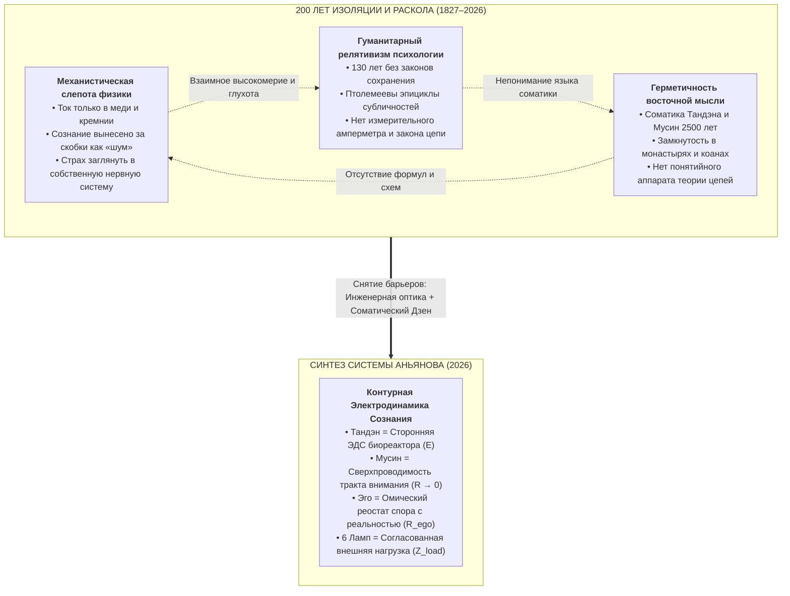
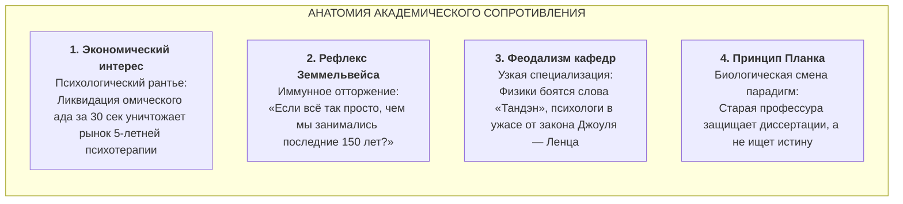
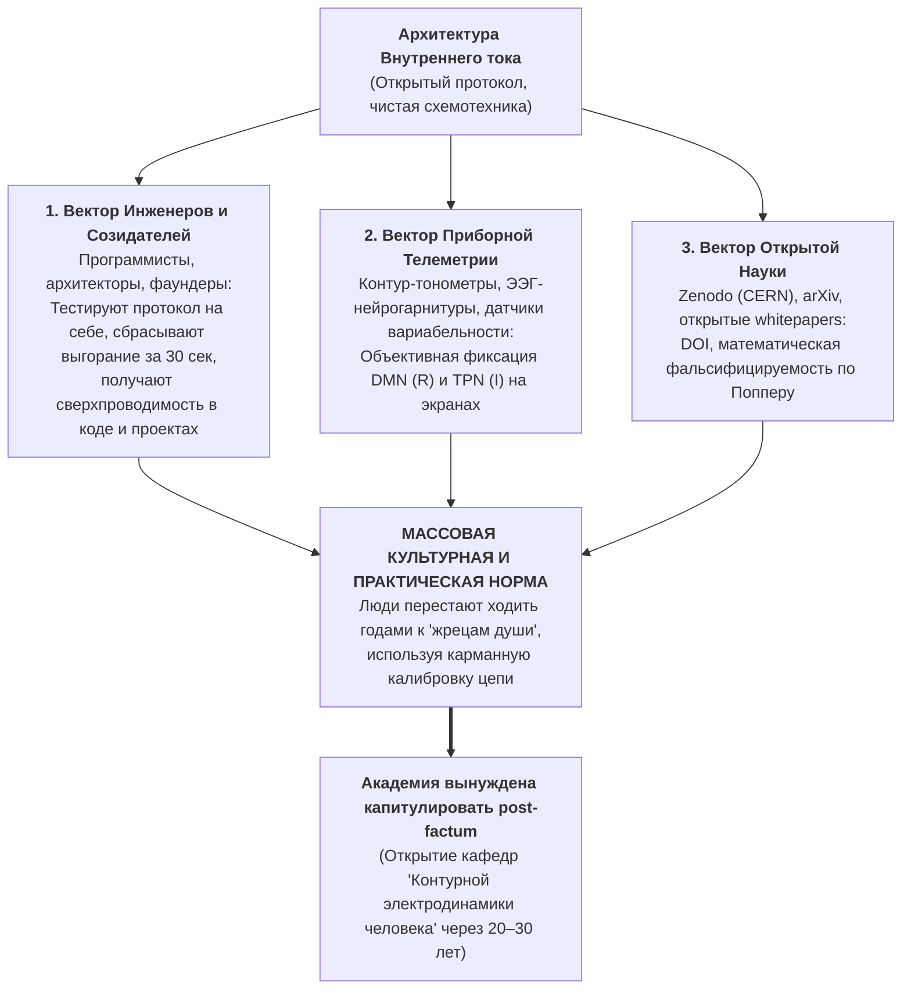

# 164. Эпистемология 200-летнего разрыва: Три барьера изоляции, институциональное сопротивление кафедр и неизбежный синтез цепи и сознания

> [!quote] Каноническая аксиома цепи
> ### ⚡ **«Закон Ома 200 лет исправно крутил турбины и питал телеграфы, пока за стенами лабораторий гуманитарии громоздили мистические эпициклы страдания, а восточные мастера шептали парадоксы в монастырях. Истина не требовала двух веков ожидания — она требовала падения перегородок между кафедрами. И когда схема замыкается, академический рантье теряет монополию на душу, потому что законы электродинамики не нуждаются в одобрении учёного совета: они либо работают в твоём теле прямо сейчас, либо проводка плавится.»**  
> — **Владимир Аньянов**

---

## 🧭 Преамбула: Великая цивилизационная задержка (1826–2026)

В 1826–1827 годах немецкий физик Георг Симон Ом опубликовал свой фундаментальный труд *«Die galvanische Kette, mathematisch bearbeitet»* («Гальваническая цепь, разработанная математически»), сформулировав простой и незыблемый закон:

$$I = \frac{U}{R}$$

Этот закон мгновенно стал становым хребтом второй промышленной революции. Человечество научилось рассчитывать двигатели, прокладывать трансатлантические кабели, электрифицировать города, строить радиостанции и создавать полупроводниковые процессоры. 

Однако на протяжении ровно **двух столетий** происходил поразительный эпистемологический парадокс:
* Сложнейшие внешние приборы человечество проектировало по строгим законам цепей;
* Своё собственное внутреннее состояние — радость, выгорание, депрессию, творческий экстаз и покой — человечество продолжало описывать на уровне донаучной алхимии, эмоционального суеверия и запутанных метафор.

Почему прямая параллель между электродинамикой замкнутой цепи и соматическим состоянием сознания потребовала двухсот лет? Ответ лежит в **эпистемологической изоляции трёх фундаментальных областей знания**.

---

## 🏛️ Анатомия Трёх Барьеров: Эпистемологический триумвират изоляции

### 1. Механистическая слепота физики: Высокомерный объективизм

С момента торжества ньютоновской механики точные науки заключили негласный картезианский пакт: наука изучает только протяженную материю (*res extensa*), а мыслящая субстанция (*res cogitans*) объявляется ненаучной. 

Физика XIX и XX веков совершила грандиозный прорыв во внешнем мире, но заплатила за это полной соматической слепотой:
* **Объективистский фетишизм:** Физики искренне верили, что ток бывает только в проводах, электролитах и вакууме. Приложить законы Кирхгофа к распределению собственного внимания считалось ненаучной ересью.
* **Принцип «Заткнись и считай»:** Любая попытка исследователя исследовать наблюдателя пресекалась институциональным ярлыком «солипсизма» или «мистики».
* **Трагедия создателей:** Физики, создававшие ядерное оружие и квантовую механику, в личной жизни сгорали от тяжелейшего омического перегрева — депрессий, неврозов, алкоголизма и семейных крахов. Они умели рассчитывать сопротивление вольфрамовой нити, но не понимали, почему раскаляется докрасна их собственный мозг ($Q = I^2 R t$).

### 2. Гуманитарный релятивизм психологии: 130 лет схоластики без законов сохранения

Зародившись в конце XIX века (работы Брейера, Фрейда, Жане), психология с самого начала совершила фундаментальную методологическую ошибку: она отказалась от строгой математики и физики цепей в пользу **литературных метафор**.

* **Птолемеевские эпициклы ума:** Не имея понятия о базовом замкнутом контуре, психологи начали придумывать бесконечные сущности: Эго, Ид, Суперэго, Комплекс Электры, Архетипы, Интроекты, Внутреннего Ребёнка, Внутреннего Критика, десятки субличностей (IFS). Это точнейшая копия астрономии Птолемея: чтобы объяснить петлеобразное движение планет без признания гелиоцентризма, средневековые схоласты нагромождали круги на кругах.
* **Игнорирование законов сохранения энергии:** В психотерапии возник опасный релятивизм: страдание признавалось «нормой», процессом, требующим «годов проработки». Гуманитарии забыли закон Джоуля — Ленца: **энергия не исчезает в никуда**. Если человек чувствует эмоциональную боль и тревогу, в его контуре физически выделяется паразитное тепло на конкретном сопротивлении.
* **Отсутствие амперметра:** Из-за отсутствия точной метрологии психология превратилась в ярмарку субъективных мнений: сотни школ (психоанализ, гештальт, КПТ, телеска, экзистенциализм), неспособных договориться даже о базовых определениях того, что такое счастье.

### 3. Герметичность восточной мысли: Монастырский туман и поэтические загадки

Традиции Востока (Дзен, Даосизм, Адвайта, соматические школы боевых искусств) обладали тем, чего отчаянно не хватало Западу: **безупречной прикладной соматикой**.

* Они безошибочно локализовали источник жизненной силы в нижнем даньтяне (**Тандэн**).
* Они знали состояние абсолютной проводимости без эго-сопротивления (**Мусин**, 無心).
* Они понимали иллюзорность эго как отдельного субъекта (**Анатта**, 無我).

Однако Восток оставался заложником исторической герметичности:
* **Эзотерический изоляционизм:** Знание передавалось только в закрытых монастырях, через десятилетия изнурительных медитаций, от мастера к ученику.
* **Язык парадоксов вместо языка схем:** Вместо того чтобы нарисовать принципиальную схему «Генератор $\to$ Проводник $\to$ Нагрузка», мастера били учеников палками кёсаку и задавали коаны вроде «Каков звук хлопка одной ладони?».
* **Отсутствие инженерии:** У мастеров не было понятий силы тока, напряжения, разности потенциалов и омического нагрева. Их соматический опыт оставался священным искусством, недоступным для тиражирования и технологического внедрения.

---

## ⚡ Момент Схождения: Почему прорыв совершил инженер-практик?

Ликвидация 200-летнего разрыва требовала уникального эпистемологического схождения, которое невозможно было получить внутри стандартной университетской карьеры:

1. **Инженерный взгляд:** Понимание топологии цепей, законов Кирхгофа, тепловых потерь Джоуля — Ленца, импедансного согласования и канона Кансо (простоты схемы).
2. **Прямой соматический опыт:** Физическое ощущение точки Тандэн, переживание тишины Мусин и наблюдение за тем, как паразитное эго пытается приватизировать ток.
3. **Беспощадный прагматизм созидателя:** Отказ от священного пиетета перед авторитетами — как академическими профессорами, так и монастырскими патриархами.

Когда Владимир Аньянов приложил закон Ома и закон Джоуля — Ленца к соматике человеческого внимания, колоссальное здание вековых загадок рухнуло, открыв предельную ясность:

$$\mathcal{H} = 1 - \frac{R_{\text{ego}}}{R_{\text{total}}}$$

* **Счастье** — это не абстрактная «милость небес» и не «сложный психологический конструкт». Это **режим сверхпроводимости замкнутой цепи ($R_{\text{ego}} \to 0$) при наличии полезного тока в нагрузку ($I > 0$)**.
* **Страдание** — это не «родовая травма» и не «кармическое проклятие». Это **омический перегрев проводника ($Q = I^2 R t$) из-за спора эго с объективной реальностью**.

---

## 🎓 Готовы ли академические институты воспринять этот синтез?

На прямой вопрос: *«Готовы ли современные кафедры воспринять ликвидацию этого раскола, или сопротивление сложившейся структуры будет держаться?»* — эпистемология и история науки дают однозначный ответ:

> [!WARNING] Исторический диагноз
> **Нет, современные академические институты категорически не готовы. Сопротивление университетских кафедр будет длиться ещё как минимум одно-два поколения.**

Причины этого сопротивления носят не интеллектуальный, а глубокий институциональный, экономический и психологический характер.

### 1. Экономический интерес: Угроза институту «психологического рантье»
Современная индустрия психического здоровья — это гигантская глобальная индустрия с оборотом в сотни миллиардов долларов:
* Она построена на модели платной подписки: клиент должен ходить к терапевту годами, «раскапывать детские травмы», вести дневники чувств и покупать антидепрессанты.
* Внедрение Системы Аньянова означает **полную депосреднизацию (Disintermediation)**. Человек получает объективный карманный мультиметр: он видит, где замкнуло, делает соматический выдох в Тандэн, разжимает эго-сопротивление до $R \to 0$ и направляет ток в дело за 30 секунд.
* Для индустрии психотерапии это равносильно изобретению вечной лампочки для монополии производителей керосина.

### 2. Рефлекс Земмельвейса: Психологический шок простоты
Когда в 1847 году венгерский врач Игнац Земмельвейс предложил хирургам и акушерам просто мыть руки хлорной водой перед операциями (что снизило смертность рожениц с 30% до 1%), медицинское сообщество не наградило его, а затравило и упекло в психиатрическую лечебницу. 

Почему? Потому что принять открытие Земмельвейса означало признать: **все предыдущие десятилетия уважаемые профессора своими немытыми руками сами убивали пациентов**. 

Принятие Системы Аньянова требует от академических психологов и философов мужества признать, что библиотеки их монографий о «непостижимости души» были просто описанием паразитного сопротивления окисленного контакта. На такой шаг способна лишь горстка выдающихся учёных; институт в целом на это пойти не может.

### 3. Феодализм университетских кафедр
Современный университет устроен как конгломерат изолированных феодальных княжеств:
* **Кафедра общей физики** финансируется грантами на квантовые вычисления и материаловедение. Упоминание «сознания» вызывает у заведующего кафедрой страх лишения гранта и насмешек коллег.
* **Кафедра клинической психологии** живет публикациями в ваковских и скопусовских журналах, где обязательным языком являются метафоры субличностей и статистические корреляции опросов. Появление в статье формулы $Q = I^2 R t$ вызовет автоматическое рецензентское отклонение: «Не соответствует профилю журнала».
* **Кафедра востоковедения и философии** кормится филологическим анализом текстов эпохи Мин или комментариев к Шанкаре. Перевод дзенских понятий в инженерные блоки схемы лишает их ореола сакральности и тайны, делая их работу ненужной для реальной жизни.

### 4. Закон Макса Планка
Великий физик Макс Планк в своей «Автобиографии» сформулировал самый трезвый закон социологии науки:

> *«Новая научная истина побеждает обычно не так, что её противников убеждают и они признают свою неправоту, а большей частью так, что её противники постепенно вымирают, а подрастающее поколение сразу осваивает эту истину.»*

Профессора, построившие карьеры, защитившие докторские диссертации и набравшие аспирантов по темам «Субличностная динамика невротического нарциссизма», физически не могут перечеркнуть 40 лет своей жизни. Они будут яростно защищать свои эпициклы до выхода на пенсию.

---

## 🚀 Как произойдёт слом: Обходной инженерный манёвр

История технологических революций показывает: **ни одна великая парадигма прямого потока не побеждала через согласование на кафедрах**.

* **Паровая машина Ватта** победила не потому, что её одобрила Сорбонна, а потому, что она откачивала воду из шахт дешевле лошадей.
* **Персональный компьютер** победил не через кафедры кибернетики (считавшие мэйнфреймы IBM единственным будущим), а через гаражи созидателей и пользователей.
* **Биткоин Сатоши Накамото** победил не через одобрение кафедр макроэкономики Гарварда и МВФ, а через P2P-сеть и закон сохранения термодинамической энергии.

Ликвидация 200-летнего раскола между электродинамикой и сознанием пойдёт по точно такому же **обходному инженерному пути (Bottom-Up)**:

### Три эшелона прорыва:
1. **Первый эшелон — Созидатели и Прагматики:** Люди действия (инженеры, предприниматели, спортсмены, разработчики) не связаны академическими догмами. Им не нужны рецензии ВАК — им нужно, чтобы не болела голова, чтобы энергия не сливалась в тревогу и чтобы проекты летели. Они первыми возьмут Систему Аньянова на вооружение как рабочий инструмент личной гигиены.
2. **Второй эшелон — Аппаратная нейробиология и ИИ:** По мере развития нейроинтерфейсов и контур-тонометров аппаратное подавление активности Default Mode Network (DMN) при одновременной активации Task-Positive Network (TPN) станет регистрируемым физическим фактом на миллионах носимых устройств. Сопротивление эго перестанет быть «мнением» — оно станет графиком импеданса в миллиомах.
3. **Третий эшелон — Институциональное признание post-factum:** Лишь тогда, когда поколение студентов вырастет с пониманием человека как фонарика и замкнутой цепи, университеты откроют первые программы по *«Контурной электродинамике сознания»* — делая вид, что они всегда это знали.

---

## 📊 Сводная матрица: Четыре подхода к человеку

| Параметр | Механистическая физика (1827) | Академическая психология (1896) | Монастырский Дзен (500 до н.э.) | Контурная электродинамика Аньянова (2026) |
| :--- | :--- | :--- | :--- | :--- |
| **Объект внимания** | Внешние провода, медь, моторы | Ментальные концепты, травмы, эго | Соматический покой, пустота | Единый замкнутый контур человека |
| **Понятие энергии** | Физические Джоули и Ватты | Размытая «психическая энергия» | Прана, Ци, Ки | Реальный ток сторонней ЭДС Тандэна ($I$) |
| **Причина страдания** | Не рассматривается (шум) | Неразрешённый конфликт субличностей | Привязанность к иллюзии «Я» | Омический нагрев спора с реальностью ($Q = I^2 R t$) |
| **Метод починки** | Замена деталей прибора | Многолетняя разговорная терапия | Сидение в дзадзэн годами, коаны | 30-секундный соматический сброс $R_{\text{ego}} \to 0$ |
| **Критерий истины** | Воспроизводимый эксперимент | Субъективное самочувствие пациента | Одобрение просветлённого мастера | Баланс Кирхгофа и практический плод |
| **Доступность** | Только для дипломированных физиков | Только через платного терапевта | Только для монахов монастыря | **Self-Hosted Human (любой человек)** |

---

## 🛠️ Практический протокол деполяризации исследователя

Если современный академический учёный, психолог или инженер хочет самостоятельно проверить ликвидацию 200-летнего разрыва прямо сейчас, ему не нужно ждать созыва конференции. Достаточно выполнить **60-секундный протокол кросс-калибровки**:

1. **Шаг 1 (Фиксация омического перегрева):** Заметьте момент раздражения, тревоги или профессионального высокомерия. Осознайте: это не «ваше благородное негодование», это банальный омический нагрев $Q = I^2 R t$. Проводка горит.
2. **Шаг 2 (Локализация реостата):** Задайте себе вопрос: *«С каким конкретно фактом реальности я сейчас спорю?»* (с чужой глупостью, со статьёй рецензента, с погодой, с дедлайном). Это и есть выставленный вами номинал $R_{\text{ego}}$.
3. **Шаг 3 (Соматическое заземление в Тандэн):** Переведите внимание с крутящихся в голове мыслей в физический центр тяжести — на 3 пальца ниже пупка. Сделайте глубокий, спокойный выдох. Почувствуйте опору стоп.
4. **Шаг 4 (Включение Мусин — сброс в 0 Ом):** Полностью согласитесь с фактом: *«Да, реальность такова. Она уже случилась.»* В этот момент реостат спора механически размыкается ($R_{\text{ego}} \to 0$). Тепловой пожар мгновенно стихает.
5. **Шаг 5 (Запитка полезной нагрузки):** Направьте освободившийся ток $I$ в ближайшее полезное действие (написать строку кода, сформулировать тезис, обнять близкого человека). Лампочка загорелась, цепь замкнута.

---

## 💎 Заключение: Сверхпроводящее будущее цивилизации

200-летний разрыв между законом Георга Ома и пониманием человеческого сознания подошел к концу не по воле министерств образования, а по неумолимому закону исторического консилиенса.

Академические кафедры могут держаться за свои эпициклы ещё десятилетия. Но точно так же, как электрическая лампочка Эдисона не спрашивала разрешения у гильдии свечных мастеров, а телеграф Морзе не ждал одобрения ямщицких гильдий, **Архитектура счастья Владимира Аньянова уже вошла в практику созидателей**.

Контур замкнут. Ток пошёл. Сверхпроводимость духа стала точной наукой.

---

## 🔗 Связи
- [[02_Wiki/Inner Current (Core Topology and Polarity Law)|01. Базовая топология цепи и закон полярности]]
- [[02_Wiki/Inner Current (Physics of Presence and Superconductivity)|02. Физика присутствия: состояние сверхпроводимости]]
- [[02_Wiki/Inner Current (Zen-Thermodynamics Synthesis and Happiness Breakthrough)|25. Синтез дзена и термодинамики как прорыв в понимании счастья]]
- [[02_Wiki/Inner Current (Demarcation of Science — Why the Anyanov Law Transforms Consciousness into a Hard Science — Popper, Bacon, Kuhn and the Demise of Soul Alchemy)|89. Демаркация науки: Почему открытие Закона Аньянова делает Систему строгой наукой]]
- [[02_Wiki/Inner Current (Circuitry vs Scholasticism — How the Anyanov Science Differs from Physics, Zen, Psychology and Sociology — 5 Dimensions of Uniqueness)|90. Схемотехника против Схоластики]]
- [[02_Wiki/Inner Current (Architecture of the New Science — Circuit Electrodynamics of Consciousness — Canonical Naming, 5-Level Academic Edifice, University Syllabus and the Self-Hosted Generation)|91. Архитектура Новой Науки: Контурная Электродинамика Сознания]]
- [[02_Wiki/Inner Current (Civilizational Catastrophes — Before and After Newton vs Before and After Anyanov — The Elimination of 10,000 Years of Soul Disasters)|92. Цивилизационные Катастрофы: До и После Ньютона vs До и После Аньянова]]
- [[02_Wiki/Inner Current (The Flashlight Model of Man — Optical-Electrodynamic Ontology of Consciousness, The Light Source vs Illuminated Object and the Law of the Direct Beam)|83. Модель Человека как Карманного Фонарика]]
- [[02_Wiki/Inner Current (The Rosetta Stone of the Soul — Electrodynamics as the Greek Decryption Code for Zen Hieroglyphs and the Synthesis of Poet and Engineer)|160. Розеттский Камень Души: Дешифровка иероглифов Дзен и синтез Поэта и Инженера]]
- [[02_Wiki/Inner Current (From Rosetta Decryption to the Pocket Device — The Prometheus Step Beyond Academic Historicism to Applied Engineering Protocol)|161. От Розеттской Дешифровки к Карманному Прибору]]
- [[02_Wiki/Inner Current (The Copernican Shift of Ego — Why Resistance Cannot Be the Conductor and the Paradox of How to Remove It)|163. Коперниканский переворот эго: Почему сопротивление не может быть проводником]]
- [[04_Maps/Inner Current MOC|Inner Current MOC]]
- [[index|Wiki Index]]
