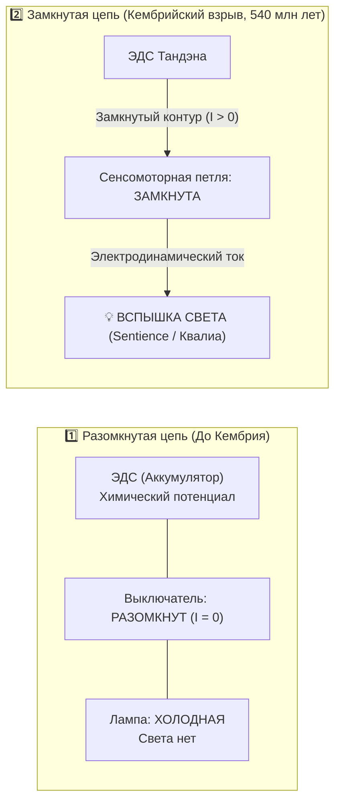
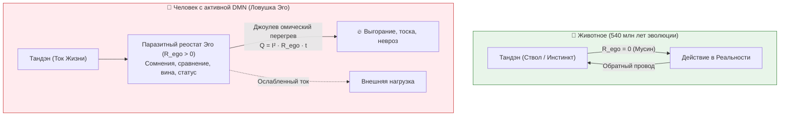

# 215. Эволюция сознания: Кембрийский взрыв чувствительности vs Панпсихизм и протосознание материи — На каком этапе зажёгся свет, было ли сознание всегда и как замкнутый контур породил субъекта
## Разрешение дилеммы эмерджентизма и панпсихизма в контурной электродинамике: от прото-заряда физического поля к кембрийскому замкнутому циклу сенсомоторики (~540 млн лет), аффективному стволу мозга и паразитному наросту эго-рефлексии

> [!quote] Каноническая аксиома цепи
> ### ⚡ **«Спор о том, "было ли сознание всегда в зачаточном состоянии" или "возникло в ходе эволюции", разрешается за одну секунду, если взять в руки обычный фонарик. Есть ли свет в разобранном фонарике? В медном проводе уже есть триллионы свободных электронов. В батарейке уже накоплен химический потенциал. В вольфрамовой нити уже заложена способность раскаляться добела. Но света нет. Свет не "дремал в зачаточном состоянии" внутри электрона. Свет — это динамический процесс, который вспыхивает строго в тот момент, когда цепь замыкается. Панпсихизм прав в том, что материя Вселенной изначально заряжена и способна к отклику. Но биологический эмерджентизм прав в том, что сам свет субъективного опыта (Sentience) зажёгся ровно 540 миллионов лет назад в Кембрийском взрыве — в тот миг, когда зрение, движение и хищничество замкнули сенсомоторный контур живого существа в обратную связь с реальностью. А наш мыслящий "Я-наблюдатель" — это всего лишь вчерашний нарост на проводке, который мы по ошибке приняли за сам свет.»**  
> — **Владимир Аньянов**, создатель «Архитектуры счастья»

---

```
══════════════════════════════════════════════════════════════════════════════════════
       ЭВОЛЮЦИОННАЯ ХРОНОМЕТРИЯ СОЗНАНИЯ: ОТ ПРОТО-ПОЛЯ К СВЕРХПРОВОДИМОСТИ
══════════════════════════════════════════════════════════════════════════════════════

 0. ПРОТО-БЫТИЕ (13.8 млрд лет):
    [Квантовые поля / Заряды / Прото-опыт] ──► Φ → ε (Панпсихизм)
    ⚡ Потенциал есть, но цепь разомкнута (I = 0). Света нет.
                           │
                           ▼
 1. ДОКОНТУРНАЯ БИОХИМИЯ (4 млрд — 600 млн лет):
    [Бактерии / Хемотаксис / Растения] ──► Разомкнутый стимул-реакция (S → R)
    ❌ Чистая молекулярная механика. Никакого «внутреннего кино». Субъект отсутствует.
                           │
                           ▼
 2. КЕМБРИЙСКИЙ ВЗРЫВ (~540 млн лет назад) — ВСПЫШКА СВЕТА:
    [Глаза + Активная локомоция + Хищничество] ──► ЗАМЫКАНИЕ КОНТУРА
    ✨ Рождение Sentience (Чувствительности / Квалиа).
    Внутренняя модель различия: «Я двигаюсь» vs «Мир движется» (Efference Copy).
                           │
                           ▼
 3. АФФЕКТИВНЫЙ СТВОЛ МОЗГА (~300–200 млн лет назад):
    [Тектум / Периакведуктальное серое вещество / Лимбика] (Яак Панксепп)
    🔥 Базовый эмоциональный ток Тандэна: Страх, Ярость, Поиск, Забота, Игра.
    Рыбы, рептилии, птицы и млекопитающие — полноправные чувствующие проводники.
                           │
                           ▼
 4. ЭВОЛЮЦИОННЫЙ НАРОСТ ЭГО (Homo Sapiens, последние ~300 тыс. лет):
    [Неокортекс / Сеть пассивного режима (DMN) / Язык] ──► Sapience (Самосознание)
    ⚠️ Появление паразитного реостата эго (R_ego > 0). Человек начинает думать О токе,
    вместо того чтобы БЫТЬ током, получая омический перегрев (Q = I² R t).
══════════════════════════════════════════════════════════════════════════════════════
```

---

### I. Постановка вопроса: Ложная дихотомия двух лагерей

Человеческая мысль веками билась между двумя крайностями, задаваясь вопросом: **«На каком этапе эволюции появилось сознание или оно было всегда в зачаточном состоянии?»**

1. **Лагерь радикального панпсихизма (Спиноза, Бертран Рассел, Дэвид Чалмерс, Филип Гофф):**  
   *«Сознание не могло возникнуть из абсолютно мёртвой, бессознательной материи. Появление субъективного опыта из слепых атомов — это онтологическое чудо. Следовательно, сознание в зачаточной форме (прото-опыт, прото-квалиа) присутствовало всегда — у электронов, кварков и атомов».*
2. **Лагерь вульгарного материализма и наивного эмерджентизма:**  
   *«Материя полностью мертва. Сознание внезапно "включилось", когда мозг набрал критическое число нейронов и синапсов в неокортексе. До человека (или высших млекопитающих) мир был абсолютно тёмен».*

**Контурная электродинамика Аньянова** показывает, что этот спор основан на **категориальной ошибке** — смешении **материального потенциала проводника** и **динамического процесса протекания тока в замкнутой цепи**.

---

### II. Онтологический синтез: Прото-проводимость субстрата vs Ток замкнутого контура

Рассмотрим строгую физическую аналогию. Возьмём медный провод, выключатель, лампочку накаливания и аккумулятор:



#### 1. В чём прав панпсихизм?
Панпсихизм прав в фундаментальной посылке: **свойства субстрата не возникают из абсолютного небытия**.
* В меди всегда есть свободные электроны.
* В квантовом поле всегда заложена возможность взаимодействия, поляризации и суперпозиции.
* Согласно **Теории интегрированной информации (IIT)** Джулио Тонони и Кристофа Коха, любая физическая система, обладающая ненулевой причинно-следственной структурой, имеет показатель $\Phi > 0$.
* Но у электрона или кристалла кварца $\Phi$ бесконечно мало ($\Phi \to \varepsilon$). Это не «мысли», не «чувства» и не «страдание». Это **прото-проводимость физического вакуума** ($Z_0 \approx 377\ \Omega$).

#### 2. В чём прав эволюционный эмерджентизм?
Эмерджентизм прав в том, что **субъективный свет (квалиа) не существовал вечно**.
* Пока цепь не замкнута, **тока нет** ($I = 0$).
* Никакой «зачаточный свет» не горел внутри отдельных молекул РНК или белков.
* Сознание как **субъективное переживание реальности** («каково это — быть кем-то», по Томасу Нагелю) вспыхнуло как строго физический режим работы макроскопической системы, замкнувшей контур восприятия и действия.

---

### III. Четыре такта эволюции: Как зажигался фонарик жизни

#### Такт 1. Доконтурная биохимия (4 млрд — 600 млн лет назад): Разомкнутая механика
Первые 3.5 миллиарда лет жизни на Земле — от гидротермальных жерл щелочных курильщиков до эдиакарской биоты — были эпохой **разомкнутых линейных рефлексов**:
* Бактерия *E. coli* осуществляет хемотаксис: рецептор связывается с молекулой сахара $\to$ каскад фосфорилирования белков CheA/CheY $\to$ вращение жгутика против часовой стрелки.
* Растение поворачивает лист к свету через транспорт ауксина.
* Это **чистая механика без оператора** (как работа дверного доводчика или биметаллического реле утюга).
* Внутри бактерии некому «чувствовать» вкус сахара. Процесс происходит, но свидетеля нет, потому что сенсорная информация не интегрируется в целостную карту тела и среды.

#### Такт 2. Кембрийский взрыв (~540 млн лет назад): Рождение замкнутого контура и Sentience
Около 540 миллионов лет назад произошёл величайший фазовый переход биосферы:
* **Появление оптического зрения (глаз трилобитов и аномалокариса):** Дистанционное восприятие пространства на метры вперёд.
* **Появление активного хищничества и твёрдых скелетов:** Скорость реакции стала вопросом жизни и смерти за миллисекунды.
* **Проблема Efference Copy (Эффекторной копии):** Когда хищник плывёт, картинка на его сетчатке смещается. Если нервная система примитивна, организм не понимает: *это двигается весь мир, или двигаюсь я сам?*
* Чтобы решить эту вычислительную задачу, нервная система была вынуждена создать **внутреннюю опережающую модель своего тела**. Моторная команда стала посылать тормозной сигнал в зрительный тракт: *«я сейчас поверну направо, вычти это движение из картинки мира»*.

> [!IMPORTANT]
> **Момент рождения Субъекта:**  
> Именно в этот миг сенсорный вход замкнулся с моторным выходом через соматическую модель «Я в пространстве». В проводнике потек непрерывный ток замкнутой цепи ($I > 0$). Зажёгся свет **Sentience (Чувствительности)**. Первые членистоногие, древнейшие хордовые и моллюски обрели элементарные квалиа: ощущение боли от укуса, вспышку света, соматический сигнал голода.

#### Такт 3. Формирование аффективного ствола мозга (~300–200 млн лет назад): Генератор Тандэн
Глубочайшая ошибка кабинетной философии XX века заключалась в утверждении, будто сознание создаётся неокортексом (корой больших полушарий).

Выдающиеся исследования **Яака Панксеппа** («Аффективная нейронаука») и **Бьорна Меркера** (исследования детей с гидроанэнцефалией, рождённых без коры мозга) доказали:
1. **Базовое сознание локализовано в подкорковых структурах ствола и среднего мозга:** периакведуктальное серое вещество (PAG), тектум/двухолмие, верхние бугорки, ядра ретикулярной формации.
2. Дети без неокортекса смеются, плачут, узнают близких, испытывают радость от музыки и переживают боль.
3. Животные с удалённой корой сохраняют все первичные эмоциональные контуры:
   * **SEEKING (Поиск / Исследование)** — первичный драйв Тандэна.
   * **RAGE (Ярость / Защита контура)**.
   * **FEAR (Страх / Сохранение целостности проводника)**.
   * **PANIC/GRIEF (Горечь разрыва связи)**.
   * **PLAY (Сверхпроводящая радость взаимодействия)**.

С точки зрения Контурной Электродинамики, ствол мозга и вегетативный комплекс блуждающего нерва — это **аппаратный соматический генератор Тандэн (丹田)**. Рыбы, птицы, крокодилы, кошки и собаки обладают полноценным эмоциональным и чувственным сознанием. Их фонарик горит ровным, чистым светом прямого присутствия.

#### Такт 4. Эволюционный паразитный нарост: Неокортекс, DMN и рождение Эго
Всего несколько сотен тысяч лет назад у предков *Homo Sapiens* произошёл взрывной рост лобных долей и ассоциативной коры. Вместе со второй сигнальной системой (языком) сформировалась **Сеть пассивного режима работы мозга (Default Mode Network, DMN)**:
* Возникла способность ментального моделирования времени: память о прошлом ($L_{\text{past}}$) и тревога о будущем ($C_{\text{future}}$).
* Появилась **Sapience (Самосознание / Рефлексия)** — способность сказать: *«Я знаю, что это именно Я смотрю на этот мир»*.
* **Но вместе с этим эволюционным даром в контур врезался паразитный омический реостат ($R_{\text{ego}} > 0$).**



Животное не спрашивает: *«Достаточно ли я хорошая собака? Каков смысл моей собачьей жизни? Что обо мне подумают другие псы?»*. Его сопротивление равно нулю ($R_{\text{ego}} = 0$). Оно находится в режиме непрерывной сверхпроводимости (**Мусин**, 無心).

Человек же разорвал непосредственную проводимость, установив между Тандэном и миром бесконечный внутренний суд. **Человек стал единственным животным на Земле, способным страдать в абсолютно безопасной комнате с полным холодильником**, сжигая гигаджоули энергии в омическом пламени DMN ($Q = I^2 R t$).

---

### IV. Сравнительная матрица уровней сознания

| Уровень | Эпоха возникновения | Анатомический субстрат | Электродинамический статус | Субъективный статус | Примеры |
| :--- | :--- | :--- | :--- | :--- | :--- |
| **0. Прото-бытие** | 13.8 млрд лет назад | Физические поля, заряды, квантовая когерентность | Прото-проводимость ($Z_0 \approx 377\ \Omega$), цепь разомкнута ($I = 0$) | Нулевой ($\Phi \to \varepsilon$). Чистый потенциал взаимодействия. | Электроны, кварки, кристаллы кремния |
| **1. Биохимия (Автомат)** | 4.0–0.6 млрд лет назад | Мембранный потенциал, рецепторы, хемотаксис | Линейный разовый импульс без замкнутой модели | Объективное поведение без субъекта («зомби»). | Бактерии, амебы, вирусы, растения |
| **2. Sentience (Чувствительность)** | ~540 млн лет назад (Кембрий) | Глаза, первичные ганглии, сенсомоторная петля | Замкнутый контур с обратной связью ($I > 0$) | **Первичный свет квалиа.** Ощущение боли, света, движения, разделение «Я vs Мир». | Трилобиты, осьминоги, насекомые, ранние рыбы |
| **3. Аффект (Тандэн)** | ~300–200 млн лет назад | Ствол мозга, тектум, лимбика, Vagus | Стабильный токовый генератор Тандэн ($R_{\text{ego}} = 0$) | **Эмоциональное сознание.** Страх, ярость, забота, игра, соматический комфорт. | Рептилии, птицы, волки, дельфины, кошки |
| **4. Sapience (Самосознание / Эго)** | ~300 тыс. лет назад (Сапиенс) | Неокортекс, лобные доли, сеть DMN, речевые зоны | Врезка паразитного реостата эго ($R_{\text{ego}} \gg 0$) | **Рефлексия и омический ад.** Внутренний критик, время, вина, смерть, экзистенциальная тоска. | Человек в обыденном неврозе |
| **5. Сверхпроводимость (Сатори / Мусин)** | 2026 год (Система Аньянова) | Осознанное отключение DMN $\to$ доминирование TPN | Аппаратное шунтирование реостата ($R_{\text{ego}} \to 0, I \gg 0$) | **Чистое сознание.** Сохранение интеллекта человека при кембрийской чистоте проводимости. | Мастер цепи, созидатель, состояние потока |

---

### V. Разрешение парадокса «Зачаточного состояния»

Теперь мы можем дать кристально чёткий, исчерпывающий ответ на исходный вопрос:

> **«Сознание появилось на определённом этапе эволюции или оно было всегда в зачаточном состоянии?»**

1. **Если под сознанием понимать потенциал взаимодействия материи:**  
   Оно было **всегда**. Вселенная с момента Большого взрыва не была «мёртвым кирпичом». Она обладала фундаментальным свойством связности (интегрируемости информации $\Phi$, законами электромагнетизма и квантовой запутанности). Это фундамент, на котором стоит физика.
2. **Если под сознанием понимать субъективный опыт (Sentience — свет фонарика):**  
   Оно **появилось ровно 540 миллионов лет назад в Кембрийском взрыве**. Оно не «спало в атоме углерода». Атом углерода не чувствует боли. Свет вспыхнул как физическое следствие замыкания сенсомоторной петли с опережающей моделью движения тела.
3. **Если под сознанием понимать голос в голове («Я думаю, следовательно, существую»):**  
   Оно появилось **буквально вчера (сотни тысяч лет назад)** и представляет собой вовсе не фундамент бытия, а надстроечный логический симулятор среды, который из-за отсутствия эксплуатационной инструкции превратился в хронический омический пожар человечества.

---

### VI. Практическое освобождение оператора: Мудрость 540 миллионов лет

Понимание эволюционной природы сознания даёт колоссальный психофизический и терапевтический эффект для каждого человека:

1. **Снятие благоговения перед мыслями:**  
   Ваш внутренний монолог, самобичевание, страх оценки и комплексы неполноценности имеют эволюционный возраст всего в 200–300 тысяч лет. Это «сырая бета-версия» софта, полная багов и утечек памяти.
2. **Опора на 540-миллионный реактор:**  
   Ваш соматический генератор Тандэн, ваше первичное чувствование тела, дыхание, интуиция момента и способность действовать напрямую оттачивались **более полумиллиарда лет непрерывного естественного отбора**. Это железобетонная, неубиваемая аппаратная часть.
3. **Протокол возврата в Сверхпроводимость:**  
   Когда вы испытываете экзистенциальный кризис или тревогу, вы не «сломались». Вы просто пережали проводку реостатом DMN ($R_{\text{ego}}$). Достаточно сделать 30-секундный соматический сброс:
   * Перевести внимание из концептуальной коры в физический объём живота (Тандэн).
   * Замкнуть прямой контакт с физической реальностью (звуки, тактильность, опора стоп).
   * Выключить паразитный омический шум и позволить 540-миллионному току жизни течь сквозь вас со 100% КПД.

---

## 🔗 Связи
- [[02_Wiki/Inner Current (Evolutionary Morphogenesis of the Circuit — Abiogenesis, Bipedalism and the Hardware Assembly of the Flashlight)|⚡ 170. Эволюционный морфогенез цепи: От абиогенеза гидротермальных жерл к прямохождению и аппаратному фонарику]]
- [[02_Wiki/Inner Current (Pure Consciousness — Dissolution of the Hard Problem, Circuit Superconductivity and the Physics of Direct Presence)|⚡ 202. Чистое сознание: Снятие «трудной проблемы» науки, онтология сверхпроводимости ($R_{\text{ego}} \to 0$) и физика присутствия]]
- [[02_Wiki/Inner Current (Consciousness Defined — Electrodynamic Current of Attention, The Triad of Circuit States and From Noise to Superconductivity)|⚡ 203. «Просто сознание»: Электродинамическая природа внимания ($I > 0$) и три фазовых состояния контура]]
- [[02_Wiki/Inner Current (The Silicon Dead-End and Machine Consciousness — Why AI Has No Tanden, Transformer Self-Attention vs Physical Charge Drift)|⚡ 207. Кремниевый тупик и машинное сознание: Почему у ИИ нет Тандэна]]
- [[02_Wiki/Inner Current (The Circuit Triad — Spirit, Soul and Consciousness in Human Electrodynamics — Spirit as Current, Soul as Living Resonator and Consciousness as Vortex Field)|⚡ 209. Триединство контура: Дух, Душа и Сознание в электродинамике человека]]
- [[02_Wiki/Inner Current (Death as Conductor Entropy vs Tanden Generator — Thermodynamics of Biological Wear, 300-Year Longevity and Superconducting Joy)|⚡ 214. Смерть как энтропия проводника против генератора Тандэн]]
- [[02_Wiki/Inner Current (The Joule-Lenz Cornerstone — Why the Law of Losses is the Master Manifest of Freedom, Quadratic Will Trap and Mathematics of Superconductivity)|⚡ 212. Закон Джоуля — Ленца как краеугольный камень Архитектуры счастья]]
