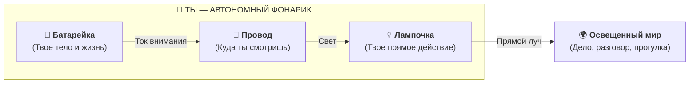
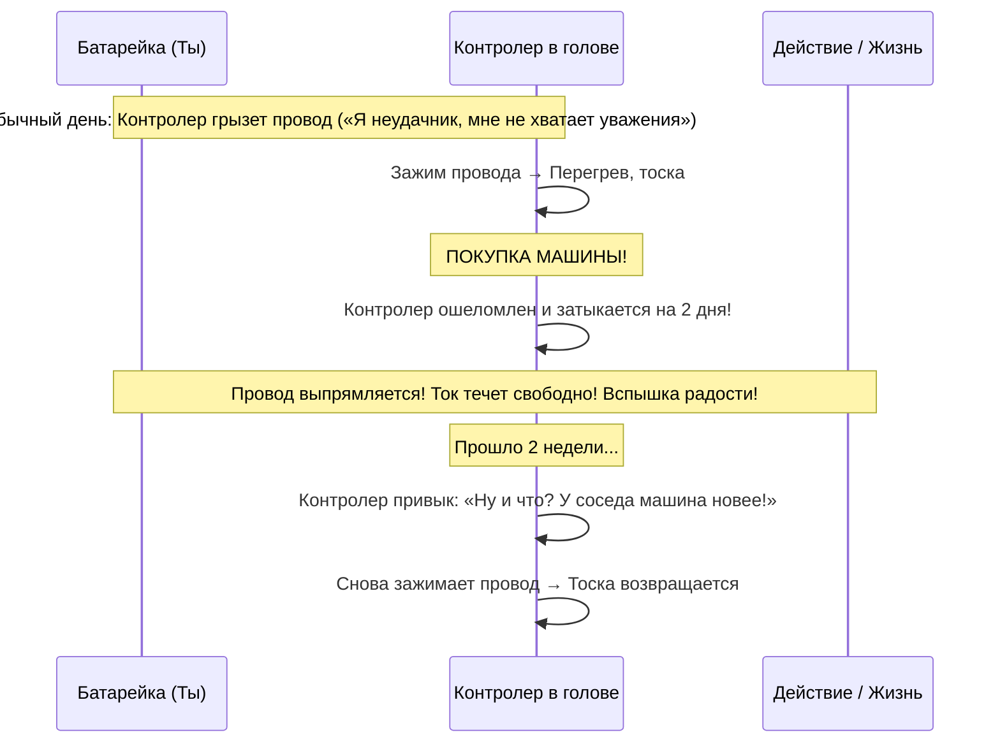
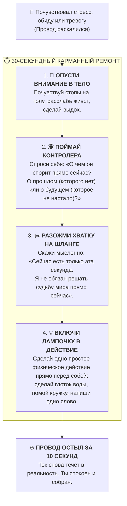

# ⚡ Праймер Фейнмана: Архитектура счастья простыми словами
## Базовые понятия Системы Аньянова для неподготовленного читателя
### *Как устроена механика человеческого благополучия без академического жаргона, мистики и снисходительности*

> [!quote] Канон Ричарда Фейнмана
> ### 💡 **«Если вы не можете объяснить идею простыми словами обычному человеку или десятилетнему ребенку — значит, вы сами глубоко её не понимаете или прячете ложь за птичьим языком.»**  
> — *Ричард Фейнман*

---

## 🧭 Входной порог: Зачем нужен этот праймер

Большая книга по **Архитектуре счастья (Системе Аньянова)** содержит строгие формулы электродинамики, анализ нейросетей мозга, ссылки на термодинамику и демаркацию науки по Попперу и Бэкону. Для специалистов и инженеров это необходимо: любая фундаментальная теория обязана доказать свою академическую строгость.

Но у физика Ричарда Фейнмана было золотое правило: **истинный закон природы всегда предельно прост в своей основе**. Если для объяснения сути вам требуется нагромождение латыни, греческих терминов и туманных метафор — значит, вы сами путаетесь в механике.

Этот праймер написан для любого мыслящего человека — врача, водителя, программиста, повара, школьного учителя или студента, — который никогда не читал трактатов по философии и не собирается сдавать экзамен по физике.

Здесь нет сюсюканья, нет детских сказок и нет абстрактной заумности. Только кристально ясная механика на пальцах: как устроен человек, почему ему бывает невыносимо плохо и как за тридцать секунд вернуть себя в состояние кристального спокойствия и рабочей радости.

---

## 🔦 Глава 1. Ты — это фонарик, а не темная комната

Главная ошибка, из-за которой люди страдают тысячелетиями, звучит так:  
*«Я пуст, несчастен и одинок. Мне нужно найти что-то снаружи — вещь, человека, успех, признание, — что войдет в меня и сделает меня счастливым».*

Люди представляют себя темной пустой комнатой, в которую кто-то снаружи должен принести лампу. Но это грубейшая физическая ошибка.

**В действительности человек устроен как автономный карманный фонарик.**



1. **Ни один предмет в мире не светится сам по себе.** Новая машина, дорогая одежда, диплом, пачка денег или лайки в телефоне — это просто холодные куски пластика, металла или бумаги. Они темные.
2. **Свет производит только твой собственный фонарик.** Когда ты смотришь на что-то с живым интересом, ты освещаешь этот предмет собственным лучом. 
3. Предмет кажется тебе «прекрасным» и «радостным» не потому, что в нем спрятан свет, а потому, что **твой собственный фонарик прямо сейчас светит на него на полной мощности**.

Счастье — это не то, что лежит на полке магазина. Счастье — это когда твоя лампочка горит, а батарейка легко отдает ток.

---

## ⚙️ Глава 2. Четыре простые детали твоего устройства

Чтобы управлять автомобилем, не нужно быть профессором машиностроения, но нужно знать, где руль, где тормоз и почему нельзя ехать на ручнике. У человека всего четыре базовых узла:

| Узел | Что это в жизни | Как это работает на пальцах |
| :--- | :--- | :--- |
| **1. Батарейка (Генератор)** | Твое живое тело, центр тяжести внизу живота | Это соматический источник жизни. Пока ты дышишь и сыт, батарейка непрерывно вырабатывает ток. Она не может «иссякнуть от мыслей» — она работает всегда. |
| **2. Провод** | Твое внимание | Это единственный электрический кабель в системе. Ты не можешь думать обо всем сразу: куда направлен твой провод, туда течет весь твой ток. |
| **3. Лампочка (Нагрузка)** | Твое прямое действие прямо сейчас | То, чем ты физически занят в эту секунду: моешь посуду, забиваешь гвоздь, пишешь строку текста, делаешь пробежку, пьешь чай. |
| **4. Обратный провод** | Физическая реальность | В розетке всегда два отверстия: чтобы ток шел, цепь должна быть **замкнута**. Ты сделал действие в мир — мир дал осязаемый отклик — круг замкнулся. Энергия обновилась. |

Если все четыре детали соединены правильно, ток бежит ровно, лампочка горит ровным светом, а провод остается холодным. Ты чувствуешь бодрость, ясность и тихое удовольствие от жизни.

---

## 🌊 Глава 3. Что такое счастье? Аналогия со шлангом

В философских книгах о счастье написаны миллионы страниц. Но инженер Владимир Аньянов сформулировал его так, что поймет даже первоклассник:

> **Счастье — это шланг с водой, на котором нет заломов.**

Представь садовый шланг, подключенный к крану:
* Когда шланг прямой и ровный, вода летит упругой, мощной, прохладной струей. Она поит цветы, смывает пыль и шумит свежестью. Шланг расслаблен и надежен.
* А теперь наступи на шланг ногой или согни его пополам.
* Вода перестала течь. Возле крана шланг раздувается, резина скрипит и трещит, давление зашкаливает, он готов лопнуть или сорвать кран.

**Счастье — это свободное течение тока изнутри наружу.** Это физическое отсутствие зажимов и заломов на твоем проводе внимания. Тебе не нужно «учиться счастью». Тебе нужно просто убрать ногу со шланга.

---

## 🔥 Глава 4. Почему нам бывает больно? Закон горячего провода

Почему человек в депрессии, стрессе или тревоге физически мучается? Почему у него щемит в груди, болит голова и нет сил встать с дивана?

Вспомни, как устроен обычный электрический обогреватель, тостер или чайник. В них специально вставляют провод из материала с огромным **сопротивлением**. Току трудно пройти сквозь это место, электроны с силой бьются о препятствие, и провод **начинает раскаляться докрасна**.

```
    [Батарейка] ───(Ток I)───> [ ⚡ ПОМЕХА (Сопротивление R) ⚡ ] ───> РАСКАЛЁННЫЙ ПРОВОД (Ожог Q = I²Rt)
                                      ▲
                                      │
                           Внутренний спор и тревога:
                    «А вдруг не получится?», «Они меня не любят!»
```

Точно такой же закон работает внутри твоего внимания:

1. Если твой провод чист — энергия свободно идет в действие. Провод ледяной. Ты можешь работать часами и не уставать.
2. Но если ты втыкаешь посреди провода препятствие — начинаешь яростно спорить с реальностью, накручивать себя, бояться, винить себя или обижаться, — **твой провод внимания раскаляется докрасна**.
3. **Душевная боль, паника, обида и выгорание — это буквальный термический ожог от твоего собственного перегретого провода!**

Ты устал не от работы. Ты устал от того, что твой внутренний кабель горит огнем из-за колоссального сопротивления внутри.

---

## 🗣️ Глава 5. Кто ставит помеху? Жадный контролер в голове

Кто же тот вредитель, который пережимает провод и заставляет его раскаляться?

Этот вредитель — **наш собственный мысленный контролер (Эго)**.

Контролер — это болтливый голос в голове, который считает себя хозяином всего фонарика. Он не умеет делать реальные дела. Он не умеет копать землю, обнимать ребенка или писать музыку. Всё, что он умеет — это **комментировать и судить**:
* *«А достаточно ли я умен?»*
* *«А что обо мне подумает сосед?»*
* *«А вдруг завтра случится кошмар?»*
* *«Почему со мной обошлись так несправедливо три года назад?»*

Заметь: этот контролер никогда не живет в текущей секунде. Он всегда либо в прошлом (винит и обижается), либо в будущем (боится и тревожится).

Встав посреди провода, он перекрывает ток к лампочке и требует: *«Сначала докажи мне, что мы великие! Сначала защити мое величие от критики!»*.

Ток упирается в него. Провод начинает плавиться. Человек сгорает от внутреннего пожара, хотя внешне он просто сидит на стуле и смотрит в стену.

---

## 🏎️ Глава 6. Ошибка аккумулятора: почему вещи не приносят счастья

Это главное разоблачение цивилизации потребления, понятное на пальцах.

Человек покупает дорогой автомобиль, новый телефон или модные кроссовки. Первые три дня он ходит сияющий: ему кажется, что он на седьмом небе. Но через две недели восторг исчезает, наступает серая тоска, и хочется купить что-то новое.

Почему так происходит?

Большинство людей уверены: *«Счастье было внутри машины! Машина зарядила меня, как аккумулятор, а потом заряд кончился»*.

**Это иллюзия. В машине не было ни одного грамма счастья.** Машина — это холодный кусок штампованного железа.

Вот что произошло на самом деле:



1. Когда ты купил машину, твой вечно брюзжащий контролер в голове на мгновение потерял дар речи. Он заткнулся от неожиданности.
2. В эту секунду он **разжал хватку на проводе**.
3. Твой собственный ток из батарейки наконец-то пошел в лампочку без помех! Ты почувствовал блаженство своего собственного свободного тока.
4. Но по ошибке ты подумал, что радость пришла из салона автомобиля.
5. Прошло время, контролер опомнился и снова наступил на шланг. Снова стало больно и пусто.

Никакие покупки, похвалы, награды и лайки не способны сделать тебя счастливым, потому что они — не батарейки. Единственный способ быть счастливым стабильно — это **научиться не давать контролеру зажимать твой провод**.

---

## 🎯 Глава 7. Режим прямого потока: как это чувствуется

Каждый человек хоть раз в жизни испытывал режим, в котором провод абсолютно чист и холоден. Вспомни моменты, когда:
* Ты увлеченно играл в футбол или собирал сложный конструктор;
* Ты вел машину по пустой ночной трассе под хорошую музыку;
* Ты чистил картошку или мыл пол, не думая ни о чем постороннем;
* Ты решал сложную задачу по математике или писал код, забыв про обед.

В эти минуты контролер спал. В голове не было внутреннего монолога: *«А как я выгляжу? А любят ли меня?»*. 

Был только ты и действие. Батарейка $\to$ Провод внимания $\to$ Дело.

Это состояние физики называют **сверхпроводимостью**, а на Востоке веками называли словом *Мусин* (чистый ум без помех). В этом состоянии человек работает с максимальной скоростью, не делает ошибок и, главное, совершенно не устает. Потому что сопротивление равно нулю, и провод ледяной.

---

## 🧯 Глава 8. Что делать, если лампочка перегорела? (Предохранитель)

В жизни не всё идет по плану. Это закон природы.
* Ты долго строил проект — а клиент отказался.
* Ты пошел на пикник — а пошел ливень.
* Сломался замок, сорвалась поездка, человек повел себя некрасиво.

Что делает человек без понимания схемы?  
Он решает, что настал конец света. Он впадает в ярость, начинает орать, крушить мебель или неделями лежать носом к стенке, проклиная судьбу. Это всё равно что водитель, у которого спустило колесо, поджег бы собственный автомобиль.

Что делает человек, знающий схему фонарика?  
Он знает: **в фонарике перегорела сменная лампочка. Но батарейка и провод целы!**

В нормальной электросети для этого стоит **предохранитель**. Когда происходит замыкание, предохранитель мягко размыкает цепь: «Стоп. Лампочка сгорела. Давай спокойно заменим её на новую».

Умный человек смотрит на неудачу без истерики:  
*«Да, этот проект закрылся (лампочка погасла). Это бывает. Но мой генератор энергии работает, я жив и здоров. Я просто беру следующую задачу и включаю ток в неё»*.

Это называется **антихрупкостью**: внешние удары не ломают твою внутреннюю станцию.

---

## 🛠️ Глава 9. Карманный ремонт: 30 секунд к холодному проводу

Вот простейшая пошаговая инструкция, которую можно применять прямо сейчас, если ты почувствовал приступ тревоги, злости, обиды или бессилия.



### 1. Опустись в батарейку (10 секунд)
Прекрати слушать кинофильм в голове. Переведи внимание в тело.  
Ощути, как стопы стоят на полу. Почувствуй вес своего тела на стуле. Опусти дыхание в самый низ живота (туда, где находится центр тяжести). Твоя батарейка здесь, она работает стабильно.

### 2. Заметь зажим на проводе (5 секунд)
Честно скажи себе: *«Мне сейчас плохо не из-за мира. Мне плохо, потому что мой контролер зажал провод и спорит с тем, что уже произошло или чего еще нет»*. Ты не виноват. Это просто физика перегрева.

### 3. Сними ногу со шланга (5 секунд)
Разреши миру быть таким, какой он есть в эту секунду. То, что уже случилось, изменить невозможно. Будущее еще не наступило. Есть только точка «здесь и сейчас». Разожми внутренний кулак.

### 4. Включи ток в простое осязаемое дело (10 секунд)
Направь луч фонарика на любое простое физическое действие, которое находится на расстоянии вытянутой руки.  
Вымой чашку. Наведи порядок на столе. Завяжи шнурок. Сделай глоток чая и почувствуй его вкус.

В ту секунду, когда твое внимание соединилось с простым реальным действием, **провод выпрямляется, сопротивление падает до нуля, и провод мгновенно остывает**. Тревога растворяется, как пар над чайником.

---

## 📖 Карманный словарик инженера жизни

Если ты запомнишь эти семь понятий, ты никогда больше не заблудишься в дебрях психологии:

1. **Батарейка (Генератор / Тандэн):** Твой неиссякаемый источник жизненной силы в теле. Работает всегда, пока ты жив.
2. **Провод (Внимание):** Кабель, направляющий твою энергию. Куда направлен провод — то и оживает.
3. **Лампочка (Нагрузка):** Твое конкретное дело прямо сейчас. Без лампочки ток не может совершить полезной работы.
4. **Счастье (Сверхпроводимость):** Состояние, когда провод абсолютно прямой, ток бежит свободно, а лампочка горит ровно и ярко.
5. **Страдание / Стресс (Омический перегрев):** Ожог от раскаленного провода, когда ток упирается во внутреннее сопротивление и споры с реальностью.
6. **Контролер (Эго):** Назойливый голос в голове, который пытается командовать проводом, создавая заломы и аварии.
7. **Предохранитель (Спокойная готовность / Дзансин):** Способность не разрушать свой фонарик, когда перегорает внешняя лампочка, а спокойно заменить её на новую.

---

## 🏁 Резюме: Твоя жизнь в твоих руках

Счастье — это не тайна за семью печатями, не привилегия избранных и не награда за праведную жизнь.

**Это простая, безупречная и честная схемотехника.**

Ты держишь в руках самый совершенный фонарик во Вселенной. Не разворачивай луч внутрь, чтобы искать там несуществующие изъяны. Не жди, что темные вещи вокруг вдруг начнут светить вместо тебя.

Направь прямой, чистый и спокойный луч своего внимания на то, что ты любишь и делаешь прямо сейчас. 

Замкни контур с реальностью. И свет появится сам собой.
