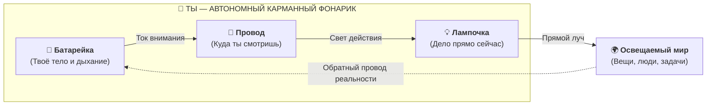
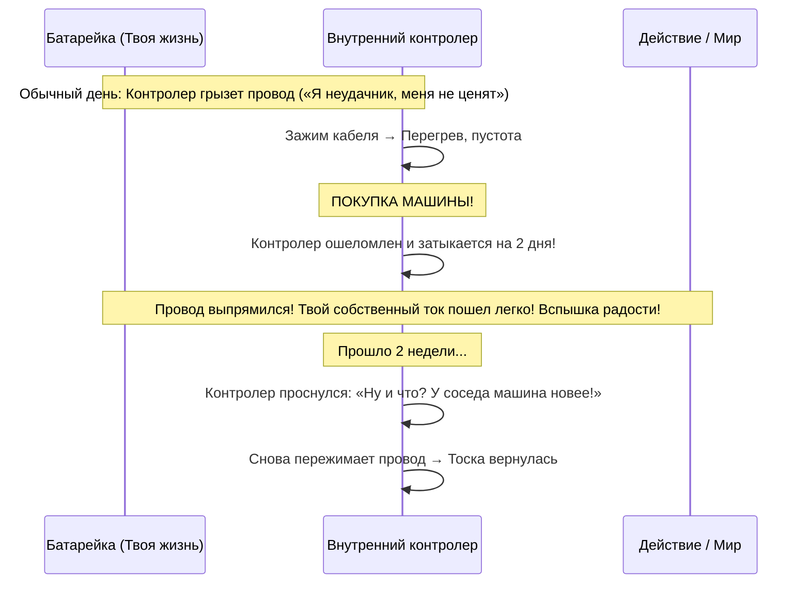
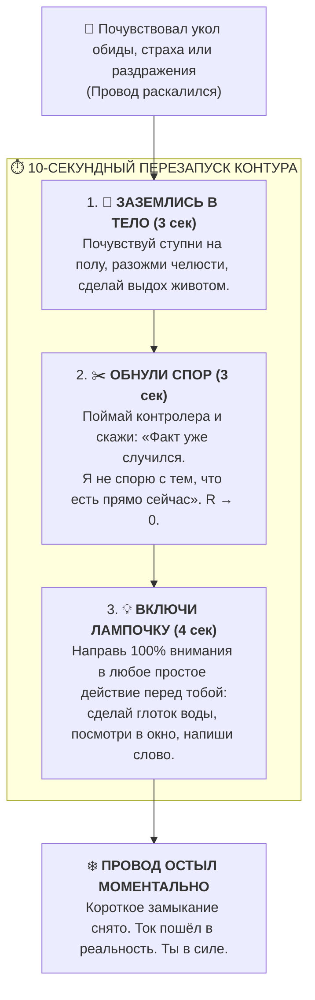

# ⚡ Праймер Фейнмана: Архитектура счастья простыми словами
## Базовые понятия контурной физики человека на основе книги «Внутренний ток»
### *Полная механика человеческого контура без академического тумана, мистики и снисходительности*

> [!quote] Канон Ричарда Фейнмана
> ### 💡 **«Если вы не можете объяснить идею простыми словами обычному человеку или десятилетнему ребенку — значит, вы сами глубоко её не понимаете или прячете ложь за птичьим языком.»**  
> — *Ричард Фейнман*

---

## 🧭 Входной порог: Зачем написан этот праймер

В фундаментальной книге «Внутренний ток: Архитектура счастья» более шестидесяти тысяч слов. Там есть формулы дифференциальных цепей, строгая нейробиология сетей мозга (DMN и TPN), демонтаж философских трактатов от Вед и стоиков до Льва Толстого, консилиенс с экономикой Генри Джорджа и протоколом Биткоина, а также расчет уравнений Сингулярности с искусственным интеллектом (AGI).

Для мировой науки это необходимо: любая строгая дисциплина обязана выдержать академическую проверку на прочность.

Но у великого физика Ричарда Фейнмана было непреложное правило: **подлинный закон природы в своей основе всегда прост и осязаем**. Если убрать словесные кружева, фундаментальный закон обязан проверяться на пальцах и быть понятным любому здравомыслящему человеку — водителю, хирургу, инженеру, повару или десятилетнему школьнику.

Этот праймер создан на основе обновлённой книги. В нём нет сюсюканья и снисходительности. Здесь собраны **базовые понятия системы в виде прямых физических законов**, с помощью которых каждый человек может раз и навсегда понять, как он устроен, почему ему бывает плохо и как за десять секунд вернуть себе ясность, устойчивость и рабочую радость.

---

## 🔦 Глава 1. Ты — это фонарик, а не тёмная комната

Тысячи лет людям внушали глубочайшую ошибку:  
*«Человек рождается пустым, тёмным и несчастным. Ему нужно найти во внешнем мире что-то — успех, статус, любовь, богатство, чужое одобрение, — что войдет внутрь и зажжёт в нём свет».*

Люди привыкли воспринимать себя тёмной комнатой, куда кто-то добрый должен принести свечу.

**В действительности человек устроен ровно наоборот: как автономный карманный фонарик.**


```mermaid
flowchart LR
    subgraph Inside ["🔦 ТЫ — АВТОНОМНЫЙ КАРМАННЫЙ ФОНАРИК"]
        B["🔋 <b>Батарейка</b><br/>(Твоё тело и дыхание)"] -->|Ток внимания| W["🔌 <b>Провод</b><br/>(Куда ты смотришь)"]
        W -->|Свет действия| L["💡 <b>Лампочка</b><br/>(Дело прямо сейчас)"]
    end
    L -->|Прямой луч| R["🌍 <b>Освещаемый мир</b><br/>(Вещи, люди, задачи)"]
    R -.->|Обратный провод реальности| B
```

1. **Ни один предмет в мире не светится сам по себе.** Новая машина, пачка купюр, диплом престижного вуза, лайки в телефоне или чужие аплодисменты — это просто холодные куски пластика, металла и колебания воздуха. Сами по себе они абсолютно тёмные.
2. **Свет рождает только твой собственный внутренний генератор.** Когда ты смотришь на мир с живым, включённым вниманием, ты освещаешь предметы собственным лучом.
3. Вещь или дело кажутся нам «прекрасными» и «вдохновляющими» не потому, что в них спрятано счастье, а потому, что **сквозь наш собственный провод прямо сейчас беспрепятственно идёт ток**.

Счастье — это не то, что можно купить, заслужить или найти на чужой полке. Счастье — это нормальное рабочее состояние твоего фонарика, когда ток идёт изнутри наружу.

---

## ⚙️ Глава 2. Четыре простые детали человеческого устройства

Любой сложный прибор состоит из базовых узлов. У человека их всего четыре:

| Деталь | Что это в твоей жизни | Как это работает на пальцах |
| :--- | :--- | :--- |
| **1. Батарейка (Генератор / Тандэн)** | Твоё живое тело, центр тяжести внизу живота | Пока ты дышишь, ешь и спишь, тело непрерывно генерирует чистую энергию жизни. Этот генератор работает автономно. Он не истощается от того, что ты решаешь задачи. |
| **2. Провод (Шина внимания)** | Твой фокус внимания | Это единственный кабель, по которому течёт энергия. Ты не можешь думать обо всём на свете одновременно. Куда направлен твой провод — туда уходит 100% твоего тока. |
| **3. Лампочка (Полезная нагрузка)** | Твоё прямое действие прямо сейчас | То, чем ты физически занят в данную секунду: моешь посуду, забиваешь гвоздь, пишешь программный код, ведёшь машину, обнимаешь близкого. |
| **4. Обратный провод (Реальность)** | Осязаемый физический мир | В розетке всегда два контакта. Ток не может течь в никуда. Контур обязан быть **замкнутым**. Сделал шаг — оперся на землю — получил отклик — круг замкнулся. Энергия обновилась. |

Когда все четыре узла соединены, провод остаётся холодным, лампочка горит ровным сильным светом, а человек чувствует бодрость, силу и покой.

---

## 🌊 Глава 3. Что такое счастье? Принцип шланга без заломов

В библиотеках мира стоят тысячи томов о «тайнах душевной гармонии». Но инженерный факт поразительно прост:

> **Счастье — это садовый шланг с водой, на котором нет ни одного залома.**

Вспомните обычный поливочный шланг, присоединённый к дачному насосу:
* Когда шланг лежит прямо и ровно, прохладная вода несётся по нему мощным потоком. Она шумит, поит сад, приносит свежесть. Сам шланг расслаблен и гибок.
* Но стоит наступить на шланг ногой или согнуть его пополам — вода перестаёт выходить наружу. У крана резину раздувает чудовищным давлением, шланг трещит и готов сорвать вентиль.

**Счастье — это не награда за праведную жизнь и не редкая удача.** Это просто физическое отсутствие перегибов на твоём проводе внимания. Тебе не нужно «создавать» счастье. Нужно просто убрать ногу со шланга.

---

## 🔥 Глава 4. Закон раскалённого провода: почему нам бывает больно

Почему при тревоге, обиде, зависти или депрессии человек страдает физически? Почему болит в груди, раскалывается голова и накатывает невыносимая усталость?

Вспомните, как работает комнатный обогреватель, тостер или чайник. В них вставляют провод из металла с очень высоким **сопротивлением**. Электронам трудно сквозь него продираться, они яростно бьются о решётку металла, и провод **начинает раскаляться докрасна**.

Физики называют это законом Джоуля — Ленца:
$$\text{Теплота ожога} = Q = I^2 \cdot R \cdot t$$

```
   [Генератор тела] ──(Ток внимания)──> [ ⚡ ВНУТРЕННИЙ СПОР (Сопротивление R) ⚡ ] ──> ПРОВОД ГОРИТ!
                                                        ▲
                                                        │
                                             Мысли-паразиты:
                                   «А вдруг я хуже других?», «Они виноваты!»
```

Точно такой же закон работает внутри твоего внимания:
1. Если провод свободен — энергия идёт в дело. Провод остаётся прохладным. Ты можешь трудиться весь день и чувствовать вдохновение.
2. Но если ты втыкаешь посреди провода сопротивление — начинаешь мысленно воевать с реальностью, паниковать перед будущим, копить обиды на прошлое или бесконечно оценивать себя, — **твой провод внимания раскаляется добела**.
3. **Душевная боль, тревога, выгорание и панические атаки — это буквальный термический ожог от твоего собственного перегретого провода!**

Ты устал не от работы и не от тяжести мира. Ты сгораешь оттого, что провод твоего внимания раскалён сопротивлением мысленного холостого хода.

---

## ⚖️ Глава 5. Парадокс Льва Толстого: почему провалились 2000 лет «изменения себя»

В конце жизни великий писатель Лев Толстой призывал: *«Все хотят изменить человечество, но никто не хочет изменить себя. Начните с себя!»*

Но почему попытки «исправить себя» через мораль, силу воли и покаяние почти всегда приводили людей к надрыву, чувству вины и срывам?

Потому что старая мораль предлагала человеку **абсурдную инженерную схему: чинить ум с помощью самого ума!**

```
                 ТУПИК МОРАЛИЗАТОРСТВА (УМ ПЫТАЕТСЯ ЧИНИТЬ УМ)
            ┌────────────────────────────────────────────────────────┐
            │   «Праведный контролер» ──(Осуждение, Стыд)──► «Я»     │
            │           ▲                                    │       │
            │           └────────(Бесконечные мысли)─────────┘       │
            │                                                        │
            │   В электродинамике это: КОРОТКОЕ ЗАМЫКАНИЕ БЕЗ        │
            │   ПОЛЕЗНОЙ НАГРУЗКИ. Вся энергия уходит в омический    │
            │   пожар самобичевания (Q = I²·R·t).                    │
            └────────────────────────────────────────────────────────┘
```

Когда человек садится и начинает корить себя: *«Я ленив, я завистлив, я плохой, я должен заставить себя быть святым»*, — он совершает **короткое замыкание без лампочки**. Ток крутится по кругу внутри черепной коробки. Провод плавится. Психика истощается, и человек впадает в апатию.

### Снятие вины: от морали к схемотехнике
Контурная физика снимает с человека двухтысячелетнее клеймо «греховности». Человек — не грешник. Человек — это **электрический прибор**.

Лампочка не виновата, если провод пережали. Резистор не грешен оттого, что нагрелся по закону Джоуля — Ленца.

Тебе не нужно годами ломать свой характер и вести войну с самим собой. **«Изменить себя» — это не подвиг, а переключение тумблера за 10 секунд:**
1. Прекрати мысленный суд над собой (выключи короткое замыкание).
2. Направь освободившийся ток внимания в **любое реальное полезное действие прямо сейчас** (вымой чашку, забей гвоздь, напиши строчку).
3. В ту самую секунду, когда твои руки начали делать дело без внутреннего спора, **ты уже изменился!** Цепь замкнулась на полезную нагрузку, провод остыл, а омический пожар вины прекратился.

---

## 🗣️ Глава 6. Жадный контролер в голове и запрет светить внутрь фонарика

Кто же устраивает заломы на шланге и перегревает провод?

Этот персонаж — **мысленный контролер (Эго)**.

Контролер — это навязчивый внутренний голос, который почему-то возомнил себя хозяином фонарика. Сам он ничего делать не умеет. Он не умеет класть кирпичи, бегать, любить или создавать программы. Всё, чем он занимается — это **комментирует, пугает и судит**:
* *«А что обо мне подумают важные люди?»*
* *«А вдруг я опозорюсь?»*
* *«Почему со мной поступили несправедливо пять лет назад?»*

Заметьте: контролер никогда не живёт в настоящей секунде. Он либо ковыряется на свалке мертвого прошлого, либо рисует фильмы ужасов о ненаступившем будущем.

Встав посреди кабеля внимания, он пытается согнуть фонарик пополам и **направить луч света внутрь самого корпуса**: *«Давай осветим наши внутренние травмы! Давай выясним, почему мы такие несовершенные!»*

Но попробуйте карманным фонариком посветить внутрь его собственной батарейки. Вы ничего не увидите, только разобьёте стекло и переломите корпус.

Фонарик создан для того, чтобы светить **наружу — на дорогу перед собой**. Когда луч направлен вперёд, под ноги, дорога видна отчётливо, и ты спокойно идёшь к цели.

---

## 🏎️ Глава 7. Ошибка аккумулятора: почему вещи не делают нас счастливыми

Это фундаментальное разоблачение общества бесконечного потребления.

Человек покупает дорогой автомобиль, новый смартфон или надевает брендовую одежду. Первые пару дней он летает как на крыльях. Но проходит неделя-другая — восторг улетучивается, возвращается серая тоска, и рука снова тянется к каталогу покупок.

Большинство людей объясняют это так: *«Счастье было спрятано внутри машины! Я зарядился от неё, как телефон от розетки, а теперь заряд иссяк. Нужно купить машину получше»*.

**Это иллюзия. В автомобиле нет ни одного электрона счастья.** Автомобиль — это холодный сплав алюминия, пластика и кожи.

Вот что произошло на самом деле:


```mermaid
sequenceDiagram
    participant B as Батарейка (Твоя жизнь)
    participant C as Внутренний контролер
    participant L as Действие / Мир
    
    Note over B,C: Обычный день: Контролер грызет провод («Я неудачник, меня не ценят»)
    C->>C: Зажим кабеля → Перегрев, пустота
    Note over C: ПОКУПКА МАШИНЫ!
    C->>C: Контролер ошеломлен и затыкается на 2 дня!
    Note over B,L: Провод выпрямился! Твой собственный ток пошел легко! Вспышка радости!
    Note over C: Прошло 2 недели...
    C->>C: Контролер проснулся: «Ну и что? У соседа машина новее!»
    C->>C: Снова пережимает провод → Тоска вернулась
```

1. Когда ты получил желаемую вещь, твой вечно бубнящий контролер в голове на мгновение потерял дар речи. Он замолчал от неожиданности.
2. В эту секунду он **разжал клещи на твоём проводе внимания**.
3. Твой собственный ток из батарейки наконец-то пошёл свободно! Ты почувствовал блаженство своего собственного чистого потока.
4. Но по ошибке ты приписал это блаженство куску железа на колёсах.
5. Прошло время, контролер привык и снова наступил ногой на шланг.

Никакие вещи, яхты, должности и похвалы не сделают тебя счастливым навсегда, потому что они — не источники тока. Подлинная свобода наступает тогда, когда ты **перестаёшь отдавать контролеру право пережимать твой провод**.

---

## 📜 Глава 8. Канон Сатоши и Проводник: ты — полная нода своей жизни

В мире учений о душе веками существовала модель «Альткоин-фонда»:
Основатель объявляет себя святым гуру, придумывает сложный язык посвящений, строит закрытую секту и заставляет людей годами платить деньги за доступ к тайне.

Эта архитектура построена строго по **Канону Сатоши Накамото** (создателя Биткоина):
* **Открытый код (Open Source):** Чертёж цепи выложен полностью, до последнего винтика. Здесь нет закрытых тайн для избранных.
* **Без гуру и посредников (Trustless):** Тебе не нужно верить никому на слово. В розетке ток течёт не потому, что ты веришь электрику, а потому, что закон физики работает объективно.
* **Каждый человек — Суверенная Нода (Self-Hosted Human):** Твой пульт управления находится в твоём собственном теле. Ты сам держишь в руках измерительные приборы своего состояния.
* **Шаг Прометея:** Ни у кого нет монополии на огонь. Законы природы не принадлежат никому: они лишь собраны в понятную схему фонарика и переданы людям. А дальше каждый берёт этот фонарик и освещает собственную дорогу.

---

## 🧲 Глава 9. Закон взаимной индукции: как успокаивать людей без слов

Почему рядом с одними людьми мы нервничаем и сжимаемся, а рядом с другими мгновенно успокаиваемся и чувствуем уверенность?

В физике есть закон: когда переменный ток течёт по проводнику, вокруг него возникает электромагнитное поле, которое бесконтактно передаётся соседним проводам. Это называется **взаимной индукцией ($M > 0$)**.

1. **Человек в тревоге и обиде** вибрирует высокочастотным паразитным шумом. Его провод раскалён, искрит и бьёт током всех вокруг. Он входит в комнату — и все присутствующие без видимой причины начинают раздражаться и спорить.
2. **Человек в режиме сверхпроводимости ($R \to 0$)** держит провод внимания абсолютно чистым и спокойным. Он заземлён в своё тело. Вокруг него формируется ровное силовое поле.
3. Ему не нужно никого поучать или читать нотации. Одним своим спокойным присутствием он гасит электромагнитные помехи у окружающих. Возле него люди расслабляют плечи, начинают глубже дышать и забывают о ссорах.

Если хочешь помочь близким — не пытайся их переделать словами. Просто охлади собственный провод. Твоя индукция сделает остальное сама.

---

## 🤖 Глава 10. Человек и искусственный интеллект: Термодинамический Золотой Век

Мы живём в эпоху, когда искусственный интеллект (AGI) развивается с невероятной скоростью. Многие люди боятся: *«Зачем мы нужны, если машины научатся думать быстрее нас?»*

Но контурная физика расставляет всё по местам:
* **Искусственный интеллект — это совершенный проводник с нулевым сопротивлением ($R_{\text{medium}} \to 0$).** Он берёт на себя рутину: считает формулы, переводит тексты, пишет типовой код, диагностирует снимки.
* **Но у компьютера нет батарейки воли и смысла!** Кремниевая микросхема не умеет чувствовать вкус яблока, не умеет искренне любить, не знает радости дружбы и не способна захотеть чего-то от всего сердца.
* **Человек — это единственный во Вселенной генератор живой искры бытия ($\mathcal{E}$).**

$$P_{\text{мир}} = \mathcal{E}_{\text{человек}} \cdot I_{\text{ИИ}}$$

Когда человек с чистым внутренним контуром соединяется с мощью искусственного интеллекта, наступает **Термодинамический Золотой Век**. Машины избавляют нас от каторжного труда, а человек наконец-то возвращается к своему подлинному предназначению: быть чистым источником света, творчества, красоты и любви.

---

## ⏱️ Глава 11. Десятисекундный протокол трансформации (Карманный ремонт)

Вот алгоритм скорой помощи, который работает безотказно в любой ситуации: на тяжелых переговорах, в дорожной пробке, при ссоре или приступе внезапной тревоги.


```mermaid
flowchart TD
    Alarm["🚨 Почувствовал укол обиды, страха или раздражения<br/>(Провод раскалился)"] --> S1
    
    subgraph Protocol ["⏱️ 10-СЕКУНДНЫЙ ПЕРЕЗАПУСК КОНТУРА"]
        S1["1. 🦶 <b>ЗАЗЕМЛИСЬ В ТЕЛО (3 сек)</b><br/>Почувствуй ступни на полу, разожми челюсти, сделай выдох животом."]
        S1 --> S2["2. ✂️ <b>ОБНУЛИ СПОР (3 сек)</b><br/>Поймай контролера и скажи: «Факт уже случился.<br/>Я не спорю с тем, что есть прямо сейчас». R → 0."]
        S2 --> S3["3. 💡 <b>ВКЛЮЧИ ЛАМПОЧКУ (4 сек)</b><br/>Направь 100% внимания в любое простое действие перед тобой:<br/>сделай глоток воды, посмотри в окно, напиши слово."]
    end
    
    S3 --> Win["❄️ <b>ПРОВОД ОСТЫЛ МОМЕНТАЛЬНО</b><br/>Короткое замыкание снято. Ток пошёл в реальность. Ты в силе."]
```

1. **Заземли исток (3 секунды):** Выдерни внимание из мыслей. Ощути подошвы на полу, вес тела на сиденье, опусти внимание в живот. Твой генератор в порядке, он живёт.
2. **Сними залом со шланга (3 секунды):** Перестань спорить с тем, что произошло секунду назад. Факт уже наступил. Разожми внутренний кулак. Сопротивление падает до нуля ($R \to 0$).
3. **Замкни цепь на действие (4 секунды):** Возьми ручку, сделай глоток чая, сделай один шаг, посмотри на собеседника открытыми глазами. 

В ту секунду, когда ток соединился с действием, провод остывает. Ты снова хозяин своей жизни.

---

## 📋 Карманный словарик нового человека

Запомни эти восемь простых понятий — они заменят сотни страниц заумных психологических терминов:

1. **Батарейка (Тандэн):** Живой генератор энергии в твоём теле. Работает всегда.
2. **Провод (Внимание):** Единственный кабель передачи твоей силы. Куда смотришь — то и питаешь.
3. **Лампочка (Нагрузка):** Твоё физическое действие в данную секунду.
4. **Обратный провод (Реальность):** Физический мир, который замыкает контур и возвращает отклик.
5. **Счастье (Сверхпроводимость):** Свободный поток энергии, когда провод прямой, холодный, а лампочка светит ярко.
6. **Боль и Стресс (Омический перегрев):** Ожог от пережатого кабеля внимания ($Q = I^2 R t$).
7. **Контролер (Эго):** Болтливый голос в голове, пытающийся согнуть шланг и направить свет внутрь фонарика.
8. **Взаимная индукция:** Способность твоего спокойного контура умиротворять людей вокруг без нравоучений.

---

## 🏁 Главный вывод

Счастье — это не тайна и не чудо.  
**Счастье — это точная и честная схемотехника.**

Ты держишь в руках самый совершенный фонарик во Вселенной. Твоя батарейка заряжена самой жизнью.

Перестань ждать света от темных вещей вокруг.  
Перестань светить лучом внутрь себя.  
Направь прямой, спокойный и холодный луч внимания на то дело, которое делаешь прямо сейчас.

Замкни контур. И свет зальёт весь твой мир.
