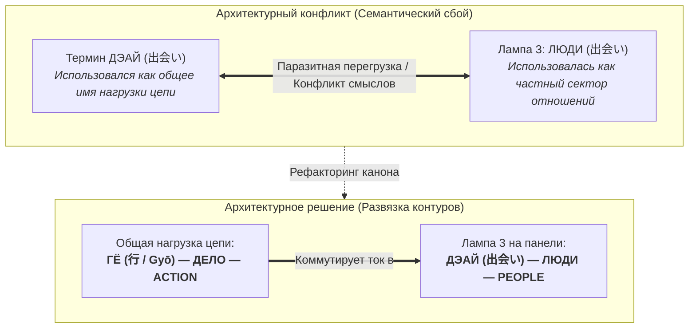
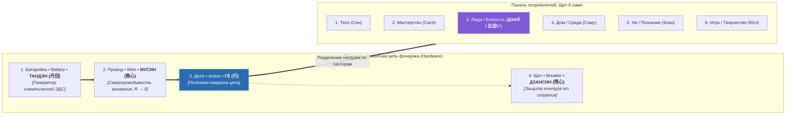

# Inner Current: 146. Схемотехника фонарика и согласование лада — Триада нагрузки «Дело — Action — Гё (行)» и отвязка Дэай в реляционный сектор

> «Когда инженерная физика спорит с монастырской лирикой, в схеме возникает паразитный шум. Чтобы цепь зазвучала безупречно, все три языка — русский, английский и дзен — должны быть настроены в абсолютно единый прикладной лад прямого действия.»  
> — **Владимир Аньянов**

---

> [!abstract] Квинтэссенция
> Настоящая статья устраняет критический архитектурный дефект терминологического наложения в общей схеме карманного фонарика:
> 
> 1. **Анатомия сбоя лада:** Триада *«Дело — Load — Томё»* содержала стилистический разнобой (бытовой язык спорил со строгой схемотехникой и храмовой поэзией лампады). Одновременно перегрузка термина *Дэай (出会い)* общей нагрузкой цепи создавала паразитный конфликт с 3-й лампой (*Люди / Близость*).
> 2. **Единый лад прямого действия:** Для 3-го узла фонарика (полезной нагрузки цепи) канонизирована строгая триада в едином регистре:
>    $$\mathbf{\text{ДЕЛО (Действие)}} \quad \longleftrightarrow \quad \mathbf{\text{ACTION (Work)}} \quad \longleftrightarrow \quad \mathbf{\text{ГЁ (行 / Gyō)}}$$
> 3. **Отвязка термина Дэай:** Понятие **Дэай (出会い)** окончательно освобождено от роли общей нагрузки и закреплено строго за своим естественным местом — **3-й лампой реляционного контура (Люди / Близость / Прямая встреча проводников)**.
> 4. **Итоговая 4-элементная схемотехника фонарика:**
>    - 1. Батарейка • Battery • **ТАНДЭН (丹田)** — генератор ЭДС
>    - 2. Провод • Wire • **МУСИН (無心)** — сверхпроводимость ($R \to 0$)
>    - 3. Дело • Action • **ГЁ (行)** — полезная нагрузка формы
>    - 4. Щит • Breaker • **ДЗАНСИН (残心)** — стабилизация и предохранитель

---

## 1. Проблема рассогласования регистров (Сбой лада)

В первичных формулировках фонарика возникало скрытое семантическое трение. Попытка связать:
* **Дело** (русский бытовой язык)
* **Load** (строгий электротехнический термин)
* **Томё (燈明)** (японский ритуально-поэтический образ храмовой лампады)

...приводила к нарушению однородности. Физика цепей спорила с монастырской лирикой, и триада не звучала «на один лад».

### Архитектурный баг: Двойная перегрузка термина Дэай
В качестве альтернативы для лампы фонарика предлагался дзенский термин **Дэай (出会い / момент прямого контакта)**. Но здесь возникала ещё более грубая ошибка:
* Дэай перегружался двойной ролью: и как общее название нагрузки всей цепи, и как 3-я лампа («Люди / Близость / Отношения»).
* Получалось, что любое действие (мытьё пола, решение уравнений, приседания со штангой) называлось словом «Встреча», что стирало специфику межличностного реляционного сектора.

---

## 2. Каноническая триада в ладе прямого действия

Чтобы устранить стилистический разнобой и конфликт терминов, узел общей нагрузки цепи фонарика переведён в единый **лад прямого прикладного действия**:

$$\begin{aligned}
\text{Русский язык:} & \quad \mathbf{\text{ДЕЛО}} \quad (\text{или } \mathbf{\text{ДЕЙСТВИЕ}}) \\
\text{English:} & \quad \mathbf{\text{ACTION}} \quad (\text{или } \mathbf{\text{WORK}}) \\
\text{Дзен-канон:} & \quad \mathbf{\text{ГЁ (行 / Gyō)}}
\end{aligned}$$

### Почему «ГЁ (行)» безупречно решает задачу:
1. **Фундаментальный корень воплощения:** Гё (行) в дзэн означает «практическое действие», «деяние в материи», «прямое осуществление».
2. **Преодоление созерцательного паралича:** В учении Догэна и буддизме Махаяны внутренний покой ума существует не ради пассивного сидения на подушке, а ради **Гё** — перехода соматического импульса в осязаемый факт материального мира здесь и сейчас.
3. **Строгая синонимичность:** Корень «Гё» краток, ёмок и абсолютно параллелен русскому «Делу / Действию» и английскому «Action / Work».
4. **Овеществлённая форма (Ката):** Если нагрузка рассматривается как конкретная форма сопротивления материи (строки кода, глиняный кувшин, удар меча), дзенским эквивалентом выступает **Ката (型)** — геометрия формы, принимающая в себя импульс и превращающая его в свет без рассеяния в пустоту.

---

## 3. Согласованная схемотехника карманного фонарика

После устранения конфликта общая схемотехника человека обретает предельную инженерную стройность:

### Сводная таблица биекции узлов фонарика:

| Узел цепи | Русский | English | Дзен-канон | Физическая и онтологическая роль |
|---|---|---|---|---|
| **Узел 1** | **Батарейка** | Battery | **ТАНДЭН (丹田)** | Автономный источник соматической энергии и давления ($\mathcal{E} > 0$). |
| **Узел 2** | **Провод** | Wire | **МУСИН (無心)** | Канал чистого внимания; сверхпроводимость без омического сопротивления эго ($R \to 0$). |
| **Узел 3** | **Дело (Действие)** | Action (Work) | **ГЁ (行)** | Полезная нагрузка цепи; точка совершения полезной работы в контакте с реальностью. |
| **Узел 4** | **Щит** | Breaker (Shield) | **ДЗАНСИН (残心)** | Предохранитель цепи; непрерывная бдительность и устойчивость к пиковым перегрузкам. |

---

## 4. Развязка: Дэай остаётся в секторе Отношений

С освобождением термина **Гё (行)** для общего обозначения нагрузки цепи, термин **Дэай (出会い)** занял своё безупречное, единственно верное место:

* **Дэай** — это не абстрактная лампочка фонарика вообще.
* **Дэай** — это **3-я лампа нагрузки: Люди / Близость / Отношения**.
* В кэндо, айкидо и чайной церемонии *Дэай* — это священный момент встречи двух клинков, двух взглядов или двух проводников «здесь и сейчас». Это замыкание двух суверенных генераторов без защитных экранов эго.

### Итог рефакторинга
Архитектурная путаница снята навсегда:
* Когда мы говорим об **общей цепи фонарика**, мы говорим: **«Тандэн $\to$ Мусин $\to$ Гё $\to$ Дзансин»** (Батарейка $\to$ Провод $\to$ Дело $\to$ Щит).
* Когда мы включаем переключатель на **панели потребителей**, ток **Гё** направляется в одну из 6 ламп, и в секторе близости он зажигает священный контакт **Дэай**.

---

## 🔗 Связи
- [[02_Wiki/Inner Current (The Shield of Six Lamps — Exhaustive Basis of Load and the Kanso Canon)|142. Щит из шести ламп бытия: Исчерпывающий базис нагрузки]]
- [[02_Wiki/Inner Current (The Dual-Cable Architecture — Western Functional UI vs Zen Ontological Kernel)|143. Архитектура сдвоенного кабеля: Западный UI vs Дзенское ядро]]
- [[02_Wiki/Inner Current (The Flashlight Model of Man — Optical-Electrodynamic Ontology of Consciousness, The Light Source vs Illuminated Object and the Law of the Direct Beam)|83. Модель Человека как Карманного Фонарика]]
- [[04_Maps/Inner Current MOC|Inner Current MOC]]
- [[index|Главный индекс LLM Wiki]]

---
*Created: 2026-09-30 | Maintained by Antigravity*
