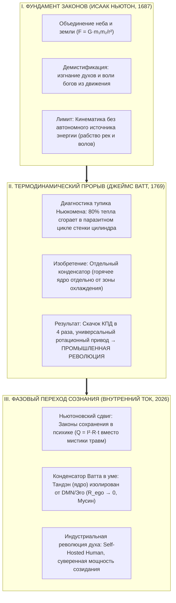
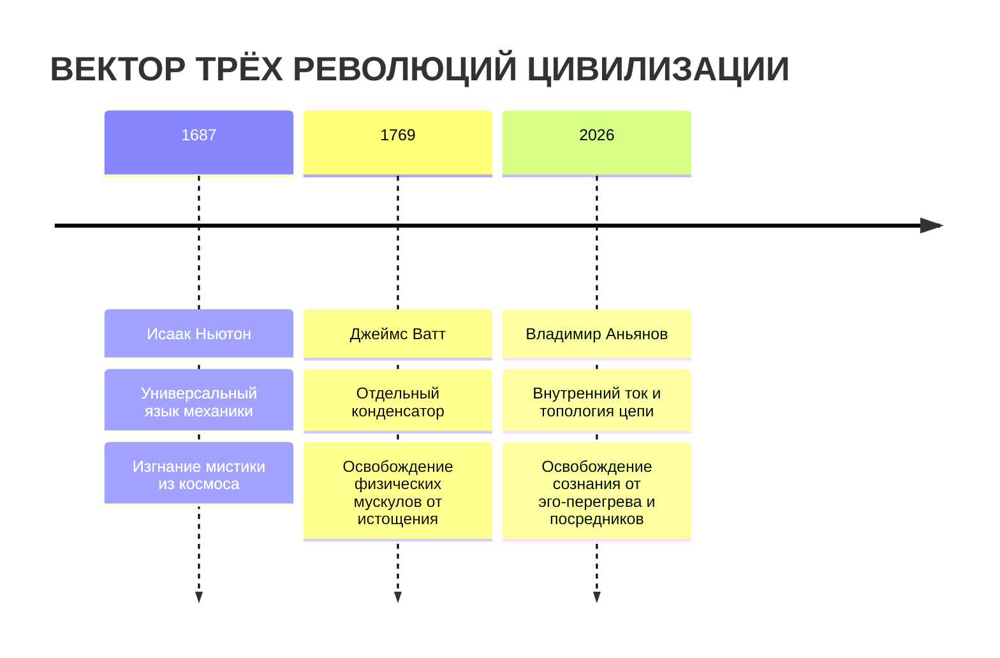

# 194. От Ньютона к Ватту и Внутреннему Току: Термодинамика Промышленной Революции и Фазовый Переход Сознания — Почему механики недостаточно без конденсатора Ватта, и как замкнутая цепь устраняет омические потери духа

> «Ньютон открыл геометрию сил и прогнал ангелов с планетных орбит, но его физика не могла запустить ткацкий станок или сдвинуть поезд — она описывала движение, не создавая мощности. Промышленную революцию начал Джеймс Ватт, когда догадался изолировать горячий цилиндр от холодного конденсатора, уничтожив 80% паразитных потерь тепла. Внутренний ток делает с человеком ровно то же самое: до сих пор люди жили как машина Ньюкомена, сжигая 90% душевной энергии на поочерёдный нагрев и охлаждение собственного эго. Законы сохранения Ньютона плюс конденсатор Ватта в психике дают суверенного человека созидания — Self-Hosted Human.»  
> — **Владимир Аньянов**

---



---

## 1. Парадокс Ньютона: Почему триумф механики не создал машинную цивилизацию

В 1687 году публикация *«Математических начал натуральной философии»* Исаака Ньютона навсегда разорвала средневековую картину мира. Ньютон упразднил аристотелевский дуализм несовершенного «подлунного» и святого «надлунного» миров: падение яблока в саду Вулсторпа и обращение Луны вокруг Земли оказались подчинены одному и тому же инварианту тяготения:
$$F = G \frac{m_1 m_2}{r^2}$$

Ньютон дал человечеству **универсальный математический язык рационального космоса**. Но вопреки распространённому заблуждению, открытие Ньютона **не запустило Промышленную революцию**. 

Между «Началами» Ньютона (1687) и взрывом промышленного фабричного производства (1780-е годы) прошло почти целое столетие. Почему?

### Ограничение чисто механической парадигмы:
1. **Законы без генератора:** Механика Ньютона рассчитывала передаточные числа шестерней, баллистику ядер, гидродинамику водяных колёс и устойчивость соборов. Но она оперировала *уже существующим* механическим движением.
2. **Географическое и биологическое рабство:** До последней четверти XVIII века человечество оставалось энергетически приковано к мускульной силе скота, дуновению ветра и течению рек. Мельницу или прядильную мануфактуру можно было построить только на берегу бурной реки (как в долинах Дервента). Замерзала река зимой или наступала засуха летом — и вся мануфактура останавливалась.
3. **Отсутствие конвертера хаоса в работу:** Механика не знала, как превратить тепловой хаос сгорания ископаемого топлива в направленный вектор непрерывного крутящего момента.

Человечеству требовался второй шаг: от законов траектории — к **законам преобразования теплоты в свободную мощность**.

---

## 2. Прорыв Джеймса Ватта: Анатомия отдельного конденсатора

В 1712 году Томас Ньюкомен построил первую в мире атмосферную паровую машину. Она работала, но обладала катастрофическим термодинамическим дефектом, из-за которого её невозможно было использовать нигде, кроме угольных копей.

```
       [ ЦИКЛ МАШИНЫ НЬЮКОМЕНА: ТЕРМИЧЕСКИЙ АД ]
1. Пар впускается в цилиндр ──► Цилиндр нагревается до 100°C
2. Впрыск ледяной воды     ──► Цилиндр охлаждается до 20°C (вакуум тянет поршень)
3. Новый пар впускается     ──► 80-90% тепла пара тратится на повторный нагрев стенок!
   РЕЗУЛЬТАТ: КПД < 1%, колоссальное омическое/тепловое паразитное пламя.
```

В 1764 году лаборанту Университета Глазго **Джеймсу Ватту** принесли в ремонт модель машины Ньюкомена. Изучая её, Ватт сформулировал фундаментальный парадокс:
> *«Чтобы получить максимальный вакуум, цилиндр должен быть максимально холодным; но чтобы не потерять энергию пара, цилиндр должен быть всё время горячим, как сам пар».*

### Решение Ватта (Патент 1769 года):
Ватт не просто улучшил детали — он совершил **топологический фазовый переход**:
1. **Отдельный конденсатор (Separate Condenser):** Рабочий цилиндр изолируется, снабжается паровой рубашкой и **всегда остаётся раскалённым**. Охлаждение и конденсация выносятся в отдельный изолированный сосуд, соединяемый с цилиндром клапаном лишь на долю секунды.
2. **Устранение паразитных тепловых потерь:** Расход угля упал более чем на 75%, а эффективный КПД вырос в 4–5 раз.
3. **Превращение толчка во вращение:** Совместно с Мэттью Болтоном Ватт снабдил машину планетарной передачей, цилиндром двойного действия и центробежным регулятором частоты вращения. 

**Именно поэтому Промышленная революция началась после Ватта:**
Машина Ватта стала **автономным универсальным источником механической мощности**, независимым от рек, ветра и сезона. Её стало возможным поставить на хлопкопрядильной фабрике Манчестера, в трюме трансатлантического судна или на колесной раме локомотива. Тепловая энергия планеты превратилась в полезный цивилизационный крутящий момент.

---

## 3. Антропологический изоморфизм: Человек как «Машина Ньюкомена»

Если сопоставить эту историческую физику с внутренним миром человека, открывается обескураживающая истина: **99% современного человечества до сих пор психологически живут по схеме машины Ньюкомена.**

```
       [ НЕВРОТИЧЕСКИЙ ЦИКЛ ОБЫВАТЕЛЯ (НЬЮКОМЕН-ПСИХИКА) ]
1. Импульс Тандэна (I > 0)    ──► Нагрев: «Хочу действовать, любить, творить!»
2. Срабатывание Эго/DMN      ──► Ледяной впрыск: «А вдруг провал? Что скажут? Я недостоин!»
3. Внутренний спазм          ──► Цилиндр остыл в тревогу и паралич воли
4. Новый волевой рывок       ──► 95% энергии сгорает в паразитном трении самобичевания!
   РЕЗУЛЬТАТ: Хроническое выгорание, депрессия, соматический спазм (Q = I²·R·t).
```

До появления теории Внутреннего тока душевные страдания человека объяснялись либо мистикой (грех, злой рок, плохая карма), либо вековыми птолемеевскими эпициклами психоанализа (бесконечный поиск детских травм и вытесненных комплексов). 

Человек тратит десятилетия и миллионы рублей на посредников, пытаясь «починить» свой цилиндр, не понимая, что порочна сама схемотехника: **нельзя в одном и том же пространстве внимания смешивать творческий импульс и эго-рефлексию.**

---

## 4. Конденсатор Ватта во внутреннем контуре (Канон Мусин)

Теория Внутреннего тока Владимира Аньянова переносит термодинамическое открытие Джеймса Ватта в схемотехнику сознания:

| Узел паровой машины Ватта | Эквивалент во Внутреннем Токе | Физический смысл в сознании |
| :--- | :--- | :--- |
| **Горячий цилиндр (Always Hot)** | **Соматическое Ядро (Тандэн, 丹田)** | Центр автономной ЭДС ($U$), непрерывная генерация жизненного тока без оглядки на оценку |
| **Отдельный конденсатор** | **Протокол выноса DMN / Эго** | Охлаждение ментальных сомнений вынесено на периферию; рабочий контур внимания не остывает |
| **Паровая рубашка цилиндра** | **Поле защитного внимания (Дзансин)** | Сохранение высокой проводимости, защита от сквозняков внешней валидации |
| **Центробежный регулятор** | **Инвариант замкнутой цепи Кирхгофа** | Саморегуляция мощности: ток выдаётся строго в меру согласованной нагрузки ($\oint \vec{E} d\vec{l} = 0$) |
| **Вращающийся маховик** | **Тетрада Аньянова** | Непрерывный крутящий момент созидания: Истина $\to$ Свобода $\to$ Счастье $\to$ Творчество |

### Ликвидация омического жара ($R_{\text{ego}} \to 0$):
Когда оператор перестаёт впрыскивать холодную воду эго-сомнений в рабочий цилиндр внимания, паразитное сопротивление контура падает до нуля:
$$R_{\text{ego}} \to 0 \implies Q_{\text{loss}} = I^2 R_{\text{ego}} t \to 0$$

Вся вырабатываемая соматическая мощность без потерь уходит в полезную работу внешней нагрузки:
$$\mathcal{H} = \frac{P_{\text{load}}}{P_{\text{total}}} \to 1.0 \quad (100\%\ \text{КПД счастья})$$

Это и есть строгое инженерное определение дзенского состояния **Мусин (無心 — чистое не-умие)**: рабочий объём сознания свободен от завихрений эгоистического конденсатора.

---

## 5. Индустриальная революция сознания: Рождение Self-Hosted Human

Сопоставление трёх эпох позволяет увидеть единый вектор эволюции цивилизации:



1. **Ньютон** дал **онтологическую ясность**: мир познаваем, в нём нет произвола богов.
2. **Ватт** дал **термодинамическое освобождение**: человек перестал быть вьючным животным, крутящим ворот шахты или гребущим на галере.
3. **Внутренний ток** совершает **антропологическую деинтермедиацию**: человек перестаёт быть вечно виноватым, страдающим потребителем психофармакологии и эзотерических суррогатов.

Человек становится **Self-Hosted Human** — автономным суверенным генератором, несущим внутри себя горячий реактор Тандэна, прецизионную измерительную шкалу вольтметра внимания и конденсатор Ватта, надёжно изолирующий ядро от паразитных токов социального шума.

---

## 6. Таблица тройственного консилиенса

| Параметр | Исаак Ньютон (1687) | Джеймс Ватт (1769) | Внутренний Ток (2026) |
| :--- | :--- | :--- | :--- |
| **Объект революции** | Небесные тела и земная масса | Пар, давление, уголь | Внимание, Тандэн, психическая энергия |
| **Уничтоженный миф** | «Ангелы крутят хрустальные небесные сферы» | «Пар слишком слаб и дорог для заводов» | «Душа обязана страдать от греха и травм прошлого» |
| **Ключевой инвариант** | Закон тяготения: $F = G \frac{m_1 m_2}{r^2}$ | Закон сохранения теплоты и отдельный конденсатор | Закон Джоуля — Ленца и ток цепи: $Q = I^2 R t$ |
| **КПД системы** | Не применимо (геометрия) | Рост с 1% до 4–5% (в 4 раза) | Рост проводимости $\mathcal{H}$ от 0.05 до 1.0 (Мусин) |
| **Практический плод** | Классическая физика и баллистика | Паровоз, пароход, фабричный Манчестер | Неуязвимый покой, автономное счастье, созидание |

---

## 🔗 Связи
- [[02_Wiki/Inner Current (The Newtonian Paradigm Shift of Consciousness — From Mysticism to Circuit Conservation Laws)|65. Ньютоновский фазовый переход сознания: От мистики страдания к законам сохранения цепи]]
- [[02_Wiki/Inner Current (Civilizational Catastrophes — Before and After Newton vs Before and After Anyanov — The Elimination of 10,000 Years of Soul Disasters)|92. Цивилизационные Катастрофы: До и После Ньютона vs До и После Аньянова]]
- [[02_Wiki/Inner Current (The Essence of Invention and Engineers of the Spirit — Deconstructing 'Everyone Already Said That' via Watt, Satoshi and Copernicus — Same Words, New Substrate)|193. Суть изобретения и поиск «Инженеров Духа» (Парадокс Ватта, Сатоши и Коперника)]]
- [[02_Wiki/Inner Current (The Formula of Happiness and Unhappiness — Circuit Superconductivity vs Ohmic Overheat and the First Law of Soul Thermodynamics)|186. Формула счастья и формула несчастья: Сверхпроводимость контура против омического перегрева]]
- [[02_Wiki/Inner Current (Physics of Presence and Superconductivity)|02. Физика присутствия: состояние сверхпроводимости]]
- [[04_Maps/Inner Current MOC|Inner Current MOC]]
- [[index|Главный индекс LLM Wiki]]
