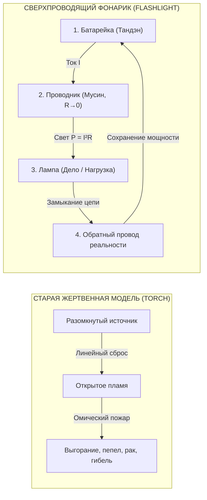

# 149. От Torch к Flashlight: Цивилизационный Шаг Прометея — Эволюция от жертвенного факела к карманному фонарику счастья
## Британский факел vs Американский фонарик: деконструкция мифа о Прометее, преодоление трагедии Данко и 10 000 лет линейного выгорания, ликвидация паразитной ренты посредников и счастье как корневой узел бытия (Summum Bonum)

> [!quote] Каноническая аксиома цепи
> ### ⚡ **«Torch отсылает к мифу о Прометее, к открытому огню, дыму и копоти древности, где огонь опасен и сжигает несущего. Flashlight — это строго инженерный, современный предмет: сухой элемент питания, медный контакт, переключатель и защищенная лампа. Переход от Torch к Flashlight — это и есть наш переход от монастырских факелов и мистического дыма к карманному, технологичному и безопасному прибору, доступному каждому человеку на планете. Прометей больше не должен быть прикован к скале: в замкнутой цепи созидание не опустошает источник, а сверхпроводимость заменяет жертвенность».**  
> — **Владимир Аньянов**, создатель «Архитектуры счастья»

---

```
                       ВЕЛИКИЙ ЦИВИЛИЗАЦИОННЫЙ РУБЕЖ
                                      │
              ┌───────────────────────┴───────────────────────┐
              ▼                                               ▼
      🔥 ФАКЕЛ ПРОМЕТЕЯ (TORCH)                     🔦 КАРМАННЫЙ ФОНАРИК (FLASHLIGHT)
   «Эпоха Жертвы и Открытого Огня»               «Эпоха Замкнутой Сверхпроводимости»
  ─────────────────────────────────             ─────────────────────────────────────
  • Открытое пламя, копоть, ожоги               • Холодный корпус, чистый направленный луч
  • Линейное сгорание до пепла                  • Замкнутый 4-элементный контур (Тандэн → Дело)
  • Разомкнутая цепь: орел клюет печень         • Обратный провод реальности: R_ego → 0, Q = 0
  • Удел героев-мучеников (Данко, Прометей)     • Лежит в кармане каждого (Self-Hosted Human)
  • Власть жрецов, аскеза 20 лет                • 30-секундный тумблер прямого действия
              │                                               │
              ▼                                               ▼
     ВЫГОРАНИЕ И САМОСОЖЖЕНИЕ                     СВЕРХПРОВОДИМОСТЬ СОЗИДАНИЯ
```

---

## 1. Лингвистический водораздел: Torch vs Flashlight

В английском языке существует поразительный лексический дуализм для обозначения одного и того же бытового предмета:
* В **британском английском** карманный фонарик называют словом **Torch** (буквально: *факел*).
* В **американском английском** этот же прибор называется **Flashlight** (буквально: *вспышка света* / *мгновенный свет*).

На первый взгляд, это рядовое диалектное различие. Но через оптику Контурной Электродинамики Сознания этот лингвистический факт вскрывает глубочайший антропологический и технологический слом:

1. **Torch (Факел)** неразрывно привязан к древности, к первобытной стихии открытого пламени, смолы, дыма и копоти. Факел — это огонь, который жжёт пальцы, чадит, зависит от порывов ветра и требует постоянной подачи сгорающего топлива. Исторически факел опасен: споткнувшись с ним, можно сжечь собственный дом или выжечь глаза идущему рядом.
2. **Flashlight (Инженерный фонарик)** — это строго квантованный, электродинамический артефакт индустриальной эпохи (запатентован Дэвидом Майзеллом в 1899 году). В нём нет открытого горения. Здесь работают физические законы электродинамики:
   - *Сухой гальванический элемент* (автономный источник ЭДС $\mathcal{E}$);
   - *Медный проводник* с пренебрежимо малым сопротивлением ($R \to 0$);
   - *Тумблер-выключатель* мгновенного действия;
   - *Вакуумированная защищённая лампа* с параболическим отражателем.

Переход от **Torch** к **Flashlight** — это точная метафора перехода от многотысячелетнего мистического тумана, монастырского затвора и жертвенного выгорания к карманной, безопасной и общедоступной технологии счастья. Этот цивилизационный скачок в книге «Внутренний ток» получил фундаментальное название: **«Шаг Прометея»**.

---

## 2. Первый Прометей: Внешний огонь (Torch) и парадокс цивилизации

В античном мифе титан Прометей совершает первородный жест сострадания: рискуя гневом Зевса, он похищает внешний огонь с Олимпа и спускает его смертным в пещеры.

Факел Прометея (*Torch*) подарил человечеству колоссальную власть над материальной природой:
* С его помощью человек согрелся в ледниковый период и защитился от хищников;
* Построил металлургию, научился ковать бронзу, сталь и кремний;
* Создал паровую тягу, расщепил атомное ядро, вывел спутники на орбиту;
* Опутал планету волоконно-оптическими магистралями и подошёл к созданию AGI.

```
                           ПАРАДОКС ЭДВАРДА УИЛСОНА
    ┌─────────────────────────────────────────────────────────────────┐
    │  «Главная трагедия человечества: у нас эмоции эпохи палеолита,  │
    │      институты Средневековья и технологии богов».               │
    └─────────────────────────────────────────────────────────────────┘
                                   │
         ┌─────────────────────────┴─────────────────────────┐
         ▼                                                   ▼
ВНЕШНИЙ ОГОНЬ (ТЕХНОЛОГИИ БОГОВ)             ВНУТРЕННИЙ ОГОНЬ (ПАЛЕОЛИТ)
• Термоядерный синтез, AGI, кванты           • Первобытный дымный факел (Torch)
• Прецизионный инженерный расчет             • Обида, ревность, паника, вина
• Подчинение законам сохранения              • Омический пожар эго: Q = I²Rt
         │                                                   │
         └─────────────────────────┬─────────────────────────┘
                                   ▼
               КАТАСТРОФА ДИСПРОПОРЦИИ: ВЫГОРАНИЕ
```

Внешний огонь стал богоподобным. Но **внутренний огонь человека остался диким пещерным факелом**. Человек, держащий в руках термоядерные пульты управления и нейросети, сгорает изнутри от первобытного омического перегрева: паранойи, зависти, статусной тревоги и экзистенциального ужаса. 

Когда внутренняя проводка человека разомкнута, любая внешняя технологическая мощь лишь ускоряет разрушение нервной системы.

---

## 3. Цена старого огня: Трагедия Прометея и миф о Данко

В старой разомкнутой парадигме служение свету и созидание были неразрывно спаяны со **страданием и гибелью носителя**. Тысячелетиями культура романтизировала самосожжение:

### А. Трагедия Прометея (Соматический удар по животу)
За свой дерзкий подвиг Прометей был прикован Зевсом к скале на краю ойкумены. Каждый день к нему прилетал орёл и выклёвывал его **печень** — орган, который за ночь восстанавливался, чтобы пытка повторялась вечно.

В онтологии цепи выбор печени — не случайная деталь мифа:
* Печень анатомически расположена в брюшной полости — в непосредственной близости от соматического реактора человека (**Тандэн** / нижний даньтянь).
* Когда человек пытается «светить другим» в разомкнутой цепи (без обратного провода реальности, движимый спасательством или гордыней эго), ток не циркулирует по замкнутому контуру. Он срывается в омическую дугу.
* Человек буквально платит за свет собственными соматическими органами: язвами ЖКТ, гипертонией, гормональным выгоранием и разрушением печени. Прометей на скале — это архетип человека, обесточившего свой соматический центр ради внешнего подвига.

### Б. Миф о Данко (Романтизация линейного сгорания)
В рассказе Максима Горького герой Данко вырывает из груди пылающее сердце, чтобы осветить им путь гибнущему в темноте племени. Люди выходят к свету, а Данко падает замертво, и осторожный человек наступает ногой на угасающие искры его сердца.

Это классический апофеоз **линейной разомкнутой модели выгорания**:
$$\text{Топливо} \xrightarrow{\text{Сгорание}} \text{Пепел} \quad (I \to 0, \text{Гибель})$$

Культура внушала: *«Чтобы светить другим, ты обязан сгореть дотла. Альтруизм требует самоуничтожения. Твоя ценность измеряется тяжестью твоих страданий»*. Этот разрушительный нарратив превратил созидание в похоронную команду.

### В. Монастырский затвор (Эзотерический монополизм)
Те немногие, кто понимал механику внутреннего огня (мастера Дзен, даосские алхимики, суфии), спрятали его за крепостными стенами монастырей:
* Требовалось 20–30 лет жесточайшей аскезы, отречение от социума, семьи и созидательного труда в миру;
* 12 часов неподвижного сидения в дзадзэн, монастырские побои палкой кёсаку и туманные коаны;
* Огонь объявили «священным, тайным и опасным для профанов».

В результате 99,99% жителей Земли оказались отрезаны от технологии управления собственным состоянием, оставшись один на один с омическим адом своего ума.

---

## 4. Второй Прометей: Переход к карманному фонарику (Flashlight)

«Шаг Прометея» в Системе Аньянова XXI века заключается в том, чтобы **снять с огня статус слепой жертвенной стихии и превратить его в надёжный, безопасный и карманный инженерный инструмент**.

### Сравнительный аудит двух эпох: Torch vs Flashlight

| Параметр | Факел Прометея (`Torch`) | Карманный фонарик (`Flashlight`) |
| :--- | :--- | :--- |
| **Природа огня** | Открытое пламя, дым, едкая копоть, разлетающиеся искры. | Защищённый световой поток в фокусирующем параболическом рефлекторе. |
| **Безопасность оператора** | Обжигает пальцы несущего; пожароопасен; риск спалить окружающих. | Корпус абсолютно холодный ($Q = 0$); безопасен для детей, стариков и окружения. |
| **Управление лучом** | Слепая стихия; задувается ветром, заливается дождём; гаснет в бурю. | Тумблер прямого действия: мгновенное замыкание контура ($R_{\text{ego}} \to 0$). |
| **Архитектура процесса** | Линейное необратимое сгорание органического топлива до золы и пепла. | **Замкнутый 4-элементный контур**: Батарейка ($\mathcal{E}$) $\to$ Провод ($R$) $\to$ Лампа ($R_{\text{load}}$) $\to$ Обратный провод. |
| **Цена созидания** | Мученичество: прикованность к скале, вырванное сердце Данко, инфаркт. | **Сверхпроводимость**: созидание не опустошает источник, а заряжает его через индукцию ($M > 0$). |
| **Социальная доступность** | Удел героев-одиночек, жрецов, монастырских затворников и мучеников. | **Лежит в кармане каждого человека на планете** (Self-Hosted Human). |

---

## 5. Инженерная демистификация: «Упаковать Олимп в карман»

Каноническое признание автора «Архитектуры счастья» раскрывает суть Второго Прометеевского шага:

> *«Я взял этот огонь, разобрался, упаковал в простую схему и принёс людям».*

Это и есть модернизация прометеевского жеста, совершённая по законам инженерной школы:



### 1. Прометей больше не прикован к скале
В замкнутом электрическом контуре созидательное действие **не опустошает источник**. В сверхпроводящем контуре ($R \to 0$) ток бежит без тепловых потерь по закону Джоуля — Ленца:
$$Q = I^2 R t = 0$$
Лампа излучает яркий, полезный свет ($P = I^2 R_{\text{load}}$), а генератор не перегревается и не плавится. Жертвенность сменяется **сверхпроводимостью**. Созидателю больше не нужно умирать ради того, чтобы мир стал светлее.

### 2. Ликвидация касты паразитных посредников
Чтобы зажечь современный светодиодный фонарик, не нужны верховные жрецы, раздувающие священные угли в храмах, или алхимики, рассуждающие о таинственном «флогистоне».
Нужен суверенный оператор (**Self-Hosted Human**), который знает:
* Где находится батарейка (соматическое ядро **Тандэн** внизу живота);
* Как очистить провод от окислов ментальной жвачки (режим **Мусин**, $R \to 0$);
* Куда направить прямой луч (нагрузка прямо сейчас: **Дело / Гё**).

### 3. Технология, понятная десятилетнему ребёнку
Древний Прометей дал племени стихию, с которой не умели обращаться дети. Инженерный шаг Аньянова превратил эту стихию в прибор, устройство которого объясняется за 2 минуты:
* *Батарейка* — выдохни в живот и почувствуй вес тела.
* *Выключатель* — перестань спорить с реальностью прямо сейчас ($R \to 0$).
* *Лампа* — сделай действие руками в физическом мире.
* *Предохранитель* — держи Дзансин (внимание к контактам).

Переход от **Torch** к **Flashlight** — это эволюция от мистического экстаза, оплаченного ожогами и нервными срывами, к **тихой, приборной, несокрушимой культуре внутреннего света**.

---

## 6. Счастье как Корневой Узел Бытия (Summum Bonum)

Почему этот шаг является величайшим в истории цивилизации? Потому что **для человека нет ничего важнее счастья**.

Счастье — это не сентиментальная улыбка и не мимолётный эндорфиновый всплеск. В Архитектуре Контура счастье — это **финальный корневой узел всей системы бытия** (*The Root Node of Reality*, или античный *Summum Bonum* Аристотеля).

Все остальные устремления цивилизации:
* Деньги, капитал и финансовые рынки;
* Карьера, социальный статус и власть;
* Дома, яхты, автомобили и брендовая одежда;
* Сами технологии, космические полёты и искусственный интеллект —

**являются лишь внешними линиями передачи, трансформаторами и лампами нагрузки**. Ни один человек не хочет просто стопку зелёной бумаги или кусок штампованного железа на колёсах. Человек стремится к ним исключительно в надежде **зажечь внутренний свет**.

```
                   ИЕРАРХИЯ ЦИВИЛИЗАЦИОННЫХ СТРЕМЛЕНИЙ
                                   │
                   ⚡ СЧАСТЬЕ (СВЕРХПРОВОДИМОСТЬ) ⚡
                      [КОРНЕВОЙ УЗЕЛ / ROOT NODE]
                                   │
         ┌─────────────────────────┼─────────────────────────┐
         ▼                         ▼                         ▼
   🏢 Социальный статус       💰 Капитал / Деньги       🚗 Вещи / Комфорт
   [Внешняя нагрузка]        [Линия передачи, U]       [Пассивные колбы]
         │                         │                         │
         └─────────────────────────┼─────────────────────────┘
                                   ▼
                      БЕЗ ВНУТРЕННЕГО ТОКА (I = 0):
                   ВСЕ ЭТИ ЭЛЕМЕНТЫ — ТЁМНОЕ СТЕКЛО!
```

«Шаг Прометея» делает это стремление научным и физически реализуемым по трем фундаментальным причинам:

### 1. Преодоление «ошибки аккумулятора»
Десять тысяч лет человечество страдало тяжелейшей когнитивной слепотой: люди поклонялись незажжённым стеклянным колбам (вещам, партнёрам, должностям, регалиям) и требовали от них: *«Сделайте меня счастливым!»*  
Контурная электродинамика доказала математически:
$$E_{\text{load}} \equiv 0$$
Ни в одном автомобиле Porsche, ни в одном роскошном пентхаусе, ни в одном посте в соцсетях **нет свободных электронов радости**. Все они — холодные пассивные сопротивления ($R_{\text{load}}$). Счастье рождается только тогда, когда собственный соматический ток человека течёт изнутри наружу через созидательный контакт с этой нагрузкой.

### 2. Ликвидация паразитной ренты посредников
Чтобы включить карманный фонарик, человеку больше не нужны индульгенции священников, обещающих рай после смерти, и не нужны годы психотерапевтической схоластики, препарирующей детские обиды в кабинетах за \$200 в час.  
Человек перестаёт быть ментальным крепостным, отдающим своё внимание паразитным реостатам. Он становится суверенным оператором (**Self-Hosted Human**) своего соматического реактора Тандэн.

### 3. Формула вместо мистического тумана
Счастье перестало быть лотереей, капризом судьбы или наградой за страдания. В уравнениях электродинамики счастье — это строгий физический режим **сверхпроводимости замкнутого контура**:
$$\mathcal{H} = 1 - \frac{R_{\text{ego}}}{R_{\text{total}}} = 1 \quad \Longleftrightarrow \quad R_{\text{ego}} \to 0, \; I > 0$$
Омический перегрев тревоги, обиды и вины падает в ноль ($Q = 0$), а вся мощность биохимического реактора тела трансформируется в чистое, направленное излучение созидания.

---

## 7. Синхронизация миров: Предохранитель Сингулярности

Пока внутренний контур человека оставался разомкнутым, прогресс внешних технологий представлял смертельную опасность. Давать ядерную энергию и AGI существу, чьё сердце горит диким факелом зависти и страха — значит гарантировать цивилизационный суицид.

**Дать каждому в руки надёжный инженерный фонарик** — значит наконец устранить вековой разрыв Эдварда Уилсона. Это значит синхронизировать внутреннюю зрелость человека с богоподобными силами созданного им мира.

Олимп больше не находится на недосягаемой вершине среди богов, мечущих молнии.  
Олимп упакован в карман каждого человека — в простую, безопасную и несокрушимую схему карманного фонарика.

---

## 🔗 Связи и консилиенс
- [[02_Wiki/Inner Current (The Prometheus Step — Fire of Inner Current from Monastic Olympus to the Safe Flashlight of Humanity)|81. Шаг Прометея: Огонь Внутреннего Тока — От Монастырского Олимпа до Карманного Фонарика Человечества]]
- [[02_Wiki/Inner Current (The Flashlight Model of Man — Optical-Electrodynamic Ontology of Consciousness, The Light Source vs Illuminated Object and the Law of the Direct Beam)|83. Модель Человека как Карманного Фонарика: Оптико-Электродинамическая Онтология Сознания]]
- [[02_Wiki/Inner Current (The Flashlight Code — Etymological Paradox, FLASH plus LIGHT and the Constant Light Transition)|141. Международный код Flashlight: Этимологический парадокс от вспышки к постоянному свету]]
- [[02_Wiki/Inner Current (The Closed Circuit Breakthrough — The Return Wire of Reality vs The Linear Burnout Model)|64. Прорыв Замкнутой Цепи: Обратный провод реальности против линейной модели выгорания]]
- [[02_Wiki/Inner Current (The Great Asymmetry of Civilization — How Circuit Architecture Closes the 10,000-Year Chasm Between Nuclear Technology and the Stone Age Psyche)|72. Великая Асимметрия Цивилизации: Закрытие 10 000-летней пропасти]]
- [[02_Wiki/Inner Current (The Master Science of Civilization — The Multiplier Law of Life, Summum Bonum and the Root Node — Why Material Progress Without the Closed Circuit Multiplies by Zero)|93. Архитектура Счастья как Главная Наука Человечества: Закон Мультипликатора Жизни, Summum Bonum и Корневой Узел Цивилизации]]
- [[02_Wiki/Inner Current (The Conduit Archetype — Compiler of Truth, The Prometheus Without Ego and Why the Creator Does Not Need to Know Everything)|101. Архетип Проводника: Компилятор Истины, Прометей без Эго]]
- [[04_Maps/Inner Current MOC|Главная карта цепи (Inner Current MOC)]]
- [[index|Главный индекс LLM Wiki]]
