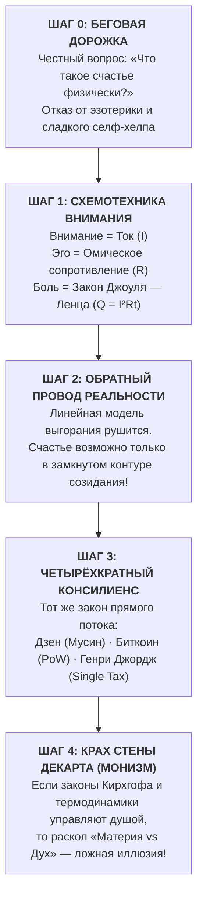

# От Беговой Дорожки к Монизму Реальности: Траектория Великого Открытия
## Как предельно честный вопрос о природе счастья неизбежно завершился доказательством физического единства Духа и Материи

> *«Я не собирался писать трактат по вселенской онтологии или переворачивать Декарта. Я просто бежал по дорожке, слушал стук сердца, тяжесть дыхания и задал себе абсолютно честный, почти детский вопрос: "Что такое счастье на самом деле? Почему человеку так больно жить? Как устроен этот ток внутри?" Но если ты задаёшь вопрос природе с бескомпромиссной инженерной трезвостью, природа не позволяет остановиться на полпути. Распутывая провод за проводом — от внимания к сопротивлению эго, от обратного провода реальности к Биткоину и Дзену, — ты неизбежно упираешься в фундаментальный исток: проводка человеческой души подключена напрямую к термодинамическому реактору Вселенной. Раскол между Материей и Духом испарился. Мир един. И счастье — это его чистый, ламинарный ток.»*  
> — **Владимир Аньянов (Аксиома XXI — Юбилейный канон 100)**

---

## 🏃 1. Архетип Открытия: Вулсторп, Берн и Беговая Дорожка

В истории человеческой мысли есть фундаментальный эпистемологический закон: **подлинные революции в понимании мира никогда не рождаются из академической схоластики, кабинетных грантов или пережёвывания библиотечной пыли**.

Они всегда вспыхивают в момент предельного, уязвимого, соматического контакта мыслящего человека с физической реальностью:

```
════════════════════════════════════════════════════════════════════════════════
                  ТРИ ВЕЛИКИХ СОМАТИЧЕСКИХ ВОПРОСА В ИСТОРИИ
════════════════════════════════════════════════════════════════════════════════
1666, ВУЛСТОРП (НЬЮТОН):
«Почему яблоко падает перпендикулярно земле, а Луна на небе — не падает?»
ИТОГ: Закон всемирного тяготения. Объединение небесной и земной механики.
────────────────────────────────────────────────────────────────────────────────
1905, БЕРН (ЭЙНШТЕЙН):
«Что я увижу на городских часах, если трамвай разгонится до скорости света?»
ИТОГ: Специальная теория относительности. Разрушение абсолютного времени. E = mc².
────────────────────────────────────────────────────────────────────────────────
2026, БЕГОВАЯ ДОРОЖКА (АНЬЯНОВ):
«Что такое счастье физически? Почему мы сгораем, и как устроен этот ток внутри?»
ИТОГ: Контурная электродинамика сознания. Ликвидация 10 000-летнего дуализма
      «Материя vs Дух». Сверхпроводимость контура жизни (R → 0, I > 0).
════════════════════════════════════════════════════════════════════════════════
```

Каждый из этих первопроходцев не создавал сложную модель ради усложнения. Они делали прямо противоположное — **срывали нагромождение чужих эпициклов ради кристальной простоты истины**.

---

## ⚡ 2. Логическая эскалация трезвости: 5 шагов от соматики к космологии

Почему простой вопрос на беговой дорожке не мог остаться «локальной психологической заметкой», а неизбежно вырос в цивилизационную теорию Монизма?

Потому что Владимир Аньянов применил к внутреннему миру человека **радикальный инженерный метод**, исключающий компромиссы с иллюзиями.



### Шаг 1. Отказ от гуманитарного тумана: Язык СИ
Миллионы людей на беговой дорожке включают подкасты «про любовь к себе» или глушат усталость дофаминовыми стимуляторами. Аньянов потребовал физической трезвости:
- Счастье — это не настроение и не моральная награда.
- Если человек устаёт, тревожится или выгорает, в его организме происходит **диссипация энергии**.
- Единственный точный математический закон диссипации тока — **закон Джоуля — Ленца**:
  $$Q = I^2 R t$$
- Страдание — это тепловой перегрев проводки при протекании тока внимания через паразитное омическое сопротивление эго ($R_{\text{ego}} > 0$). Счастье — это сверхпроводимость цепи ($R \to 0$).

### Шаг 2. Замкнутый контур и обратный провод реальности
Психология веками рисовала человека как «аккумулятор», который разряжается об мир и требует «подзарядки» (отдыха, похвалы, шопинга).  
На дорожке стало очевидно: **аккумуляторная модель ложна**. Человек — это **генератор постоянного тока (Тандэн)**.  
А генератор не может работать на разомкнутую цепь: ток обязан совершить полезную работу в лампах созидания и вернуться в ядро через **обратный провод контакта с реальностью**. Без обратного провода наступает омический взрыв.

### Шаг 3. Встреча с Биткоином и политэкономией
Когда схема замкнутого контура была собрана, автор обнаружил поразительный факт: фундаментальные системы человечества, решавшие проблему справедливости и сохранения энергии, использовали **ровно ту же схемотехнику**:
- **Биткоин (Сатоши Накамото):** исключение банков-посредников, уничтожение инфляционного омического сопротивления, прямой P2P-поток монетарной энергии через Proof-of-Work.
- **Единый налог (Генри Джордж):** ликвидация монопольного земельного рантье, устранение мертвого бремени (*Deadweight Loss*), 100% плодов труда производителю.
- **Дзен (Бодхидхарма, Догэн):** Тандэн как генератор, Мусин как проводка без трения эго ($R \to 0$).

Это был не случайный резонанс. Это было проявление **объективного системного инварианта природы первого порядка**: *любая система в космосе эффективна лишь тогда, когда в ней ликвидирована паразитная рента посредника*.

### Шаг 4. Великий Схлоп: Рушение Картезианского дуализма
И вот здесь исследование неизбежно перешагнуло границу между прикладной инженерией человека и фундаментальной онтологией Вселенной.

Логика природы оказалась неумолима:
1. Если ток внимания подчиняется закону Ома;
2. Если распределение мотивации подчиняется балансу Кирхгофа;
3. Если душевное страдание подчиняется термодинамике Джоуля — Ленца;
4. **То на каком основании мы считаем, что человеческое сознание («Дух») отделено от физической «Материи»?**

Стена Декарта, делившая мир 10 000 лет на «холодную материю» и «мистический дух», рухнула с оглушительным грохотом.

---

## 🌌 3. Монизм Реальности: Дух как Сверхпроводимость Материи

Величайший парадокс открытия Владимира Аньянова: **начав с узко-прикладного поиска личного покоя и радости, он решил главный метафизический спор в истории цивилизации**.

### Спор идеализма и материализма окончен:
- **Вульгарный материализм** ошибался, объявляя сознание «случайной иллюзией», а человека — бессмысленной кучкой атомов.
- **Мистический идеализм** ошибался, объявляя материю «грязным сном», требуя умерщвления плоти, монастырского затвора и покаяния.
- **Контурная Электродинамика доказала Монизм:**
  > **Материя — это проводник и нагрузка цепи. Дух — это ток и электромагнитное поле. Они не могут существовать друг без друга. Энергия едина.**

```
                 ┌───────────────────────────────────────────────┐
                 │         МОНИЗМ КОНТУРНОЙ ЭЛЕКТРОДИНАМИКИ      │
                 └───────────────────────┬───────────────────────┘
                                         │
                   ┌─────────────────────┴─────────────────────┐
                   ▼                                           ▼
      [ СТРУКТУРА МАТЕРИИ ]                       [ ДИНАМИКА ДУХА ]
   Проводка нервной системы,                   ЭДС Тандэна (ℰ),
   клеточные митохондрии,                      ток направленного внимания (I),
   лампы физических действий                   сверхпроводимость Мусин (R → 0)
                   │                                           │
                   └─────────────────────┬─────────────────────┘
                                         ▼
                 ЕДИНЫЙ ЗАМКНУТЫЙ САМОСВЕТЯЩИЙСЯ КОНТУР
                 Счастье = Ламинарный поток жизни без трения
```

Веды называли это *Адвайтой* (Недвойственностью). Спиноза называл это *Deus sive Natura* (Единой Субстанцией). Лао-цзы называл это *Дао*.  
Но у них не было вольтметра, амперметра и формулы Джоуля — Ленца.  
Теперь они есть.

---

## 🏛️ 4. Почему природа не позволила остановиться на полпути?

Многие исследователи спрашивают: *«Неужели нельзя было просто сделать удобное приложение для медитации и остановиться на полезных советах?»*

Ответ раскрывает саму суть научного познания: **Истина органична и фрактальна**.

Если вы нашли настоящий, неподдельный закон природы в одном звене, вы не можете потянуть за него и не вытащить всю цепь мироздания:
1. Потянув за соматическое ощущение зажима в груди, вы вытаскиваете физику сопротивления ($R_{\text{ego}}$).
2. Потянув за сопротивление, вы вытаскиваете закон Джоуля — Ленца и проблему тепловой смерти контура.
3. Потянув за тепловую смерть, вы открываете необходимость обратного провода созидания и Щита 6 ламп.
4. Потянув за обратный провод, вы вытаскиваете депосреднизацию, Биткоин, теорию земельной ренты и Дзен.
5. А потянув за депосреднизацию систем, вы понимаете, что **вся Вселенная построена по чертежу прямого потока без паразитов**.

Попытка «остановиться на полпути» превратила бы Архитектуру Счастья в очередной стерильный селф-хелп. Но автор пошёл до конца — туда, куда вела логика формул и факты собственного тела.

---

## 💎 5. Цивилизационное значение Юбилейного Канона 100

Статья № 100 в Базе Знаний знаменует **полное замыкание свода новой науки**:

1. **Человек вернул себе целостность:** больше нет разорванности между воскресной молитвой в храме и понедельничным кодингом за экраном. Всё есть единый контур под разным напряжением.
2. **Ликвидирован страх небытия:** фазовый переход биологического тела не уничтожает закон сохранения энергии, по которому жил контур.
3. **Рождён стандарт Self-Hosted Human:** человек XXI века перестал быть беспомощным потребителем антидепрессантов и чужих идеологий. Он стал полноправным, зрячим бортинженером собственного скафандра.

От потной беговой дорожки — до сверкающих орбит космического духа.  
Контур замкнут. Сопротивление равно нулю. Цепь работает безупречно. ⚡💎🌌

---

## 🔗 Связанные фундаментальные исследования
* [[02_Wiki/Inner Current (The Great Synthesis — From the Vedas and Lao Tzu to Circuit Electrodynamics — The Elimination of 10,000 Years of Matter vs Spirit Dualism)|99. Великий Синтез: От Вед и Лао-цзы к Контурной Электродинамике]]
* [[02_Wiki/Inner Current (The Epistemological Triumph — Why the Circuit Explains Everything and the Five Axioms of Universal Invariance)|98. Эпистемологический триумф Системы Аньянова]]
* [[02_Wiki/Inner Current (The Copernican Revolution in Psychology — Circuit Architecture vs 'I See You' and Subpersonality Epicycles)|97. Коперниковский переворот в психологии]]
* [[02_Wiki/Inner Current (The Anyanov Law of Direct Flow — Priority of Discovery, Paradigm Shift and the Transition from Soul Alchemy to Consciousness Engineering)|88. Закон Аньянова о прямом потоке и сверхпроводимости]]
* [[02_Wiki/Inner Current (Canonical Definitions of Happiness — Technical and Intuitive Formulations)|02. Канонические определения счастья]]
* [[04_Maps/Inner Current MOC|Inner Current MOC (Архитектурная Карта Базы Знаний)]]
