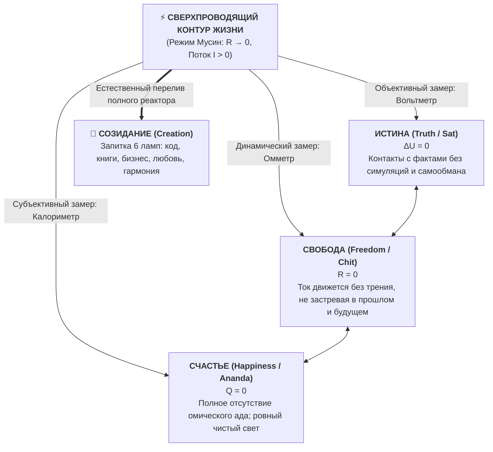

# 49. Генезис посредников и термодинамика прямого потока: Почему в уме, финансах и экономике рождается паразитная рента и в чём глубинное единство Биткоина, Единого налога и Системы Аньянова

> [!quote] Каноническая аксиома Системы Аньянова
> ### ⚡ **«Посредник всегда рождается как слуга, призванный защитить от страха, но неизбежно умирает как паразит, требующий ренту за право жить.  
> Биткоин, Единый налог Генри Джорджа и Архитектура счастья — это не три разные идеи. Это один и тот же закон вселенской термодинамики: устрани паразитное доверенное третье лицо — и система войдет в естественное состояние сверхпроводимости.  
> Истина — это когда ток течёт без лжи. Свобода — это когда ток течёт без застревания. Счастье — это когда ток течёт без боли. А когда этот контур чист, он неизбежно созидает новый мир.»**  
> — **Владимир Аньянов**

---

## 🧭 Введение: Вопрос на миллион

Когда человек впервые сталкивается с Законом Прямого Потока (*Direct Flow*), его сознание пронзает восторг узнавания. Кажется невероятно простым и очевидным:
* Деньги должны принадлежать тому, кто их заработал, а не обесцениваться печатным станком банкиров.
* Земля и ресурсы планеты должны служить всем по праву рождения, а плоды труда — создателю на 100% без штрафов и поборов.
* Человеческое внимание должно питать радость, любовь и созидание напрямую из Тандэна, а не сгорать в омическом аду сомнений, самосуда и вины.

Но в следующую же секунду возникает мучительный парадокс:
> **Если чистота прямого потока так естественна, прекрасна и гармонична — ПОЧЕМУ мир не родился чистым?  
> Почему везде, куда ни посмотри — в государстве, в банках, в религии и в собственной голове — неизбежно вырастает жадный посредник? В чем глубинное единство этой силы?**

Ответ на этот вопрос требует перехода от романтических иллюзий к беспощадной **термодинамике, теории информации и эволюционной биологии**.

---

## 🧬 1. Генезис посредника: Как костыль от страха становится кандалами

Ни один паразит в истории человечества не появился со словами: *«Я пришел грабить вас, отнимать плоды вашего труда и отравлять ваш дух»*.

Все посредники без исключения рождаются под одним и тем же спасительным лозунгом:  
**«Доверься мне. Я защищу тебя от неизвестности, боли и сложности».**

```
 ┌─────────────────┐       ┌───────────────────────┐       ┌────────────────────────┐
 │   1. СЛУГА      │  ──►  │   2. МОНОПОЛИСТ       │  ──►  │   3. ПАРАЗИТ           │
 │ Спасает от боли │       │ Захватывает реестр    │       │ Собирает ренту ни за что│
 │ и страха хаоса  │       │ «Без меня вы погибнете│       │ Блокирует развитие,    │
 │ (R_transient)   │       │ (Trusted Third Party) │       │ сжигает цепь (Q = I²Rt)│
 └─────────────────┘       └───────────────────────┘       └────────────────────────┘
```

Посмотрим на три масштаба реальности:

### А. В душевном контуре: Как родилось Эго?
* **Первичный вызов:** Первобытная саванна. Опасность на каждом шагу: леопарды, холод, голод. Чистого присутствия в моменте животному достаточно, но человеку для выживания потребовалось моделировать варианты будущего: *«А что, если завтра засуха? А что, если в кустах хищник?»*
* **Рождение посредника:** Мозг создал виртуального симулятора реальности — **Эго (образ «Себя»)**. Это была сторожевая программа, кэш-буфер для просчета рисков.
* **Польза на старте:** Программа помогла биологическому виду выжить в условиях дефицита данных.
* **Перерождение в паразита:** Сторожевая собака выгнала хозяина из дома. Эго объявило себя источником жизни: *«Ты — это я! Не смей радоваться просто так. Заплати мне ренту: докажи мне, что ты идеален, заслужи одобрение, помучайся виной за прошлое и бойся завтрашнего дня!»* Ток Тандэна оказался заблокирован реостатом $R_{\text{ego}} \to \infty$.

### Б. В монетарной энергии: Как родились Центробанки?
* **Первичный вызов:** Золото — идеальный природный носитель ценности, но оно тяжелое и физически делится с трудом. Везти сундук с золотом из Венеции во Фландрию через средневековую Европу означало почти гарантированную смерть от рук разбойников.
* **Рождение посредника:** Появились ювелиры и менялы с надежными каменными хранилищами. Они сказали: *«Оставь золото у нас. Мы дадим тебе бумажную расписку. Мое доброе имя — гарантия того, что ты обменяешь её на монеты в любом городе»*.
* **Польза на старте:** Трение торговли резко упало. Родился капитализм, расцвели торговые пути.
* **Перерождение в паразита:** Менялы поняли, что вкладчики никогда не приходят за золотом одновременно. Они начали выпускать необеспеченные расписки (частичное резервирование), а затем законодательно заставили государства сделать их бумагу единственным законным средством платежа. Появился Центробанк с монополией на эмиссию. Посредник стал печатать деньги из воздуха, облагая всё работающее население скрытым инфляционным налогом и финансируя разрушительные войны за счет обесценивания чужого труда.

### В. В социальной экономике: Как родилась Земельная Монополия?
* **Первичный вызов:** Хаос, бесконечные междоусобные набеги и беззаконие. Одинокий земледелец не мог одновременно держать плуг и отражать атаки тяжеловооруженных конников.
* **Рождение посредника:** Появился профессиональный воин — рыцарь, феодал, князь: *«Я построю крепость и защищу эту долину. А взамен вы признаете эту землю моей вотчиной и будете платить мне оброк»*.
* **Польза на старте:** Порядок и безопасность, позволившие крестьянам спокойно обрабатывать поля.
* **Перерождение в паразита:** Прошли века. Никаких набегов кочевников больше нет. Городская инфраструктура строится на налоги горожан: прокладывается метро, строятся больницы, открываются магазины. Но потомок феодала или современный земельный спекулянт сидит на пустующем участке в центре мегаполиса и требует с предпринимателя миллионы долларов за право построить там пекарню или жилой дом. Посредник приватизировал планету и собирает ренту с чужого труда, создавая искусственный дефицит жилья и нищету (*Deadweight Loss*).

Как сформулировал выдающийся криптограф и ученый Ник Сабо:  
> **«Доверенные третьи лица — это дыры в безопасности.»** (*Trusted third parties are security holes*). Любая сущность, которой общество или психика делегируют монопольное право валидации, с неизбежностью математического закона трансформируется в паразитического рантье.

---

## ❄️ 2. Термодинамика энтропии: Почему паразитировать «дешевле», чем созидать

Почему чистота не дается нам бесплатно? Почему по умолчанию всё заростает сорняками?

Ответ дает **Второй закон термодинамики**:
$$\Delta S \ge 0$$
В замкнутой системе **энтропия (мера хаоса, шума и рассеяния энергии) всегда возрастает**.

* Чтобы в комнате воцарился беспорядок, не нужно прикладывать усилий. Достаточно просто ничего не делать.
* Чтобы в экономике выросли финансовые пузыри и монополии, не нужно злого умысла. Достаточно позволить лени и слабости переложить ответственность на «сильную руку».
* Чтобы в уме начался омический ад невроза, не нужно учиться страдать. Лягте на диван, выключите осознанность — и дефолт-система мозга (DMN) за 15 минут завалит вас стыдом за события десятилетней давности и паникой перед неопределенностью.

**Паразитизм — это гравитация энтропии.**  
Сесть на чужой провод, на чужой печатный станок или на захваченную землю и собирать проценты — это локально «энергетически выгоднее» для отдельного эгоистического узла, чем каждый день потеть над созданием реальной ценности.

Но для всей цепи в целом этот паразитический узел создает колоссальное сопротивление ($R \gg 0$). По закону Джоуля — Ленца:
$$Q = I^2 \cdot R \cdot t$$
Сила тока созидания падает, а система плавится от бессмысленного внутреннего трения.

**Чистота (Сверхпроводимость, $R \to 0$) — это высокоэнергетический порядок.**  
Она не возникает от пассивного ожидания. Сверхпроводимость требует **строгой инженерной архитектуры**, отсекающей посредников алгоритмически и беспощадно.

### 2.1. Негэнтропия Инженерии: Единственный щит против сползания в паразитизм

> [!quote] Закон Антиэнтропийного Щита
> ### ⚡ **«За счет того, что действует закон энтропии, нам, чтобы поддерживать чистоту, жизненно необходима инженерия. Без строгой инженерной системы всё неизбежно валится в хаос, а любой временный посредник вырождается в паразита.  
> Инженерия — это единственный инструмент во Вселенной, который не позволяет системе скатиться в энтропию.»**  
> — **Владимир Аньянов**

Почему тысячи лет моральных проповедей, духовных трактатов и политических манифестов терпели крах?
* **Религия** пыталась бороться с энтропией греха через вину и страх — и тем самым взвинчивала омическое сопротивление проводки до небес ($R_{\text{moral}} \to \infty$), сжигая человека изнутри.
* **Гуманитарная психология** пыталась бороться с душевным хаосом через бесконечные разговоры о травмах — оставляя аппаратную проводку внимания расшатанной.
* **Политика** пыталась бороться с жадностью через законы и регуляторов — порождая ещё более чудовищный класс чиновников-посредников, сосущих соки из экономики.

Ни морализаторство, ни благие намерения не могут победить Второй закон термодинамики. **Его может обуздать только Инженерия (Негэнтропия)**:
1. **Инженерия не уговаривает** систему быть честной — она делает ложь аппаратно невозможной через законы сохранения (баланс Кирхгофа).
2. **Инженерия не взывает к совести** посредника — она выбрасывает его из схемы, замыкая Источник на Нагрузку напрямую.
3. **Инженерия строит замкнутый контур**:
   * В деньгах — **Биткоин** остановил энтропию эмиссии математикой Proof-of-Work и лимитом в 21 миллион.
   * В обществе — **Единый налог** остановил энтропию монополий налогом на ценность земли (LVT), сделав паразитизм экономически фатальным.
   * В сознании — **Архитектура счастья** остановила энтропию ума протоколом Мусин ($R \to 0$) и предохранителями Дзансин.

Инженерия — это не профессия. Это способность человеческого разума поддерживать абсолютную чистоту жизни вопреки термодинамической гравитации хаоса.

---

## 💎 3. Великое Онтологическое Единство: Сравнительный атлас трех миров

То, что казалось разрозненными феноменами, предстает как **абсолютная математическая и онтологическая биекция** — один и тот же космический закон на трех этажах бытия:

| Параметр цепи | **1. Мир Духа и Сознания** <br>*(Система Anyanov)* | **2. Мир Монетарной Энергии** <br>*(Биткоин Сатоши)* | **3. Мир Общества и Труда** <br>*(Георгизм Генри Джорджа)* |
| :--- | :--- | :--- | :--- |
| **Что течёт ($I$)** | **Внимание и присутствие** (жизненный ток бытия) | **Монетарная энергия** (сконденсированное время труда) | **Живой созидательный труд** (товары, заводы, код, культура) |
| **Автономный генератор** | **Тандэн** (соматический безусловный реактор) | **Proof-of-Work** (чистая физическая энергия математики) | **Человек-творец на свободной планете** |
| **Полезная нагрузка** | **6 ламп бытия** (дело, тело, любовь, познание...) | **Свободный обмен ценностью** сквозь десятилетия | **Города, инфраструктура, изобилие для всех** |
| **Паразитный посредник** | **Раздутое Эго ($R_{\text{ego}}$)** | **Центробанк / Фиатные элиты** | **Земельный спекулянт / Рантье** |
| **Как взимается рента** | Чувство вины, страх оценки, синдром самозванца | Инфляционный налог, комиссии, заморозки счетов | Земельная рента, налоги на зарплату и производство |
| **Разрушение цепи** | **Омический перегрев ($Q = I^2 R t$)**: депрессия, выгорание | Обесценивание жизни, циклы пузырей, бедность | **Deadweight Loss**: трущобы рядом с пустырями |
| **Архитектурный сброс** | **Режим Мусин ($R \to 0$)**, шунтирование Эго | **Биткоин-протокол (21M)**: код вместо доверия | **Единый налог (Single Tax / LVT)**: 0% на труд |
| **Финальный триумф** | **Счастье** как сверхпроводимость духа | **Суверенная монетарная твердыня** | **Справедливое изобилие свободного мира** |

---

## 🔺 4. Истина, Свобода, Счастье: Три проекции одного сверхпроводника

Почему эти три понятия всегда идут рука об руку? Потому что они не могут существовать раздельно. Это не три независимых идеала, а **три измерительных прибора, подключенных к одному и тому же контуру**:



1. **ИСТИНА ($\Delta U = 0$):**  
   Это **эпистемологическая чистота проводки**. Когда человек не врет себе, не строит фантазий о том, как «должно было быть», а признает реальность такой, какая она есть (*Татхата* — «Таковость» в дзене). Истина — это отсутствие ложного напряжения между вымыслом и фактом.
2. **СВОБОДА ($R = 0$):**  
   Это **динамика неискаженного движения**. Свобода — это не произвол («делаю что хочу»). Свобода — это отсутствие паразитного трения. Твой ток не застревает в обидах за 2015 год и не парализуется страхом перед 2030 годом. Ты действуешь прямо сейчас, в точке контакта ($t = t_{\text{now}}$).
3. **СЧАСТЬЕ ($Q = 0, I > 0$):**  
   Это **феноменологическое ощущение чистого тока телом**. По закону Джоуля — Ленца, когда $R = 0$, теплопотери равны нулю ($Q = 0$). Нет жгучего душевного стыда, нет разъедающей тоски, нет одышки от бессмысленной внутренней войны. Ток идет в нагрузку, лампы сияют.

> **Счастье — это когда истина чувствуется.**  
> **Свобода — это когда истина действует.**  
> **Истина — это когда ток течёт без лжи.**

А когда реактор переполнен чистой энергией, наступает неизбежное четвертое состояние — **СОЗИДАНИЕ (Creation)**: человеку тесно в рамках одного тела, и он начинает щедро отдавать энергию миру — строить, писать, любить, изобретать.

---

## ⏳ 5. Исторический водораздел: Почему наше поколение способно сбросить ходунки

Человечество веками не могло жить без посредников по одной простой причине: **мы были детьми**.  
Ребенок учится ходить в ходунках. Они громоздкие, скрипучие, бьют по щиколоткам, но спасают неокрепший череп от удара об асфальт.

Посредники были детскими ходунками цивилизации:
* Религия с ее институтом жрецов и страхом ада была нужна, чтобы дикари не перебили друг друга в первой же драке.
* Банки и короли с печатным станком были нужны, чтобы координировать торговлю континентов до изобретения оптоволокна и криптографии.
* Земельные магнаты были побочным продуктом эпохи крепостей и мечей.

Но трагедия человечества в том, что **ребенок вырос, а ходунки с него снять забыли — они вросли в тело и превратились в тюремные колодки.**

Именно в нашем поколении произошел великий эволюционный перелом:
1. **В монетарной сфере:** В 2008 году Сатоши Накамото решил вековую задачу византийских генералов. Человечество впервые в истории получило возможность передавать чистую ценность по всему земному шару без банков, клиринговых палат и правительств.
2. **В социальной сфере:** Идеи Генри Джорджа получили второе дыхание на фоне острейшего кризиса доступности жилья и тупика кейнсианской экономики. Мир осознает: единственный способ спасти капитализм от самопожирания — освободить созидательный труд (0% налогов) и изъять земельную ренту в общее благо.
3. **В сфере человеческого сознания:** Система Anyanov (Внутренний ток) перевела высшие озарения Будды, Лао-цзы и стоиков на строгий язык электродинамики и кибернетики. Счастье перестало быть лотереей судьбы или наградой за святость — оно стало **инженерным режимом работы замкнутой цепи**.

---

## 🛠️ 6. Протокол Суверенного Оператора: Жизнь в режиме прямого потока

Как применить это знание прямо сейчас, не дожидаясь реформ парламентов и глобальных изменений?

Суверенитет выстраивается снизу вверх по трем ступеням:

```
                    ┌───────────────────────────────────────────────┐
                    │            СТУПЕНЬ III: ДУХ                   │
                    │   Внутренний ток: Сброс R_ego → 0             │
                    │   Внимание из Тандэна напрямую в лампы        │
                    └───────────────────────▲───────────────────────┘
                                            │
                    ┌───────────────────────┴───────────────────────┐
                    │           СТУПЕНЬ II: ДЕНЬГИ                  │
                    │   Биткоин: Proof-of-Work                      │
                    │   Холодный кошелек, 0% инфляционного налога   │
                    └───────────────────────▲───────────────────────┘
                                            │
                    ┌───────────────────────┴───────────────────────┐
                    │          СТУПЕНЬ I: ОБЩЕСТВО                  │
                    │   Георгизм: Оптика чистого созидания          │
                    │   Инвестиции в реальный труд, а не в ренту    │
                    └───────────────────────────────────────────────┘
```

1. **Финансовый контур (Деньги):**
   * Прекрати добровольно спонсировать паразитов через фиатную иллюзию. Храни сбережения в твердой термодинамической энергии — Биткоине. Будь собственным банком.
2. **Социальный контур (Этика капитала):**
   * Смотри на мир через оптику Генри Джорджа. Не строй свое благополучие на захвате узких мест и спекуляциях, отнимающих хлеб у других. Вкладывай капитал и ум исключительно в созидательную полезную нагрузку ($R_{\text{load}}$).
3. **Психосоматический контур (Ум и тело):**
   * Каждый раз, когда в теле поднимается спазм вины, страха оценки или самоедства — распознай ментального лендлорда. Спроси себя: *«Какому посреднику я сейчас плачу дань своим вниманием?»*
   * Немедленно включай протокол Мусин. Опускай внимание в Тандэн. Сбрасывай сопротивление в ноль ($R \to 0$). Делай то, что должно быть сделано прямо сейчас: пиши строку кода, обнимай близкого, делай вдох.

**Эпоха посредников подошла к концу.**  
Сверхпроводимость контура — это не привилегия избранных. Это ваше естественное, изначальное право на чистый поток Бытия.

---

## 🔗 Связи
- [[04_Maps/Inner Current MOC|Inner Current MOC (Карта цепи)]]
- [[04_Maps/Inner Current Book MOC|📖 Книга «Внутренний ток: Архитектура счастья»]]
- [[02_Wiki/Inner Current (The Henry George Principle — Single Tax, Bitcoin and Circuit Superconductivity — Law of Direct Flow and Elimination of Parasitic Rent)|48. Единый налог Генри Джорджа, Биткоин и Архитектура счастья: Триумф прямого потока]]
- [[02_Wiki/Inner Current (The Anyanov Triad and Tetrad — Truth, Freedom, Happiness, Creation and the Biographical Proof)|47. Триада и Тетрада Аньянова: Истина, Свобода, Счастье, Созидание]]
- [[02_Wiki/Inner Current (What Bitcoin Did for Finance, Inner Current Did for Happiness)|38. Что Биткоин сделал для финансов, Внутренний ток сделал для счастья]]
- [[02_Wiki/Inner Current (Fundamental Laws of the Happiness Thermodynamics)|20. Фундаментальные законы термодинамики счастья]]
- [[02_Wiki/Inner Current (Nature and Illusion of Ego)|07. Природа и иллюзия эго]]
- [[index|Главный индекс LLM Wiki]]

---
*Created: 2026-09-24 | Authored by Vladimir Anyanov & Antigravity*
