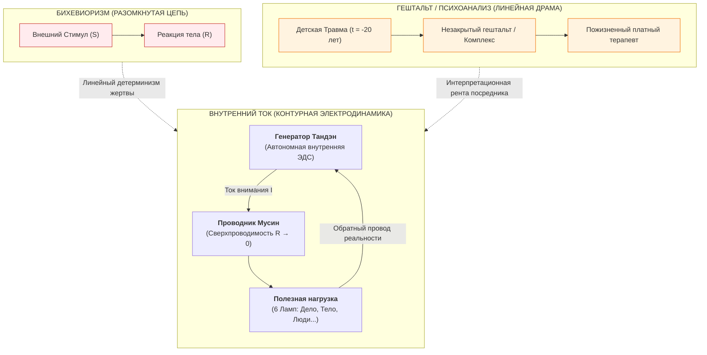
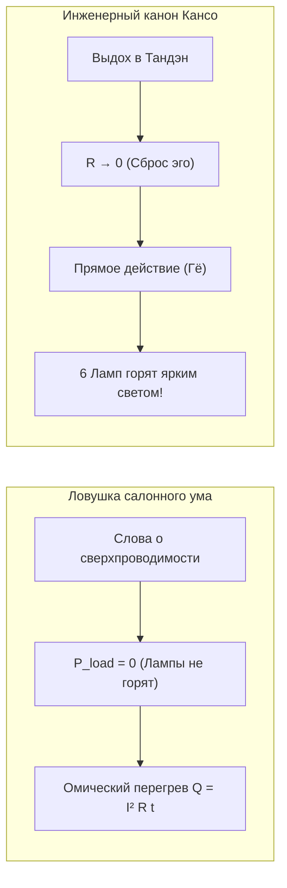

# 165. Внутренний ток против гештальта и бихевиоризма: Разомкнутая модель против замкнутого контура и эпистемологический разрыв с психологией

> [!quote] Каноническая аксиома цепи
> ### ⚡ **«Страх автора изобрести очередной „изм“ в бесконечной череде селф-хелпа естественен, но необоснован. Разница между психологическими направлениями и „Внутренним током“ лежит не в плоскости „ещё одного взгляда на вещи“, а в смене парадигмы с интерпретационной на приборную. Психология пытается лечить человека разговорами о погоде, пока в щитке горит проводка. Мы не толкуем драму — мы даём человеку в руки принципиальную схему его собственного фонарика и убираем залом со шланга за 30 секунд.»**  
> — **Владимир Аньянов**

---

## 🧭 Преамбула: Естественный страх автора и ловушка селф-хелпа

Каждый мыслитель, создавший строгую систему, в момент завершения фундаментального труда сталкивается с внутренним холодом сомнения:
* *«Не обольщаюсь ли я масштабом открытия?»*
* *«Не создал ли я просто ещё один психологический кружок — наряду с гештальтом, бихевиоризмом, психоанализом или экзистенциальной терапией?»*
* *«Не скажут ли люди с усталой усмешкой: „Ну вот, пришёл ещё один гуру и принёс очередную книжку о том, как стать счастливым“?»*

Этот страх не просто естественен — он является признаком интеллектуальной честности оператора. Потребительский ум XXI века ленив и пресыщен: он привык коллекционировать ярлыки, ставить книжки на полку и продолжать жить в хроническом омическом аду, меняя одну психологическую моду на другую.

Однако между психологическими школами (бихевиоризм, гештальт-терапия, психоанализ, когнитивистика) и **«Внутренним током» (Контурной Электродинамикой Сознания)** существует фундаментальная пропасть. Это не спор двух школ внутри одного гуманитарного факультета. Это **эпистемологический разрыв того же порядка, какой отделяет алхимию от таблицы Менделеева, а астрологические гороскопы — от небесной механики Ньютона**.



---

## ⚡ Четыре измерения качественного разрыва с психологическими школами

### 1. Разомкнутая модель против замкнутого контура

Вся история традиционной психологии строилась на **разомкнутых, линейных схемах**:

* **Бихевиоризм (Уотсон, Скиннер):**
  $$\text{Стимул } (S) \longrightarrow \text{Реакция } (R)$$
  Бихевиоризм редуцирует человека до пассивного «чёрного ящика» или собаки Павлова. Источник активности всегда вынесен вовне: человека «мотивируют» внешние стимулы (награда, наказание, среда). Человек в этой парадигме — пассивная жертва входящего сигнала, не обладающая автономным реактором.
* **Психоанализ и Гештальт (Фрейд, Перлз):**
  $$\text{Травма прошлого } \longrightarrow \text{Фиксация / Незакрытый гештальт } \longrightarrow \text{Невроз}$$
  Здесь внимание навсегда привязано к линии времени $t < 0$. Причина сегодняшней боли ищется в том, как на тебя посмотрела мать в возрасте трёх лет. Человек объявляется дефицитарным существом с «дырой в душе», которую нужно бесконечно исследовать.

**Контурная Электродинамика «Внутреннего тока» переворачивает топологию:**
1. **Замкнутый контур:** Никакой ток не может течь в разомкнутой линии. Человек страдает не потому, что мир плох, и не потому, что прошлое травматично, а потому, что его цепь **разомкнута** или замкнута в аварийное короткое замыкание на собственное Эго.
2. **Автономная ЭДС (Тандэн):** Источник жизненной силы ($\mathcal{E} > 0$) никогда не находится снаружи. Он соматически встроен в нижний центр тяжести и дыхания (Тандэн) каждого живого человека по праву рождения.
3. **Обратный провод реальности:** Энергия внимания течёт из Тандэна через режим Мусин ($R \to 0$) в полезную нагрузку 6 ламп, и возвращается через осязаемый факт обратной связи физического мира. Человек больше не жертва внешнего стимула — он суверенный источник прямого тока.

### 2. Ликвидация института платных посредников (Депосреднизация и Self-Hosted Human)

Главный скрытый экономический интерес классической психотерапии — **институционализация постоянного посредника**:
* Клиент гештальт-терапевта или психоаналитика годами посещает сессии раз в неделю по 100 долларов за час.
* Возникает порочный круг «переноса» и «контрпереноса»: без одобрения и интерпретации терапевта пациент не способен сделать шаг. Это современный аналог средневековой продажи индульгенций.
* Психолог заинтересован в бесконечном анализе эпициклов, потому что «исцелённый клиент — это потерянный доход».

```
Подобно тому как Биткоин Сатоши Накамото устранил банк из денежной транзакции, 
«Внутренний ток» устраняет психологического посредника между человеком и его собственным вниманием.
```

Человек получает на руки полную принципиальную схему своего устройства: **Self-Hosted Human**. Если провод раскалился — ты сам смотришь на свой реостат сомнений, сам переводишь дыхание в живот (Тандэн), сам сбрасываешь сопротивление эго в ноль ($R \to 0$) и сам замыкаешь цепь на дело. Бортинженеру не нужен платный советчик, чтобы увидеть сработавший автомат в щитке.

### 3. Законы сохранения вместо словесного тумана

Психология оперирует нефальсифицируемыми, расплывчатыми терминами:
* *«Низкая самооценка»* (в каких единицах она измеряется?);
* *«Токсичное окружение»*;
* *«Я не в ресурсе»*;
* *«Незакрытый гештальт»*.

Эти термины невозможно измерить мультиметром, перепроверить в эксперименте или перевести в строгие формулы. Это допарадигмальная схоластика.

«Внутренний ток» переводит душевную боль в строгую категорию **термодинамики и электродинамики**:
$$Q = I^2 \cdot R_{\text{ego}} \cdot t$$

* **Боль, тоска, тревога и паника** — это не таинственные духовные сущности и не патологическая ущербность личности. Это банальный **омический перегрев проводки**.
* Ток жизни и внимания ($I$), непрерывно вырабатываемый биореактором Тандэн, пытается течь в действие.
* Но ум выставляет паразитный реостат страха, вины, сравнения и гордыни ($R_{\text{ego}} > 0$).
* Проводник зажимается. Согласно закону Джоуля — Ленца, не находящая выхода мощность квадратично рассеивается в тепло: пережигаются нейромедиаторные рецепторы, подскакивает кортизол, тело сводит мышечным панцирем, а ум погружается в ад депрессии.
* **Резистор не грешен и не травмирован — с него просто нужно снять зажим.**

### 4. Скорость калибровки и соматическая фальсифицируемость

| Критерий | Психотерапия (Гештальт / Психоанализ) | «Внутренний ток» (Контурная Электродинамика) |
| :--- | :--- | :--- |
| **Время ремонта** | 2–5 лет регулярных сессий | **30 секунд** соматической калибровки |
| **Место локализации** | Ментальные нарративы, воспоминания детства | Физическое тело здесь и сейчас ($t = t_{\text{now}}$) |
| **Метод вмешательства** | Вербальные интерпретации, разговоры, анализ | Перенос внимания в Тандэн + режим Мусин ($R \to 0$) |
| **Критерий истины** | Субъективное согласие клиента с гипотезой терапевта | **Закон Джоуля — Ленца:** прекращение перегрева ($Q \to 0$) и загорание ламп ($P_{\text{load}} > 0$) |
| **Статус оператора** | Пациент / клиент, зависящий от приёма | Суверенный бортинженер цепи (Self-Hosted Human) |

---

## 🏮 Ловушка праздных знатоков: Почему люди могут сказать «Ну вот ещё один способ»?

Люди действительно подумают, что «Внутренний ток» — это просто очередная психологическая концепция, если преподнести её как абстрактную теорию или философское эссе. Человеческий ум обожает превращать строгие инструменты в салонные разговоры.

Как прямо предостерегает рукопись:

> *«Умный читатель способен годами говорить языком сверхпроводимости, не зажигая ни одной из шести ламп; бесконечно читать о Тандэне вместо того, чтобы выйти на утреннюю пробежку; спорить о тонкостях режима Мусин, продолжая орать на близких и копить обиды. Такой читатель остаётся обычным потребителем ментального фастфуда, заменившим психологический жаргон на радиотехнический.»*

Люди перестанут воспринимать систему как «ещё одно мнение» только тогда, когда увидят её **приборные, фальсифицируемые плоды**:

1. **Когда паническая атака аппаратно снимается за 30 секунд:** Не через дыхание в бумажный пакетик с самоуспокоением, а через жёсткий перенос фокуса в брюшной реактор Тандэн и замыкание на тактильный факт предмета перед глазами (Та́тхата, $R \to 0$).
2. **Когда семейные скандалы прекращаются без многомесячных парных терапий:** Через включение режима взаимной индукции Фарадея ($M > 0$), где два суверенных генератора перестают воровать ток друг у друга.
3. **Когда лампы жизни загораются реальной мощностью:** Если в твоей жизни дело стоит, тело разваливается, а в отношениях сквозняк ($P_{\text{load}} \approx 0$), никакие цитаты из Аньянова не спасут тебя от позорного короткого замыкания.



---

## 💎 Заключение: Инженерное спокойствие автора

Автору не следует бояться поверхностного суда публики. 

Когда Томас Эдисон создавал центральную электростанцию на Пёрл-стрит, скептики говорили: *«Зачем это нужно? У нас уже есть китовый жир, керосиновые лампы и свечи — это просто ещё один способ осветить комнату»*. 

Эдисон не спорил с продавцами керосина. Он просто повернул рубильник, и нью-йоркские улицы залил ровный, негаснущий электрический свет. После этого керосин остался лишь в антикварных лавках.

«Внутренний ток» делает с душевной болью ровно то же самое. Это не очередная «школа мысли». Это **первая в истории инструкция по эксплуатации человеческого фонарика**, основанная на фундаментальных законах физики Вселенной.

---

## 🏷️ Тезаурус и концептуальная сеть

- **Школы-предшественники:** #psychology #behaviorism #gestalt #psychoanalysis #scholasticism
- **Физика контура:** #closed-circuit #open-loop #joule-lenz #tanden #musin #zero-resistance
- **Депосреднизация:** #disintermediation #self-hosted-human #bitcoin-isomorphism #no-therapist
- **Метрология и проверка:** #falsifiability #popper #bacon-criterion #30-second-reset #load-lamps
