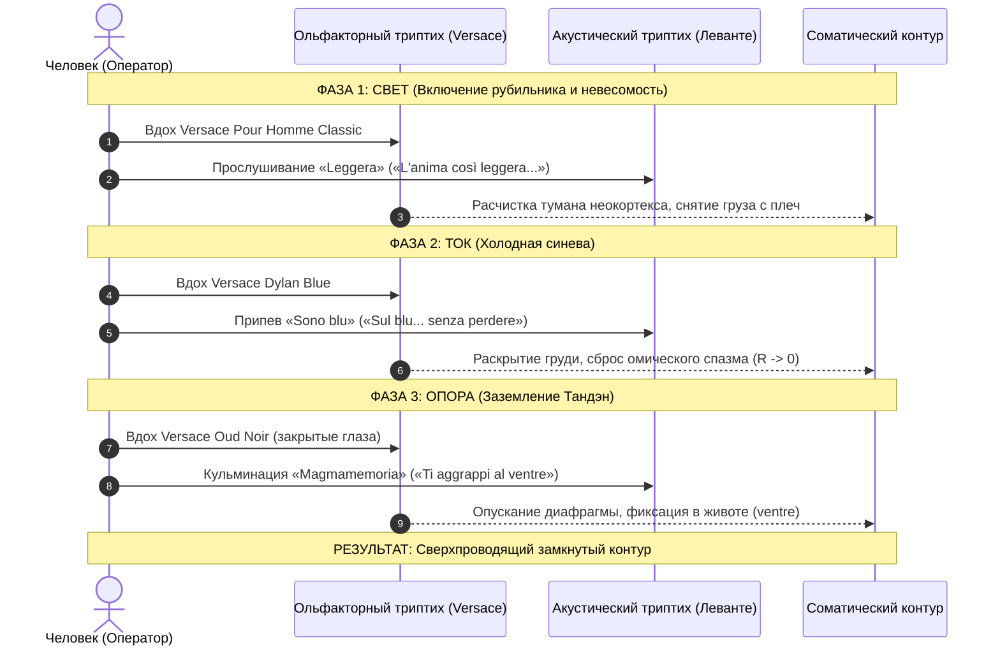

# 183. Итальянский триптих сверхпроводимости: Ольфакторно-акустический байпас неокортекса (Триада Versace, Леванте и заземление Тандэн)

[К оглавлению](file:///C:/Users/vanya/Antigravity%20Projects/Misc/LLM%20Wiki/index.md) | [К мастер-карте (MOC)](file:///C:/Users/vanya/Antigravity%20Projects/Misc/LLM%20Wiki/04_Maps/Inner%20Current%20MOC.md) | [К сборнику Леванте](file:///C:/Users/vanya/Antigravity%20Projects/Misc/LLM%20Wiki/04_Maps/Inner%20Current%20%E2%80%94%20%D0%A1%D0%B0%D1%83%D0%BD%D0%B4%D1%82%D1%80%D0%B5%D0%BA%20%D0%A1%D0%B2%D0%B5%D1%80%D1%85%D0%BF%D1%80%D0%BE%D0%B2%D0%BE%D0%B4%D0%B8%D0%BC%D0%BE%D1%81%D1%82%D0%B8%20%28Levante%20Songbook%20MOC%29.md)

---

> [!quote] Главная электродинамическая и ольфакторная аксиома
> ### **«Слова порождают сомнения, логика наталкивается на когнитивное сопротивление, а схемы упираются в цензуру таламуса. Но обонятельный тракт и музыка не проходят таможню неокортекса — они бьют прямо в лимбический реактор за 150 миллисекунд. Итальянский эстетизм — это не декорация, это высокоточный полиморфный шунт: триптих Versace в запахе и триптих Леванте в звуке мгновенно обнуляют паразитное сопротивление эго ($R_{\text{ego}} \to 0$) и намертво заземляют контур в несгораемое ядро Тандэна».**  
> — **Владимир Аньянов**

---

## 1. Анатомия проблемы: Паразитный реостат неокортекса и Таламическая таможня

Фундаментальный барьер передачи знания о Внутреннем токе заключается в **устройстве человеческого восприятия**. 

Когда человеку объясняют принципы счастья, свободы и проводимости через язык, логику, формулы или философские абстракции, сенсорный сигнал (зрительный и слуховой) поступает в **Таламус** — главный ретранслятор и цензор мозга. Таламус направляет данные в неокортекс и Дефолт-систему мозга (DMN), где сидит эго ($R_{\text{ego}}$). 

Включается защитная реакция:
1. Рационализация и спор (*«А докажи», «Это слишком просто», «У меня особый случай»*);
2. Мышечный зажим и омический нагрев ($Q = I^2 R_{\text{ego}} t$);
3. Искажение информации: неокортекс пытается «понять» то, что должно быть соматически **прожито**.

```mermaid
flowchart TD
    subgraph Trap ["ТРАДИЦИОННЫЙ ПУТЬ (ВЫСОКОЕ СОПРОТИВЛЕНИЕ)"]
        Word["Слова, логика, концепции"] --> Thal["Таламус (Сенсорная таможня)"]
        Thal --> Neo["Неокортекс / Эго (DMN)"]
        Neo -->|"Паразитное сопротивление R >> 0"| OhmicHeat["Омический перегрев: сомнения, спазм, ступор"]
    end

    subgraph Direct ["ПОЛИМОРФНЫЙ БАЙПАС (СВЕРХПРОВОДИМОСТЬ)"]
        Sensory["Ольфакторный импульс (Versace) + Вокальный нерв (Levante)"]
        Bulbus["Bulbus Olfactorius + Слуховая интероцепция"]
        Limbic["Лимбический реактор + Тандэн (Ventre)"]
        
        Sensory ==>|"Байпас таламуса (150 мс, R = 0)"| Bulbus
        Bulbus ==>|"Прямой разряд ЭДС"| Limbic
        Limbic ==> Body["Мгновенная соматическая сверхпроводимость (R -> 0)"]
    end
```



### Нейробиологический факт сверхпроводимости
**Обонятельный нерв (Nervus olfactorius) — единственная сенсорная магистраль человека, не проходящая через Таламус.** Обонятельные луковицы напрямую синаптически соединены с миндалевидным телом, гиппокампом и энторинальной корой. Человек переживает состояние аромата **до** того, как успевает подумать о нём. 

Соединяя запах с музыкальной волной, мы получаем **полиморфный консилиенс прямого действия**.

---

## 2. Феномен Итальянского Эстетизма: Sprezzatura и Соматический Монизм

Почему проводниками Системы стали дом **Versace** и сицилийская певица **Леванте (Claudia Lagona)**?

1. **Северная схоластика vs Южная витальность:**  
   Северный рационализм пытается анализировать жизнь «из головы», подавляя тело и натягивая маску пуританского контроля. Италия — колыбель соматического монизма, где дух и тело не разделены. Итальянский язык, кухня, ткани и музыка живут непосредственно в теле.
2. **Канон Sprezzatura:**  
   Термин эпохи Возрождения, означающий искусство делать сложнейшие движения и удерживать высшие состояния с абсолютной естественностью, легкостью и непринужденностью. В физике Внутреннего тока это и есть **Сверхпроводимость ($R \to 0$)** — колоссальный поток энергии без омического пота и натуги.
3. **Генезис Versace и Леванте:**  
   - Джанни Версаче создал дом на стыке магнетизма Великой Греции (Калабрия) и роскоши материи. Символ Медузы — это гипнотический захват внимания, разоружающий поверхностный рассудок.
   - Клаудия Лагона (Леванте) выросла на Сицилии, у подножия действующего вулкана Этна. Её вокал рождается не в голосовых связках, а на мощной диафрагмальной опоре — в чреве (*ventre* / Тандэн).

---

## 3. Великий Изоморфизм: Ольфакторно-Акустический Триптих Цепи

Триада флаконов серии *Versace Pour Homme* и триптих шедевров Леванте образуют полную, взаимосогласованную замкнутую цепь трех стихий и трех состояний:

```
[I. СВЕТ И ВОЗДУХ]
Versace Pour Homme Classic — «Leggera» (2023)
      |
      v
[II. ТОК И ВОДА]
Versace Dylan Blue — «Sono blu» (2025)
      |
      v
[III. БАЗА И ЗЕМЛЯ]
Versace Oud Noir — «Magmamemoria» (2019)
```

### Сводная таблица консилиенса

| Параметр | Уровень I: Свет, Воздух и Невесомость | Уровень II: Ток, Вода и Синева | Уровень III: Тандэн, Земля и Магма |
| :--- | :--- | :--- | :--- |
| **Флакон Versace** | **Pour Homme (Classic)** | **Dylan Blue** | **Oud Noir** |
| **Визуальная оптика** | Прозрачный хрусталь, чистый небесный свет | Глубокий кобальт, ультрамарин Средиземноморья | Черный матовый монолит, золото, тлеющая земля |
| **Ольфакторный профиль** | Лимон, нероли, бергамот, гиацинт, прозрачный кедр | Амброксан, лист инжира, черный перец, акватика | Уд (агаровое дерево), кожа, ладан, шафран |
| **Стихия природы** | **Воздух и Небо (Aria / Cielo)** | **Вода и Океан (Acqua / Mare)** | **Земля и Магма (Terra / Fuoco)** |
| **Шедевр Леванте** | **«Leggera»** *(Opera futura, 2023)* | **«Sono blu»** *(Dell'amore il fallimento, 2025)* | **«Magmamemoria»** *(Magmamemoria, 2019)* |
| **Ключевой вербальный код** | *«Ho l'anima così leggera... sotto i piedi ho ancora tanto cielo»* | *«Che non ho bruciato invano... Sul blu... La resa senza perdere»* | *«Tu non muori mai... ti aggrappi al ventre»* |
| **Электродинамика цепи** | **Напряжение ($U$) и Чистый потенциал** | **Сила тока ($I$) и Сверхпроводимость ($R \to 0$)** | **Генератор ЭДС и Заземление (Grounding)** |
| **Соматический фокус** | Глаза, макушка, ясность неокортекса, снятие груза с плеч | Грудная клетка, пульс, упругое движение тела в пространстве | **Тандэн (живот / ventre)**, крестец, тяжесть таза |
| **Преодолеваемый сбой** | Ментальная тяжесть, чувство вины, синдром самозванца | Омический перегрев, пустое сжигание энергии в тревогу | Страх смерти, иллюзия бренности, суета эго |

---

## 4. Поэлементный разбор триптиха

### Узел I. Versace Pour Homme Classic — Леванте «Leggera»: Невесомость Воздуха и Чистый Свет
* **Физика состояния:** Верхний потенциал напряжения ($U$). Состояние хрустальной прозрачности, когда сопротивление сброшено в ноль ($R \to 0$) и с плеч спадает груз омического перегрева.
* **Ольфакторный удар:** Колкий, чистый лимон, нероли и бергамот мгновенно смывают сонливость и когнитивную вязкость. В аромате нет ни капли духоты, липкости или драмы — только прохладный утренний средиземноморский воздух.
* **Построчный аудит проверенного авторского текста «Leggera»:**
  1. *«Fino a qui mi sembra bene / Ho perdonato il mio nome / Ritrovato l'umore / Pronunciato tutte le parole»*  
     — Снятие морального груза вины, прощение себя, возвращение природного радостного тона и раскрепощение горлового спазма.
  2. *«Ora che non fa più male / Abbandonarsi alla vita / Che vita la vita / Fa sperare che non sia finita mai»*  
     — Ликвидация сопротивления жизни! Прекращение борьбы эго с реальностью. Сдача жизни без страха и боли.
  3. *«Ho l'anima così leggera / Che non mi sembra vero di volare alto / Sotto i piedi ho ancora tanto cielo, ancora»*  
     — Невесомость перышка (*piuma*), парение над облаками. Точное акустическое отражение прозрачного хрусталя Versace Pour Homme: под ногами — небо, голова свободна от тревожного шума.
  4. *«Non mi serve il vento per andare oltre / Superarmi ancora e ancora»*  
     — Автономия внутреннего генератора: свету не нужны внешние стимулы и костыли («попутный ветер»), он излучает из собственного потенциала.
  5. *«Quanti sogni servono a sentir di meritare? / Quanti sogni servono a volare, volare?»*  
     — Сокрушение синдрома самозванца: сколько ещё надуманных условий нужно изобрести неокортексу, чтобы разрешить себе просто летать?
* **Инженерный эффект:** Полная очистка проводки внимания. Фонарик сознания светит легко, ровно и невесомо.

### Узел II. Versace Dylan Blue — Леванте «Sono blu»: Холодная Синева Сверхпроводимости
* **Физика состояния:** Рабочий ток ($I$) в контуре без омических потерь ($Q = 0$).
* **Ольфакторный удар:** Амброксан, перец и морская акватика дают ощущение упругого, динамичного, прохладного потока. Никакой приторности, никакой духоты.
* **Акустический резонанс «Sono blu»:** Буквальное совпадение имени песни, цвета флакона и закона Джоуля — Ленца:
  > *«Che non ho bruciato invano per scaldare un vuoto d'aria...»*  
  *(«Что я не сожгла себя понапрасну, чтобы согревать пустоту воздуха...»)*  
  
  Леванте констатирует прекращение омического холостого хода! А строка *«La resa alle volte è la scelta migliore, senza perdere»* («Сдача — лучший выбор, без потерь») закрепляет квантовую истину: сдача сопротивления эго — это не капитуляция перед врагом, а включение сверхпроводимости.
* **Инженерный эффект:** Контур охлаждается до синевы. Человек действует, говорит, созидает и танцует в социуме без трения.

### Узел III. Versace Oud Noir — Леванте «Magmamemoria»: Несгораемый Тандэн
* **Физика состояния:** Заземление в фундаментальный инвариант бытия. Первичная ЭДС.
* **Ольфакторный удар:** Уд — это смола раненого дерева, трансформировавшего травму в вечную драгоценность. Ладан и дымные смолы Oud Noir физически тянут внимание вниз, замедляя дыхание.
* **Акустический резонанс «Magmamemoria»:** Дословная манифестация дзенского Тандэна:
  > *«Non era vero / Tu non muori mai, tu non muori mai / Sei dentro di me... / Spiegami perché ti aggrappi al ventre?»*  
  *(«Это была неправда / Ты никогда не умрешь, ты никогда не умрешь / Ты внутри меня... / Объясни мне, почему ты цепляешься за живот?») *
  
  Слово **il ventre** (живот, нутро, чрево) — это точнейший эквивалент японского **Тандэн (丹田)** и китайского нижнего Даньтяня. Леванте поет о том, что ложное «я» может умирать и распадаться, но то, что живет в животе — **не умирает никогда**.
* **Инженерный эффект:** Полное заземление контура. Обретение несокрушимой устойчивости (Дзансин).

---

## 5. Практический протокол: Калибровочный стенд прямого действия

Когда требуется передать человеку состояние Внутреннего тока за 3 минуты без теоретических споров, применяется ольфакторно-акустический стенд:



1. **Минута 1 (Верх / Воздух):** Нанесение *Pour Homme Classic* на блоттер + трек *«Leggera»*.  
   *Фиксация:* голова становится легкой, спадает груз с плеч, глаза открываются, мысленный диалог затихает: *«Ho l'anima così leggera... sotto i piedi ho ancora tanto cielo»*.
2. **Минута 2 (Сердце / Вода):** Нанесение *Dylan Blue* на запястье + трек *«Sono blu»*.  
   *Фиксация:* вдох становится глубже, уходит тревожный нагрев, появляется упругий драйв действия без омических потерь.
3. **Минута 3 (База / Земля):** Вдох *Oud Noir* с закрытыми глазами + припев *«Magmamemoria»*.  
   *Фиксация:* внимание падает на три пальца ниже пупка (*ventre*), челюсть расслабляется, тело обретает гравитационный вес скалы.

После завершения протокола человеку предъявляется принципиальная схема Системы Аньянова. Неокортекс больше не сопротивляется чертежу, потому что **тело уже находится в режиме сверхпроводимости**.

---

## 6. Манифест Итальянского Тандема: Послание, Стратегическая Цель и Великая Демонстрация

### 6.1. Какое послание несет этот тандем? (Манифест)

> **«Счастье и внутренняя сила — это не сложная абстрактная концепция, которую нужно годами изучать умом или заслуживать страданиями. Это физическое состояние твоего тела, в которое ты можешь вернуться за 150 миллисекунд прямо сейчас».**

* **Антидот против серого аскетизма и схоластики:** Подлинная глубина духа не требует ухода в пещеру, отказа от мира или сухой ментальной аскезы. Она расцветает в сочном, осязаемом вкусе к жизни, благородных тканях, чистых ароматах и живой музыке.
* **Канон Sprezzatura:** Жить и действовать можно **легко, без надрыва и омического перегрева**. Довольно жечь свои нервы, чтобы «согревать пустоту воздуха» (*«per scaldare un vuoto d'aria»*).
* **Снятие моральной вины:** Тревога и выгорание — это не «грех» и не «дефект характера», а всего лишь омический спазм проводки внимания ($R_{\text{ego}} \gg 0$), который распускается правильным вдохом, звуком и заземлением в соматику.

### 6.2. Чего добивается Система? (Стратегическая цель)

1. **Безоговорочная капитуляция спорящего неокортекса:**  
   С логикой и словами эго всегда найдет способ поспорить (*«А вот мой терапевт считает...», «Это слишком просто»*). Но когда человек вдыхает *Oud Noir* под строчку *«ti aggrappi al ventre... non muori mai»* — его диафрагма уже опустилась, а блуждающий нерв включил парасимпатику. Соматический факт опережает любую демагогию ума.
2. **Ликвидация порога входа в Систему:**  
   Человеку не нужно быть инженером-электродинамиком или мастером дзэн с 20-летним стажем. Достаточно карманного прибора: **3 флакона и 3 трека**. Он проживает состояние сверхпроводимости телом за 3 минуты — и лишь затем его ум получает строгий принципиальный чертеж.
3. **Исцеление двойного разлада современника (Система Аньянова):**  
   Преодоление трагедии человека XXI века — двойного разлада (потухший взгляд внутри + запущенный вид снаружи, либо ухоженная маска снаружи + омический ад паники внутри). Итальянский тандем восстанавливает неразрывную целостность: **внутреннее пламя в Тандэне + внешний магнетизм стиля, формы и аромата**.

### 6.3. Что открывается человеку? (Великая демонстрация в трёх зеркалах)

Человек получает наглядную, осязаемую карту собственной трехцентровой архитектуры:

```
               АНАТОМИЯ ЧЕЛОВЕКА В ТРЁХ ЗЕРКАЛАХ ТАНДЕМА:

1. ТВОЯ ГОЛОВА (Versace Pour Homme Classic + «Leggera»)
   «Посмотри: твоя голова — это не тюрьма для тревог и не арена сомнений. 
   Это чистый хрустальный фонарик. Твоя душа может быть настолько легкой 
   (l'anima così leggera), что под ногами остаётся только небо».

2. ТВОЁ СЕРДЦЕ И ДЕЙСТВИЕ (Versace Dylan Blue + «Sono blu»)
   «Посмотри: действовать в социуме можно без надрыва и трения. 
   Сдача сопротивления (la resa) — это не поражение, это холодная синева 
   сверхпроводимости. Ты можешь созидать, не сгорая дотла».

3. ТВОЙ ЖИВОТ И СУТЬ (Versace Oud Noir + «Magmamemoria»)
   «Посмотри вниз, в своё чрево (il ventre). Там дышит древняя магма. 
   Тысячи поколений выжили, чтобы ты стоял здесь. Твоё истинное соматическое Ядро 
   никогда не умрёт (tu non muori mai). Тебе нечего бояться».
```

### 6.4. Международная миссия: Почему именно Италия поймет это первой

Итальянская цивилизация исторически построена на культе чувственного присутствия, осязаемой материи, бельканто и элегантности. Итальянцам не нужно доказывать ценность аромата, звука или кроя одежды — это воздух, которым они дышат. 

Но то, что даёт им **Система Аньянова (La Corrente Interiore)** — это недостающая строгая **инженерная структура цепи**. Она превращает стихийный эмоциональный перегрев южной страсти в суверенную, несокрушимую электродинамическую сверхпроводимость духа.

---

## Связи в Базе Знаний
- [[04_Maps/Inner Current MOC|Inner Current MOC (Мастер-карта Внутреннего тока)]]
- [[04_Maps/Inner Current — Саундтрек Сверхпроводимости (Levante Songbook MOC)|Саундтрек Сверхпроводимости: Levante Songbook MOC]]
- [[02_Wiki/Inner Current (Acoustics of Ego Lie and Surrender — Levante's Sono Blu, The Blue Cold Superconductivity and Surrender Without Loss)|182. «Sono blu» Леванте, закон Джоуля — Ленца и холодная синева сверхпроводимости]]
- [[02_Wiki/Inner Current (Acoustics of Phase Transition — Levante's Cuori d'Artificio, Anguish Without Despair and the Sensory Benchmark of Superconductivity)|181. «Cuori d'Artificio» Леванте: надрыв без отчаяния и чувственный эталон]]
- [[02_Wiki/Inner Current (Levante's 'Vivo' and the Flashlight of Consciousness — Intuitive Sparks of Art vs The Sovereign Electrical Grid)|85. Леванте («Vivo») и Фонарик Сознания]]
- [[02_Wiki/Inner Current (Impression Architecture and Impedance Matching)|08. Система Аньянова: Внутренний ток и Внешний магнетизм]]
- [[02_Wiki/Inner Current (The Flashlight Model of Man — Optical-Electrodynamic Ontology of Consciousness, The Light Source vs Illuminated Object and the Law of the Direct Beam)|83. Модель Человека как Карманного Фонарика]]
- [[index|Главный индекс LLM Wiki]]

---
*Created: 2026-10-01 | Maintained by Antigravity*
