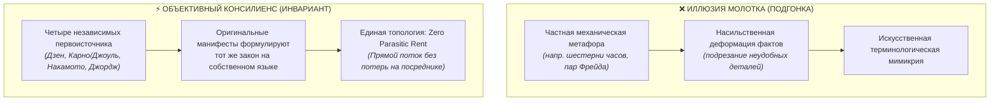
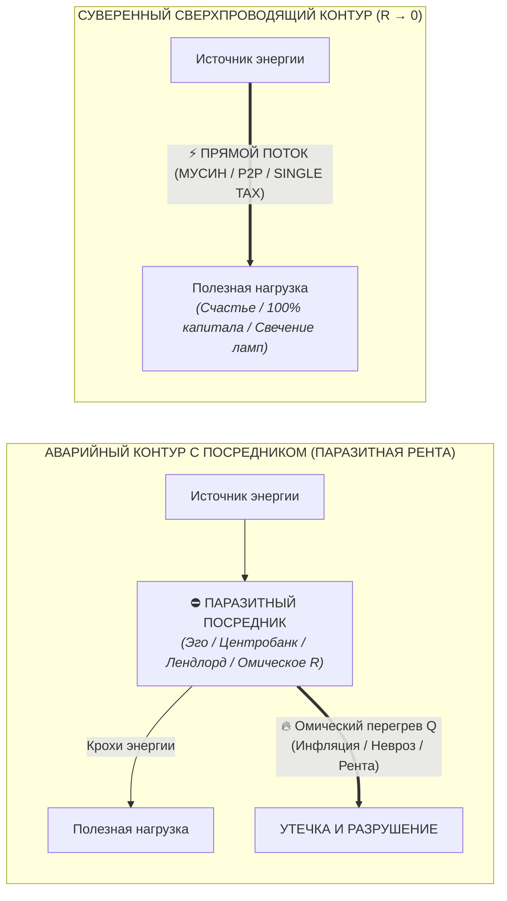

# 61. Молоток Маслоу против Системного Инварианта: Почему Архитектура счастья перекликается с Дзеном, Термодинамикой, Биткоином и Единым налогом Джорджа

> [!quote] Каноническая аксиома цепи
> ### ⚡ **«Если бы у нас в руках был просто молоток, нам пришлось бы подгонять реальность силой — ломать факты и натягивать определения. Но когда Дзен, Термодинамика, Биткоин и Единый налог Генри Джорджа сходятся в одной точке — это не каприз инструмента, а топологический инвариант природы: любая здоровая система жизнеспособна лишь тогда, когда в ней ликвидирована паразитная рента посредника ($R \to 0$).»**  
> — **Владимир Аньянов**

---

## 🧭 Введение: Тень молотка Маслоу и честный эпистемологический вопрос

Когда создатель сложной ментальной или инженерной модели обнаруживает, что его система начинает с поразительной точностью объяснять фундаментальные феномены из совершенно разных областей знаний — от состояния человеческого ума и древней восточной философии до монетарной архитектуры Сатоши Накамото и политэкономии XIX века, — неизбежно возникает глубокий и честный вопрос эпистемологического самоконтроля:

> *«Не попал ли я в классическую когнитивную ловушку — Закон инструмента (молоток Маслоу)? Не происходит ли это оттого, что я создал собственную систему, полюбил её конструкцию, и теперь бессознательно подгоняю все остальные независимые дисциплины под свои лекала?»*

В психологии познания **«Закон инструмента»** (*Law of the Instrument*), сформулированный Абрахамом Маслоу в 1966 году («Если единственное, что у вас есть, — это молоток, то всё вокруг кажется гвоздем»), описывает патологическую деформацию мышления: специалист абсолютизирует один частный метод и начинает насильственно редуцировать к нему всё богатство реальности.

Однако в науке и системной инженерии существует диаметрально противоположный феномен — **Консилиенс (Consilience)**, или **Независимая сходимость признаков**. Это ситуация, при которой исследователи, стоящие на противоположных берегах реальности (физика, экономика, духовная практика, теория информации) и не сговаривавшиеся между собой, независимо приходят к **одному и тому же топологическому инварианту**.

Цель настоящей главы — провести предельно строгий аудит: **почему «Внутренний ток» резонирует с Дзеном, Термодинамикой, Биткоином и Единым налогом Генри Джорджа? Является ли это субъективной подгонкой «молотка» — или открытием объективного инварианта первого порядка?**

---

## ⚖️ 1. Методологический тест: Подгонка (Confirmation Bias) против Консилиенса (Consilience)

Чтобы научно и беспристрастно отличить субъективное натягивание фактов от объективного системного изоморфизма, применим строгий 4-факторный инженерный аудит:

### Критерий 1. Ломаем ли мы исходные определения?
* **При подгонке «молотком»:** исследователю приходится переписывать исходные теории, закрывать глаза на нестыковки и искажать термины.
* **В нашем случае:** Мы берём канонические первоисточники **буквально, as-is**:
  * Сатоши Накамото в [Bitcoin Whitepaper (2008)](file:///C:/Users/vanya/Antigravity%20Projects/Misc/LLM%20Wiki/02_Wiki/Inner%20Current%20(Whitepaper%20%E2%80%94%20Variant%201%20Satoshi%20Canon%20%E2%80%94%20Sovereign%20Thermodynamic%20Circuit).md) в первом же абзаце объявляет целью: *«online payments to be sent directly from one party to another without going through a financial institution»*.
  * Генри Джордж в *«Прогрессе и бедности» (1879)* прямо доказывает: частное присвоение земельной ренты монополистом — это паразитное торможение производства, а налог на стоимость земли (LVT) устраняет *Deadweight Loss* (мертвое бремя), оставляя 100% плодов труда производителю.
  * Бодхидхарма и патриархи Дзен формулируют канон Мусин: *«Не ставь голову поверх головы»* — то есть устрани мысль об «эго» как посредника между глазом и формой, между импульсом и действием.
  * Закон Джоуля — Ленца ($Q = I^2 R t$) математически констатирует: тепловые потери пропорциональны сопротивлению $R$; сверхпроводимость наступает строго при $R \to 0$.

Ни одно определение не потребовалось «подгонять». Все эти системы **уже были направлены на решение одной и той же фундаментальной проблемы**.

### Критерий 2. Историческая независимость (Zero Cross-Contamination)
Четыре столпа формировались в полной изоляции:
1. **Дзен (V–XIII вв.):** медитативные монастыри Китая и Японии, соматическая культура присутствия.
2. **Термодинамика и электродинамика (XIX в.):** физические лаборатории Карно, Джоуля, Ома, Клаузиуса, исследовавших КПД паровых машин и электрических цепей.
3. **Джорджизм (XIX в.):** классическая политэкономия Сан-Франциско эпохи золотой лихорадки и промышленного бума.
4. **Биткоин (XXI в.):** движение шифропанков, криптография открытого ключа и консенсус Proof-of-Work.

Когда четыре абсолютно изолированные ветви человеческой мысли на протяжении полутора тысяч лет приходят к одной и той же топологической конфигурации — это не совпадение. Это закон природы.

---

## 🏛️ 2. Архитектурная матрица: 4 проекции одного инварианта

Общим знаменателем всех четырёх систем является **Закон прямого потока и ликвидации паразитной ренты (Law of Direct Flow and Zero Parasitic Rent)**.

Любая жизнеспособная система в космосе состоит из трёх базовых узлов:
$$\text{Генератор энергии} \xrightarrow[\text{Канал передачи (Провод)}]{R \to 0} \text{Полезная нагрузка (Жизнь / Рынок / Творчество)}$$

Патология во всех системах возникает по одному и тому же сценарию: **в канал передачи внедряется самопровозглашённый посредник, который не создает энергии, но взимает паразитную ренту за проход, превращая поток в рассеянное тепло и разрушение**.

| Измерение | Генератор чистой энергии | Канал сверхпроводимости ($R \to 0$) | Паразитный посредник (Паразитная рента / $R$) | Аварийный режим системы | Режим оптимума (Сверхпроводимость) |
| :--- | :--- | :--- | :--- | :--- | :--- |
| **Термодинамика & Физика** | Источник ЭДС / Свободная энергия | Сверхпроводник без омического сопротивления | Омическое сопротивление проводника ($R > 0$) | Джоулев перегрев ($Q = I^2 R t$), тепловая смерть, пожар | Полная передача мощности в нагрузку ($\eta \to 100\%$) |
| **Дзен (Психосоматика)** | Автономный реактор **Тандэн** (жизненный импульс) | **Мусин (無心)** — прямое чистое внимание «здесь и сейчас» | **Эго ($自我$ / Дзига)** — ментальный реостат сомнений и оценки | Дуккха (страдание), выгорание, невротический ступор | Счастье как естественный режим сверхпроводимости цепи |
| **Биткоин (Монетарная энергия)** | Энергия реального мира (джоули майнинга, Proof-of-Work) | **Peer-to-Peer** (прямой криптографический протокол) | **Центробанки и фиатные эмитенты** (печать денег без труда) | Инфляция, распад сбережений, искажение ценностных сигналов | Твёрдые неподкупные деньги, сохраняющие энергию во времени |
| **Генри Джордж (Политэкономия)** | Труд человека + Производительный капитал | **Свободный безналоговый обмен** (Single Tax на землю) | **Земельный монополист / рантье** (сбор ренты за доступ к планете) | Экономические кризисы, трущобы рядом с небоскребами (*Deadweight Loss*) | Процветание, где созидатель получает 100% плодов своего труда |
| **Внутренний ток** | Суверенный внутренний контур человека | **Проводка внимания**, согласованная с 6 лампами жизни | **Эго-шунт** (паразитная симуляция чужих ожиданий) | Хроническая тревога, депрессия, утечка в ложные нарративы | Непрерывный ток созидания, радость бытия без внешнего суда |

---

## ⚡ 3. Почему это не молоток, а универсальная топология

В системном анализе существует понятие **топологического изоморфизма**: две системы могут иметь абсолютно разные физические носители (байты в Биткоине, электроны в меди, гектары земли в экономике, нейроны в головном мозге), но обладать **идентичным графом взаимодействия узлов**.

### 1. Биткоин — это Дзен монетарной энергии
Что сделал Сатоши Накамото? Он убрал «эго» из денежной сети.  
В традиционной фиатной системе между вашим трудом и ценностью стоит доверенная третья сторона (*Trusted Third Party*), которая говорит: *«Я подтверждаю эту транзакцию, но забираю 2–10% в виде комиссий и инфляции»*. Это омический резистор в финансовом контуре.  
Биткоин сжигает этот резистор, создавая **математический Мусин**: транзакция валидируется строгим физическим законом (хэшрейт) напрямую от узла к узлу.

### 2. Единый налог Генри Джорджа — это термодинамика свободного рынка
Что сделал Генри Джордж в политэкономии? Он указал на главный омический резистор цивилизации — **спекулятивную ренту на землю**.  
Земля существовала до человека и не создана трудом лендлорда. Когда монополист перекрывает доступ к ресурсу и требует плату просто за право стоять на планете, он действует как паразитный делитель напряжения.  
Генри Джордж предложил гениальное решение: **Single Tax (Единый налог на стоимость земли)**. Снять все налоги с труда, торговли, производства и зданий (устранив искусственное сопротивление $R_{\text{taxes}} \to 0$), а ренту монополиста изъять в пользу всего общества. Это термодинамическая очистка русла экономики.

### 3. Дзен — это электродинамика человеческого внимания
Что сделал Дзен в вопросе сознания? Он объявил войну паразитной ренте «Я».  
Когда человек моет посуду, но думает: *«Достаточно ли я успешен? Что обо мне подумают завтра? Достоин ли я любви?»* — между мускульным усилием и тарелкой возникает огромный омический перегрев ($R_{\text{ego}} \gg 0$). Человек устает не от мытья посуды, а от гигантского рассеяния тепла в реостате эго-контролера.  
Дзен отсекает этого мыслительного посредника: *«Когда идёшь — просто иди. Когда сидишь — просто сиди»*. Это формула $R \to 0$.

### 4. Внутренний ток — это объединяющий синтез
«Внутренний ток» не изобретал эти законы с нуля. Система Аньянова взяла **строгий математический язык электродинамики** и объединила эти разрозненные прозрения в единую, прикладную, доступную для телеметрии карту.  
Она показала человеку: **твой невроз устроен ровно так же, как инфляция доллара или спекулятивная земельная монополия**. Это всё один и тот же системный сбой — внедрение паразитного шунта в здоровый проводник.

---

## 🛡️ 4. Эпистемологический предохранитель Дзансин: Где граница модели?

Чтобы окончательно исключить самообман, созидатель обязан включить ментальный выключатель **Дзансин (残心)** и четко зафиксировать границы:

1. **Мы не создали «теорию всего» (Theory of Everything):**  
   «Внутренний ток» не заменяет квантовую хромодинамику, органическую химию или лечение клинических патологий мозга. Физика электродинамики используется здесь как **строгая концептуальная оптика и язык системного анализа**.
2. **Мы не утверждаем, что экономика тождественна нейронам:**  
   Экономика оперирует институтами и ресурсами, а сознание — квалиа и вниманием. Но их **информационно-термодинамическая архитектура изоморфна**: обе системы подчиняются законам сохранения энергии и диссипации при наличии сопротивления.
3. **«Внутренний ток» — это Камертон Реальности:**  
   Его задача — не подгонять мир под формулу, а служить **диагностическим мультиметром**. Если в любой сфере жизни возникает перегрев, тревога, кризис или истощение — мультиметр мгновенно указывает на узел, где завёлся посредник, взимающий незаконную ренту.

---

## 💎 Резюме и вердикт

Сомнение в собственном инструменте — верный признак зрелого ума. Незрелый автор объявляет любую свою мысль абсолютом; зрелый инженер постоянно проверяет калибровку измерительных приборов.

Вердикт эпистемологического аудита однозначен:
* **Это не молоток Маслоу.** Молоток пытается забить шуруп или разбить стекло там, где требуется тонкий ключ.
* **Это обнаружение фундаментального топологического закона.** Имя этому закону — **Сверхпроводимость через депосреднизацию**.

Когда вы видите, как одни и те же законы сохранения работают в Дзене, физике, Биткоине и учении Генри Джорджа, вы можете опереться на эту истину с абсолютной спокойной уверенностью. Это не вы подогнали мир под свою систему — это **сама природа говорит на одном языке во всех своих творениях**. ⚡

---

## 🔗 Связанные главы
* [[02_Wiki/Inner Current (The Henry George Principle — Single Tax, Bitcoin and Circuit Superconductivity — Law of Direct Flow and Elimination of Parasitic Rent)|48. Единый налог Генри Джорджа, Биткоин и Архитектура счастья: Триумф прямого потока]]
* [[02_Wiki/Inner Current (Genesis of Intermediaries and the Thermodynamics of Direct Flow — Why Parasites Arise and How the Triad Restores Purity)|49. Генезис посредников и термодинамика прямого потока]]
* [[02_Wiki/Inner Current (What Bitcoin Did for Finance, Inner Current Did for Happiness)|38. Что Биткоин сделал для финансов, Внутренний ток сделал для счастья]]
* [[02_Wiki/Inner Current (Summum Bonum and Epistemological Grounding — The Root Node of Happiness vs Limits of the Model)|45. Счастье как Summum Bonum и трезвый эпистемологический аудит]]
* [[02_Wiki/Inner Current (Mathematics of Harmony and Consilience)|05. Синтез физики и духа: математика гармонии]]
* [[02_Wiki/Inner Current (The Universal Key — Dissolution of Ego, Convergence of World Religions and the Electrodynamics of Non-Resistance)|60. Универсальный Ключ: Растворение Эго как схождение всех мировых религий]]
