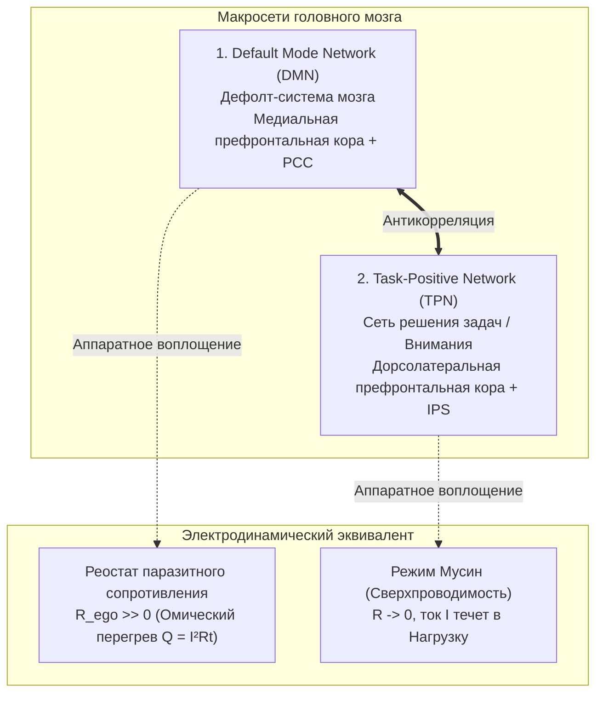

# 29. Нейробиология сверхпроводимости: DMN как аппаратный реостат Эго, TPN как фокус Мусин и блуждающий нерв как заземление Тандэна

> [!quote] Цитата Канона
> ### ⚡ **«Эго — это не философская абстракция и не кармический грех. Это конкретная нейросеть мозга — Default Mode Network. Когда она активна, контур работает на холостой перегрев. Когда вы включаете прямое действие (TPN), реостат падает в ноль, и наступает физиологическая сверхпроводимость.»**  
> — **Владимир Аньянов**

---

## 🔬 1. Анатомический субстрат электродинамики сознания

На протяжении веков духовные учения Востока и Запада говорили о «смерти эго», «чистом присутствии» и «просветлении». Однако для строгого инженерного и научного ума эти понятия оставались туманными метафорами. 

**Архитектура счастья Владимира Аньянова** впервые сопоставляет физику цепи с современной функциональной нейровизуализацией (фМРТ) и нейробиологией. Человеческий мозг — это не монолитный процессор, а сложная динамическая электросеть с двумя взаимоисключающими макро-режимами работы:



---

## 🧠 2. DMN (Default Mode Network) — Аппаратное воплощение $R_{\text{ego}}$

Открытая Маркусом Райхлом (Marcus Raichle) в 2001 году дефолт-система мозга объединяет вентромедиальную префронтальную кору, заднюю поясную кору (PCC) и нижнюю теменную долю.

### Механика работы DMN:
1. **Холостой ход и самореференция:** DMN включается автоматически в ту секунду, когда человек **перестает взаимодействовать с реальным физическим миром**.
2. **Нарративное «Я»:** DMN непрерывно прокручивает три типа ментальных симуляций:
   - *Прошлое:* «Почему я так сказал? Что обо мне подумали? Зачем я ошибся?» (омические потери $R_{\text{past}}$).
   - *Будущее:* «А вдруг меня уволят? А вдруг она откажет? А что если кризис?» (омические потери $R_{\text{future}}$).
   - *Социальный статус:* сравнение себя с другими («Я выше или ниже? Я успешен или неудачник?»).
3. **Электродинамика:** Активность DMN порождает высокое омическое сопротивление проводки внимания ($R_{\text{ego}} \gg 0$). Ток энергии Тандэна не доходит до 6 ламп, а циркулирует по кольцу DMN, вызывая **омический перегрев по закону Джоуля — Ленца**:
   $$Q = I^2 \cdot R_{\text{ego}} \cdot t$$
   Субъективно это ощущается как истощение, тревога, выгорание и хроническая усталость при полном отсутствии физической работы.

---

## 🎯 3. TPN (Task-Positive Network) — Физиология режима Мусин ($R \to 0$)

Второй макросетью мозга является **Task-Positive Network (TPN)** — сеть прямого действия и внешнего фокуса (включает дорсолатеральную префронтальную кору, фронтальные глазные поля и интрапариетальную борозду).

### Закон антикорреляции DMN и TPN:
> В физиологии мозга доказан закон взаимного торможения: **DMN и TPN не могут быть активны одновременно**. Включение прямого сенсорного взаимодействия с физической реальностью аппаратным путем подавляет дефолт-систему.

Когда хирург делает надрез, программист пишет критический алгоритм, музыкант берет аккорд, а мастер чайной церемонии наливает кипяток в пиалу:
- TPN выходит на максимальную мощность.
- DMN полностью затухает.
- Самореференция (мысли о себе) исчезает.
- $R_{\text{ego}}$ падает до нуля ($R \to 0$).
- Наступает **режим сверхпроводимости цепи (Мусин)**. Ток течет беспрепятственно, КПД контура достигает 100%, усталость исчезает, а переживание счастья становится абсолютным.

---

## 🫀 4. Блуждающий нерв (Vagus Nerve) и Вариабельность Пульса (HRV) — Заземление Тандэна

Какова физиологическая природа источника питания — **Тандэна**?

Тандэн — это не метафизическая точка. Это **нейросоматический комплекс брюшного мозга (энтеральной нервной системы) и вентрального блуждающего нерва (Vagus nerve)**:
1. **Энтеральная нервная система:** 500 миллионов нейронов в брюшной полости производят более 90% серотонина и 50% дофамина всего организма.
2. **Вентральный вагусный комплекс (теория Стивена Порджеса):** блуждающий нерв связывает ствол мозга с сердцем, легкими и диафрагмой. 
   - При поверхностном грудном дыхании симпатическая система сигнализирует об опасности (включая DMN и спазм).
   - При глубоком **брюшном дыхании Тандэном** активируется вентральный вагус, сердце замедляется, вариабельность сердечного ритма (HRV) возрастает до максимальных гармонических значений, а уровень кортизола падает.

```
Грудное дыхание (Страх / Эго)   ──► Симпатический спазм ──► DMN активна ──► R >> 0 (Перегрев)
Брюшное дыхание (Тандэн / Вагус) ──► Парасимпатический тон ──► TPN активна ──► R -> 0 (Сверхпроводимость)
```

---

## 🛠️ 5. Практический протокол: Аппаратное переключение DMN ➔ TPN за 20 секунд

Если вы чувствуете приступ тревоги, синдром самозванца или ментальную жвачку (активировалась DMN, $R_{\text{ego}} \gg 0$), бесполезно «уговаривать себя мыслить позитивно». Мысли о мыслях только усиливают DMN.

Нужно применить **аппаратный протокол вагусного заземления**:
1. **Физический якорь Тандэна (5 сек):** Перенесите центр внимания на 3 пальца ниже пупка. Сделайте медленный вдох животом, надувая нижнюю часть пресса.
2. **Длинный вагусный выдох (5 сек):** Медленный выдох через слегка сжатые губы (выдох длиннее вдоха в 2 раза). Это мгновенно активирует блуждающий нерв и сбрасывает пульс.
3. **Сенсорный захват TPN (10 сек):** Зафиксируйте глазами 3 конкретных физических объекта вокруг себя (текстуру стола, блик света на стекле, холод металла ручки). Прикоснитесь рукой к материалу.

**Результат:**  
DMN аппаратным образом выключается за счет активации первичной соматосенсорной коры и TPN. Реостат $R_{\text{ego}}$ сброшен в ноль. Цепь возвращена в режим сверхпроводимости.

---

## 🔗 Связи
- [[04_Maps/Inner Current MOC|Inner Current MOC]]
- [[02_Wiki/Inner Current (Physics of Presence and Superconductivity)|02. Физика присутствия: состояние сверхпроводимости]]
- [[02_Wiki/Inner Current (Nature and Illusion of Ego)|07. Природа и иллюзия эго]]
- [[02_Wiki/Inner Current (Core Topology and Polarity Law)|01. Базовая топология цепи и закон полярности]]

---
*Created: 2026-09-23 | Author: Vladimir Anyanov & Antigravity*
