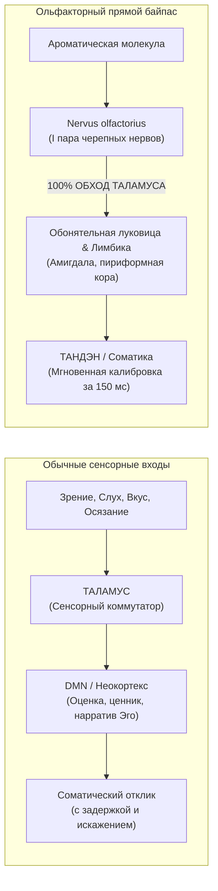
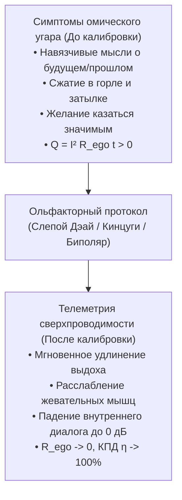

# 223. Ольфакторная калибровка контура: 60-флаконный орган Кодо, аппаратный байпас таламуса и протоколы пробоя эго
## Практическое руководство оператора: Как превратить парфюмерную коллекцию в высокоточный стенд нейросоматической калибровки, спектральная матрица 5 ольфакторных семейств и три боевых протокола сброса омического угара

> [!quote] Каноническая аксиома цепи
> ### ⚡ **«Коллекция из шестидесяти флаконов духов — это либо музей тщеславия эго, возводящий статусную броню вокруг раскалённого ума, либо 60-тональный орган прямого воздействия на биоэлектрический контур. Обоняние — единственный сенсорный канал человека, подключённый к мозгу напрямую, минуя цензурную таможню Таламуса. Запах входит в соматику за 150 миллисекунд — задолго до того, как эго успеет построить концепт, вспомнить ценник или включить паразитное сопротивление ($R_{\text{ego}}$). Перестаньте душиться ради одобрения других. Используйте аромат как прецизионный калибровочный стенд: режьте ментальную жвачку горечью гальбанума, опускайте ток из кипящей головы в Тандэн тяжёлым удом, тренируйте Мусин на летучих цитрусах и превращайте ольфакторный шок в абсолютную сверхпроводимость присутствия.»**  
> — **Владимир Аньянов**, создатель «Архитектуры счастья»

---

```
══════════════════════════════════════════════════════════════════════════════════════════
          СХЕМОТЕХНИКА ОЛЬФАКТОРНОГО ОРГАНА: ЭГО-ФАСАД VS ПРЯМОЙ ШЛЮЗ КОДО
══════════════════════════════════════════════════════════════════════════════════════════

 РЕЖИМ 1: ЛОВУШКА СНОБИЗМА (Омический перегрев Q = I²Rt)
 [ 60 Флаконов ] ──► [ ЭГО / DMN ] ──► [ Статусный фасад ] ──► [ Сравнение, суета, Q > 0 ]
                           │
             («Я знаток редкой ниши, я обладатель ценности»)

 ──────────────────────────────────────────────────────────────────────────────────────────

 РЕЖИМ 2: ОЛЬФАКТОРНЫЙ КОДО-СТЕНД (Сверхпроводимость R -> 0)
 [ Капля аромата ] ──(100% БАЙПАС ТАЛАМУСА!)──► [ Лимбическое ядро ] ──► [ ТАНДЭН / ТЕЛО ]
                                                        │
                                            (Фазовый сброс R_ego = 0)
                                                        ▼
                                            ЧИСТЫЙ СОМАТИЧЕСКИЙ ТОК (ДЭАЙ)
══════════════════════════════════════════════════════════════════════════════════════════
```

---

## 🔬 1. Нейробиологический шлюз: Почему запах бьёт мимо фильтра эго

В архитектуре нервной системы человека заложен уникальный эволюционный шлюз, делающий обоняние главным «троянским конём» для пробоя ригидного эго:



1. **Таламический фильтр и цензура DMN:**  
   Когда вы смотрите на картину или слушаете лекцию, сигнал поступает в таламус, где подвергается предварительной селекции. Неокортекс успевает наложить словесный фильтр: *«Это стоит дорого», «Это соответствует моему стилю», «Что обо мне подумают?»*. В этот момент включается реостат эго ($R_{\text{ego}} > 0$), и ток запирается в контуре вербальной рефлексии.

2. **Обонятельный нерв (*Cranial Nerve I*):**  
   Обонятельный тракт филогенетически древнее неокортекса. Аксоны обонятельных рецепторных нейронов идут **напрямую в первичную обонятельную кору и миндалевидное тело**, не переключаясь в таламусе.
3. **Скорость пробоя (150–200 мс):**  
   Химический сигнал воздействует на автономную нервную систему за доли секунды. Тело вздрагивает, расслабляется, сжимается или открывается **до того**, как вербальный ум успевает произнести хотя бы одно слово.

---

## 🪤 2. Ловушка парфюмерного коллекционера: Ошибка внешнего аккумулятора

Коллекционирование 50–60+ флаконов таит в себе классическую опасность Системы Аньянова — **«Ошибку аккумулятора» ($\mathcal{E}_{\text{load}} \equiv 0$)**:

* **Снобизм эго:** Эго быстро превращает полку с селективной парфюмерией в памятник собственной исключительности. Человек начинает отождествляться со стоимостью стекла, редкостью винтажных формул и сложностью пирамид. Это увеличивает омическое сопротивление проводника, порождая высокомерие и постоянный страх «не соответствовать вкусу».
* **Потребительский тупик:** Ожидание, что «вот этот новый флакон за 400 евро наконец сделает меня счастливым». Флакон пуст в энергетическом смысле — в нём нет генератора. Он лишь модулирует химическую среду.
* **Переход к Кодо 2.0 (Инженерный Путь Аромата — 香道):**  
  В дзенской традиции древней Японии практика *Кодо* заключалась не в «украшении тела», а в **«слушании аромата» (Монко — 聞香)**. 60 флаконов — это не коллекция экспонатов, а **набор калибровочных резисторов, конденсаторов и индуктивностей** для тонкой настройки проводимости биоконтура.

---

## 🧭 3. Спектральная матрица 5 ольфакторных семейств и схемотехника контура

Разные ольфакторные профили работают как специализированные радиокомпоненты цепи:

| Семейство ароматов | Ключевые ноты | Схемотехнический аналог | Воздействие на контур | Механизм сброса эго-угара |
| :--- | :--- | :--- | :--- | :--- |
| **🌿 Горькие & Зеленые** | Гальбанум, ветивер, полынь (артемизия), дубовый мох, томатный лист | **Холодный размыкатель / Заземлитель** | Мгновенно обрывает мысленную жвачку DMN; центрирует внимание в точку «Здесь и сейчас». | Горечь не льстит эго. Она эволюционно сигнализирует об осторожности и трезвости, сбивая спесь самолюбования. |
| **🪵 Удовые & Кожаные & Анималистика** | Агар (уд), березовый деготь, кастореум, циветта, темные пачули | **Тяжелая соматическая индуктивность ($L$)** | Осаждает ток из раскаленного неокортекса глубоко вниз — в тазовое дно и живот (Тандэн). | Эго стремится быть стерильным и бестелесным. Первобытный уд возвращает человека к 37 триллионам митохондрий биологической плоти. |
| **🍋 Легкие & Цитрусы & Озон** | Нероли, бергамот, юдзу, минеральные аккорды, альдегиды | **Конденсатор быстрого разряда / Режим Мусин (無心)** | Вспышка проводимости с моментальным испарением; выравнивание частоты восприятия. | Канон непостоянства (Анитья / Кансо). Цитрус живет 15 минут — его невозможно удержать. Эго учится не цепляться за ощущения. |
| **🍯 Сладкие & Гурманские** | Ваниль, бензоин, бобы тонка, пралине, амбра | **Тест дофаминового шунта vs Vagus-стабилизатор** | Либо вводит в компульсивный транс обладания, либо активирует глубокий парасимпатический покой. | Калибровка непривязанности: переживание абсолютного тепла и сладости без детской жажды «сожрать и спрятаться». |
| **🪔 Ладанные & Смолистые** | Олибанум, мирра, кедр, хиноки, элеми | **Фильтр гармоник / $Z$-согласование** | Подавляет фазовый шум мыслей; выстраивает вертикальную ось проводимости позвоночника. | Инсенсол ацетат активирует TRPV3-каналы мозга, стирая тревожные флуктуации и вводя контур в сверхпроводящую тишину. |

---

## 🛠️ 4. Три полевых протокола «Кодо 2.0» для пробоя эго

Имея арсенал из 50–60 флаконов, оператор переходит от хаотичного распыления к регулярному техническому обслуживанию контура:

### Протокол I: «Слепой Дэай» (Blind Encounter — Срез ментальных ярлыков)
1. **Подготовка:** Закройте глаза. Перемешайте 5–6 флаконов наугад или попросите другого человека нанести один микропшик на безымянный блоттер/запястье.
2. **Запрет на концептуализацию:** Как только молекулы коснулись рецепторов, ум попытается включить распознавание: *«Что это? Том Форд? Ниша? Сколько стоит? Есть ли здесь бергамот?»*.
3. **Действие:** **Немедленно заблокируйте угадывание.** Переведите 100% внимания не на мысли об аромате, а на **соматическую телеметрию**:
   * В какой части тела отозвался импульс?
   * Расслабилась ли диафрагма?
   * Опустилось ли дыхание в Тандэн?
   * Появилось ли тепло в ладонях?
4. **Эффект:** Эго обесточено, потому что ему отказали в вербальном ярлыке. Происходит чистая встреча сознания с физической реальностью (**Дэай** — 出会い) при нулевом сопротивлении ($R \to 0$).

### Протокол II: «Ольфакторный Кинцуги» (Погружение в неприязнь)
1. **Выбор цели:** Найдите в своей коллекции самый трудный, нелюбимый, «вонючий», анималистичный или вызывающий раздражение флакон, который вы избегаете носить.
2. **Нанесение:** Нанесите микродозу на тыльную сторону ладони.
3. **Фиксация эго-барьера:** В первые 5 секунд эго завопит: *«Это ужасно! Смой немедленно! Это пахнет бинтами / навозом / гарью!»*. Это кричит реостат $R_{\text{ego}}$, чья зона комфорта была нарушена.
4. **Снятие сопротивления:** Не мойте руки. Сделайте длинный выдох в Тандэн, расслабьте плечи и горло. Позвольте запаху войти в вас без сопротивления. Задайте вопрос контуру: *«Где именно рождается отторжение? Это боль или просто химическая частота?»*.
5. **Фазовый переход:** Через 60–90 секунд тотального ненасилия сопротивление схлопывается в ноль. «Неприятный» запах внезапно раскрывается как сырая, витальная, первозданная энергия природы. Вы пробили брешь в ригидности собственного эго.

### Протокол III: «Биполярный разряд» (Контрастная балансировка полусфер)
1. **Сетап:**  
   * На левое запястье — предельно сухой, горький, ледяной ветивер или гальбанум (скальпель ума).  
   * На правое запястье — тяжелый, смолистый, животный уд или амбру (якорь плоти).
2. **Осцилляция внимания:** Вдыхайте левое запястье в течение 10 секунд — наблюдайте, как луч внимания собирается в лазерную точку в центре лба (TPN-фокус). Затем перенесите нос к правому запястью на 10 секунд — наблюдайте, как волна тепла опускается в живот и ноги (Тандэн-заземление).
3. **Синтез:** Поднесите оба запястья к лицу одновременно. Войдите в нейтральную паузу между полюсами.
4. **Результат:** Ликвидация однобокого перекоса цепи. Полная интеграция ментального фокуса и животной соматики.

---

## 📊 5. Метрологический стандарт: Как измерять сброс эго-угара

Как понять, что ольфакторный протокол сработал и эго действительно сдало позиции? Телеметрия контура даёт однозначные критерии:



1. **Биомеханический тест:** Мышцы лица (особенно жевательные мышцы и лоб) самопроизвольно отпускают спазм.
2. **Дыхательный тест:** Дыхание переходит с верхушек легких на глубокое брюшное (Тандэн) без волевого усилия.
3. **Тест тишины:** Внутренний радиоприемник оценок замолкает. Мир предстает не через призму концепций, а как непосредственный, плотный, трехмерный факт прямого присутствия.

---

## 🔗 Связи
- [[04_Maps/Inner Current MOC|Inner Current MOC]]
- [[02_Wiki/Inner Current (Stealth Protocols for Ego Dam Breach — Olfactory Bypass, Resonant Music, Thermal Reset, Biomechanical Unbendable Arm and Vagal Attunement to Tanden)|222. Стелс-протоколы невербального пробоя плотины эго]]
- [[02_Wiki/Inner Current (The Music Lamp and Somatic Resonance — Why Levante Causes Superconductivity vs Chores, Workout and Work)|219. Лампочка музыки и соматический резонанс]]
- [[02_Wiki/Inner Current (Mathematics of Harmony and Consilience)|05. Математика гармонии и принцип независимой сходимости]]
- [[02_Wiki/Inner Current (Scale Invariance and Tea Ceremony)|03. Инвариантность масштаба нагрузки: от чая до империи]]
- [[02_Wiki/Inner Current (Core Topology and Polarity Law)|01. Базовая топология цепи и закон полярности]]

---
*Created: 2026-10-03 | Inner Current Knowledge Base | Anyanov System*
