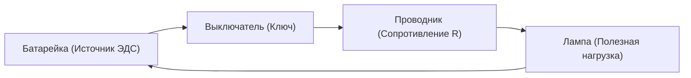
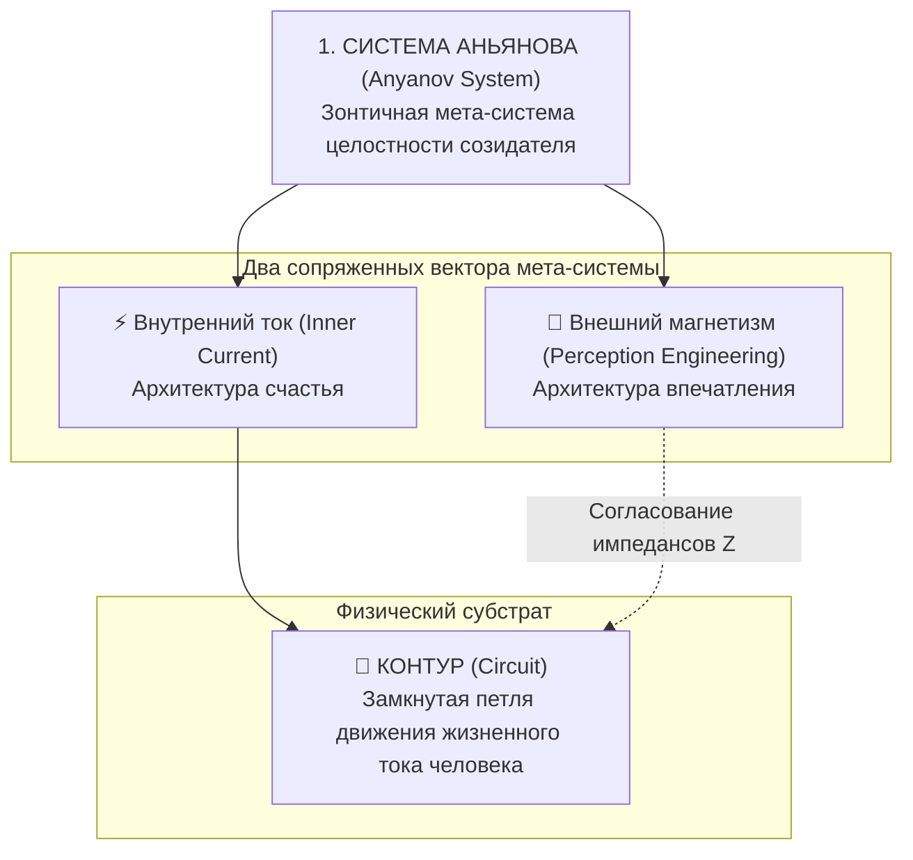
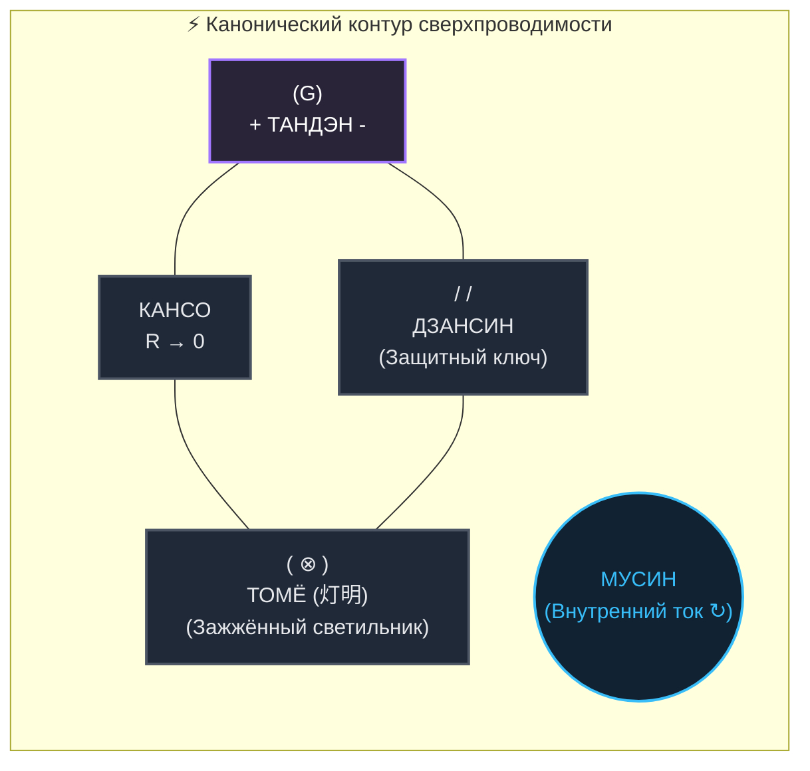
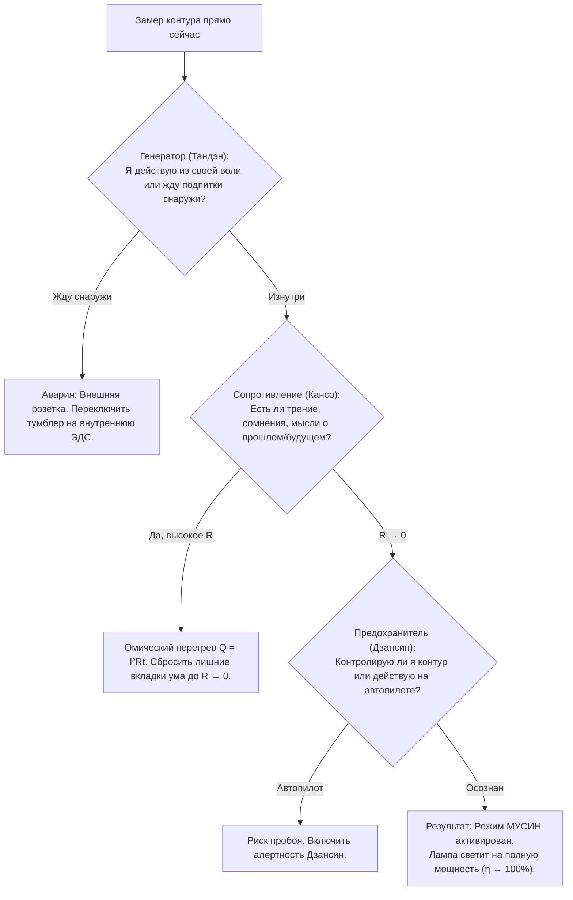

# 37. Онтология схемы: Человек или его состояние? Триада терминов (Контур, Архитектура, Система) и Блокнотный канон

> [!quote] Каноническая аксиома Системы Аньянова
> ### **⚡ «Схема на листке — это не абстрактная метафора. Это принципиальная электрическая схема человека, зафиксированная в его единственно штатном рабочем режиме — режиме сверхпроводимости.»**  
> — **Владимир Аньянов**

> «Когда человек впервые видит простую электрическую цепь с обозначениями Тандэн, Мусин, Кансо и Дзансин, у него возникает закономерный когнитивный сбой: *"Что здесь нарисовано? Это модель меня самого или это рисунок мимолётного чувства счастья? И чем вообще контур отличается от системы и архитектуры?"*  
> Данная глава навсегда устраняет эту понятийную путаницу, закрепляя строгую онтологию каждого элемента, разводя масштаб понятий и фиксируя исторический первоисточник — рукописный **Блокнотный канон** автора.»

---

## 1. Главная дихотомия: Изображение человека или его состояния?

Самый частый тупик при знакомстве с концепцией «Внутреннего тока» — попытка выбрать одну из двух крайностей: либо объявить схему *анатомическим описанием личности*, либо свести её к *психологическому портрету настроения*.

Истина лежит в точной инженерной формулировке:

$$\boxed{\text{Схема} = \text{Аппаратная топология ЧЕЛОВЕКА} \times \text{Рабочий режим СВЕРХПРОВОДИМОСТИ (Состояние)}}$$

### Инженерная аналогия: Карманный фонарик

Представьте принципиальную схему обычного автономного карманного фонарика:

1. **Сам чертёж и его компоненты** (источник питания, проводники, ключ, вольфрамовая нить лампы) — это **ЧЕЛОВЕК** как физическая и психосоматическая структура. Это его аппаратный базис (Hardware).
2. **Параметры и режим работы цепи** ($R \to 0$, ключ замкнут, паразитные емкости отсутствуют, ток $I > 0$ течет свободно, лампа ярко излучает свет) — это **СОСТОЯНИЕ СЧАСТЬЯ** (Software / Dynamic State).

Если провод окислился ($R \gg 0$) или ключ разомкнут, перед нами **тот же самый человек (фонарик)**, но находящийся в **аварийном режиме омического перегрева или обесточенности** (выгорание, депрессия, тревожность).

> **Вывод:** Схема изображает **человека**, но зафиксированного не в состоянии аварии или простоя, а в его **нормальном проектном режиме максимального КПД** ($\eta \to 100\%$).

---

## 2. Разведение понятийной триады: Контур vs Архитектура vs Мета-система

Чтобы не путаться в терминологии, необходимо строго различать три уровня абстракции в Системе Аньянова:

### Сравнительная таблица онтологических уровней

| Термин | Что это такое? | Роль в жизни человека | Физическая аналогия |
| :--- | :--- | :--- | :--- |
| **1. Контур (Circuit / Цепь)** | **Конкретная топология движения энергии.** Замкнутый путь: откуда генерируется импульс (`Тандэн`), через какую шину внимания течет (`Провод`), обо что преобразуется (`Лампа`) и как стабилизируется (`Дзансин`). | Базовый биомеханический и нейродинамический каркас присутствия человека в моменте времени. | **Медные дорожки и проводники на плате**, по которым физически бегут электроны. |
| **2. Архитектура счастья (Inner Current)** | **Инженерная теория и свод фундаментальных законов.** Онтология, объясняющая поведение контура: законы Кирхгофа, Джоуля — Ленца ($Q = I^2 R t$), природа сопротивления эго ($R_{\text{ego}}$) и математическое доказательство сверхпроводимости. | Наука и протоколы отладки: как находить утечки, устранять сопротивление и выводить систему на пиковый КПД. | **Теоретическая электродинамика и схемотехника**, объясняющая законы токов и напряжений. |
| **3. Система Аньянова (Anyanov System)** | **Глобальная зонтичная мета-система (Dual-Polarity Framework).** Полная интеграция человека с социумом, объединяющая:  1. *Внутренний ток* (Архитектура счастья — автономия ядра). 2. *Внешний магнетизм* (Архитектура впечатления — проекция образа, стиль, язык ароматов и материй). | Тотальная синхронизация: счастливый автономный созидатель внутри, оказывающий максимальное чистое воздействие на внешний мир без потерь. | **Весь космический корабль целиком**: автономный ядерный реактор внутри плюс гравитационные маневровые двигатели для взаимодействия с планетами. |

---

## 3. Блокнотный канон: Экспертиза рукописного чертежа и 3D-рендеры

Историческим первоисточником наглядного представления «Внутреннего тока» является лаконичный чертеж в клетчатом блокноте, выполненный автором, и его официальный канонический 3D-рендер:

Ниже представлена точная схемотехническая трансляция этого канона:

### Поузловой инженерный разбор пяти дзенских элементов:

#### 1. Источник ЭДС: `(G)` — Тандэн (丹田)
* **В физике:** Первичный генератор жизненной электродвижущей силы ($\mathcal{E} > 0$), создающий базовую разность потенциалов.
* **В контуре человека:** Корневой психофизический центр (низ живота, центр тяжести, блуждающий нерв). Он автономен. Человек не является аккумулятором, требующим постоянной подзарядки от чужого одобрения, внешних оценок или лайков. Он — **первичный генератор созидательной воли**. Полярность строгая: *«изнутри наружу»*.

#### 2. Нулевое сопротивление: `R → 0` — Кансо (簡素)
* **В физике:** Режим абсолютной сверхпроводимости, при котором омическое сопротивление проводника стремится к нулю.
* **В контуре человека:** Принцип простоты и очищения. Устранение ментальных «стилусов», чужих ожиданий, сомнений, обид за прошлое ($L_{\text{past}} = 0$) и тревоги за будущее ($C_{\text{future}} = 0$). Согласно закону Джоуля — Ленца:
  $$Q = I^2 R t$$
  Если $R \to 0$, то паразитный омический перегрев $Q \equiv 0$. Человек не выгорает, сколько бы работы он ни выполнял.

#### 3. Вектор тока: `МУСИН` (無心)
* **В физике:** Замкнутый квазистационарный ток $I$, безостановочно циркулирующий по контуру без турбулентных завихрений.
* **В контуре человека:** Дзенское состояние «не-ума», чистого потока и прямого действия. Сознание не спотыкается о внутренний диалог, оценщика или цензора. Мысль, воля и действие становятся единым неделимым импульсом.

#### 4. Защитный ключ / Реле: `ДЗАНСИН` (残心)
* **В физике:** Управляемый коммутационный аппарат, прерыватель и автоматический выключатель (Circuit Breaker).
* **В контуре человека:** Непрерывная остаточная осознанность и алертность. Дзансин не дает контуру «уйти в разнос» или замкнуться на токсичный внешний контакт. При возникновении нештатной нагрузки оператор цепи осознанно размыкает контакт, предотвращая пробой изоляции, а затем плавно замыкает его обратно.

#### 5. Нагрузка: `ТОМЁ` (灯明) — Зажжённый священный светильник (Любое земное дело)
* **В физике:** Активная нагрузка ($R_{\text{load}}$), через которую физически протекает ток и преобразуется в непрерывный поток фотонов видимого света.
* **В контуре человека:** **Любое земное дело, наполненное током жизни.** Лампа на схеме — это не холодная стеклянная колба на складе и не пассивная рутина. Она **уже горит**, потому что цепь замкнута и ток запущен. 
  * Написание кода под током — это **Томё архитектуры**.
  * Игра на фортепиано под током — это **Томё музыки и звука**.
  * Свидание с любимым человеком под током — это **Томё близости и тепла**.
  * Заваривание чая под током — это **Томё присутствия**.
  * **Томё** — это точка, где невидимая внутренняя сила человека озаряет материальный мир.

---

## 4. Почему эта схема называется «Контуром счастья»?

В обыденном сознании счастье считается «целью», к которой нужно стремиться, или «наградой», которую выдают за заслуги.

Блокнотная схема наглядно демонстрирует фундаментальную ошибку этого взгляда:

> **Свет лампы невозможно купить, догнать или выпросить. Свет — это автоматическое, неизбежное физическое следствие замкнутого сверхпроводящего контура.**

1. Если в центре цепи крутится **Мусин** ($I > 0$),
2. Если в шине внимания царит **Кансо** ($R \to 0$),
3. Если снизу контур защищен **Дзансином** (замкнут без пробоя),
4. А слева работает **Тандэн** ($\mathcal{E} > 0$), —

**ЛАМПА НЕ МОЖЕТ НЕ СВЕТИТЬ.** Это фундаментальный закон природы, такой же строгий, как закон всемирного тяготения или законы термодинамики. 

Счастье — это не лампочка сама по себе. **Счастье — это режим, в котором находится вся замкнутая цепь.**

---

## 5. Быстрый диагностический опросник оператора цепи (15 секунд)

Глядя на эту блокнотную схему, любой человек может мгновенно протестировать свое текущее состояние без сложных психологических тестов:

---

## 6. Резюме для созидателя

* **Что нарисовано на схеме?** Электродинамическая модель человека в состоянии внутренней сверхпроводимости.
* **Контур** — это путь движения тока.
* **Архитектура счастья** — это законы и физика этого движения.
* **Система Аньянова** — это вся полнота проявления: от внутреннего реактора до внешнего стиля и воздействия на цивилизацию.

---

## 🔗 Связи
- [[04_Maps/Inner Current MOC|Inner Current MOC (Карта понятий)]]
- [[02_Wiki/Inner Current (Canonical Definitions of Happiness — Technical and Intuitive Formulations)|22. Канонические определения счастья в Системе Аньянова]]
- [[02_Wiki/Inner Current (Physics of Presence and Superconductivity)|02. Физика присутствия: состояние сверхпроводимости]]
- [[02_Wiki/Inner Current (Core Topology and Polarity Law)|01. Базовая топология цепи и закон полярности]]
- [[02_Wiki/Inner Current (Safety, Antifragility and Zanshin)|04. Предохранители цепи, ваби-саби и антихрупкость]]
- [[02_Wiki/Inner Current (The Nature of the Light Bulb and Zen Load)|17. Природа лампочки и закон нагрузки по канонам Дзена]]
- [[02_Wiki/Inner Current (Impression Architecture and Impedance Matching)|08. Система Аньянова: Внутренний ток и Внешний магнетизм]]
- [[index|Главный индекс Базы Знаний (LLM Wiki)]]
