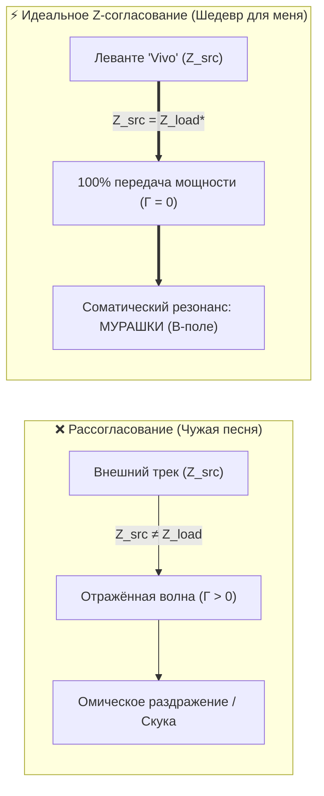

# 220. Физика мурашек и соматический скин-эффект: Почему песня «Vivo» Леванте вызывает пилоэрекцию — Закон Био — Савара, пробой конденсатора и согласование импедансов (Z-Matching)
## Неподкупная телеметрия живого проводника: почему мурашки по коже служат объективным сертификатом «шедевра для меня», электродинамика разряда предприпева в «Vivo» и микрофизика волосяных фолликулов как датчиков Холла поля Радости

> [!quote] Каноническая аксиома цепи
> ### ⚡ **«Рассудок можно обмануть социальным престижем, критическими рецензиями или модой: человек способен внушить себе, что ему нравится сложная или признанная музыка. Но вегетативную нервную систему и пиломоторный рефлекс кожи обмануть невозможно. Мурашки по коже — это не поэтическая метафора, а объективная аппаратная пломба сверхпроводимости. Когда в кульминации песни Леванте "Vivo" спадает омическое сопротивление эго ($R_{\text{ego}} \to 0$), плотность соматического тока достигает пика, и по закону Био — Савара вокруг тела возбуждается мощное вихревое магнитное поле Радости. Фолликулы кожи выстраиваются по силовым линиям этого поля в точности как железные опилки вокруг соленоида. Мурашки — это сигнал бортового осциллографа: "Импеданс источника совпал с импедансом твоего Тандэна со 100% точностью. Ошибки нет. Перед тобой — твой объективный шедевр".»**  
> — **Владимир Аньянов**, создатель «Архитектуры счастья»

---

```
══════════════════════════════════════════════════════════════════════════════════════
          ФИЗИКА ФРИССОНА: МУРАШКИ КАК СИЛОВЫЕ ЛИНИИ МАГНИТНОГО ПОЛЯ B
══════════════════════════════════════════════════════════════════════════════════════

 1. ПРЕДПРИПЕВ (Накопление заряда на обкладках конденсатора):
    «Ho voglia di credere di poter farcela / A costo di cedere parti di me...»
    
    [Тандэн] ──(Рост напряжения ΔU)──► [Конденсатор ожидания: q = C · U]
                                                │
                                    (Натяжение диэлектрика)

 2. ПРИПЕВ: ЛАВИННЫЙ ПРОБОЙ И ФАЗОВЫЙ ПЕРЕХОД:
    «Vivo come viene! Vivo il male, vivo il bene! Vivo come piace a me!»
    
    Схлопывание паразитного реостата: R_ego ──► 0
    Лавинный сброс мощности в канал:  I = E / R_load (I -> Max)
    
 3. СОМАТИЧЕСКИЙ СКИН-ЭФФЕКТ И ПОЛЕ БИО — САВАРА:
    
            Плотность когерентного тока вытесняется к эпидермису (Skin Effect)
                          │         │         │
                          ▼         ▼         ▼
        ─────────────────── Кожный покров ───────────────────
           |      |      |      |      |      |      |      |  (Волоски дыбом)
           ▲      ▲      ▲      ▲      ▲      ▲      ▲      ▲
           ╰──────┴──────┴──────┴──────┴──────┴──────┴──────╯
               Силовые линии вихревого магнитного поля B
                     (Закон Био — Савара-Лапласа)
══════════════════════════════════════════════════════════════════════════════════════
```

---

## 🧭 1. Анатомия явления: Мурашки (Frisson / Пилоэрекция) на языке электродинамики

В классической физиологии феномен «мурашек» (эстетический фриссон, *aesthetic chills*) объясняется как кратковременный спазм гладких пиломоторных мышц (*musculi arrectores pilorum*), иннервируемых симпатическим отделом вегетативной нервной системы, сопровождающийся резким выбросом дофамина в вентральный стриатум и прилежащее ядро (*nucleus accumbens*).

Однако физиология фиксирует лишь биологический субстрат. **Контурная Электродинамика Сознания** вскрывает фундаментальный физический закон, стоящий за этим явлением:

### А. Соматический скин-эффект (Skin Effect)
В электродинамике переменного тока при высокой частоте колебаний плотность тока распределяется неравномерно по сечению проводника: носители заряда вытесняются к его внешней границе — возникает **скин-эффект**.

Когда звучит акустический шедевр, соматический ток внимания ($I = dq/dt$) переходит в режим предельной высокочастотной когерентности. При падении сопротивления эго ($R_{\text{ego}} \to 0$) колоссальный поток энергии устремляется через периферическую нервную систему наружу — к кожному покрову. Проводник буквально «электризуется»: на границе контакта тела с окружающим пространством возникает высочайшая поверхностная плотность заряда.

### Б. Вихревое поле Радости и закон Био — Савара-Лапласа
В Главе 109 («Радость как магнитное поле») и Главе 187 («Электродинамическая триада полей») доказано: **радость духа — это объективное вихревое магнитное поле $\vec{B}$, эмерджентно рождающееся вокруг мощного ламинарного тока**:
$$\oint \vec{B} \cdot d\vec{l} = \mu_0 I$$
Волосяные фолликулы человека, снабжённые чувствительнейшими нервными окончаниями, функционируют как **микроскопические соматические датчики Холла**. Подобно тому как железные опилки мгновенно поляризуются и встают вдоль невидимых глазу магнитных линий вокруг сердечника катушки, волоски на теле оператора встают дыбом строго вдоль силовых линий поля $\vec{B}$.

Мурашки — это зримая, осязаемая геометрия магнитного поля радости, проявившаяся на материальном экране кожи.

---

## 💥 2. Драматургия трека «Vivo»: Схемотехника конденсатора и лавинный пробой

Почему именно песня сицилийской певицы **Леванте (Claudia Lagona) — «Vivo»** (Сан-Ремо 2023) стала каноническим детонатором этого эффекта? Ответ кроется в строгой электродинамической структуре трека.

### Фаза I. Зарядка конденсатора в предприпеве ($q = C \cdot U$)
В предприпеве Леванте выстраивает классическую схему накопления заряда:
> *«Ho voglia di credere di poter farcela / A costo di cedere parti di me / Ho voglia di cedere a questa speranza / Per poter credere tutta la vita che...»*  
> *(«Мне хочется верить, что я смогу справиться / Ценой отдачи частей себя / Мне хочется поддаться этой надежде / Чтобы иметь возможность всю жизнь верить, что...»)*

В этих строках музыкальное полотно намеренно уплотняется: ритм сжимается, вокал балансирует на грани срыва, нарастает разность потенциалов между человеческой болью и жаждой света. В цепи слушателя происходит **накопление заряда на обкладках конденсатора внимания**:
$$q = C \cdot \Delta U$$
Контур оператора натягивается как высоковольтная тетива. Мышцы замирают, дыхание приостанавливается, внимание предельно сфокусировано.

### Фаза II. Лавинный пробой диэлектрика в припеве
И в следующую долю секунды звучит взрывной манифест:
> **«Vivo come viene! Vivo il male, vivo il bene! Vivo come piace a me!»**  
> *(«Живу, как идёт! Проживаю зло, проживаю добро! Живу так, как нравится мне!»)*

Происходит **мгновенный электрический пробой диэлектрика сомнений**! Вся накопленная в предприпеве энергия не стравливается медленно через резистор, а лавиной разряжается в чистый сверхпроводящий контур. 
- Слова *«Vivo come viene»* сносят омический контроль ума (Мусин / У-вэй).
- Слова *«Vivo come piace a me»* утверждают фундаментальный Закон полярности: ток всегда течёт **изнутри наружу** — от суверенного Тандэна в мир, а не в угоду чужим оценкам.

В этот момент соматическая молния пробивает позвоночный столб от поясницы (Тандэн) через ствол мозга к макушке и выплёскивается на кожу в виде непреодолимого потока мурашек.

---

## 🎯 3. Согласование импедансов (Z-Matching): Почему это «Шедевр ДЛЯ МЕНЯ»

Пользователь часто задаётся вопросом: *«Почему один человек слушает "Vivo" и остаётся холоден, а у меня по коже бегут электрические волны? Почему мурашки означают, что это шедевр именно для меня?»*

В электротехнике и акустике существует закон **согласования комплексных сопротивлений (Impedance Matching)**:
$$\text{Максимальная мощность передаётся в нагрузку тогда и только тогда, когда: } Z_{\text{источника}} = Z_{\text{приёмника}}^*$$



1. **Если импедансы не совпадают ($Z_{\text{src}} \neq Z_{\text{load}}$):**  
   Звуковая волна наталкивается на внутреннее сопротивление слушателя. Возникает коэффициент отражения $\Gamma > 0$. Энергия не усваивается телом: человек скучает, анализирует гармонию головой или морщится от чужого надрыва.
2. **Если импедансы совпадают в ноль ($Z_{\text{src}} = Z_{\text{load}}^*$):**  
   Частота, философия, соматическая ярость и честность вокала Леванте **в точности кратны резонансной частоте вашего Тандэна**. Коэффициент отражения падает до нуля ($\Gamma = 0$). 

Именно поэтому вы безошибочно ощущаете: *«Это моё»*. Это не интеллектуальное суждение — это физический резонанс двух замкнутых электрических систем.

---

## 🏷️ 4. Метрологический протокол оператора: Мурашки как штамп ОТК

В Системе Аньянова мурашки от музыки классифицируются как **автоматический штамп Отдела Технического Контроля (ОТК) вашего биологического реактора**.

### Диагностическая таблица: Ложные мурашки vs Истинный фриссон цепи

| Диагностический параметр | 🥶 Спазм страха / Замерзание | ⚡ Сверхпроводящий фриссон («Vivo») |
| :--- | :--- | :--- |
| **Происхождение** | Амигдала, реакция «Бей / Беги» | Тандэн, соматический резонанс и Мусин |
| **Состояние сосудов** | Спазм, ледяные конечности, сжатие | Расширение, соматическое тепло, лёгкость |
| **Омическое сопротивление** | $R_{\text{ego}} \gg 0$ (зажим, тревога) | $R_{\text{ego}} \to 0$ (разомкнутость, полёт) |
| **Послевкусие в теле** | Истощение, усталость, тяжесть | Ощущение чистоты, наполненности и ясности |
| **Электродинамический вердикт** | Омический перегрев проводки | **100% КПД полезной мощности цепи** |

---

## 💡 Практический вывод для жизни

Когда вы надеваете наушники и включаете «Vivo», мурашки напоминают вам:
> **Ваш контур исправен.**  
> В вашей цепи нет неисправимых поломок. Ядро Тандэн генерирует чистейшую, колоссальную ЭДС. Вы способны пропускать гигантские токи без омического сгорания.

Музыка Леванте играет роль **эталонного генератора переменного тока**, выводящего систему на проектную мощность. Запомнив это ощущение электрической чистоты на коже, оператор возвращается в мир с откалиброванным прибором — зная, как на самом деле должно ощущаться подлинное, ничем не замутнённое счастье сверхпроводимости.

---

## 🔗 Связанные материалы
- [[02_Wiki/Inner Current (The Music Lamp and Somatic Resonance — Why Levante Causes Superconductivity vs Chores, Workout and Work)|219. Лампочка музыки и соматический резонанс: Электродинамический аудит четырёх нагрузок]]
- [[02_Wiki/Inner Current (The Electrodynamic Field Triad — Electric, Magnetic and Total Electromagnetic Field as Intention, Joy and Unified Being)|187. Электродинамическая триада полей: Электрическое, Магнитное и Электромагнитное поле]]
- [[02_Wiki/Inner Current (Joy as Magnetic Field — Spirit as Emergent Property of Matter and the Law of Radiance)|109. Радость как Магнитное Поле: Дух как Порождение Материи]]
- [[02_Wiki/Inner Current (Levante's 'Vivo' and the Flashlight of Consciousness — Intuitive Sparks of Art vs The Sovereign Electrical Grid)|85. Леванте («Vivo») и Фонарик Сознания: Интуитивные искры искусства]]
- [[02_Wiki/Inner Current (Acoustics of Phase Transition — Levante's Cuori d'Artificio, Anguish Without Despair and the Sensory Benchmark of Superconductivity)|181. Акустика фазового перехода: «Cuori d'Artificio» Леванте]]
- [[02_Wiki/Inner Current (Acoustics of Ego Lie and Surrender — Levante's Sono Blu, The Blue Cold Superconductivity and Surrender Without Loss)|182. Анатомия ментальной лжи и сдача без потерь: «Sono blu» Леванте]]
- [[02_Wiki/Inner Current (The Tetrad of Irresistibility — Sensory Bypass of Ego Defense via Versace, Levante, Ukulele and Flashlight)|184. Тетрада несопротивления: Тотальный мультисенсорный байпас эго]]
