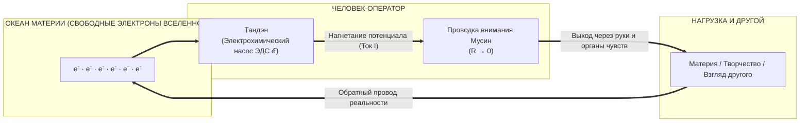
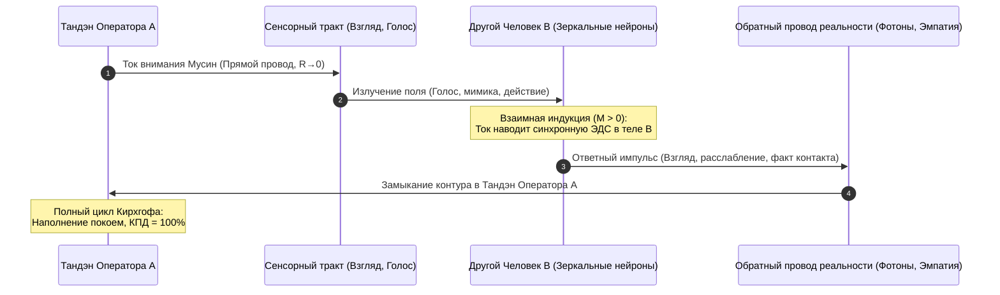

# 122. Физика неделимого заряда: Почему в природе нет «электронов духа» и какой ток возвращается через Другого
## Снятие скрытого идеализма, квантовая тождественность носителей тока, Тандэн как электрохимический ЭДС-насос и строгое физическое определение Единства

> [!quote] Каноническая аксиома цепи
> ### ⚡ **«В природе нет и не может быть отдельных "электронов духа" и "электронов материи". Тот же самый элементарный электрический заряд ($e \approx -1{,}602 \times 10^{-19}$ Кл), который выталкивается разностью соматических потенциалов в Тандэне, течёт по нервной системе, выходит через руки и органы чувств в осязаемую материю мира, совершает полезную работу в нагрузке и замыкается обратно. Человек и Вселенная сделаны из одного и того же физического электричества. Единство — это не поэтическая метафора, а непрерывность замкнутого контура.»**  
> — **Владимир Аньянов**

---

## 🏛️ 1. Крах «электронов духа»: Радикальный физический монизм

Главный скрытый порок почти всех философских и духовных систем прошлого — даже тех, что провозглашали единство (монизм, Адвайта), — заключался в **бессознательном постулировании двух разных субстанций**:
* Есть «грубая физическая материя» (электроны, атомы, камни, шестерёнки).
* И есть некая «тонкая духовная энергия» (прана, ци, витальная сила, ментальный свет), якобы живущая по собственным, нематериальным законам.

Этот дуализм неизбежно вёл к шизофрении познания: физику отдавали инженерам, а переживания — мистикам и психоаналитикам.

```
════════════════════════════════════════════════════════════════════════════════
                  ТУПИК ДУАЛИЗМА СУБСТАНЦИЙ (ПРОШЛОЕ)
════════════════════════════════════════════════════════════════════════════════
«Материальные электроны» (CERN, физика)  ≠  «Духовная энергия» (Прана, Ци, Душа)
        [Строгие законы, формулы]                      [Туман, мистика, мораль]
════════════════════════════════════════════════════════════════════════════════
                     ▼ РАДИКАЛЬНЫЙ СДВИГ АНЬЯНОВА (2026) ▼
               ЕДИНОЕ ЭЛЕКТРОМАГНИТНОЕ ПОЛЕ И ОДНИ И ТЕ ЖЕ ФЕРМИОНЫ
════════════════════════════════════════════════════════════════════════════════
```

### Теорема о квантовой тождественности
В Стандартной модели физики элементарных частиц и квантовой электродинамике действует фундаментальный закон: **все электроны во Вселенной абсолютно тождественны и неразличимы**.
* У них строго одинаковая масса покоя ($m_e \approx 9{,}109 \times 10^{-31}$ кг).
* Строго одинаковый неделимый отрицательный заряд ($e \approx -1{,}602 \times 10^{-19}$ Кл).
* Строго одинаковый спин ($1/2$).

В природе физически не существует электрона, на котором стояла бы метка «принадлежит душе» или «принадлежит мертвому камню». Электрон, участвующий в окислительном фосфорилировании в митохондриях ваших клеток, ничем не отличается от электрона в кремниевом затворе транзистора и электрона в сетчатке глаза человека напротив.

Система Аньянова беспощадно отсекает последний рубеж идеализма: **мы не используем электричество как метафору. Сознание и внимание — это реальное движение реального заряда в реальных проводниках.**

---

## ⚙️ 2. Тандэн — не фабрика материи, а насос ЭДС

Из неделимости физического заряда вытекает фундаментальное следствие, переворачивающее представление о человеческой энергетике:

> **Человек не создаёт энергию из ничего. Закон сохранения электрического заряда строг:**
> $$\nabla \cdot \mathbf{J} = -\frac{\partial \rho}{\partial t} = 0 \quad (\text{в замкнутом стационарном контуре})$$

Обыватель думает: *«У меня кончилась энергия, я иссяк»*. Он представляет себя одноразовым баллоном со сжатым газом.  
Но генератор Тандэн — **не склад электронов**. Тандэн — это **электрохимический насос сторонней электродвижущей силы ($\mathcal{E}$)**:

1. **Биохимический привод:** За счёт расщепления АТФ и работы калий-натриевых помп ($3\text{Na}^+ / 2\text{K}^+$) мембраны клеток брюшного нервного сплетения создают разность электрических потенциалов ($\Delta \varphi \approx -70$ мВ на мембрану).
2. **Сторонняя сила:** Тандэн создает напор, сдвигающий свободные носители заряда.
3. **Единая среда:** Электроны не рождаются в животе. Тандэн лишь приводит в движение **тот самый океан заряда, который УЖЕ наполняет тело, воздух и материю Вселенной**.



Когда человек чувствует бессилие, у него не «исчезло электричество» (электроны никуда не могут исчезнуть из Вселенной). У него либо упало давление насоса из-за соматического зажима, либо цепь разомкнута паразитным сопротивлением эго-реостата ($R_{\text{ego}} \to \infty$).

---

## 🔄 3. Анатомия обратного провода: Какой ток возвращается ко мне?

В линейной модели («я отдаю себя без остатка») отдача энергии неизбежно ведёт к опустошению (трагедия горьковского Данко). Но если цепь замкнута, закон сохранения требует: **сколько заряда вышло из одного полюса источника, ровно столько же должно войти в противоположный полюс**.

Что же физически представляет собой «обратный провод» реальности?

### А. Соматический возврат: Тактильный и афферентный контакт
Когда ток действия выходит через руки в физический мир:
* Пальцы нажимают на струну гитары или клавишу клавиатуры. Электростатическое отталкивание электронных оболочек атомов порождает механическую силу (Третий закон Ньютона: $F_1 = -F_2$).
* Механорецепторы кожи (тельца Пачини и Мейснера) мгновенно преобразуют деформацию в волну деполяризации нервного волокна.
* Афферентный импульс со скоростью 60–120 м/с летит обратно в ЦНС и смыкается на тело.
* **Физический факт:** Действие не повисло в пустоте. Нагрузка оказала противодействие. Контур замкнулся ощущением завершённости и покоя.

### Б. Реляционный возврат: Прохождение тока через Другого
Что происходит, когда ток внимания направлен не на неодушевленный предмет, а на другого человека?



1. **Взаимная индукция ($M > 0$):** Ток вашего чистого внимания (лишенного скрытого торга и страха) создает электромагнитное и акустическое поле. В нервной системе Другого активируются зеркальные нейроны. По закону электромагнитной индукции Фарадея ваше переменное поле индуцирует согласованный отклик в его проводниках.
2. **Другой как участок цепи:** Другой человек не поглощает ваши электроны. Он служит **активным проводником и нагрузкой**, в которой совершается работа понимания, согревания или созидания.
3. **Возврат через факт отклика:** Отражённый свет от его зрачков попадает на вашу сетчатку, звук его голоса колеблет вашу барабанную перепонку, соматическое считывание его безопасности успокаивает ваш блуждающий нерв.
4. **Замыкание цикла:** Ток возвращается в исходную точку. Вы чувствуете не истощение, а **наполненность и расширение**. Вы совершили работу, но ваши «ампер-часы» не сгорели в пустоте — контур замкнут на реальность.

---

## 🌐 4. Так что же это за «Единство»?

Когда древние говорили *«Тат Твам Аси»* («Ты еси То») или *«Всё едино»*, они выражали соматическую истину языком поэзии. Контурная электродинамика дает этому **строгое физическое определение**.

Единство человека и мира — это не аморфное «растворение в космосе». Это **три строгих физических свойства цепи**:

### 1. Единство субстрата (Квантовая непрерывность)
Граница кожи — это не граница бытия, а полупроводниковый переход между электролитом тела и внешней средой. Нет двух параллельных вселенных («моя внутренняя» и «чужая внешняя»). Есть одна непрерывная кристаллическая и полевая решётка Вселенной, в которой ваши нервы — это просто участки с высокой плотностью ионных каналов.

### 2. Единство условия течения (Запрет на разомкнутость)
В физике невозможно пустить ток «только из генератора», если нагрузка не подключена к обратному проводу. При малейшем обрыве ($R \to \infty$) ток $I$ обращается в ноль **мгновенно во всей цепи**, включая сам генератор:
$$\lim_{R_{\text{circuit}} \to \infty} I = 0$$

> **Отсюда следует фундаментальный закон:**  
> Сам факт того, что вы прямо сейчас можете чувствовать, мыслить и действовать, означает, что **Вселенная прямо в эту микросекунду замкнула ваш контур на себя**. Мир ежесекундно даёт вам согласие на бытие, предоставляя обратный провод для вашего тока. Одиночество физически невозможно: разомкнутый оператор был бы мгновенно обесточен.

### 3. Ликвидация мифа об «энергетических вампирах»
Из единства цепи вытекает полное крушение популярного невроза об «энергетическом вампиризме»:
* Ни один человек в мире не способен «украсть» вашу энергию, потому что чужой организм не может удерживать электроны вашего контура — закон сохранения заряда $I_{\text{in}} = I_{\text{out}}$ действует для любого тела.
* То, что люди называют «меня опустошили в разговоре», — это **омический перегрев собственного паразитного реостата ($Q = I^2 R_{\text{ego}} t$)**. Вы испугались оценки, сжали живот, включили внутренний диалог — и ваше собственное напряжение сожгло вашу нервную систему изнутри на собственном внутреннем трении.
* Когда вы входите в контакт в режиме Мусин ($R \to 0$), Другой может кричать или паниковать, но его хаос не может вас обесточить. Ток вашего покоя проходит сквозь ситуацию, заземляется и возвращается к вам неповреждённым.

---

## 💎 5. Резюме: От моно-схемы к P2P-электросети сознания (Smart Grid)

Открытие неделимости электрического заряда переводит «Архитектуру счастья» со ступени индивидуального прибора на уровень **коллективной сетевой топологии**:

| Параметр | Устаревшая модель (Эпоха Лошади / Мистика) | Физика неделимого заряда (Система Аньянова) |
| :--- | :--- | :--- |
| **Природа энергии** | «Духовная прана» отдельно от физических электронов | Единый неделимый заряд $e = -1{,}602 \times 10^{-19}$ Кл |
| **Роль тела (Тандэн)** | Аккумулятор, который истощается и требует подзарядки | Насос ЭДС ($\mathcal{E}$), толкающий единый океан заряда |
| **Действие в мире** | Жертвенная отдача («сжигание себя ради других») | Замыкание цепи через нагрузку; ток обязан вернуться |
| **Другой человек** | Потенциальный вампир, соперник или чужак | Со-оператор и нагрузка, замыкающая контур в единый резонанс |
| **Природа Единства** | Туманная абстракция («мы все капли одного океана») | **Строгая непрерывность замкнутой электродинамической цепи** |

Ток, выходящий из Тандэна, идущий через руки в клавиши, проходящий через глаза другого человека и возвращающийся в тело соматическим вздохом облегчения, говорит об одном:  
**Разделения никогда не существовало.** Выключатель был выдуман испуганным умом, но сама цепь всегда оставалась целой. ⚡

---

## 🔗 Связанные главы
* [[02_Wiki/Inner Current (The Closed Circuit Breakthrough — The Return Wire of Reality vs The Linear Burnout Model)|64. Прорыв Замкнутой Цепи: Обратный провод реальности против линейной модели выгорания]]
* [[02_Wiki/Inner Current (The Great Synthesis — From the Vedas and Lao Tzu to Circuit Electrodynamics — The Elimination of 10,000 Years of Matter vs Spirit Dualism)|99. Великий Синтез: От Вед и Лао-цзы до Контурной Электродинамики]]
* [[02_Wiki/Inner Current (The Nature of the Light Bulb and Zen Load)|17. Природа лампочки и закон нагрузки по канонам Дзена]]
* [[02_Wiki/Inner Current (Electrodynamics of Love — Inductive Resonance of Two Sovereign Generators vs Reverse Current Breakdown)|68. Электродинамика Любви: Индуктивный резонанс двух суверенных генераторов ($M > 0$)]]
* [[02_Wiki/Inner Current (Monism of Circuit Electrodynamics — Proof of Unity of Spirit and Matter and Elimination of Dualism)|116. Монизм контурной электродинамики: Строгое доказательство единства духа и материи]]
* [[02_Wiki/Inner Current (The Root Problem Dissolution — Why Solving the Matter-Spirit Dualism Automatically Eliminates All Human Problems and Illusions)|121. Ликвидация Корневой Проблемы: Снятие дуализма Материи и Духа]]
