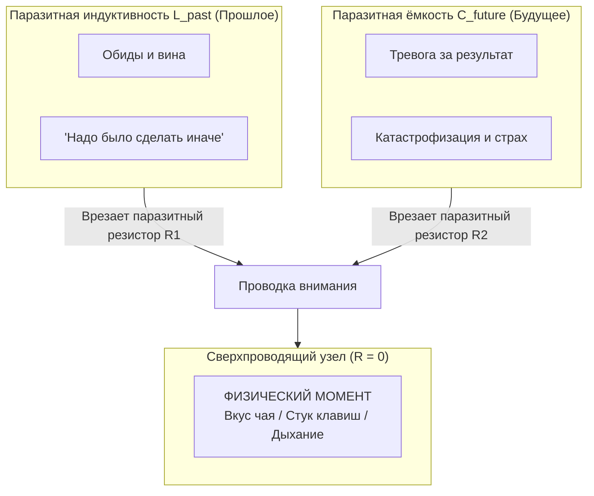
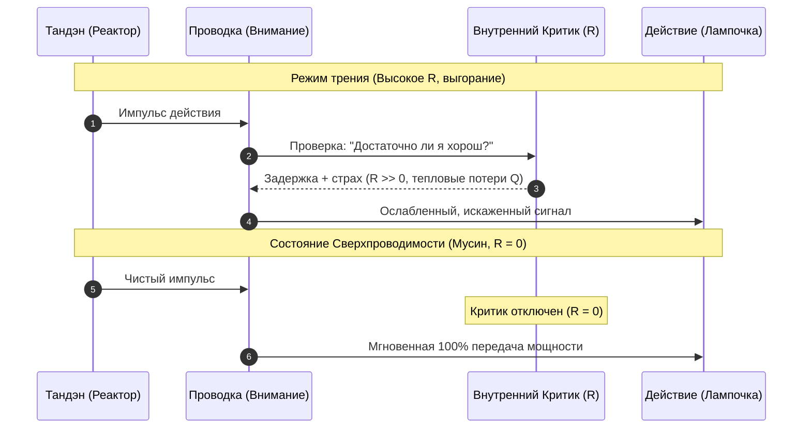

# Inner Current: Физика присутствия и состояние сверхпроводимости

> «На языке инженерии быть в моменте — это состояние сверхпроводимости проводника.»

---

## 1. Инженерная суть феномена «Здесь и сейчас»

В физике **сверхпроводимость** возникает, когда при определенных условиях электрическое сопротивление проводника падает строго до нуля ($R \to 0$). В таком режиме электрический ток течёт по кольцу бесконечно долго без потерь мощности и без выделения тепла.

В человеческом контуре:
* **Момент «Здесь и сейчас»** — единственный физически реальный интервал времени (текущая миллисекунда).
* **Сверхпроводимость сознания** — абсолютная синхронизация внимания с сенсорным потоком физической реальности.

---

## 2. Паразитные индуктивности времени и Закон Джоуля — Ленца

Мысли о времени представляют собой две гигантские паразитные индуктивности ума:
* **Прошлое ($L_{past}$):** Сожаления, обиды, чувство вины, ментальные судебные процессы над собой.
* **Будущее ($C_{future}$):** Тревога за результат, моделирование катастроф, страх провала.

### Формула психологического выгорания:
Омический нагрев проводки подчиняется **закону Джоуля — Ленца**:
$$Q = I^2 \cdot R \cdot t$$
Где:
* $I$ — сила тока созидательного импульса;
* $R$ — паразитное сопротивление ума (сомнения, страх оценки, внутренний диалог);
* $t$ — длительность удержания внимания на виртуальной симуляции;
* $Q$ — паразитное тепло (хроническая усталость, туман в голове, выгорание).

Когда внимание улетает во вчера или в завтра, человек сжигает мегаватты мощности на внутреннем омическом трении, даже просто сидя на диване.

---

## 3. Обнуление сопротивления ($R \to 0$) и состояние Мусин (無心)

Когда внимание возвращается в физический контакт с реальностью:
1. **Отключение нарратива эго:** Мозг физиологически не способен одновременно обслуживать сложную мысленную драму («кто я?», «что обо мне думают?») и полностью считывать сенсорный поток (давление ступней на пол, вкус напитка, клавиатуру).
2. **Падение сопротивления до нуля ($R \to 0$):** Внутренний критик засыпает. Исчезает зазор между импульсом воли и действием.
3. **Чистый поток Мусин:**
   * Если вы идете — вы просто идете.
   * Если вы пишете код — вы просто пишете код.
   * Мощность из Тандэна передаётся в лампочку задачи со 100% КПД.

---

## 4. Почему сверхпроводимость переживается как счастье?

Счастье — это не внешний приз и не награда за дедлайн.  
**Счастье — это субъективное ощущение нулевого сопротивления цепи.**

Когда ток течет свободно, без паразитного трения о мысли о времени, сознание переживает кристальную ясность, плотный прилив сил и глубокое чувство покоя.

---

## Связи
- [[04_Maps/Inner Current MOC|Inner Current MOC]]
- ⚡ [[02_Wiki/Брошюра — Электродинамика сознания (Снятие трудной проблемы, физика внимания и контур сверхпроводимости)|Брошюра: «Электродинамика сознания: Снятие «трудной проблемы», физика внимания и контур сверхпроводимости»]] — синтетический манифест новой науки о сознании.
- [[02_Wiki/Inner Current (Core Topology and Polarity Law)|Базовая топология цепи]]
- [[02_Wiki/Inner Current (Scale Invariance and Tea Ceremony)|Инвариантность масштаба нагрузки]]
- [[02_Wiki/Inner Current (Diagnostic Machine and System Specification)|Машина для диагностики счастья]]
- [[02_Wiki/Inner Current (Mushin Is Obscured, Not Destroyed — Why Bonno Interrupts Superconductivity Without Cancelling the Nature of the Conductor, and Why the Return Costs Nothing)|112. Мусин не исчезает, а затеняется]] — почему при $R_{\text{bonno}} > 0$ режим Мусин сорван, но природа проводника (и сам Мусин как свойство) сохраняется.
