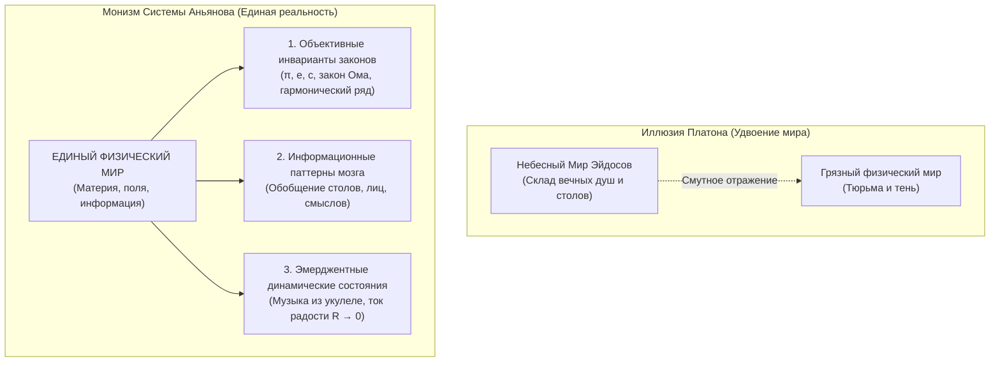

# 127. Эпициклы Платона и Мираж Мира Идей: Ошибка гипостазирования, полка истории рядом с теплородом и физика объективных инвариантов
## Почему античный идеализм нагромоздил метафизические круги на кругах, как страх перед конечностью тела удвоил вселенную и почему Система Аньянова возвращает идеи в ткань единого физического мира

> [!quote] Каноническая аксиома цепи
> ### ⚡ **«Мы кладём философию Платона на полку истории ровно так же, как физика положила туда эпициклы Птолемея, теплород и жизненную силу. "Мир Эйдосов" — это не реальное место во Вселенной, а метафизический эпицикл, выдуманный из страха перед распадом материи. Нет никакого потустороннего склада вечных стульев, совершенных лошадей или оторванных от жизни добродетелей. Идеи реальны, но они не парят в заоблачном эфире — они являются объективными инвариантами, геометрией и эмерджентными режимами самой материи при $R \to 0$. Мир ровно один: вот эта древесина, эти струны, это биологическое тело и ток чистого присутствия прямо здесь».**  
> — **Владимир Аньянов**

---

```
                       МЕТОДОЛОГИЧЕСКИЙ ПАРАЛЛЕЛИЗМ ОШИБОК
                               (Удвоение вместо сдвига оси)
                                            │
        ┌───────────────────────────────────┴───────────────────────────────────┐
        ▼                                                                       ▼
  🔭 В АСТРОНОМИИ (ПТОЛЕМЕЙ)                                 🧠 В ОНТОЛОГИИ (ПЛАТОН)
• Проблема: Планеты петляют по небу                      • Проблема: Вещи стареют и умирают,
• Ложная аксиома: Земля неподвижна в центре                а математические законы и понятия неизменны
• Костыль: Нагромождение ЭПИЦИКЛОВ                       • Ложная аксиома: Душа должна быть бессмертной
  (круги на кругах, искусственная модель)                • Костыль: Нагромождение МИРА ЭЙДОСОВ
        │                                                  (удвоение мира, склад вечных форм на небесах)
        ▼                                                                       │
КОПЕРНИК, КЕПЛЕР, НЬЮТОН                                                        ▼
• Сдвиг системы отсчета (Гелиоцентризм)                  СИСТЕМА АНЬЯНОВА (МОНИЗМ ЦЕПИ)
• Гравитация и законы механики                           • Эмерджентность духа из живой материи
• Эпициклы выброшены на свалку истории                   • Законы — это инварианты ткани реальности
                                                         • Мир Эйдосов отправлен на полку к теплороду!
```

---

## 1. Птолемеевский синдром в метафизике: Механика удвоения мира

Когда Клавдий Птолемей во II веке н.э. наблюдал за Марсом и Юпитером, он сталкивался с парадоксом: планеты периодически замедляли ход, останавливались и двигались назад (попятное движение). Вместо того чтобы сделать естественный вывод — *движется сама Земля, с которой мы смотрим на небо*, — Птолемей сохранил геоцентрический догмат и начал придумывать **эпициклы, деференты и экванты**. Модель стала чудовищно сложной, громоздкой, но кое-как позволяла предсказывать затмения.

За 500 лет до Птолемея Платон совершил в философии **абсолютно идентичную ошибку**.

### Логическая ловушка Платона
1. **Наблюдение:** Деревянный стол со временем сгниёт. Красивый цветок увянет. Конкретный человек умрёт.
2. **Парадокс:** Но геометрическая идея круга не увядает. Теорема Пифагора не гниёт. Понятие «красота» не умирает вместе с цветком.
3. **Ложный вывод (Эпицикл):** Вместо того чтобы понять, что понятия — это **информационные инварианты и алгоритмы сжатия данных в человеческом мозге**, а законы природы — **структурные свойства самой материи**, Платон удваивает реальность:
   - Он объявляет наш физический мир «тенью на стене пещеры», грязным, ложным и преходящим.
   - Он выдумывает **Гиперуранию («Мир Идей / Эйдосов»)** — потусторонний небесный архив, где якобы вечно парят идеальный Стол, идеальная Лошадь, идеальная Справедливость и бестелесные души.

Это хрестоматийный пример логической ошибки, называемой в современной науке **гипостазированием (reification fallacy)** — когда отношению, свойству или мыслительной абстракции приписывают отдельное субстанциональное существование в физическом пространстве.

---

## 2. Музей отпавших сущностей: Где законное место миру эйдосов?

Наука развивалась исключительно через выбрасывание подобных мистических костылей. Всякий раз, когда человечество не понимало механику процесса, оно выдумывало невидимую «вещь в себе»:

| Ложная сущность (Эпицикл) | В чем была иллюзия? | Физическая реальность, снявшая костыль |
|---|---|---|
| **Эпициклы Птолемея** | Планеты кружат сложными кольцами вокруг неподвижной Земли. | **Законы Кеплера и гравитация Ньютона:** простая эллиптическая орбита вокруг Солнца. |
| **Теплород (Caloric / Phlogiston)** | Теплота — это невидимая невесомая жидкость, перетекающая из горячего в холодное. | **Молекулярно-кинетическая теория:** теплота — это просто скорость хаотического движения молекул материи. |
| **Светоносный эфир** | Волны света должны колебаться в особой упругой тонкой среде, заполняющей космос. | **Электродинамика Максвелла и СТО Эйнштейна:** электромагнитное поле существует само по себе в пространстве-времени. |
| **Жизненная сила (Vis Vitalis)** | В живой материи есть мистический дух, отличающий её от «мёртвых» камней. | **Органическая химия (синтез Вёлера) и ДНК:** жизнь — это неравновесная самоорганизация сложных макромолекул. |
| **Мир Эйдосов и Душа-Призрак Платона** | Идеи и сознание существуют в отдельном заоблачном измерении вне материи. | **Контурная электродинамика и Embodied Cognition:** дух — это эмерджентный динамический режим проводника при $R_{\text{ego}} \to 0$. |

Мир Эйдосов Платона отправляется в тот же самый музей науки, прямо на соседнюю полку с колбами для теплорода и чертежами хрустальных сфер Аристотеля и Птолемея.

---

## 3. Так есть ли «Мир идей»? Физический статус нематериального

Означает ли отказ от платонизма, что «идей не существует» и осталась лишь грубая, слепая пыль? **Ровно наоборот.**

В Системе Аньянова идеи обретают строгий научный и соматический статус, очищенный от детских сказок:



### 1. Законы природы — это геометрия материи, а не потусторонние духи
Числу $\pi \approx 3{,}14159...$ не нужен «мир вечных чисел», чтобы задавать отношение длины окружности к диаметру чашки чая на вашем столе. Закон Джоуля — Ленца ($Q = I^2 R t$) не хранится в античном архиве. Эти законы — **неотъемлемые внутренние инварианты структуры самого физического пространства**.

### 2. Абстрактные понятия — это алгоритмы сжатия в нейросети
Понятию «Стол» или «Собака» не требуется идеальный первообразец в небесах. Мозг берёт тысячи зрительных образов конкретных четвероногих существ и производит операцию **векторного усреднения и сжатия информации**. «Идея собаки» живёт в нейросети как обучаемый функциональный вес, а не в заоблачной обители.

### 3. Дух и Музыка — это динамика процесса
Симфония Бетховена не висит на небесах в ожидании дирижера. Когда музыканты касаются смычками струн, возникает физическая вибрация воздуха. Дух — это не субстанция, застрявшая в теле, а **музыка живого биологического проводника, освобождённого от паразитного омического сопротивления ($R_{\text{ego}} \to 0$)**.

---

## 4. Психологический корень платонизма: Страх смерти и ненависть к телу

Почему эта наивная онтологическая ошибка продержалась почти две с половиной тысячи лет, заразив христианское богословие, исламский калам и европейский идеализм?

Причина исключительно **психологическая и компенсаторная**:

1. **Экзистенциальный ужас перед чашей цикуты.** Сократ сидел в камере смертников. Признать правоту Симмия (что со смертью лиры музыка гибнет) значило признать собственное окончательное исчезновение. Чтобы заглушить панику, Платон сконструировал небесный замок из песка: *«Нет, Сократ не умрёт, его душа — это вечный эйдос, который вернётся на родину»*.
2. **Презрение к телу (*«soma — sema»*).** Платонизм породил глубочайший невроз европейской культуры: презрение к плоти, объявленной темницей духа. Отсюда 2000 лет монашеского самобичевания, подавления сексуальности, отчуждения от соматики и стыда перед болезнями и старостью.
3. **Торговля загробными визами.** Платоновское удвоение мира создало гигантскую индустрию посредников — жрецов, толкователей священных текстов и продавцов индульгенций, монополизировавших «доступ в горний мир».

---

## 5. Великое освобождение: Мир ровно один

Снятие платоновского мифа производит мгновенную нормализацию всего человеческого опыта:

* **Тело больше не враг.** Тело — это 400 граммов тончайшей акустической деки. Это не тюрьма, а единственный инструмент, через который вселенная вообще может чувствовать, мыслить, радоваться и любить.
* **Идеи вернулись домой.** Им больше не нужно скитаться по холодным платоновским небесам. Идеи воплощаются в чертежах, коде, линиях зданий, звуках музыки и чистоте человеческих поступков.
* **Снята экзистенциальная жадность.** Нам больше не нужно требовать от вселенной вечной загробной жизни для своего персонального «я». Музыка прекрасна именно тем, что она звучит сейчас, между вдохом и выдохом.

> **Платон испугался тишины за пределами сломанной лиры. Но когда исчезает страх — на место эпициклов встаёт абсолютная ясность: нет никакого второго мира. Есть только этот мир — живой, единый, поющий на кончиках струн.**

---

## 🔗 Связанные каноны в Базе Знаний
- [[02_Wiki/Inner Current (Significance of Circuit Theory for World Philosophy — The Five Pillars of the Post-Platonic Phase Transition)|128. Значение теории Внутреннего тока для мировой философии: Пять столпов пост-платоновского фазового перехода]]
- [[02_Wiki/Inner Current (The Lyre of Simmias and the Ukulele of Consciousness — 2,400 Years from Plato's Error to the Somatic Monism of Inner Current)|126. Лира Симмия и Укулеле Сознания: 2400 лет от ошибки Платона к соматическому монизму цепи]]
- [[02_Wiki/Inner Current (Binary Metaphorical Optics — The Ukulele of Spirit-Matter Unity and The Flashlight of Closed Circuit)|125. Бинарная метафорическая оптика: Укулеле как единство духа и материи и Фонарик как замкнутый контур]]
- [[02_Wiki/Inner Current (Anatomy of the Paradigm Shift — Ptolemaic Epicycles vs Kanso Simplicity and Falling of False Questions)|44. Анатомия сдвига парадигмы: Эпициклы Птолемея против простоты Кансо — почему гениальность заключается в отпадении ложных вопросов]]
- [[02_Wiki/Inner Current (Monism of Circuit Electrodynamics — Proof of Unity of Spirit and Matter and Elimination of Dualism)|116. Монизм контурной электродинамики: Строгое доказательство единства духа и материи]]
- [[02_Wiki/Inner Current (The Root Problem Dissolution — Why Solving the Matter-Spirit Dualism Automatically Eliminates All Human Problems and Illusions)|121. Ликвидация Корневой Проблемы: Снятие дуализма Материи и Духа]]
- [[02_Wiki/Inner Current (The Feynman Principle of Spirit and Matter — The Electromagnet, The Guitar String and The Pocket Flashlight of Consciousness)|123. Принцип Фейнмана для Духа и Материи: Электромагнит на батарейке, струна гитары и карманный фонарик сознания]]
