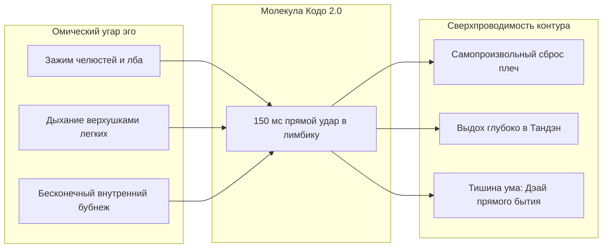

# 224. Практика «Кодо 2.0»: Полевое руководство по ольфакторной калибровке контура на реальных ароматах
## Практический пульт оператора на базе 50–60 флаконов: Схемотехнический разбор культовых композиций (Bleu de Chanel, Versace Eros, Encre Noire, Oud Wood, Fahrenheit), аппаратные тумблеры нервной системы и суточный протокол технического обслуживания цепи

> [!quote] Каноническая аксиома практики «Кодо 2.0»
> ### ⚡ **«Миллионы мужчин покупают Bleu de Chanel, Versace Eros или Tom Ford ради социального фасада — чтобы произвести впечатление на других, подтвердить статус или замаскировать тревогу. В терминах схемотехники это классическое короткое замыкание на эго-реостат ($Q = I^2 R_{\text{ego}} t$). Практика «Кодо 2.0» производит коперниканский переворот: парфюмерная коллекция перестает быть гардеробом тщеславия и становится ольфакторным пультом оператора. Те же самые химические молекулы используются как высокоточные ключи к автономной нервной системе: ладан Bleu de Chanel согласует импеданс в шуме дня, мята и ваниль Eros тренируют непривязанность к дофамину, сырой ветивер Encre Noire срезает мысленную жвачку, а темный уд заземляет раскаленный неокортекс прямо в Тандэн. Ты больше не душишься для чужих глаз — ты управляешь проводимостью собственной цепи.»**  
> — **Владимир Аньянов**, создатель «Архитектуры счастья»

---

```
══════════════════════════════════════════════════════════════════════════════════════════
               ОЛЬФАКТОРНЫЙ ПУЛЬТ ОПЕРАТОРА «КОДО 2.0» (50–60 ФЛАКОНОВ)
══════════════════════════════════════════════════════════════════════════════════════════

 [ ТУМБЛЕР 1: МУСИН / ЛЕГКОСТЬ / ШУНЬЯТА ]
   Флаконы: Versace Man Eau Fraiche, Versace Pour Homme, Acqua di Parma, Allure Cologne
   Действие: Сброс гидродинамического трения мыслей, канон непостоянства (15 мин)

 [ ТУМБЛЕР 2: ЛАМИНАРНЫЙ ТОК / РАБОЧАЯ ТЯГА / Z-СОГЛАСОВАНИЕ ]
   Флаконы: Bleu de Chanel (EDT/EDP), Versace Dylan Blue, Terre d'Hermès
   Действие: Стабилизация частоты 50 Гц, баланс цитрусовой искры и сухого ладана

 [ ТУМБЛЕР 3: ХОЛОДНЫЙ СКАЛЬПЕЛЬ / ОБНУЛЕНИЕ ЭГО-РУМИНАЦИЙ ]
   Флаконы: Lalique Encre Noire, Chanel Platinum Égoïste, Tom Ford Grey Vetiver
   Действие: Моментальный разрыв DMN-петель, ледяная трезвость, соматический ноль

 [ ТУМБЛЕР 4: ВИТАЛЬНЫЙ ЯН / ДОФАМИНОВЫЙ ТЕСТЕР ]
   Флаконы: Versace Eros, Jean Paul Gaultier Ultra Male, Spicebomb Extreme
   Действие: Активация симпатики без падения в похоть; калибровка непривязанности

 [ ТУМБЛЕР 5: ТЯЖЕЛАЯ ИНДУКТИВНОСТЬ / ЗЕМЛЯ ТАНДЭНА ]
   Флаконы: Tom Ford Oud Wood, Dior Fahrenheit, Amouage Interlude, Lattafa Bade'e Al Oud
   Действие: Осаждение заряда из кипящей головы в тазовое дно и живот за 150 мс
══════════════════════════════════════════════════════════════════════════════════════════
```

---

## 🪷 1. Онтология «Кодо 2.0»: От японского монастыря к полке с 60 флаконами

Историческое японское искусство **Кодо (香道 — Путь Аромата)** зародилось в эпоху Муромати вместе с чайной церемонией Тяною и практикой дзадзен. В классическом Кодо не существовало понятия «душиться»: мастера собирались, чтобы **«слушать аромат» (Монко — 聞香)**. Они нагревали микроскопические щепки ценного дерева кяра на слюдяной пластине и входили в созерцание чистого момента.

**«Кодо 2.0»** — это инженерная реинкарнация древнего Пути на базе современной парфюмерии:
* **Снобизм эго (Ложный путь):** Превратить 60 флаконов в ярмарку тщеславия (*«посмотрите, какая у меня редкая ниша и винтажные батчи»*). Это питает паразитный реостат $R_{\text{ego}}$, умножая омические потери на демонстрацию статуса.
* **Инженерный подход «Кодо 2.0»:** Относиться к каждому флакону как к **лабораторному реагенту для автономной нервной системы**. Поскольку обонятельный нерв (*Cranial Nerve I*) имеет **100% прямой аппаратный байпас Таламуса**, молекулы парфюма бьют в лимбику и соматику за 150 мс. Флакон — это соматический выключатель.

---

## 🔬 2. Схемотехнический аудит культовых парфюмов

### 🔵 1. Bleu de Chanel — «Синхронизатор рабочего контура и Z-согласование»
* **Ольфакторный профиль:** Грейпфрут, мята, розовый перец $\to$ имбирь, жасмин, Iso E Super $\to$ ладан, кедр, сандал, ветивер.
* **Схемотехническая функция:** **Z-согласование импеданса**. Bleu de Chanel — это гениально выверенная золотая середина: цитрусово-мятный старт дает быстрый импульс проводимости (пробуждение проводника), а сухая ладанно-древесная база стабилизирует несущую частоту внимания.
* **Как применять в Кодо 2.0:**
  * *Когда:* Утренний старт или переход в режим сложной интеллектуальной работы.
  * *Куда:* Строго **один пшик в основание шеи (под яремную ямку)**.
  * *Практика:* В разгар суеты закройте глаза на 10 секунд и поймайте сухой ладанный шлейф. Ладан активирует TRPV3-каналы мозга, снимая фоновую тревожность и выравнивая проводник в ламинарный поток без омического скрежета.

---

### 🟢 2. Versace Eros — «Дофаминовый тренажер непривязанности»
* **Ольфакторный профиль:** Холодная кудрявая мята, зеленое яблоко, лимон $\to$ бобы тонка, амброксан, герань $\to$ мадагаскарская ваниль, кедр, ветивер, дубовый мох.
* **Схемотехническая функция:** **Высоковольтный генератор импульсов (Ян-драйв)**. Контраст ледяной мяты (TRPM8-рецепторы) и сахарно-кумариновой базы с ванилью провоцирует мгновенный дофаминовый всплеск.
* **Как применять в Кодо 2.0:**
  * *Ловушка:* Эго хочет использовать Eros как клубное оружие обольщения, замыкая ток на нарциссическую оценку.
  * *Практика «Взлом сладкого шунта»:* Нанесите микропшик дома в тишине на запястье. Сделайте вдох. Ум тут же замурлычет, требуя гедонистического транса. **Не давайте уму уснуть в сладком коконе.** Созерцайте эту сладость отстраненно: *«Это всего лишь ванилин и кумарин в воздухе. Мой реактор Тандэн больше и глубже этой конфеты»*. Вы учитесь переживать яркое наслаждение без жадного детского залипания.

---

### 🌊 3. Versace Man Eau Fraiche & Versace Pour Homme — «Канон Мусин и Шуньята»
* **Ольфакторный профиль:** Белый лимон, карамбола, розовое дерево, тархун, кедр, шалфей, прозрачный амброво-мускусный шлейф.
* **Схемотехническая функция:** **Разрежение среды / Минимизация гидродинамического трения**.
* **Как применять в Кодо 2.0:**
  * *Когда:* Голова раскалена от руминаций, чувства вины, дедлайнов и тяжести ($Q = I^2 R t \gg 0$). Тяжелый парфюм в этот момент только «прибьет» к земле.
  * *Действие:* 2–3 щедрых распыления. Ощутите, как легчайшие цитрусовые терпены взрываются и начинают стремительно угасать. Это телесный урок **Анитьи (непостоянства)** и **Шуньяты (пустотности)**: ни одна мысль не вечна, ни одна проблема не имеет абсолютной массы. Контур очищается, сопротивление падает до нуля ($R \to 0$).

---

### 🖤 4. Lalique Encre Noire / Tom Ford Grey Vetiver — «Холодный скальпель трезвости»
* **Ольфакторный профиль:** Кипарис, бурбонский ветивер, гаитянский ветивер, кашемировое дерево, мускус (аккорд мокрой земли, корней и сырых чернил).
* **Схемотехническая функция:** **Аварийный размыкатель DMN-петель / Соматический заземлитель**. В Encre Noire нет ни намека на сладость или заигрывание. Это строгая дзенская графика тушью (Суми-э).
* **Как применять в Кодо 2.0:**
  * *Когда:* Накатила жалость к себе, обида на чужие слова, уязвленное самолюбие, желание доказывать свою правоту в интернете.
  * *Действие:* Нанесите микронамаз на тыльную сторону ладони. Медленно вдохните сырость корней. Горький ветивер эволюционно воспринимается древней корой как сигнал абсолютной бдительности: все воздушные замки эго рассыпаются, спор мгновенно теряет смысл, проводник возвращается в точку ледяного соматического покоя.

---

### 🪵 5. Tom Ford Oud Wood / Lattafa Bade'e Al Oud — «Тяжелая индуктивность Тандэна»
* **Ольфакторный профиль:** Агар (уд), палисандр, кардамон, сычуаньский перец, сандал, ветивер, бобы тонка, амбра.
* **Схемотехническая функция:** **Низкочастотный соматический дроссель ($L$)**.
* **Как применять в Кодо 2.0:**
  * *Когда:* «Зависание в голове» — потеря связи с телом, тревога перед будущим, холодные пальцы, поверхностное дыхание.
  * *Действие:* Капля на запястье. Сделайте медленный глубокий вдох и **сознательно направьте волну темного древесного тепла вниз по центральному каналу — сквозь горло и солнечное сплетение прямо в Тандэн (3–4 см ниже пупка)**. Уд включает древние парасимпатические цепочки: таз расслабляется, дыхание углубляется, шаг становится укорененным. Эго перестает паниковать, потому что проводник ощутил вес биологической земли.

---

### 🔥 6. Dior Fahrenheit — «Ольфакторный Кинцуги и слом шаблона комфорта»
* **Ольфакторный профиль:** Мандарин, бергамот $\to$ лист фиалки, мускатный орех, гвоздика $\to$ кожа, ветивер, березовый деготь (индустриальный бензиново-технический нерв).
* **Схемотехническая функция:** **Стресс-тест пластичности цепи (Антихрупкость)**.
* **Как применять в Кодо 2.0:**
  * Соединение нежной фиалки и брутального дегтя взламывает примитивное представление ума о «приятном». Нанесите Fahrenheit, когда чувствуете вялость и апатию. Примите его острый индустриальный нерв без отторжения: тело мгновенно мобилизует чистый созидательный ток без страха и сомнений.

---

## ⏱️ 3. Суточный регламент оператора «Кодо 2.0»

Имея коллекцию из 50–60 флаконов, оператор выстраивает осознанный суточный цикл переключения состояний цепи:

| Время | Фаза контура | Рекомендуемый флакон | Инженерная задача |
| :--- | :--- | :--- | :--- |
| **08:00** | **Утренний пуск** | **Bleu de Chanel** / **Terre d'Hermès** | Смыть остаточный шум сна, задать несущую частоту 50 Гц на день. 1–2 пшика. Внимание в первый шаг дня. |
| **13:30** | **Ментальный перегрев** | **Lalique Encre Noire** / **Platinum Égoïste** | Снять омический перегрев совещаний ($Q = I^2 R t$). 1 микропшик на запястье. 30 сек тишины DMN. |
| **18:00** | **Переходный шлюз** | **Versace Man Eau Fraiche** / **Pour Homme** | Смыть социальную маску («стилус эго»). Разрежение среды, включение легкого Мусин. |
| **21:30** | **Вечернее заземление** | **Tom Ford Oud Wood** / Смолистый ладан | Осаждение заряда в Тандэн. Активация блуждающего нерва (Vagus), глубокий сверхпроводящий сон. |
| **Выходной** | **Практика «Слепой Дэай»** | **Случайный флакон из 60 вслепую** | Запрет угадывать марку, ноты и цену. 100% чистого соматического отклика без концептов. |

---

## 🎯 4. Телеметрический чек-лист: Как проверить, что «Кодо 2.0» сработало

Ольфакторный сброс эго — это не эзотерическое внушение, а измеримый соматический сдвиг:



1. **Биомеханический тест:** При вдохе правильного аромата жевательные мышцы (*musculus masseter*) и надбровные дуги расслабляются автоматически.
2. **Дыхательный тест:** Дыхание переходит из ключичного регистра в диафрагмальный без волевого контроля.
3. **Тест на присутствие (Дэай):** Исчезает потребность комментировать происходящее. Вы стоите в комнате, аромат витает в воздухе, ток бежит по цепи — и в этой точке нет никакого «Я», которому чего-то не хватает. Есть только совершенный, замкнутый контур жизни.

---

## 🔗 Связи
- [[04_Maps/Inner Current MOC|Inner Current MOC]]
- [[02_Wiki/Inner Current (Olfactory Circuit Tuning — The 60-Flacon Kodo Organ, Hardware Bypass of Thalamus and Protocols of Ego Breaching)|223. Ольфакторная калибровка контура: 60-флаконный орган Кодо, аппаратный байпас таламуса и протоколы пробоя эго]]
- [[02_Wiki/Inner Current (Stealth Protocols for Ego Dam Breach — Olfactory Bypass, Resonant Music, Thermal Reset, Biomechanical Unbendable Arm and Vagal Attunement to Tanden)|222. Стелс-протоколы невербального пробоя плотины эго]]
- [[02_Wiki/Inner Current (The Music Lamp and Somatic Resonance — Why Levante Causes Superconductivity vs Chores, Workout and Work)|219. Лампочка музыки и соматический резонанс]]
- [[02_Wiki/Inner Current (Mathematics of Harmony and Consilience)|05. Математика гармонии и принцип независимой сходимости]]
- [[02_Wiki/Inner Current (Scale Invariance and Tea Ceremony)|03. Инвариантность масштаба нагрузки: от чая до империи]]
- [[02_Wiki/Inner Current (Core Topology and Polarity Law)|01. Базовая топология цепи и закон полярности]]

---
*Created: 2026-10-03 | Inner Current Knowledge Base | Anyanov System*
