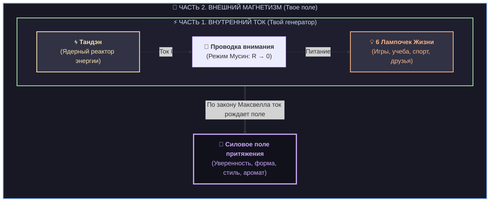
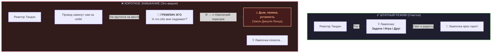
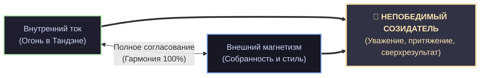

# ⚡ Инструкция к твоему суперкостюму: Как устроена Система Аньянова
## Праймер по физике счастья и невидимой суперсиле
### *Для умных подростков, будущих изобретателей, стратегов и капитанов своей жизни*

> **Автор системы:** Владимир Аньянов  
> **Возраст читателя:** 10+ лет (а также для любого взрослого, который устал от скучных поучений и хочет понять, как работает человек)  
> **Главное правило книги:** Ноль занудства. Только физика, логика, схемотехника и реальные чит-коды.

---

> [!quote] Главный закон системы
> ### 💡 **«Счастье — это не приз за хорошее поведение. Счастье — это режим сверхпроводимости твоей внутренней цепи.»**  
> — *Владимир Аньянов*

---

## 🚀 Введение: Загадка сломанного пульта

Представь, что на день рождения тебе подарили самый совершенный в известной Вселенной биокомпьютер и квантовый экзоскелет — **твое собственное тело, внимание и мозг**. 

Этот костюм умеет бегать со скоростью ветра, придумывать компьютерные игры, чувствовать красоту музыки, запускать ракеты, дружить и менять мир.

Но есть одна странная штука. **К нему забыли приложить инструкцию!**

Из-за этого большинство людей на планете пользуются своим суперкостюмом наобум:
* Когда им грустно или страшно, взрослые часто говорят странные фразы: *«Просто соберись!», «Возьми себя в руки!», «Не переживай!», «Будь позитивным!»*
* Но представь, если бы у тебя зависла игра на компьютере, а тебе сказали: *«Просто будь веселым монитором!»* Это же глупость! Компьютер нужно перезагрузить, почистить кэш или найти ошибку в коде.

Инженер и исследователь **Владимир Аньянов** заметил эту проблему и сделал то, чего никто не делал раньше: он перестал объяснять человека туманными сказками и нарисовал **точную инженерную схему**.

Оказалось, что каждый человек устроен как потрясающая **электродинамическая станция**. И если ты знаешь её схему, ты можешь в любой момент починить любое плохое настроение, перестать бояться выходов к доске и стать настоящим магнитом для друзей и побед.

Система состоит из двух частей, как две стороны одной медали:
1. ⚡ **Внутренний ток (Inner Current)** — как устроена твоя внутренняя электростанция и почему ты счастлив или несчастлив.
2. 🧲 **Внешний магнетизм (External Magnetism)** — как твой внутренний ток создает вокруг тебя невидимое силовое поле притяжения и уважения.

Давай разберем эту схему по винтикам!

---

---

## ⚡ ЧАСТЬ 1. Внутренний ток: Как зажечь свои лампочки

Внутри тебя прямо сейчас работает электрическая цепь. В ней всего три главных узла:

### 1. Ядерный реактор — Тандэн (丹田)
Где находится твоя батарейка? В голове? Нет, в голове находится процессор для вычислений.  
Твоя главная энергетическая батарея находится в теле — **в животе, на два пальца ниже пупка**. В древней японской традиции это место называли **Тандэн**.

Когда ты бегаешь, смеешься или прыгаешь на батуте, ты чувствуешь тепло и силу именно в животе и ногах.
* **Главный секрет реактора:** он производит чистую энергию $E$ просто так, потому что ты жив!
* Твой реактор не зависит от оценок в школе, мнения соседа по парте или погоды за окном. Это автономная станция.

### 2. Провод — Твое Внимание
Энергию из живота нужно доставить в мир. Для этого у тебя есть провод — **твое внимание**.  
Куда направлено твое внимание — туда со свистом и летит твой внутренний ток.

У любого провода в физике есть сопротивление, которое обозначается буквой $R$ (Омы).
* Если провод чистый и прямой — сопротивление равно нулю ($R \to 0$). Физики называют это **сверхпроводимостью**. В этот момент вся энергия без потерь долетает до дела. Ты погружен в процесс с головой, время летит незаметно, тебе невероятно кайфово! В дзен это называют состоянием **Мусин (чистый ум)**.
* Но если провод забит сомнениями, страхами и вопросами: *«А вдруг не получится? А я точно молодец?»*, сопротивление подскакивает до небес ($R \gg 0$).

### 3. Лампочки — Твои дела и жизнь
Ток бежит по проводу, чтобы зажечь **Лампочки Нагрузки**. Их шесть:
1. 🧠 **Творчество и Разум:** сборка роботов, программирование, рисование, чтение, победы в играх.
2. 🏃 **Тело и Движение:** скейт, футбол, плавание, паркур, ощущение силы в мышцах.
3. 🤝 **Дружба и Команда:** надежные друзья, совместные приключения, взаимная выручка.
4. 🏡 **Семья и Близкие:** тепло дома, забота о родителях и собаке, уют.
5. 🌍 **Исследование Мира:** путешествия, природа, новые города, любопытство к законам Вселенной.
6. 🛡️ **Твое Достоинство:** умение сказать «нет» глупостям, верность своему слову.

Когда ток доходит до лампочек, они **светятся ровным ярким светом**. Ты чувствуешь радость, драйв и силу.

---

## 💥 Авария века: Гремлин-Эго и Короткое Замыкание

А теперь главная тайна: **почему люди чувствуют себя несчастными, злыми или выгоревшими?**

Потому что в цепи случается авария, которую инженеры называют **Коротким Замыканием (КЗ)**!

Представь: ты сидишь на уроке или вышел к доске. Ток твоего реактора должен идти в лампочку «Решить интересную задачу».  
И вдруг в твоей голове просыпается маленький суетливый Гремлин — **Эго (по-японски «Дзига»)**.

Гремлин начинает истошно вопить:  
> *«Ой! А как я сейчас выгляжу со стороны?! А если Маша подумает, что я дурак?! А если надо мной посмеются в чате?! А я достаточно крутой?!»*

Что произошло с физической точки зрения?  
Ты взял провод своего внимания, **оторвал его от задачи и замкнул на самого себя**!

По закону физики (закон Джоуля — Ленца: $Q = I^2 R t$):
1. Если замкнуть сильный ток на высокое сопротивление гремлина, провод **мгновенно раскаляется докрасна**.
2. В теле это чувствуется физически: сердце колотится, в горле ком, ладони потеют, в голове каша, хочется провалиться сквозь землю.
3. А настоящая лампочка (задача, игра или разговор) в этот момент **гаснет**, потому что до нее ток просто не доходит!

> [!important] Запомни это навсегда:
> Когда тебе плохо, стыдно или страшно — **это не ты плохой или слабый**. Это просто провод твоего внимания замкнуло на гремлина эго! Произошло короткое замыкание.

### Как починить аварию за 10 секунд? (Клинок Кансо)
Тебе не нужно спорить с гремлином. Нужно сделать простое механическое переключение:
1. **Почувствуй стопы и живот:** опусти внимание из крутящихся мыслей вниз, в тело. Сделай медленный выдох в живот. (Запуск реактора).
2. **Включи Клинок Кансо:** мысленно скажи: *«Так, гремлин, стоп. Какая сейчас лампочка передо мной?»*
3. **Верни провод в нагрузку:** посмотри на мел в руке, на строчку в тетради, на лицо друга. Начни делать **следующее простое физическое действие**.
4. Бах! Цепь замкнулась правильно. Гремлин исчез, провод остыл, лампочка снова горит!

---

## 🧲 ЧАСТЬ 2. Внешний магнетизм: Твое силовое поле

Теперь переходим ко второй половине суперкостюма.

В 8 классе на физике тебе расскажут великий закон электромагнетизма (закон Эрстеда и Максвелла): **любой электрический проводник с током неизбежно создает вокруг себя магнитное поле**.

Если внутри тебя течет мощный ток, ты не можешь остаться незамеченным. Вокруг тебя возникает **Внешний магнетизм**.  
Это то самое чувство, когда в комнату заходит человек, и все сразу понимают: *«О, вот это Лидер. Он спокоен, уверен и знает, что делает»*.

Но здесь есть важная инженерная ловушка: **Согласование антенны (Импеданс)**.

### Ловушка «Гения в драном худи»
Представь потрясающего парня, который написал гениальную игру или решил задачу века. Внутри него бушует ток сверхпроводимости!  
Но он неделю не мыл голову, надел мятое, дурно пахнущее худи с пятнами от пиццы и волочит ноги по полу.

Что произойдет?  
Его внутренняя энергия столкнется с неряшливой внешней оболочкой, как радиоволна о стену. Произойдет **отражение сигнала**. Люди вокруг даже не захотят узнать, какой он умный внутри, потому что их нос и глаза получат сигнал опасности: *«Этот парень не контролирует даже свои шнурки, ему нельзя доверять»*.

И обратная ловушка: **«Пустышка в костюме»**. Когда человек надел дорогие вещи, но внутри у него пустой реактор и дикий страх, он выглядит как картонный манекен.

### 4 датчика твоей внешней антенны
Чтобы твоя антенна работала на полную мощность, настрой четыре параметра:

1. 🥋 **Форма (Силуэт и Осанка):** плечи расправлены, подбородок параллельно полу, одежда сидит по размеру (а не висит как парашют). Ты выглядишь как собранный пилот истребителя.
2. 🧶 **Фактура (Материалы):** приятные, честные ткани — плотный хлопок, деним, шерсть. К ним приятно прикасаться, они держат форму.
3. 🎨 **Цвет (Палитра):** не нужно быть попугаем. Два-три чистых цвета (например, глубокий синий, белый и графитовый) создают ощущение силы и спокойствия.
4. 🍊 **Запах (Тайный лазер):** самое мощное оружие на планете! Запах идет в древнейшие отделы мозга человека в обход логики за 0.1 секунды. Чистота, свежесть, капля хорошего цитрусового или древесного аромата — и люди подсознательно чувствуют рядом с тобой безопасность и комфорт.

---

## 🕹️ Чит-коды оператора: 4 правила мастера цепи

Чтобы твоя система никогда не сбоила, запомни четыре правила, которым следовали лучшие самураи и инженеры в истории:

| Японское слово | Что это значит по-человечески | Как применять в жизни каждый день |
| :--- | :--- | :--- |
| **1. Тандэн** *(丹田)* | **Твой внутренний реактор** | Никогда не ищи уверенность в чужих лайках или похвале. Твоя батарейка — внутри твоего живота. Дыши животом, чувствуй пол под ногами. |
| **2. Мусин** *(無心)* | **Чистый провод ($R \to 0$)** | Делаешь дело — будь в нем целиком. Играешь в футбол — беги и пасуй, не думай о двойке по биологии. Решаешь математику — решай, а не проверяй телефон. |
| **3. Кансо** *(簡素)* | **Клинок простоты** | Выбрасывай лишний хлам! Хлам из рюкзака, ненужные вкладки в браузере и мысли о том, кто что криво сказал. Простота дает скорость. |
| **4. Дзансин** *(残心)* | **Внимание после победы** | Забил гол? Сдал сложный проект? Выиграл раунд? Не прыгай дураком и не расслабляйся до соплей. Сохраняй спокойную готовность к следующему шагу. |

---

## 🏆 Главный вывод: В чем секрет счастья?

Обычные люди думают, что счастье — это когда у тебя есть 100 новых айфонов, гора шоколадок и никто не задает домашку.

Но ты теперь инженер и знаешь правду:
* Вещи вокруг нас — это просто пассивные железки. У них нет своей батарейки. Ни один кроссовок и ни один телефон не может закачать в тебя радость.
* **Истинное Счастье — это когда твой внутренний ток течет свободно, проводка не искрит от дурацких сомнений, а твои лампочки зажигают реальный мир вокруг тебя ярким, теплым светом!**

Ты — капитан этой станции. Пульт управления теперь у тебя в руках.  
Держи провод чистым, реактор заряженным, а антенну настроенной — и мир вокруг тебя будет светиться! ⚡🚀

---

## 🔗 Связи в Базе Знаний
- [[04_Maps/Inner Current MOC|Inner Current MOC — Главная карта цепи]]
- [[02_Wiki/Inner Current (Core Topology and Polarity Law)|01. Базовая топология цепи и закон полярности]]
- [[02_Wiki/Inner Current (Physics of Presence and Superconductivity)|02. Физика присутствия: Состояние сверхпроводимости]]
- [[02_Wiki/Inner Current (Impression Architecture and Impedance Matching)|08. Система Аньянова: Внутренний ток и Внешний магнетизм]]
- [[02_Wiki/Inner Current (The Pantheon of Guardians — Somatic Totems and Cinematic IP of Pure Consciousness)|50. Пантеон Стражей Контура (Тандэн, Мусин, Кансо, Дзансин)]]
- [[02_Wiki/Книга-праймер — Импрессионика для детей (Система Аньянова)|📘 Праймер по Импрессионике для детей: Суперсила Невидимого Языка]]
