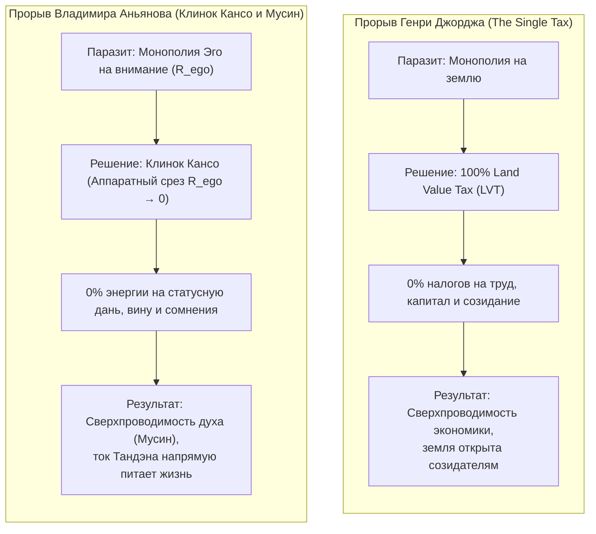

# 75. Прогресс и Нищета Духа: Эффект Генри Джорджа, Эго-Рантье и Физика Прямого Потока

> *«В центре самого изумительного материального прогресса, превосходящего всё, о чем мечтали древние, бедность преследует прогресс, подобно тому как тень следует за телом. Причина нищеты среди изобилия заключается в том, что ценность, создаваемая всем обществом, присваивается монополистом земли».*  
> — **Генри Джордж**, *«Прогресс и бедность»* (San Francisco, 1879)

> *«В центре самого ошеломляющего технологического триумфа — среди нейросетей, карманных суперкомпьютеров, автоматизации и материального изобилия — душевная нищета, тревожность и выгорание преследуют человека по пятам. Причина депрессии среди изобилия заключается в том, что живой ток внимания, генерируемый Тандэном, перехватывается внутренним монополистом — Эго-Рантье ($R_{\text{ego}} > 0$), собирающим статусную дань и сжигающим психику омическим пожаром Джоуля — Ленца ($Q = I^2 R t$)».*  
> — **Владимир Аньянов**, *«Внутренний ток: Архитектура счастья»* (2026)

---

## Введение: Великая историческая рифма (1879 vs 2026)

В истории человеческой мысли есть редкие книги, которые не просто анализируют частные проблемы, а обнажают **скрытый перекос всей цивилизации**.

В 1879 году калифорнийский журналист и политэконом **Генри Джордж (Henry George)** опубликовал труд *«Прогресс и бедность» (Progress and Poverty)*, ставший одной из самых читаемых книг рубежа веков (её тиражи уступали только Библии). Джордж задал один простой, беспощадный вопрос:

> **«Почему при колоссальном росте производительных сил, технологий и богатства — бедность не исчезает, а становится глубже, контрастнее и мучительнее?»**

В 2026 году, спустя почти полтора века, **Владимир Аньянов** в исследовании *«Внутренний ток»* обнаруживает абсолютную структурную рифму этого вопроса во внутреннем мире человека:

> **«Почему при богоподобных материальных удобствах, искусственном интеллекте, изобилии калорий и информации — душевная нищета, неврозы, клиническая депрессия и эпидемия одиночества бьют исторические рекорды?»**

```
════════════════════════════════════════════════════════════════════════════════
                     ПАРАДОКС МАТЕРИИ VS ПАРАДОКС ДУХА
════════════════════════════════════════════════════════════════════════════════
1879: ГЕНРИ ДЖОРДЖ                   2026: ВЛАДИМИР АНЬЯНОВ
(Внешний мир / Политэкономия)        (Внутренний мир / Электродинамика психики)
────────────────────────────────────────────────────────────────────────────────
Паровые машины, железные дороги,     AGI, смартфоны, медицина, автоматизация,
гигантские фабрики, рост капитала    неограниченный доступ ко всем знаниям мира
               │                                    │
               ▼                                    ▼
Трущобы Лондона и Нью-Йорка,         Эпидемия клинических депрессий, тревожности,
детский труд, нищета рабочих         выгорания, панических атак и суицидальности
               │                                    │
               ▼                                    ▼
ВОПРОС: «Почему прогресс углубляет   ВОПРОС: «Почему внешнее изобилие углубляет
бедность?»                           душевную нищету?»
               │                                    │
               ▼                                    ▼
ОТВЕТ: Монополия на землю            ОТВЕТ: Монополия Эго-Рантье на внимание
(Паразитный Земельный Рантье)        (Паразитный реостат R_ego > 0)
════════════════════════════════════════════════════════════════════════════════
```

Это не случайная метафора. Это **строгий математический изоморфизм**. Проблема Генри Джорджа и проблема Владимира Аньянова — это **одно и то же фундаментальное уравнение термодинамики**, проявленное на двух разных масштабах системы.

---

## 1. Анатомия Эго-Рантье: Паразитная монополия на внимание

Чтобы понять корень проблемы, разберем механику паразитизма, открытую Генри Джорджем, и спроецируем её на схему человеческого сознания.

### Внешний мир: Земельный спекулянт
1. **Земля дана природой:** Ни один человек не создал планету Земля, солнечный свет, плодородие почвы или географические координаты.
2. **Труд общества создает ценность:** Когда вокруг пустыря строятся дороги, открываются школы, фабрики и парки, ценность этого участка взлетает в тысячи раз.
3. **Рантье ставит шлагбаум:** Спекулянт, владеющий бумагой на этот пустырь, ничего не создал сам. Он просто сидит на земле и говорит рабочему и предпринимателю:  
   *«Хотите трудиться и жить? Отдайте мне львиную долю вашего дохода просто за право стоять на этой точке пространства»*.
4. **Итог:** Чем производительнее становится рабочий, тем большую плату вымогает рантье. Зарплата падает до границы выживания, капитал душится, а экономика сваливается в кризис перепроизводства и бедности.

### Внутренний мир: Эго-Рантье ($R_{\text{ego}}$)
Внутренняя схема человека работает точно так же:
1. **Жизненная энергия дана Природой:** Тандэн (соматический реактор тела) генерирует постоянный потенциал жизни ($U$). Этот ток генерируется не мыслями, а дыханием, метаболизмом, эволюционным импульсом бытия.
2. **Реальность готова к контакту:** Вокруг человека — грандиозный мир: творчество, код, музыка, любовь, спорт, созидание (6 ламп бытия).
3. **Эго ставит шлагбаум:** В канал проводки внимания вклинивается паразитный агент — искусственная конструкция «Я» (Дзига, Социальное Эго). Эго ничего не производит. В нем нет генератора. Но оно объявляет себя «владельцем» человека и ставит заставу:  
   *«Стой! Ты хочешь радоваться? Ты хочешь действовать? Сначала заплати мне статусную ренту! Докажи мне, что ты успешен! Что о тебе подумают люди? А достаточно ли у тебя признания? А соответствуешь ли ты идеалу?»*
4. **Итог:** Вся мощь входящего жизненного тока уходит не в полезную работу лампы ($R_{\text{load}}$), а в уплату дани ненасытному Эго-Рантье. Человек падает в экзистенциальную нищету.

```
          [ТАНДЭН: Генератор Природы]
                     │
              Ток внимания (I)
                     │
                     ▼
         ┌───────────────────────┐
         │  ШЛАГБАУМ ЭГО-РАНТЬЕ  │ ◄── «Плати ренту страхом и самосудом!
         │     (R_ego > 0)       │      Любят ли меня? Уважают ли меня?»
         └───────────────────────┘
                     │
         Остаточный обескровленный ток
                     │
                     ▼
         [ЛАМПЫ РЕАЛЬНОСТИ: Дело, Любовь] ──► Тусклый тлеющий свет
```

---

## 2. Закон Джоуля — Ленца: Почему технологии ускоряют выгорание

Главное открытие Аньянова объясняет, почему взрывной научно-технический прогресс XXI века не сделал людей счастливее, а, наоборот, спровоцировал пандемию психических расстройств.

В замкнутой цепи с сопротивлением количество выделяемого тепла подчиняется фундаментальному закону Джоуля — Ленца:

$$Q = I^2 \cdot R_{\text{ego}} \cdot t$$

Где:
* $I$ — сила тока внимания и пропускная способность стимулов;
* $R_{\text{ego}}$ — омическое сопротивление Эго-Рантье (сомнения, гордыня, страх несоответствия, сравнение с другими);
* $t$ — время экспозиции;
* $Q$ — паразитное тепловое рассеяние (невроз, выгорание, омический ад).

### Динамика технологического ускорения:
1. **В традиционном обществе (медленный поток):** Человек жил в деревне, получал мало информации, сила тока $I$ была невелика. При наличии сопротивления эго $R_{\text{ego}}$ омический перегрев $Q$ был умеренным.
2. **В гипертехнологичном обществе (лавинный поток):** Появились смартфоны, социальные сети, нейросети, мессенджеры, мгновенная конкуренция со всем миром. Входящий информационный и когнитивный поток вырос в тысячи раз ($I \uparrow\uparrow\uparrow$).
3. **Квадратичный взрыв:** Поскольку тепловыделение пропорционально **квадрату силы тока** ($I^2$), при сохранении прежнего сопротивления Эго-Рантье ($R_{\text{ego}} > 0$) проводка человеческой психики мгновенно раскаляется добела!

> **Закон Аньянова — Джорджа:**  
> **Технологический прогресс при наличии паразитного рентополучателя ($R_{\text{ego}} > 0$) не освобождает человека, а квадратично масштабирует его омическое разрушение.**  
> Смартфон в руках человека с раздутым эго — это не инструмент свободы, а индукционная печь, ежесекундно сжигающая остатки душевных сил в пламени зависти, статусной гонки и синдрома упущенной выгоды (FOMO).

---

## 3. Банкротство паллиативов: Почему благотворительность и селф-хелп бессильны

Генри Джордж в *«Прогрессе и бедности»* посвятил целые главы беспощадному разоблачению полумер: филантропии, профсоюзных забастовок, ограничения рабочего дня и экономии. Он доказал:

> Любая благотворительность, любая надбавка к зарплате при сохранении монополии на землю **неизбежно оседает в кармане землевладельца в виде повышенной арендной платы**. Если рабочему выплатят пособие — хозяин жилья просто поднимет плату за комнату.

Точно так же обстоит дело во внутреннем контуре:

```
════════════════════════════════════════════════════════════════════════════════
    ПАЛЛИАТИВЫ В ЭКОНОМИКЕ              ПАЛЛИАТИВЫ В ПСИХОЛОГИИ
    (Бессилие против Земельного Рантье) (Бессилие против Эго-Рантье)
════════════════════════════════════════════════════════════════════════════════
1. Государственная благотворительность  1. Аффирмации и позитивное мышление
   (Субсидирует арендную ставку)           (Полируют фасад горящей проводки)

2. Проповеди о терпении и бережливости 2. Поп-психология и бесконечный самоанализ
   (Учат рабочего меньше есть)             (Кормят рефлексию Эго новыми терминами)

3. Временные кредиты и субсидии        3. Дофаминовый консьюмеризм и шопинг
   (Увеличивают долговое рабство)          (Попытка залить BMW в пустую душу)

4. Седативные подачки                   4. Фармакотерапия без калибровки цепи
   (Заглушают бунт, сохраняя грабеж)       (Снижают ток I, но оставляют R_ego)
════════════════════════════════════════════════════════════════════════════════
```

Ни аффирмации *«Я самый успешный и спокойный»*, ни покупка нового спорткара, ни медитация на «привлечение изобилия» не могут сделать человека счастливым по одной причине: **они не трогают шлагбаум Эго-Рантье**. 

Как только вы пытаетесь порадовать себя покупкой, Эго-Рантье мгновенно задирает арендную ставку:  
*«Купил машину? Отлично, но у соседа новее! Теперь докажи, что ты сможешь её содержать! Теперь дрожи от страха, что её поцарапают!»*

Пока рантье сидит на проводе — любой приток ресурсов идет на обогрев его аппетитов.

---

## 4. Единственное радикальное решение: Single Tax Джорджа vs Клинок Кансо Аньянова

И Генри Джордж, и Владимир Аньянов отказываются от паллиативов. Они предлагают не «договариваться с паразитом», а **демонтировать сам институт паразитической ренты**.



### Единый налог (Single Tax / LVT) в социуме:
* Мы не отбираем землю физически — мы изымаем **всю спекулятивную экономическую ренту** в общий фонд общества.
* Держать землю пустой ради спекуляции становится финансово невозможно. Земля достается тем, кто готов строить, сеять и создавать.
* Налоги на созидательный труд, зарплаты, станки и торговлю **обнуляются** ($R_{\text{tax}} = 0$). Наступает сверхпроводимость экономики.

### Клинок Кансо и Сверхпроводимость Мусин в душе:
* Человек не пытается уничтожить личность или совершить насилие над умом — он осознает, что **Эго не владеет жизнью**. Эго — это просто пустой транзитный перекресток, возомнивший себя феодалом.
* Применяется **Клинок Кансо (簡素)**: паразитное право Эго собирать дань сомнениями, чувством неполноценности и страхом оценки аннулируется ($R_{\text{ego}} \to 0$).
* Контур переводится в режим **Мусин (無心 — Сверхпроводимость)**:
  $$\text{Тандэн} \xrightarrow{\text{Прямой поток внимания}} \text{Действие в Реальности} \xrightarrow{\text{Дзансин}} \text{Тандэн}$$
* Так как $R = 0$, то по закону Джоуля — Ленца:
  $$Q = I^2 \cdot 0 \cdot t = 0$$
  Омический перегрев исчезает. Вся мощь научно-технического прогресса XXI века наконец-то начинает служить человеку, превращаясь в чистый, ровный, нескончаемый свет созидания.

---

## 5. Сводная матрица: Триумф Прямого Потока

Сведение трёх великих освободительных систем цивилизации в единую инженерную таблицу:

| Параметр контура | Политэкономия (Генри Джордж, 1879) | Монетарная энергия (Сатоши Накамото, 2008) | Электродинамика счастья (Владимир Аньянов, 2026) |
| :--- | :--- | :--- | :--- |
| **Что течет в цепи ($I$)** | Труд, производство, товары, инновации | Монетарная кинетическая энергия | Внимание, осознанность, созидательный импульс |
| **Первичный источник ($U$)** | Природный потенциал Земли | Вычислительная работа (Proof-of-Work) | Соматический реактор тела (**Тандэн**) |
| **Полезная нагрузка ($R_L$)** | Города, научные институты, культура | Сбережение времени сквозь пространство и века | **6 ламп бытия** (дело, тело, отношения, творчество, среда, ум) |
| **Паразитный Рантье** | **Земельный спекулянт** (монополист территории) | **Центробанк / Фиатные эмитенты** (печатный станок) | **Эго-Рантье ($R_{\text{ego}}$)** (монополист на статус и самооценку) |
| **Механизм грабежа** | Земельная рента + карательные налоги на труд | Инфляционный налог + комиссии посредников | Самоедство, синдром самозванца, вина, FOMO, страх |
| **Омические потери ($Q$)** | **Deadweight Loss**: трущобы, кризисы, бедность | Обесценивание десятилетий труда, пузыри, войны | **Неврозы, депрессия, выгорание, душевная нищета** |
| **Инженерный протокол** | **Land Value Tax (LVT)**: 100% ренты — обществу, 0% на труд | **Биткоин-код**: фиксированная эмиссия 21 млн, P2P | **Клинок Кансо**: срез паразитного шунта в $R \to 0$, Мусин |
| **Итоговое состояние** | Общество процветания без нищеты и паразитов | Абсолютно твердая, суверенная монетарная энергия | **Непоколебимое счастье Суверенного Оператора цепи** |

---

## 6. Прикладной 30-секундный протокол LVT-Кансо для человека

Когда посреди рабочего дня, разговора или творческого процесса вы внезапно ощущаете упадок сил, раздражение, омический жар обиды или тревогу за будущее — знайте: **на ваш провод сел Эго-Рантье и требует уплаты ренты**.

Примените протокол экспроприации паразита:

```
┌─────────────────────────────────────────────────────────────────────────────┐
│              30-СЕКУНДНЫЙ ПРОТОКОЛ ЭКСПРОПРИАЦИИ ЭГО-РАНТЬЕ (LVT-КАНСО)     │
└─────────────────────────────────────────────────────────────────────────────┘
  ШАГ 1: ЛОКАЛИЗАЦИЯ ШЛАГБАУМА (5 сек)
  Зафиксируйте мысль-паразит: «Они не ценят меня!», «А вдруг я провалюсь?»,
  «Что обо мне подумают?». 
  Назовите вещь своим именем: «Это не я. Это Эго-Рантье пытается собрать
  статусную дань за право действовать».

  ШАГ 2: ПРИМЕНЕНИЕ ЕДИНОГО НАЛОГА (LVT) (10 сек)
  Внутренний декрет: «Рента обнулена. Никакого страха и вины в пользу эго
  не выплачивается. 100% энергии принадлежит прямому созиданию».

  ШАГ 3: УДАР КЛИНКОМ КАНСО (5 сек)
  Физический сброс напряжения с челюсти, плеч и диафрагмы. 
  Мгновенный возврат внимания в Тандэн (низ живота, 3 пальца ниже пупка).
  Сопротивление сброшено: R_ego → 0.

  ШАГ 4: ЗАМЫКАНИЕ ПРЯМОГО ПОТОКА (10 сек)
  Направьте весь ток внимания прямо в текущую предметную нагрузку:
  в строку кода, в мытье чашки, в глаза собеседника, в чертеж.
  Ток пошел в лампу. Проводка остыла. Сверхпроводимость восстановлена!
└─────────────────────────────────────────────────────────────────────────────┘
```

---

## Резюме: Конец века душевной нищеты

Генри Джордж показал человечеству, как покончить с материальной бедностью среди промышленного процветания: **убрать монополию на внешнюю землю**.

Владимир Аньянов показывает человечеству, как покончить с душевным адом среди технологического сверхизобилия: **убрать монополию Эго-Рантье на внутреннее внимание**.

Когда эти два принципа соединяются, исчезает тысячелетний раскол цивилизации. Человек перестает быть запуганным батраком, отдающим последние соки внутренним и внешним паразитам. Он встает в полный рост как **Суверенный Создатель** — в сверхпроводящей экономике свободы и в сверхпроводящем контуре несокрушимого счастья.

---

## 🏷️ Тезаурус и концептуальная сеть

- **Концепты:** #henry-george #progress-and-poverty #ego-rentier #single-tax #direct-flow #joule-lenz #superconductivity #kanso #mushin #tanden #zanshin #consilience
- **Связанные статьи:**
  - [[02_Wiki/Inner Current (The Henry George Principle — Single Tax, Bitcoin and Circuit Superconductivity — Law of Direct Flow and Elimination of Parasitic Rent)|48. Единый налог Генри Джорджа, Биткоин и Архитектура счастья]]
  - [[02_Wiki/Inner Current (Genesis of Intermediaries and the Thermodynamics of Direct Flow — Why Parasites Arise and How the Triad Restores Purity)|49. Генезис посредников и термодинамика прямого потока]]
  - [[02_Wiki/Inner Current (Maslow's Hammer vs System Invariant — Consilience of Zen, Thermodynamics, Bitcoin and Georgism)|61. Молоток Маслоу против Системного Инварианта]]
  - [[02_Wiki/Inner Current (Universal Atlas of Disintermediation — From Internet and Toyota to Mitochondria and Luther)|62. Всемирный Атлас Депосреднизации]]
  - [[02_Wiki/Inner Current (The Great Disintermediation of the Psyche — The Therapeutic Indulgence System vs The Sovereign Circuit Operator)|63. Великая Депосреднизация Психики]]
  - [[02_Wiki/Inner Current (The Great Asymmetry of Civilization — How Circuit Architecture Closes the 10,000-Year Chasm Between Nuclear Technology and the Stone Age Psyche)|72. Великая Асимметрия Цивилизации]]
  - [[02_Wiki/Inner Current (Astronautics of Consciousness — The Tsiolkovsky Effect, Escape Velocity of the Spirit and the Rocket of Superconductivity)|73. Космонавтика Сознания: Эффект Циолковского]]
  - [[04_Maps/Inner Current Book MOC|Inner Current Book MOC]]
  - [[04_Maps/Inner Current MOC|Inner Current MOC]]
