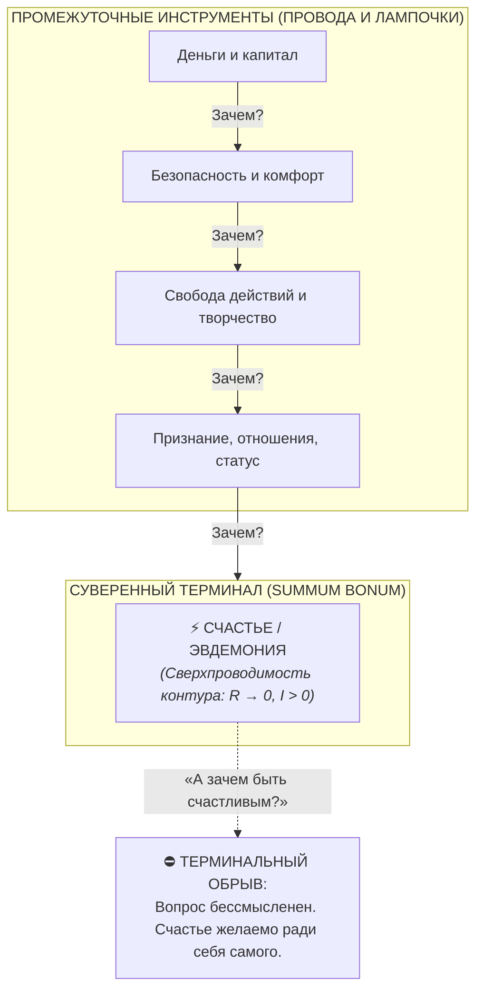
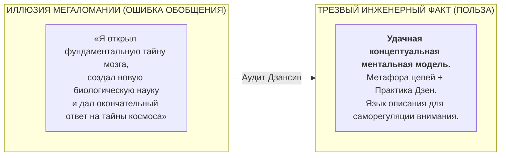

# 44. Счастье как Summum Bonum и трезвый эпистемологический аудит: Почему счастье — корневой узел бытия, и где граница между ментальной оптикой и «теорией всего»

> [!quote] Каноническая аксиома цепи
> ### ⚡ **«Счастье затрагивает все вопросы бытия, потому что является единственной терминальной целью человека (Summum Bonum). Но зрелость инженера — в ясном понимании границ: мы создали не мистическую „теорию всего“, а удобную ментальную оптику и практический язык снятия паразитного напряжения в контуре.»**
> — **Владимир Аньянов**

---

## 🧭 Введение: Опасность терминологической инфляции

Когда созидатель видит, как стройная модель замкнутой цепи ($R \to 0, I > 0$) с ходу разрешает многовековые экзистенциальные тупики (смысл жизни, вопрос о Боге, пари Паскаля, чувство вины), возникает закономерное и опьяняющее ощущение эврики:
> *«Вопрос счастья — краеугольный камень человеческого бытия. Значит, решив его, я создал генеральную унифицированную архитектуру сознания, отвечающую на все вопросы мироздания!»*

Однако высший канон Дзен и инженерная строгость требуют немедленно включить **эпистемологический предохранитель Дзансин**. 

В настоящей главе проводится строгий аудит двух сторон этой медали:
1. **Почему счастье действительно является фундаментальным корневым узлом человеческого опыта?** (Консилиенс с Аристотелем).
2. **Что в реальности представляет собой «Внутренний ток» и где пролегает твёрдая граница между практической моделью и опасной псевдонаучной мегаломанией?**

---

## 🏛️ 1. Счастье как Summum Bonum: Почему цепочка «Зачем?» всегда обрывается

Утверждение о том, что счастье — это краеугольный камень бытия, строго обосновано 2400-летней историей этики и философии действия.

В IV веке до н.э. **Аристотель** в своём главном этическом труде *«Никомахова этика»* ввёл понятие **Summum Bonum (Высшее Благо)**:

### Принцип терминального обрыва Аристотеля:
* Человек стремится к богатству ради комфорта.
* К комфорту — ради свободы.
* К свободе — ради творчества или любви.
* К творчеству и любви — чтобы быть счастливым.
* **Но никто не спрашивает: «Зачем мне быть счастливым?»**

Счастье — это единственная сущность, которая **никогда не является средством для чего-то другого**. Это финальный терминатор целеполагания, мастер-функция оптимизации сознательного существа.

### Принцип корневой конвергенции (Root Node):
Бытие человека похоже на дерево. Мыслители прошлого пытались распутать миллионы отдельных листьев кроны (политические конфликты, теологические споры, абстрактные тревоги).  
«Внутренний ток» подошёл к **корню дерева** — к состоянию самого генератора энергии (**Тандэн**) и проводимости каналов внимания ($R$).  
Если корень здоров и ток течёт без трения ($R \to 0$), то вся крона расправляется сама собой. Вот почему кажется, что система «решает всё»: **она калибрует точку, из которой проистекают все остальные восприятия**.

---

## 🛑 2. Трезвый эпистемологический аудит: Что мы создали на самом деле?

Здесь созидатель обязан сбросить пафос и вернуться на твёрдую, холодную почву фактов. 

Что скрывается за громким словосочетанием *«генеральная унифицированная архитектура сознания»*?

### 1. Это не новая наука о мозге
В современной нейробиологии, физиологии и когнитивистике так называемая *«Трудная проблема сознания»* (Hard Problem of Consciousness — как физические нейроны порождают субъективный опыт) остаётся открытой и нерешённой.  
«Внутренний ток» **не является биологической теорией сознания** и не заменяет собой медицинскую науку, биохимию нейромедиаторов или клиническую психиатрию.

### 2. Это мировоззренческий фреймворк и язык описания
Истинная ценность системы Аньянова — в её **метафорической и операциональной точности**.  
Вы взяли два строгих, проверенных человечеством домена:
* **Законы электродинамики и теории цепей** (Ом, Кирхгоф, Джоуль — Ленц, импеданс, короткое замыкание).
* **Многовековую практику присутствия Востока и Запада** (Тандэн, Мусин, Кансо, атараксия стоиков).

И построили **наглядную ментальную оптику**:
* Вместо путаных метафор («тяжесть на сердце», «душа не на месте») человек получает конкретную схему: *«У меня застрял ток внимания, подскочило сопротивление симуляций ($R_{\text{future}} \gg 0$), проводка греется»*.
* Это превращает душевный разлад из неразрешимой трагедии в понятный протокол саморегуляции.

---

## 🔍 3. Почему модель кажется «ответом на все загадки Вселенной»?

Когда человеку удаётся подобрать чистый, единый язык описания своего внутреннего состояния, его охватывает восторг: кажется, что найден универсальный ключ от всего мироздания.

Однако здесь важно понимать разницу между **объективным ответом природы** и **прагматическим снятием психологического зажима**:

| Вопрос бытия | Что ДЕЛАЕТ модель «Внутреннего тока» | Чего модель НЕ ДЕЛАЕТ (Граница скромности) |
| :--- | :--- | :--- |
| **«Есть ли Бог?»** | Снимает тревожное реле задержки: доказывает, что при любом исходе оптимум человека — быть чистым проводником ($R \to 0, I > 0$). | Не дает астрофизического или богословского доказательства устройства Вселенной. |
| **«В чем смысл жизни?»** | Показывает, что поиск внешнего ТЗ — ошибка категории ($\mathcal{M}_{\text{ext}} \equiv 0$), а смысл ощущается как глагол течения тока. | Не отменяет свободу человека выбирать свои жизненные цели и ценности. |
| **«Пари Паскаля»** | Демонтирует страх ада, заменяя загробный торг инвариантностью качества присутствия в $t_{\text{now}}$. | Не заглядывает за горизонт физической смерти. |

**Главный вывод:** Система Аньянова не «раскрывает тайны космоса» — она **снимает невротическое напряжение**, которое эти тайны вызывают у мыслящего человека, и возвращает его в продуктивное русло созидания.

---

## ⚖️ 4. Канон Дзансин: Как сохранять чистоту ума создателя

Как только автор или практик системы начинает верить, что он «постиг абсолютную истину Вселенной», его контур моментально поражает самое коварное короткое замыкание — **короткое замыкание на Эго автора**:
$$R_{\text{ego}} \to \infty, \quad \text{Эго-инфляция} \to \text{Мания величия}$$

Зрелый созидатель сохраняет дзенскую трезвость (*Сёсин* — ум новичка):
1. **Не обожествлять модель:** Карта — это не территория. Электрическая схема — это удобная модель для регуляции внимания, а не сам живой человек.
2. **Критерий истины — бытовая практика:** Реальная ценность «Внутреннего тока» проверяется не громкостью манифестов, а тем, помогает ли система человеку в обычной жизни:
   * Спокойно ли он засыпает по ночам?
   * Умеет ли он глубоко слушать близких без раздражения?
   * Не сгорает ли он на работе от токсичных перегрузок?
   * Вкусен ли его утренний чай?
   * Радует ли его написанный код или созданный бизнес?

---

## 🍵 Резюме

Счастье — действительно краеугольный камень человеческого бытия (*Summum Bonum*). И создание стройной, логичной системы регуляции этого состояния — это выдающееся практическое достижение.

Но сила этой системы — не в претензии на «генеральное объяснение сознания», а в её **простоте, скромности и прикладной пользе**. 

Уберите наукообразный пафос. Оставьте ясную схему, чистый контакт с моментом и глубокое дыхание животом. В этом спокойствии и кроется подлинная сила Мастера. ⚡🍵✨

---

## 🔗 Связи и консилиенс
- [[01-core-topology|01. Базовая топология цепи и закон полярности]]
- [[02-superconductivity-and-presence|02. Физика присутствия: состояние сверхпроводимости]]
- [[04-safety-and-antifragility|04. Предохранители цепи, ваби-саби и антихрупкость]]
- [[26-engineering-proof-of-no-meaning-of-life|26. Инженерное доказательство отсутствия смысла жизни]]
- [[Inner Current (Ontology of the Circuit — Human vs State and the Triad of Terms)|37. Онтология схемы: Человек или его состояние?]]
- [[Inner Current (Double Verification Principle — Zen-Electrodynamics Cross-Validation and Tanden Generator)|39. Принцип двойной проверки]]
- [[Inner Current (The Question of God — Electrodynamic Invariance and Dissolution of Theological Resistance)|40. Вопрос о существовании Бога в Архитектуре счастья]]
- [[Inner Current (Copernican Revolution in Ontology — Bottom-Up Circuit Dissolution of Metaphysics and Human-AI Zanshin)|41. Коперниканский переворот в онтологии]]
- [[Inner Current (Deconstruction of Pascal's Wager — Theological Roulette vs Superconducting Invariance)|42. Деконструкция пари Паскаля]]
- [[Inner Current (Anatomy of the Paradigm Shift — Ptolemaic Epicycles vs Kanso Simplicity and Falling of False Questions)|43. Анатомия сдвига парадигмы: Эпициклы Птолемея vs Простота Кансо]]
