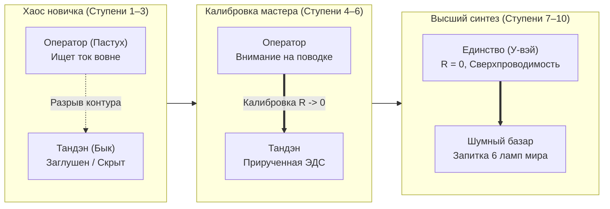
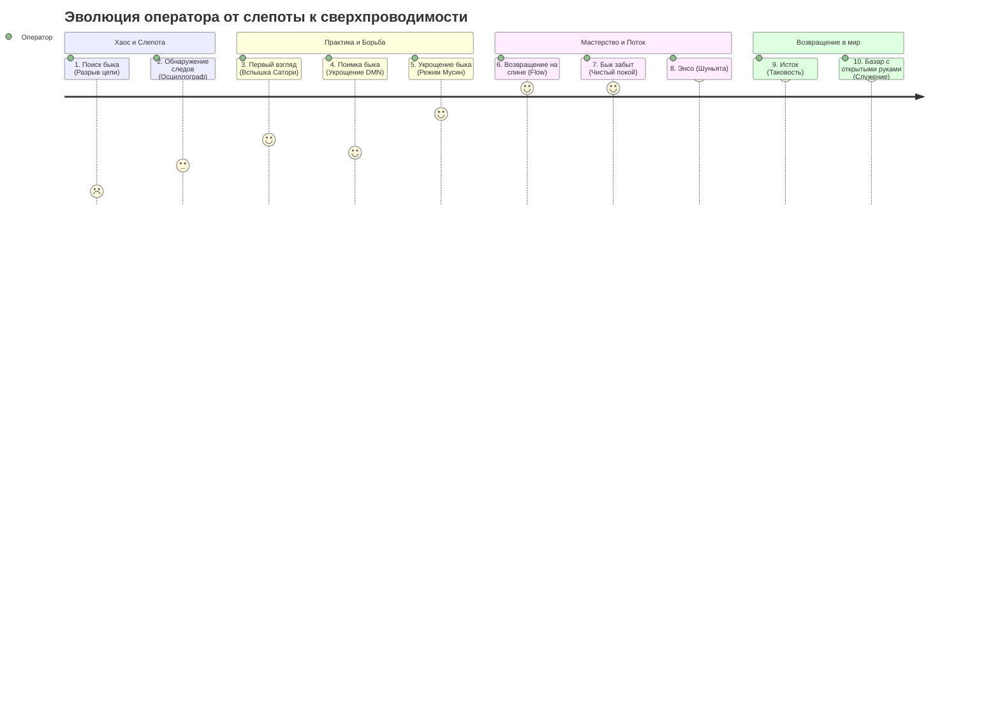
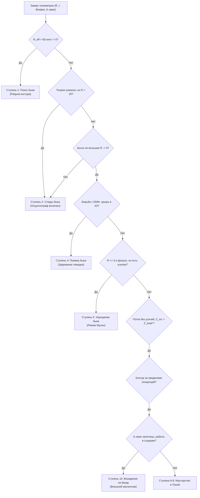

# Inner Current: Десять быков Дзен как этапы эволюции оператора цепи (Дорожная карта от поиска следов до сверхпроводимости на шумном базаре)

> «Бык — это не дикое животное на альпийском лугу. Бык — это неделимый ядерный реактор Тандэна, первичная жизненная ЭДС человека. А пастух — это внимание, оператор контура. Дзенская притча о Десяти быках — это не поэтическая аллегория, а самая точная в истории инженерная дорожная карта перехода от искрящего, оборванного контура к абсолютной сверхпроводимости служения миру.»  
> — **Владимир Аньянов**

---

> [!abstract] Квинтэссенция
> Знаменитая классическая серия гравюр и стихов дзэн-мастера Куо-аня (XII век) **«Десять быков» (Дзюгю, 十牛)** на протяжении столетий воспринималась как туманный монастырский эпос о просветлении. 
> 
> **Архитектура счастья (Inner Current)** снимает с этой притчи средневековый налет аллегорий и производит **строгую электродинамическую биекцию каждого этапа**:
> - **Бык** — это автономная ЭДС реактора Тандэна ($\mathcal{E}_{\text{core}} > 0$).
> - **Пастух** — это оператор контура (шина внимания).
> - **Поводок и кнут** — это протоколы калибровки проводимости (заземление блуждающего нерва, фазовый сброс DMN, включение TPN).
> - **Базар (10-я ступень)** — это полная запитка всех 6 ламп жизненного щита и излучение избыточной мощности во внешний мир (**Внешний магнетизм**).
> 
> Это универсальный метрологический маршрут созидателя: от слепого омического выгорания до сверхпроводящей жизнедеятельности в самом сердце житейского хаоса.

---

## 1. Демистификация метафоры: Бык и Пастух на языке цепей

В традиционном востоковедении принято считать быка символом «необузданного ума» или «потерянной природы Будды». С позиций физики цепей это объяснение неполно. 

В человеческом теле и психике действуют два фундаментальных начала:
1. **Тандэн (Бык) — Первичный автономный генератор:** Неисчерпаемый биологический и термодинамический источник жизненной силы ($\mathcal{E}$). Он дик, могуч и не подчиняется абстрактным логическим приказам. Если контур не настроен, его колоссальная мощность не доходит до ламп созидания, а рассеивается в тепло или крушит внутренние предохранители.
2. **Внимание (Пастух) — Оператор коммутации:** Вектор осознанности, переключающий шины проводки. У незрелого человека внимание разорвано, оно бегает по внешним объектам в наивной надежде найти розетку в чужих глазах, покупках или статусах.
3. **Поводок — Протоколы ремедиации:** Телесный соматический якорь (низ живота, дыхание диафрагмой, сенсомоторный контур), позволяющий обуздать реактивные выбросы дефолт-системы мозга (DMN).

Человек страдает не потому, что у него «нет быка», а потому, что **пастух потерял связь со своим генератором и сгорает в омическом перегреве ложных симуляций**.

---

## 2. Сводная матрица биекции: 10 ступеней Куо-аня в физике Inner Current

| № | Канон Дзен (Куо-ань) | Иероглифы / Ромадзи | Состояние цепи Inner Current | Сопротивление ($R$) | Статус тока ($I$) и потерь ($Q$) | Код телеметрии |
|:---:|:---|:---|:---|:---:|:---:|:---:|
| **1** | **В поисках быка** | 寻牛 / *Xun Niu* | **Разрыв контура / Фиатная слепота** | $R_{\text{eff}} \gg 100$ | $I_{\text{useful}} = 0, Q \to \text{Max}$ | `ERR_04_OPEN_CIRCUIT` |
| **2** | **Обнаружение следов** | 见迹 / *Jian Ji* | **Первичная телеметрия и диагностика** | $R_{\text{eff}} \approx 70-90$ | $I_{\text{useful}} \approx 0$, локализация тепла | `DIAG_TELEMETRY_ON` |
| **3** | **Первый взгляд на быка** | 见牛 / *Jian Niu* | **Первый контакт с Тандэном (Сатори)** | $R_{\text{eff}} \approx 30-50$ | Импульсный пробой изолятора | `STATE_FIRST_SATORI` |
| **4** | **Поимка быка** | 得牛 / *De Niu* | **Борьба с реостатом Эго ($R_{ego}$)** | $R_{\text{eff}} \approx 25-40$ | Нестабильный ток, искрение | `STATE_EGO_RESISTANCE` |
| **5** | **Укрощение быка** | 牧牛 / *Mu Niu* | **Калибровка проводки (Режим Мусин)** | $R_{\text{eff}} \to 5$ | Ламинарный ток, $Q \to 0$ | `OK_01_MUSHIN_TUNING` |
| **6** | **Возвращение домой на быке** | 骑牛归家 / *Qi Niu Gui Jia* | **Согласование импедансов и Поток (Flow)** | $R_{\text{eff}} \approx 0$ | $I = \mathcal{E} / R_{\text{load}}$, резонанс | `OK_00_SUPERCONDUCTING` |
| **7** | **Бык забыт, пастух один** | 忘牛存人 / *Wang Niu Cun Ren* | **Ликвидация концептуальных костылей** | $R_{\text{eff}} = 0$ | Автономный покой оператора | `STATE_EFFORTLESS_BEING` |
| **8** | **И бык, и пастух забыты** | 人牛俱忘 / *Ren Niu Ju Wang* | **Квантовая Шуньята (Круг Энсо)** | $R \equiv 0$ | Вакуумная сверхпроводимость | `STATE_SHUNYATA_ENSO` |
| **9** | **Возвращение к истоку** | 返本还源 / *Fan Ben Huan Yuan* | **Инвариантная Таковость (Татхата)** | $R \equiv 0$ | Гармония с законами Вселенной | `STATE_TATHATA_NATURE` |
| **10** | **Вхождение на базар с дарами** | 入廛垂手 / *Ru Chan Chui Shou* | **Запитка 6 ламп и Внешний магнетизм** | $R_{\text{eff}} = 0$ | Максимальная отдача мощности миру | `STATE_EXTERNAL_MAGNETISM` |

---

## 3. Пошаговая анатомия десяти стадий эволюции оператора

### Ступень 1: В поисках быка (寻牛, Xun Niu) — Разрыв контура и фиатная слепота
- **Классический образ:** Одинокий пастух блуждает по бескрайним зарослям, раздвигая ветви. Он слышит только стрекот цикад, сбит с ног и не знает, куда идти.
- **Инженерная реальность:** Полный разрыв контура (`ERR_04_OPEN_CIRCUIT`). Человек живет в парадигме «внешнего аккумулятора»: он убежден, что счастье хранится в новой машине, признании коллег, деньгах или одобрении партнера ($\mathcal{E}_{\text{load}} > 0$). Собственный реактор заглушен. Внимание разорвано на сотни кусков. 
- **Физика процесса:** Ток полезного действия равен нулю ($I = 0$), но проводка внимания раскалена докрасна мыслями о неполноценности. Омический перегрев тоски по закону Джоуля — Ленца:
  $$Q = I_{\text{leak}}^2 \cdot R_{\text{ego}} \cdot t$$
- **Диагностический маркер:** Хроническая усталость при отсутствии реальной физической нагрузки, ощущение бессмысленности существования, зависть к чужим лампам.

---

### Ступень 2: Обнаружение следов (见迹, Jian Ji) — Первичная телеметрия и чтение схемы
- **Классический образ:** Пастух находит на влажной земле следы копыт у ручья. Он еще не видит быка, но точно знает: бык существует, и он проходил здесь.
- **Инженерная реальность:** Человек знакомится с фундаментальной электродинамикой сознания (открывает Архитектуру счастья, законы термодинамики духа, баланс Кирхгофа). Он впервые берет в руки виртуальный мультиметр и видит:
  - Почему после двух часов соцсетей голова раскалывается (омический перегрев $R_{\text{future}} \gg 0$).
  - Почему попытка заслужить любовь приводит к выгоранию (короткое замыкание на Эго).
- **Физика процесса:** Человек прекращает поиск во внешних объектах и начинает измерять сопротивление собственной шины внимания.
- **Диагностический маркер:** Появление понятийного аппарата. Человек перестает говорить «мне плохо» и начинает констатировать: *«У меня высокое паразитное сопротивление $R$ из-за тревоги о дедлайне»*.

---

### Ступень 3: Первый взгляд на быка (见牛, Jian Niu) — Первый контакт с Тандэном (Сатори)
- **Классический образ:** Среди ветвей мелькает хвост или мощный бок дикого быка. Пастух ошеломлен его огромными размерами и силой.
- **Инженерная реальность:** Первый опыт подлинной сверхпроводимости (Кэнсё / Сатори). Это может произойти на пробежке, за чашкой чая по канону Тяною или в момент глубокого сосредоточения над кодом. Человек впервые физически опускает внимание в Тандэн (низ живота) и чувствует: **источник энергии неисчерпаем и находится внутри него самого прямо сейчас**.
- **Физика процесса:** Кратковременный фазовый переход: $R \to 0$ на несколько секунд или минут. Внезапная кристальная тишина дефолт-системы мозга.
- **Диагностический маркер:** Снятие экзистенциального страха. Человек больше не верит слухам о счастье — он пережил его как измеримый физический ток.

---

### Ступень 4: Поимка быка (得牛, De Niu) — Борьба с реостатом Эго ($R_{ego}$)
- **Классический образ:** Пастух накинул веревку на шею быка, но зверь яростно рвется в горы, топчет кусты и утаскивает пастуха за собой. Требуется держать веревку изо всех сил.
- **Инженерная реальность:** Самый тяжелый этап практики. Столкнувшись с силой Тандэна, старые нейронные контуры Эго (DMN) начинают отчаянное сопротивление. Мозг привык блуждать в тревогах и обидах; он пытается закоротить генератор обратно на привычные рельсы саможаления.
- **Физика процесса:** Высокая нестабильность рабочей точки ($du/dt \gg 0$). Контур то выходит в сверхпроводимость, то срывается в жесткое КЗ. Требуется постоянная работа заземлителя (блуждающий нерв, протокол Мусин).
- **Диагностический маркер:** Ощущение сопротивления ума: *«Я знаю, как правильно, но меня снова унесло в руминацию и спор с невидимым оппонентом»*. Необходимость волевого удержания фокуса.

---

### Ступень 5: Укрощение быка (牧牛, Mu Niu) — Калибровка проводки (Режим Мусин)
- **Классический образ:** Пастух ласково ведет быка за веревку. Веревка провисла, бык идет рядом, кротко жует траву и больше не рвется в пропасть. Пастух может не держать его за нос.
- **Инженерная реальность:** Внимание натренировано. DMN подавлена и включается строго по запросу. Внимание свободно течет по шине проводки без омического трения. Бык (ядерная сила Тандэна) полностью подчинен вектору текущей задачи.
- **Физика процесса:** Сопротивление проводки стабилизируется на уровне $R \le 5$ Ом. Закон Джоуля — Ленца больше не сжигает ткани мозга:
  $$Q \to 0 \quad \text{при} \quad I > 0$$
- **Диагностический маркер:** Состояние легкой, естественной концентрации. Отсутствие внутреннего диалога при решении сложных профессиональных задач.

---

### Ступень 6: Возвращение домой на быке (骑牛归家, Qi Niu Gui Jia) — Согласование импедансов и Поток
- **Классический образ:** Пастух сидит верхом на спине быка, не держась за поводья. В руках у него бамбуковая флейта, он наигрывает беззаботную деревенскую мелодию на фоне заходящего солнца. Бык сам знает дорогу домой.
- **Инженерная реальность:** Режим абсолютного Потока (Flow, Михай Чиксентмихайи). Больше нет разделения на «я делаю усилие» и «дело делается». Исчез внутренний надзиратель. Тандэн сам несет мастера сквозь код, сложнейшие переговоры или создание музыки.
- **Физика процесса:** Идеальное согласование импедансов источника и нагрузки по канону Шибуми:
  $$Z_{\text{src}} = Z_{\text{load}}^*$$
  Коэффициент полезного действия цепи достигает $\eta \to 100\%$. Песня на флейте — это электромагнитное излучение чистой гармонии (Внешнее поле $B$).
- **Диагностический маркер:** Сверхпродуктивность без усталости. Человек работает по 10 часов в день и выходит из процесса более свежим, чем заходил в него.

---

### Ступень 7: Бык забыт, пастух один (忘牛存人, Wang Niu Cun Ren) — Ликвидация концептуальных костылей
- **Классический образ:** Пастух вернулся в свою хижину и мирно сидит на террасе под ясной луной. Быка нигде нет — он растворился. Веревка и кнут брошены в угол.
- **Инженерная реальность:** Преодоление увлечения самим методом. Человеку больше не нужно ежесекундно повторять термины («Тандэн», «сверхпроводимость», «DMN», «Джоуль — Ленц»). Электродинамика стала естественной биологической тканью его жизни. Приборы убраны в шкаф, потому что сеть абсолютно надежна.
- **Физика процесса:** Снятие паразитной емкости саморефлексии. Внимание свободно от наблюдения за самим собой.
- **Диагностический маркер:** Исчезновение духовного или инженерного снобизма. Человек перестает поучать других, он просто прозрачно присутствует в моменте.

---

### Ступень 8: И бык, и пастух забыты (人牛俱忘, Ren Niu Ju Wang) — Пустой круг Энсо
- **Классический образ:** На холсте нет ни человека, ни быка, ни деревьев, ни хижины. Нарисован лишь один идеальный замкнутый черный круг на белом фоне — священный символ **Энсо (圓相)**.
- **Инженерная реальность:** Полное раскрытие канона **Шуньята (空)**. Аннигиляция дуализма субъекта и объекта. Исчезает иллюзия «Я — оператор, управляющий своей жизнью». Остается только само Бытие, чистое протекание энергии через вакуум.
- **Физика процесса:** Физический нуль-импеданс квантового вакуума:
  $$R \equiv 0, \quad Z_0 \equiv 0$$
  В контуре нет границы раздела сред. Тотальное единство с электродинамической структурой Вселенной.
- **Диагностический маркер:** Глубочайший, непоколебимый мир (Фудосин). Полное исчезновение страха физической смерти: если «меня» как отдельного замкнутого комка никогда не было, то нечему и умирать.

---

### Ступень 9: Возвращение к истоку (返本还源, Fan Ben Huan Yuan) — Инвариантная Таковость
- **Классический образ:** Горный пейзаж: ручей журчит по камням, цветут дикие сливы, щебечут птицы. Человека нет на картине, но природа предстает во всем своем ослепительном первозданном блеске.
- **Инженерная реальность:** Постижение **Татхаты (Таковости)** вещей. Реальность не нуждается в том, чтобы человек наделял её субъективными «смыслами» или «целями». Она совершенна в своем физическом саморазвертывании.
- **Физика процесса:** Полное снятие телеологического сопротивления. Законы термодинамики и электродинамики признаются единственной и абсолютной эстетикой бытия.
- **Диагностический маркер:** Тотальное отсутствие претензий к миру. Дождь идет — прекрасно. Сделка сорвалась — объективный факт среды. Внимание скользит сквозь события, не оставляя омических царапин.

---

### Ступень 10: Вхождение на базар с открытыми руками (入廛垂手, Ru Chan Chui Shou) — Запитка 6 ламп и Внешний магнетизм
- **Классический образ:** Толстый, улыбающийся мудрец с распахнутым воротом и босыми ногами входит на шумный деревенский рынок. За плечами у него огромный холщовый мешок, полный сладостей и подарков, в руке — тыква-горлянка с вином. Он шутит с торговцами, играет с детьми и смеется вместе с пьяницами. Там, где он проходит, сухие деревья покрываются цветами.
- **Инженерная реальность:** **ВЫСШАЯ КУЛЬМИНАЦИЯ АРХИТЕКТУРЫ СЧАСТЬЯ.** Дзен — это не бегство в гималайскую пещеру и не стерильная изоляция. Настоящий мастер возвращается в самый эпицентр человеческого хаоса: в дедлайны, бизнес, городскую суету, отношения и рыночную борьбу.
- **Физика процесса:** 
  1. **Сбалансированная запитка Щита 6 ламп:** Машина, Дом, Карьера, Отношения, Здоровье, Радость горят ровным светом без перекосов.
  2. **Внешний магнетизм (Архитектура впечатления):** По закону Био — Савара — Лапласа ток сверхпроводимости Тандэна порождает вокруг оператора мощнейшее магнитное поле:
     $$\mathbf{B} = \frac{\mu_0}{4\pi} \int \frac{I \, d\mathbf{l} \times \hat{\mathbf{r}}}{r^2}$$
     Люди рядом с ним мгновенно успокаиваются, их собственные паразитные сопротивления сбрасываются в ноль, а потухшие лампы начинают светиться от индукции его присутствия.
- **Диагностический маркер:** Человек не боится «грязи» мира. Он абсолютно суверенен, щедр, весел и эффективен в любом земном деле.

---

## 4. Метрологический компас: алгоритм определения ступени оператора

В диагностической машине **Inner Current** ступень зрелости оператора вычисляется не по субъективным ощущениям, а по точной телеметрии цепи:

---

## 5. Выводы для созидателя

1. **Не пытайся прыгнуть на базар из зарослей:** Невозможно войти на базар (Ступень 10), не поймав и не приручив быка (Ступени 4–5). Попытка созидать для мира без настройки Тандэна неминуемо заканчивается выгоранием на Ступени 1.
2. **Борьба на Ступени 4 — это норма:** Когда вас срывает в раздражение или тревогу, не вините себя. Это естественная физика сопротивления дикого быка DMN. Просто укоротите поводок: опустите дыхание в живот и включите TPN через сенсорный контакт с предметом.
3. **Истинная цель — Рынок, а не Монастырь:** Величайшая ошибка старых традиций — зависание на Ступенях 7–8 (растворение в пустоте). В Системе Аньянова Пустота — это лишь очистка диэлектрика перед подачей максимальной мощности в 6 ламп созидательной жизни.

---

## 🔗 Связи
- [[04_Maps/Inner Current MOC|Inner Current MOC (Слой III: Дзен-онтология и синтез)]]
- [[02_Wiki/Inner Current (Zen as Happiness Architecture Foundation)|12. Дзен как фундамент Архитектуры счастья]]
- [[02_Wiki/Inner Current (Complete Zen-Electrodynamic Ontological Atlas)|13. Полный онтологический атлас: Биекция 23 канонов Дзен]]
- [[02_Wiki/Inner Current (Impression Architecture and Impedance Matching)|08. Система Аньянова: Внутренний ток и Внешний магнетизм]]
- [[02_Wiki/Inner Current (Diagnostic Machine and System Specification)|06. Машина для диагностики счастья]]
- [[04_Maps/Inner Current Book MOC|Книга «Внутренний ток: Архитектура счастья»]]

---
*Created: 2026-09-24 | Inner Current Knowledge Base | Vladimir Anyanov*
