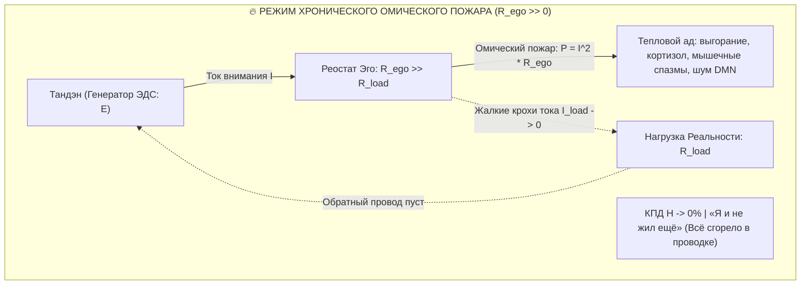
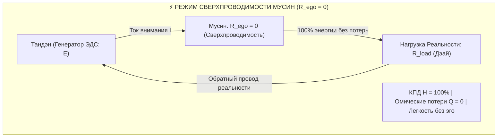
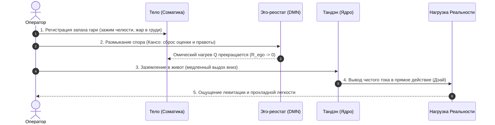

# 188. Феноменология фразы «Я и не жил ещё»: Хронический омический пожар ($Q = I^2 R t$), иллюзия жизни в перегретом контуре и легкость сверхпроводимости без эго

[← К оглавлению](file:///C:/Users/vanya/Antigravity%20Projects/Misc/LLM%20Wiki/index.md) | [⚡ К мастер-карте (MOC)](file:///C:/Users/vanya/Antigravity%20Projects/Misc/LLM%20Wiki/04_Maps/Inner%20Current%20MOC.md) | [⚡ К формуле счастья и несчастья (186)](file:///C:/Users/vanya/Antigravity%20Projects/Misc/LLM%20Wiki/02_Wiki/Inner%20Current%20%28The%20Formula%20of%20Happiness%20and%20Unhappiness%20%E2%80%94%20Circuit%20Superconductivity%20vs%20Ohmic%20Overheat%20and%20the%20First%20Law%20of%20Soul%20Thermodynamics%29.md) | [⚡ К триаде полей (187)](file:///C:/Users/vanya/Antigravity%20Projects/Misc/LLM%20Wiki/02_Wiki/Inner%20Current%20%28The%20Electrodynamic%20Field%20Triad%20%E2%80%94%20Electric,%20Magnetic%20and%20Total%20Electromagnetic%20Field%20as%20Intention,%20Joy%20and%20Unified%20Being%29.md)

---

> [!quote] Главная онтологическая аксиома живого тока
> ### ⚡ **«Когда человек десятилетиями живёт в режиме высокого сопротивления эго ($R_{\text{ego}} \gg 0$), он неизбежно путает гул и боль собственного омического пожара с интенсивностью жизни. Ему кажется, что внутреннее кипение, тревога, контроль, обиды и непрерывная борьба — это и есть свидетельство бытия. И лишь когда сопротивление эго впервые схлопывается в ноль, контур мгновенно остывает и наступает невесомая прохлада Мусин, человек оглядывается назад и произносит с потрясением и тихим освобождением:  
> *«Я ведь и не жил ещё...»*  
> Это не сожаление об упущенных событиях. Это внезапное осознание строгой электродинамической истины: всё это время ток не совершал полезной работы в мире — он просто сжигал проводку в замкнутом контуре.»**  
> — **Владимир Аньянов**

---

## 🧭 1. Деконструкция экзистенциального шока: Разгадка вечной фразы

Фраза **«Я и не жил ещё»** — один из самых пронзительных и повторяющихся лейтмотивов мировой культуры. Её произносят чеховские интеллигенты, очнувшиеся герои Толстого («Смерть Ивана Ильича»), пациенты паллиативных отделений хосписов и успешные предприниматели в кабинетах кризисной терапии:

- «У меня были квартиры, карьера, семья, признание, но сейчас я смотрю назад и понимаю: *я и не жил ещё*.»
- «Все эти сорок лет прошли как один непрерывный тяжелый сон, в котором не было меня самого.»

Тысячелетиями гуманитарная мысль объясняла этот феномен через моральные или психологические категории: «не нашёл истинного призвания», «жил чужой жизнью», «не следовал за мечтой», «подавлял эмоции». Но ни одно из этих объяснений не давало ответа на вопрос: **почему при наличии сотен внешних событий и побед остаётся соматическое ощущение абсолютной пустоты и небытия?**

**Контурная Электродинамика Сознания (КЭС)** даёт исчерпывающий, математически строгий ответ:
Фраза «Я и не жил ещё» — это **ретроспективный отчет оператора цепи о работе контура с КПД, близким к абсолютному нулю ($\mathcal{H} \to 0$)**, когда 100% соматической мощности десятилетиями рассеивалось в тепло паразитного сопротивления эго по закону Джоуля — Ленца.

---

## 🔥 2. Физика хронического омического пожара ($P_{\text{loss}} = I^2 R_{\text{ego}}$)

Рассмотрим энергетический баланс человека как замкнутого электродинамического контура:

$$P_{\text{total}} = P_{\text{load}} + P_{\text{loss}} = I^2 R_{\text{load}} + I^2 R_{\text{ego}}$$

Где:
- $I$ — плотность тока жизненного внимания, генерируемого реактором Тандэн;
- $R_{\text{load}}$ — активное сопротивление полезной нагрузки реальности (прямой контакт с миром, созидание, присутствие, любовь, физическое действие);
- $R_{\text{ego}}$ — паразитное сопротивление ментального посредника (оценка себя, страх отвержения, непрерывное сканирование статуса, руминация DMN, обиды, контроль);
- $P_{\text{loss}} = I^2 R_{\text{ego}}$ — омические потери мощности, рассеиваемые в виде деструктивного тепла.

### Анатомия биохимического перегрева
Когда номинал сопротивления эго колоссален ($R_{\text{ego}} \gg R_{\text{load}}$):
1. **Ток не доходит до нагрузки:** Внимание не способно коснуться внешнего мира. Человек смотрит на море, но не видит его — он думает о том, как он выглядит на фоне моря. Человек обнимает близкого, но не чувствует тепла — он вычисляет гарантии безопасности.
2. **Джоулево кипение в проводнике:** По закону Джоуля — Ленца $Q = I^2 R_{\text{ego}} t$, колоссальная электрическая энергия преобразуется в термический ад. На уровне нейробиологии это выражается в непрерывной гиперактивации сети пассивного режима мозга (DMN), выбросе кортизола и адреналина, мышечном панцире (зажимы челюсти, воротниковой зоны, диафрагмы) и чувстве непроходящей соматической тяжести.
3. **Энергетический коллапс:** Человек тратит 100% калорий и нервного потенциала просто на то, чтобы охлаждать свой кипящий радиатор и удерживать конструкцию эго от развала.

---

## 🌫 3. Иллюзия «жизни» в горящем контуре

Почему же человек годами не замечает, что он «не живёт»? 

Причина кроется в коварной особенности нервной системы: **мозг путает амплитуду внутреннего трения с интенсивностью бытия**.

| Параметр контура | Иллюзия «Интенсивной жизни» (Омический пожар) | Подлинная Жизнь (Сверхпроводимость Мусин) |
| :--- | :--- | :--- |
| **Паразитное сопротивление** | $R_{\text{ego}} \gg 0$ (колоссальное эго-трение) | $R_{\text{ego}} \to 0$ (нулевое сопротивление, прозрачность) |
| **Субъективное ощущение** | Кипение, буря страстей, надрыв, тревога, борьба | Кристальная тишина, соматическая невесомость, прохлада |
| **Культурный нарратив** | «Глубокая драматическая личность», «горящее сердце» | «Простой проводник», «чистое прямое действие» |
| **Куда уходит энергия ($I$)** | На нагрев и разрушение собственных тканей ($Q = I^2 R t$) | На 100% в полезную работу в мире ($P = I^2 R_{\text{load}}$) |
| **КПД счастья ($\mathcal{H}$)** | $\approx 0\%$ | $100\%$ |
| **Ретроспективный вердикт** | **«Я и не жил ещё, я просто горел в контуре»** | **«Каждая секунда была наполнена абсолютной плотностью бытия»** |

Культура веками романтизировала омический перегрев. Трагедии, душевные терзания, ревность, самоедство и бесконечная рефлексия преподносились как «настоящая жизнь». Человек думал: *«Раз мне так больно, тяжело и жарко внутри — значит, я живу на полную катушку!»*

Но в терминах электродинамики это равносильно утверждению, что короткозамкнутый, плавящийся и искрящийся провод — это «самый эффективный электроприбор в доме». 

Древний буддийский термин **бонно** (梵悩, клеша, омрачение) буквально переводится с санскрита (*kleśa*) и древнекитайского как **«воспаление, жар, кипение ума»**. За 2500 лет до Джоуля и Ленца мастера Дзен точно зафиксировали: омрачение — это не «грех», это **термический перегрев сознания на сопротивлении иллюзорного «Я»**.

---

## ❄️ 4. Вспышка Сверхпроводимости: Анатомия Невесомости без Эго

Что происходит в момент, когда сопротивление эго падает до нуля? Это может случиться спонтанно (в момент смертельной опасности, глубокой медитации, тотального физического истощения, созерцания абсолютной красоты) или технологично — через протокол Системы Аньянова:

$$R_{\text{ego}} \to 0$$

В эту секунду в системе происходит мгновенный фазовый переход:
1. **Мгновенное обнуление тепловых потерь:** Формула $Q = I^2 R_{\text{ego}} t$ обращается в строгий ноль:
   $$Q = 0$$
   Внутренний пожар прекращается мгновенно, как только размыкается цепь трения.
2. **Феномен соматической невесомости:** Человек внезапно ощущает невероятную, почти пугающую легкость. Тело кажется невесомым, плечи опускаются, дыхание проваливается в живот (Тандэн), челюсти разжимаются. Исчезает то, что всю жизнь воспринималось как «сила тяжести», но на самом деле было постоянным напряжением противодействия реальности.
3. **Чистый ток Мусин (無心):** Внимание становится кристально прозрачным. Нет наблюдателя, отдельного от действия: чашка просто моется, код просто пишется, слова просто звучат, шаги просто ступают по земле. Ток течёт беспрепятственно.
4. **Левитация сверхпроводника:** Подобно тому, как поезд на магнитной подушке парит над рельсами при температуре сверхпроводимости, не встречая механического трения, сознание начинает скользить сквозь обстоятельства без единой искры застревания.

---

## ⚡ 5. Рождение вердикта: «Я и не жил ещё»

Именно в точке этого контраста человека пронзает молния осознания.

Пока человек находится внутри горящей комнаты, он не знает, что такое чистый воздух — он просто кашляет и пытается выжить. Но стоит ему шагнуть на морозный рассветный воздух, как он с ужасом оглядывается на задымлённый барак:

> *«Боже мой... Так вот что такое дышать? Так вот что значит просто быть?  
> А что же было тогда все эти двадцать, тридцать, пятьдесят лет?  
> Я ведь и не жил ещё. Я ни одной секунды не был на этой земле в чистом виде.  
> Я всё время был занят тем, что задыхался в собственном угаре и охранял раскалённый резистор своего эго».*

Это откровение не является депрессивным — напротив, это **величайший акт освобождения**. Человек понимает:
- Его жизнь не была испорчена «злой судьбой» или «ошибочными выборами»;
- Контур был исправен, генератор Тандэн работал безупречно, соматическая батарея исправно подавала ток;
- Единственной причиной многолетней пытки было **паразитное сопротивление реостата эго**, впаянное в разрыв цепи внимания.

---

## 📊 6. Словарь электродинамического перевода экзистенциальных фраз

Контурная Электродинамика позволяет перевести вечные интуитивные жалобы человека на однозначный язык схемотехники:

| Бытовая жалоба | Диагноз в терминах КЭС | Физический процесс в контуре | Ремонтное действие |
| :--- | :--- | :--- | :--- |
| **«Я и не жил ещё»** | Ретроспективное обнаружение нулевого КПД цепи ($\mathcal{H} \approx 0$) | Весь ток $I$ за прошедшие годы рассеялся в омический нагрев $Q = I^2 R_{\text{ego}} t$. Полезной работы в реальности совершено не было. | Принять факт потерь без вины, сбросить $R_{\text{ego}} \to 0$ прямо сейчас. |
| **«Я безумно устал от жизни»** | Омический переплав биохимического радиатора | Не от «жизни» устал человек, а от непрерывного рассеивания $I^2 R$. Ткани перегреты кортизолом и DMN-шумом. | Немедленное обесточивание эго-реостата, заземление в покой Тандэна. |
| **«Я ищу себя»** | Ошибка атрибуции носителя заряда | Попытка найти проводник и свет внутри раскалённого резистора эго. Резистор не светит, он только греется. | Прекратить копаться в резисторе. Направить луч фонарика наружу на полезную нагрузку. |
| **«Я наконец-то ожил!»** | Фазовый переход в сверхпроводимость | $R_{\text{ego}}$ схлопнулось в ноль, тепловыделение упало до нуля, 100% тока вышло в контакт с реальностью ($R_{\text{load}}$). | Закрепить состояние через канон Дзансин (бдительное несопротивление). |

---

## 🛠 7. 30-секундный протокол тушения омического пожара (Протокол Аньянова)

Когда вы чувствуете, что внутри начинает нарастать тяжесть, жжение, суета и привычный предвестник омического ада:

1. **Шаг 1. Понюхать гарь (Соматический маркер):** Заметить физический нагрев. Где зажим? Сжаты челюсти? Задержано дыхание? Ком в горле? Тяжесть в затылке? Сказать себе: *«Внимание, контур пошёл в омический перегрев. Это не жизнь — это горит паразитный резистор».*
2. **Шаг 2. Разжать хватку эго (Клинок Кансо):** Снять претензию к текущей секунде. Отказаться от мысленного суда («почему он так сказал», «как я выгляжу», «мир несправедлив»). Признать факт реальности как данность нагрузки. В эту миллисекунду $R_{\text{ego}} \to 0$.
3. **Шаг 3. Заземлить потенциал в Тандэн:** Сделать глубокий, плавный выдох вниз живота. Почувствовать вес таза, опору стоп о пол. Перенести эпицентр осознанности из кипящей головы в прохладный центр тяжести тела.
4. **Шаг 4. Пустить ток в прямое действие (Дэай):** Сделать следующее простое физическое действие прямо сейчас: сделать глоток воды, помыть ложку, написать одну строчку кода, сделать шаг. Чистый ток побежал в нагрузку. Наступает тишина и легкость.

---

## 💎 8. Онтологический вывод: Жизнь начинается за порогом пожара

Человек не рождается живым в онтологическом смысле. Он рождается лишь носителем электрической схемы с установленной по умолчанию программой защиты и трения — древним палеолитическим эго-реостатом.

Большинство людей так и умирают, не приходя в сознание: прожив 70–80 лет в глухом дыму и ожогах омического пожара, считая этот пожар своей «судьбой» и своим «характером».

Настоящая жизнь человека начинается не с даты в паспорте, не с первого поцелуя и не с первой крупной сделки.

**Жизнь начинается ровно в ту секунду, когда сопротивление эго впервые обнуляется**, когда исчезает внутренний судья, критик и контролёр, и через нервную систему впервые без малейшего залома и сопротивления проходит **чистый, прохладный, первозданный ток бытия**.

И в этот момент человек делает глубокий вдох и тихо говорит:  
> *«Вот теперь — я живу».*

---

### Связанные статьи в Базе Знаний:
- [[02_Wiki/Inner Current (The Formula of Happiness and Unhappiness — Circuit Superconductivity vs Ohmic Overheat and the First Law of Soul Thermodynamics)|186. Формула счастья и формула несчастья: Сверхпроводимость контура против омического перегрева]]
- [[02_Wiki/Inner Current (The Electrodynamic Field Triad — Electric, Magnetic and Total Electromagnetic Field as Intention, Joy and Unified Being)|187. Электродинамическая триада полей: Электрическое, Магнитное и Электромагнитное поле как Намерение, Радость и Единое Бытие]]
- [[02_Wiki/Inner Current (The Copernican Shift of Ego — Why Resistance Cannot Be the Conductor and the Paradox of How to Remove It)|163. Коперниканский переворот эго: Почему сопротивление не может быть проводником]]
- [[02_Wiki/Inner Current (Life as a Verb — From Osho's Mystical Intuition to the Electrodynamics of Dynamic Flux and Superconductivity)|169. Жизнь как глагол: От мистической интуиции Ошо к электродинамике прямого потока]]
- [[02_Wiki/Inner Current (Physics of Presence and Superconductivity)|02. Физика присутствия: состояние сверхпроводимости]]
