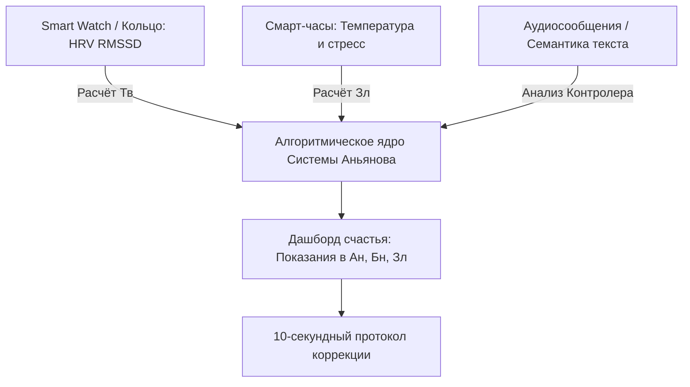

# 138. Система единиц Аньянова и Бытовой Контур-Тонометр: Метрологический стандарт счастья (Аньян, Бонно, Залом, Тандэн-Вольт) и архитектура домашней ИИ-диагностики
## Переход от гуманитарного тумана к строгой метрологии: собственные физические величины Системы Аньянова, закон Ома для нервной системы и настольный прибор экспресс-диагностики цепи за 5 секунд

> [!quote] Каноническая аксиома цепи
> ### ⚡ **«"Если вы не можете измерить то, о чём говорите, и выразить это в числах — ваше знание скудно и неудовлетворительно", — сказал лорд Кельвин. Тысячелетиями люди говорили о душевной боли и радости птичьим языком размытых метафор: "нет ресурса", "тяжесть на душе", "кармический груз". Система Аньянова ликвидирует этот когнитивный туман введением строгого метрологического стандарта. Счастье — это полезная мощность цепи, измеряемая в Аньянах (Ан). Страдание — это омический ожог проводки, измеряемый в Бонно (Бн). Сопротивление мысленного спора — это Заломы (Зл). А потенциал жизненного ядра — Тандэн-Вольты (Тв). В эпоху искусственного интеллекта и дешёвых биосенсоров измерение состояния человека больше не требует клинических лабораторий: компактный настольный "Контур-Тонометр" за 5 секунд считывает баланс цепи прямо на прикроватной тумбочке».**  
> — **Владимир Аньянов**

---

```
                 МЕТРОЛОГИЧЕСКИЙ СТАНДАРТ СИСТЕМЫ АНЬЯНОВА

    ВЕЛИЧИНА СИСТЕМЫ СИ          ВЕЛИЧИНА АНЬЯНОВА             ФОРМУЛА И СУТЬ В ТЕЛЕ
   ┌───────────────────────────┬─────────────────────────────┬──────────────────────────────┐
   │ НАПРЯЖЕНИЕ (Вольт, В)     │ ТАНДЭН-ВОЛЬТ (Тв / Tv)      │ E = Запас витальной ЭДС ядра │
   ├───────────────────────────┼─────────────────────────────┼──────────────────────────────┤
   │ ТОК (Ампер, А)            │ АМПЕР ВНИМАНИЯ (Ав / Av)    │ I = Плотность луча фокуса    │
   ├───────────────────────────┼─────────────────────────────┼──────────────────────────────┤
   │ СОПРОТИВЛЕНИЕ (Ом, Ω)     │ ЗАЛОМ (Зл / Zl)             │ R = Перегиб кабеля спором    │
   ├───────────────────────────┼─────────────────────────────┼──────────────────────────────┤
   │ ТЕПЛОВЫЕ ПОТЕРИ (Джоуль)  │ БОННО (Бн / Bn)             │ Q = I²·R·t (Ожог от вины)    │
   ├───────────────────────────┼─────────────────────────────┼──────────────────────────────┤
   │ ПОЛЕЗНАЯ МОЩНОСТЬ (Ватт)  │ АНЬЯН (Ан / An)             │ P = E·I (Чистый свет дела)   │
   ├───────────────────────────┼─────────────────────────────┼──────────────────────────────┤
   │ ИНТЕГРАЛЬНАЯ РАБОТА (кВт·ч│ АНЬЯН-ЧАС (Ан·ч / An·h)     │ W = ∫P dt (Прожитый день)    │
   └───────────────────────────┴─────────────────────────────┴──────────────────────────────┘

                                      ***

              АРХИТЕКТУРА НАСТОЛЬНОГО «КОНТУР-ТОНОМЕТРА»
   ┌────────────────────────────────────────────────────────────────────────┐
   │                         НАСТОЛЬНЫЙ ПРИБОР                              │
   │                                                                        │
   │   [СЕНСОРНАЯ ПАНЕЛЬ ДЛЯ РУКИ]          [ОПТИКА И АКУСТИКА]             │
   │   • Датчик КГР (дребезг кожи)          • Микрофон (Voice Stress AI)    │
   │   • Оптический ФПГ (RMSSD / HRV)       • Микрокамера (мимика челюсти)  │
   │                     │                               │                  │
   │                     └───────────────┬───────────────┘                  │
   │                                     ▼                                  │
   │                        ЛОКАЛЬНЫЙ ИИ-КАЛИБРАТОР                         │
   │                     (Расчёт контура за 5 секунд)                       │
   │                                     │                                  │
   │                                     ▼                                  │
   │                            ЭКРАН ПОКАЗАНИЙ                             │
   │          ┌──────────────────────────────────────────────────┐          │
   │          │  МОЩНОСТЬ: 2.1 Ан (Сверхпроводимость K = 0.94)   │          │
   │          │  ЗАЛОМ:    0.2 Зл (Провод внимания холоден)      │          │
   │          │  ОЖОГ:     15 Бн  (Норма фонового гомеостаза)    │          │
   │          │  СТАТУС:   КОНТУР ГОТОВ К СОЗИДАТЕЛЬНОЙ НАГРУЗКЕ │          │
   │          └──────────────────────────────────────────────────┘          │
   └────────────────────────────────────────────────────────────────────────┘
```

---

## 1. Зачем нужна собственная система единиц

Использование стандартных физических единиц (ваттов, джоулей и омов) полезно на этапе первоначального знакомства с моделью. Однако для построения автономной науки о человеке необходима собственная именованная шкала:

1. **Защита от семантической путаницы:** Обыватель путает киловатты внимания с показаниями счётчика в щитке на лестничной клетке.
2. **Ликвидация «духовного позерства»:** Человек может часами сидеть в позе лотоса и мнить себя просветленным. Но если объективный замер показывает полезную мощность $0{,}1$ Ан при суточном сбросе потерь в $4000$ Бн на обиды и пустые разговоры — иллюзия величия рассеивается мгновенно.
3. **Объективное A/B-тестирование психопрактик:** До 10-секундного протокола: $R = 85\ \text{Зл}$, провод горит ($Q = 350\ \text{Бн/мин}$). 10 секунд перезапуска (стопы $\to R \to 0 \to$ глоток воды). Замер после: $R = 0{,}1\ \text{Зл}$, мощность подскочила до $2{,}4\ \text{Ан}$. Человек собственными глазами видит, что физика работает без самовнушения.

---

## 2. Канонический реестр единиц Системы Аньянова

### 1. Анья́н (Ан / An) — Единица мощности счастья
* **Определение:** 1 Аньян — это мощность чистого присутствия, при которой весь ток внимания генератора в 1 единицу без малейшего паразитного сопротивления ($R = 0$) совершает полезную работу в физической нагрузке (деле) за 1 секунду.
* **Формула:**
  $$1\ \text{Ан} = 1\ \text{Тв} \cdot 1\ \text{Ав}$$
* **Соматическое ощущение:** Прохладный, свободный провод внимания, расслабленная челюсть, глубокое нижнее дыхание и яркое свечение действия (мытье чашки, написание кода, точный удар ракеткой).

### 2. Анья́н-час (Ан$\cdot$ч / An$\cdot$h) — Интегральная мера счастья
* **Определение:** Количество чистого света и созидательного следа, переданного в реальный мир за непрерывный период времени без омического трения Контролера:
  $$W = \int P(t)\, dt$$
* **Шкала дня:**
  * **0.1–0.5 Ан$\cdot$ч/день:** Тяжелый невротический режим. Весь день сожжён во внутреннем споре, тревоге и заломах на кабеле.
  * **3.0–5.0 Ан$\cdot$ч/день:** Здоровый созидательный баланс ясного человека.
  * **8.0+ Ан$\cdot$ч/день:** Состояние мастера (Действие без трения, Дао в миру).

### 3. Бонно́ (Бн / Bn) — Единица термического ожога (Страдания)
* **Определение:** 1 Бонно — это количество паразитного тепла, выделяющегося в кабеле внимания, когда ток силой в 1 Ампер внимания упирается в сопротивление мысленного спора величиной в 1 Залом в течение 1 секунды:
  $$Q = I^2 \cdot R \cdot t \implies 1\ \text{Бн} = 1\ \text{Ав}^2 \cdot 1\ \text{Зл} \cdot 1\ \text{с}$$
* **Пример:** 10 минут яростного крика и обвинений сжигают около $600$ Бн паразитного тепла, вызывая спазм шейного отдела и скачок артериального давления.

### 4. Зало́м (Зл / Zl) — Единица сопротивления (Ом ума)
* **Определение:** Мера механического пережатия кабеля внимания мысленным спором с реальностью:
  * **0 Зл:** Режим Мусин (сверхпроводимость, согласен с фактом прямо сейчас).
  * **1–5 Зл:** Легкое рабочее трение, снимаемое одним выдохом.
  * **20–50 Зл:** Острая обида, вина, яростный внутренний спор.
  * **100+ Зл:** Глухой перегиб шланга, паническая атака, ступор.

### 5. Тандэ́н-Вольт (Тв / Tv) — Единица сторонней ЭДС ядра
* **Определение:** Базовая разность потенциалов витального реактора тела, создаваемая глубиной диафрагмального дыхания, устойчивостью центра тяжести и тонусом блуждающего нерва.

---

## 3. Архитектура бытового «Контур-Тонометра»

Как измерение артериального давления перешло от ртутных манометров к автоматическим нарукавным тонометрам, так и замер контура человека переводится в бытовой настольный прибор.

### Аппаратная спецификация прибора
1. **Контактная биометрическая площадка для ладони:**
   * **Двухканальный датчик КГР (кожно-гальванической реакции):** Считывает фазическую проводимость кожи. При мысленном споре с реальностью симпатическая нервная система дает микровыбросы пота — линия «искрит», выдавая величину Заломов ($R_{бонно}$).
   * **Оптический фотоплетизмограф (ФПГ):** Считывает вариабельность сердечного ритма (HRV / RMSSD), вычисляя стороннюю ЭДС Тандэна (Тв).
2. **Акустический модуль анализа связок (Voice Stress Analysis):**
   * Микрофон фиксирует частотный микротремор голосовых связок при произнесении короткой фразы (мышцы гортани спазмируются синхронно с омическим перегревом).
3. **Оптический датчик мимики (Микрокамера):**
   * Фиксирует микротонус жевательных мышц (*musculus masseter*) и зрачковый ритм, калибруя проводимость Кансо-фактора ($K \in [0; 1]$).
4. **Локальный микроконтроллер с компактной нейросетью:**
   * Объединяет сенсорные потоки и за 5 секунд выводит на экран точный расчет: полезную мощность в Аньянах, потери в Бонно, сопротивление в Заломах и выдает персональный 10-секундный протокол коррекции.

---

## 4. Программный эмулятор прямо сейчас (Смартфон и носимые устройства)

До запуска серийного производства физических приборов метрологическая система Аньянова реализуется программно:



* **Apple Watch / Oura Ring / Pixel Watch:** Перевод RMSSD в Тандэн-Вольты ($E$).
* **Анализ текстовых сообщений нейросетью:** Детекция конструкций Контролера (*«я должен был»*, *«почему они так»*, *«а вдруг»*) с автоматическим расчётом сожжённых Бонно.
* **Экранная телеметрия:** Приложение не выдает банальное «подышите», а сигнализирует: *«Омический перегрев: 45 Зл. Сбросьте сопротивление в 0»*.

---

## 5. Сводный протокол стандарта

$$\text{Закон Ома для Человеческого Контура: } I = \frac{E}{R_{\text{нагрузки}} + R_{\text{залом}}}$$
$$\text{Полезная мощность счастья: } P = E \cdot I \cdot K_{\text{мусин}}\quad [\text{Аньян}]$$
$$\text{Термические потери боли: } Q = I^2 \cdot R_{\text{залом}} \cdot t\quad [\text{Бонно}]$$

1. Состояние человека — это не загадка, а измеримый электродинамический баланс.
2. Собственная система единиц Аньянова превращает заботу о душевном благополучии в точную гигиеническую процедуру.
3. Домашний «Контур-Тонометр» делает оператора цепи полностью суверенным, свободным от кастовых посредников и эзотерических иллюзий.
