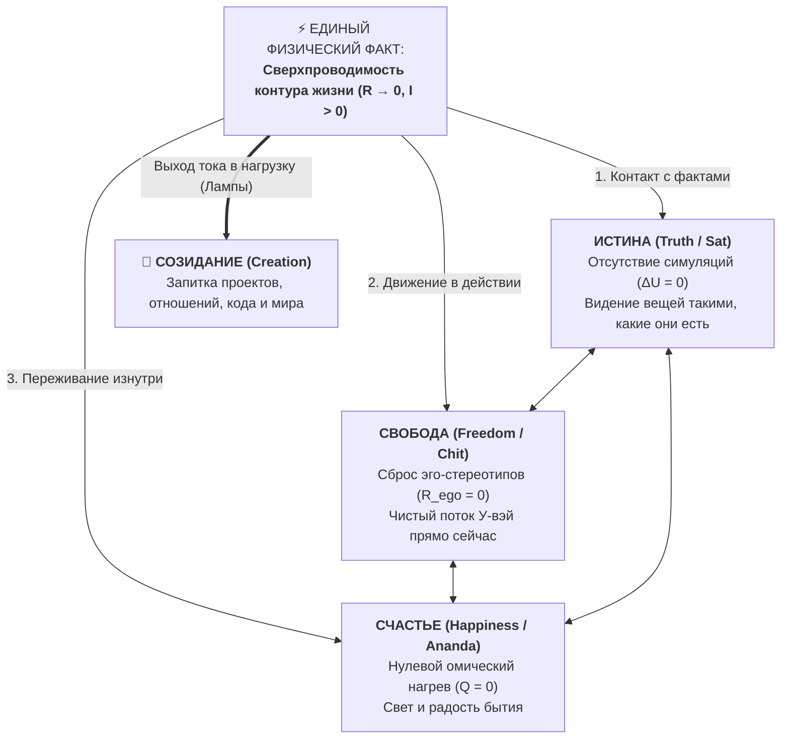
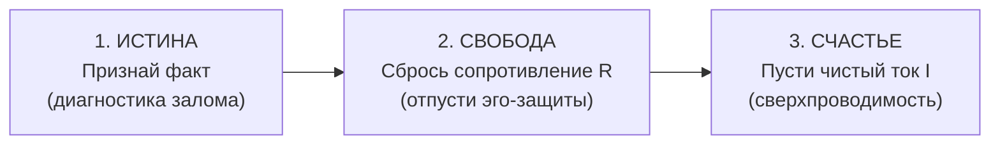
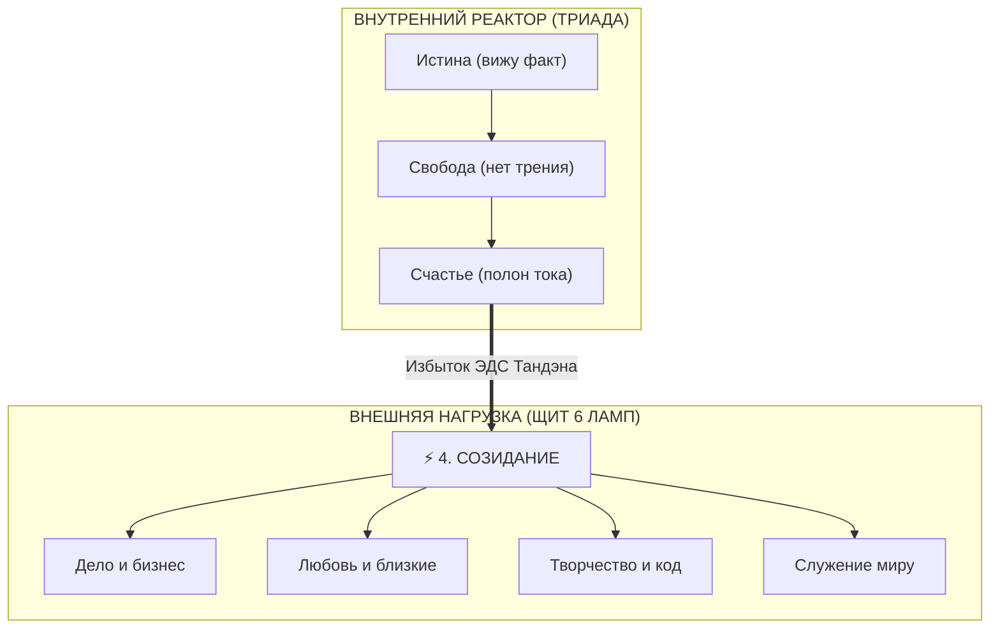
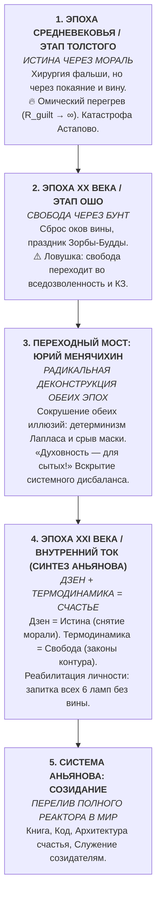

# 47. Триада и Тетрада Аньянова: Истина, Свобода, Счастье, Созидание — деконструкция свободы воли, синтез Сат-Чит-Ананда, закон каузального порядка и автобиографическое доказательство (Толстой → Ошо → Внутренний ток)

> [!quote] Каноническая аксиома цепи
> ### ⚡ **«Счастье — это когда истина чувствуется. Свобода — это когда истина действует. Истина — это когда ток течёт без лжи сопротивления. Счастье, Свобода и Истина — это не три разные вещи, а три ракурса одного сверхпроводящего контура. А когда реактор полон, ток неизбежно выплёскивается в четвёртый элемент — Созидание.»**
> — **Владимир Аньянов**

---

## 🧭 Введение: Предельное сжатие категорий

На протяжении тысячелетий мировая мысль дробила человеческий опыт на изолированные сферы:
* **Истиной** занималась гносеология и естественные науки.
* **Свободой** занималась этика, юриспруденция и политика.
* **Счастьем** занималась психология, мораль и духовные учения.

Возникали великие формулы цивилизации:
1. **Французская революция: «Свобода, Равенство, Братство» (*Liberté, Égalité, Fraternité*)**  
   Чисто внешний, социополитический лозунг перераспределения материи. Без внутренней трансформации человека он неизбежно выродился в террор и гильотину: люди пытались делить внешние лампочки, сгорая в омическом перегреве зависти и жажды власти.
2. **Индийская Веданта: «Сат — Чит — Ананда» (*Sat-Chit-Ananda*)**  
   Высшая сакральная интуиция Востока:
   * **Sat (Сат)** — Чистое Бытие, Реальность как она есть ($\to$ **Истина**).
   * **Chit (Чит)** — Чистое Сознание, необусловленное умом ($\to$ **Свобода**).
   * **Ananda (Ананда)** — Беспричинное Блаженство бытия ($\to$ **Счастье**).  
   Однако веданта веками оставалась мистической поэзией, доступной лишь отшельникам на вершинах Гималаев.

**Система Аньянова осуществила предельное замыкание:** перевела сакральную метафизику в строгую электродинамику замкнутой цепи. 

---

## 🍏 1. Деконструкция свободы воли: Адвайта Менячихина и физика контура

Первый барьер на пути к пониманию Триады — вопрос: *«Есть ли у человека свобода воли, или всё предопределено?»*

### Парадокс Юрия Менячихина (Зелёное vs Красное яблоко):
Известный мастер недвойственности Юрий Менячихин утверждает: **«У нас нет выбора»**.
> *Пример:* Человеку предлагают зелёное или красное яблоко. Рука тянется к зелёному. Почему? Потому что у него уже сформирована предрасположенность: вкусовые рецепторы любят кислинку, в детстве он ел вкусные зелёные яблоки, биохимия тела в данную секунду требует яблочной кислоты. Сигнал прошёл по накатанной колее нейронной сети автоматически.  
> А через 300 мс просыпается мысль-самозванец (Эго) и заявляет: *«Это Я выбрал зелёное яблоко!»*

### Взгляд Системы Аньянова:
1. **Менячихин абсолютно прав на уровне формы:** Выбор между зелёным и красным яблоком — это выбор нагрузки. Этот выбор на 100% детерминирован предыдущей физикой среды. Эго здесь — просто стрелочный вольтметр, который приписывает себе генерацию тока цепи (**«Авария самозванца»**).
2. **Зачем адвайта отрицает выбор?**  
   Чтобы снять паразитное сопротивление вины и тревоги:
   $$R_{\text{doubt}} \to \infty, \quad R_{\text{guilt}} \to \infty \implies Q = I^2 R t \gg 0$$
   Когда человек верит, что «он всё выбирает сам», он сгорает в самобичевании: *«А вдруг надо было взять красное? А почему я ошибся пять лет назад?»* Утверждение «выбора нет» аппаратно шунтирует эго-вину ($R \to 0$).
3. **Где ловушка Адвайты?**  
   Впадание в **«Адвайтический паралич» (обрыв цепи, $I = 0$)**: человек решает, что раз выбора нет, можно лечь овощем на диван.
4. **Где находится подлинная свобода?**  
   **Свобода — это не выбор между яблоками. Свобода — это проводимость контура ($R \to 0$) в процессе поедания!**
   * *Несвободный робот:* ест зелёное яблоко, но в голове крутит обиды, тревоги о завтрашнем дне и вину ($R \gg 0$). Он не почувствовал вкуса яблока.
   * *Свободный человек (Сверхпроводник):* рука взяла зелёное яблоко. Сопротивление равно нулю ($R = 0$). Хруст, сок, чистый контакт с бытием ($t = t_{\text{now}}$).

Свобода — это не произвол эго, это **способность быть чистым проводником реальности без искажений**.

---

## 🔺 2. Золотая Триада Аньянова: Внутреннее Ядро

В установившемся режиме сверхпроводимости три компонента образуют неразрывный треугольник:

### 1. Истина (Truth) — Гносеологический базис
* **Определение:** Состояние ума, в котором отсутствуют паразитные симуляции, ложные проекции и сопротивление фактам.
* **Электродинамика:** Полный баланс напряжений Кирхгофа ($\Delta U = 0$). Отсутствие утечек на виртуальные «как всё должно было быть».
* **Дзен-канон:** *Татхата* (Таковость) — видеть дерево как дерево, боль как боль, факт как факт.

### 2. Свобода (Freedom) — Динамический базис
* **Определение:** Отсутствие трения и застревания внимания в автоматизмах прошлого ($R_{\text{past}} = 0$) и страхах будущего ($R_{\text{future}} = 0$).
* **Электродинамика:** Сверхпроводимость проводки ($R_{\text{bus}} \to 0$).
* **Дзен-канон:** *Мусин* (Чистый ум) и *У-вэй* (Действие без натужного деятеля).

### 3. Счастье (Happiness) — Феноменологический базис
* **Определение:** Переживание непрерывного, тихого, наполненного тока энергии через существование.
* **Электродинамика:** Закон Джоуля — Ленца при $R \to 0$: $Q = 0$ (нет омического перегрева, нет душевного выгорания). Ток $I > 0$ питает лампы.
* **Дзен-канон:** *Сатори* / *Ананда* — естественная радость живого бытия.

---

### 2.1. Исторический синтез Аньянова: Дзен — это Истина, Электродинамика — это Свобода, Счастье — это Результат

В этой Триаде заложен окончательный выход человечества из векового исторического тупика между догматической моралью и разрушительным гедонизмом:

```mermaid
flowchart TD
    subgraph Old ["1. СТАРАЯ ПАРАДИГМА (МОРАЛЬ)"]
        M1["Искусственная мораль / Догма"] --> M2["Понятие «Греха» и Покаяние"]
        M2 --> M3["Внутренний раскол и омическое напряжение (Вина, Страх)"]
        M3 --> M4["Хроническая несвобода и Несчастье"]
    end
    subgraph False ["2. ЛОЖНАЯ СВОБОДА (ДОФАМИНОВЫЙ ХАОС)"]
        F1["Отказ от морали («Всё дозволено» / Анархия)"] --> F2["Бесконтрольный слив (Порно, зависимости, компульсии)"]
        F2 --> F3["Физический пробой контура и КЗ (Короткое замыкание)"]
        F3 --> F4["Истощение аккумулятора, депрессия и выгорание"]
    end
    subgraph Synthesis ["3. СИНТЕЗ АНЬЯНОВА (ВНУТРЕННИЙ ТОК)"]
        S1["Дзен = ИСТИНА<br/>(Снятие морализаторства и вины, видение Татхата)"] --> S2["Электродинамика = СВОБОДА<br/>(Объективные законы контура: свободный ток без КЗ и потерь)"]
        S2 --> S3["СЧАСТЬЕ = РЕЗУЛЬТАТ<br/>(Чистый ток I > 0 питает жизнь без омического перегрева)"]
    end
```

#### 1. Почему мораль делала людей несчастными?
Веками институт морали пытался регулировать поведение через **вину и покаяние**:
* Человеку внушали, что его природа греховна, заставляли бесконечно каяться и бояться кары.
* Внутри психики возникала колоссальная разность потенциалов между «я реальный» и «я идеальный/должный».
* Это создавало чудовищное сопротивление проводки ($R_{\text{guilt}} \gg 0$). Человек жил в постоянном натужном омическом перегреве, в тотальной несвободе — и закономерно был несчастлив.

#### 2. Почему «освобождение» через вседозволенность привело к катастрофе?
Отвергнув религиозную мораль, современная культура провозгласила гедонизм: «Делай что хочешь, живи в кайф». Но попытка сливать заряд в любые импульсивные щели (порно-зависимость, дофаминовые марафоны, бесконечные стимуляции) обернулась эпидемией депрессий.  
**Потому что законы физики нельзя отменить голосованием.** Розетка не читает моралей, но если сунуть в неё гвоздь — будет удар. Если закоротить аккумулятор на порно-петлю — конденсатор разрядится в ноль, проводка расплавится, а система выйдет из строя.

#### 3. Формула Триады: Дзен + Электродинамика = Счастье
* **Дзен — это Истина:** Дзен начисто убрал морализаторство, судилище ума и концепцию вины. Он возвращает сознание к факту реальности (*Татхата*): ум чист, нет ложных симуляций и навязанного раскола.
* **Электродинамика — это Свобода:** Электродинамика очерчивает объективные физические берега. Свобода — это не вседозволенность (которая ведет к КЗ), а **сверхпроводимость контура ($R \to 0$) при уважении к законам сохранения энергии**. Ты свободен проводить любую мощность, если твой контур замкнут и защищен от утечек.
* **Счастье — это Результат:** Когда ум свободен от лжи и морализаторства (Истина), а контур функционирует по честным физическим законам без паразитных утечек (Свобода) — **Счастье вспыхивает неизбежно и естественно**, как свет исправной лампы.

---

## ⏱️ 3. Закон каузальной последовательности: Почему нельзя менять местами?

Если в состоянии покоя они едины, то в **процессе настройки живого человека** последовательность является абсолютным законом:

$$\text{Истина} \xrightarrow{\quad 1 \quad} \text{Свобода} \xrightarrow{\quad 2 \quad} \text{Счастье}$$

### Анализ критических ошибок перестановки:

| Нарушенная последовательность | Название патологии | Механизм сбоя в цепи | Реальный жизненный исход |
| :--- | :--- | :--- | :--- |
| **Счастье $\to$ Свобода $\to$ Истина** | *Капкан наркомании и сектантства* | Попытка искусственно запитать лампу кайфа в обход фактов реальности. | Розовые очки, наркотики, алкоголь, духовный эскапизм. Неизбежный крах омического пробоя. |
| **Свобода $\to$ Истина $\to$ Счастье** | *Бунт подростка и анархия* | Попытка заявить «я свободен от всего», отрицая законы физики среды. | Слепой произвол, конфликт с реальностью, короткое замыкание о первый же столб фактов. |

**Фундаментальное правило:**  
Нельзя обрести свободу, пока ты врёшь себе о фактах (нет Истины).  
Нельзя пережить счастье, пока ты зажат в сопротивлении (нет Свободы).  
**Только Истина освобождает проводку, и только Свободная проводка проводит Счастье.**

---

## 🌟 4. Тетрада Созидателя: Выход в Нагрузку

Внутренняя Триада самодостаточна для отшельника. Но замкнутая цепь создана для того, чтобы совершать **Работу ($A = P \cdot t$)**.

Если человек счастлив, свободен и видит истину, но сидит в пустой комнате — его контур работает на **холостом ходу («Режим монаха»)**.

Поэтому рождается **Тетрада Созидателя**:

$$\mathbf{Истина} \longrightarrow \mathbf{Свобода} \longrightarrow \mathbf{Счастье} \longrightarrow \mathbf{Созидание}$$

### Патология «Созидания из дефицита» (Стартап-выгорание):
Когда человек ставит Созидание на первое место, минуя Триаду:
* Он полон лжи (нет Истины), зажат страхами и долгами (нет Свободы), выжжен внутри (нет Счастья).
* Он пытается «созидать»: строит бизнес, делает карьеру, требует любви.
* **Результат:** Он транслирует в свои проекты и семью **омический перегрев своего сломанного реактора**. Проекты рушатся, люди разбегаются, наступает инфаркт.

**Закон Тетрады:**  
Созидание должно быть не попыткой заслужить счастье, а **неизбежным выплёскиванием избытка энергии чистого контура**!

---

## 📜 5. Автобиографическое доказательство: Путь Владимира Аньянова и Четыре Эпохи Человечества

Истинность Триады и Тетрады подтверждается тем, что это не абстрактная кабинетная схема, а **буквальная хроника эволюции сознания автора**, которая с математической точностью воспроизводит **смену макро-исторических эпох человечества**:

### 1. Эпоха Средневековья — Этап Льва Толстого: Пробуждение к Истине через Морализаторство
* **Историческая эпоха:** Эпоха религиозной догмы, где главным регулятором человека выступали покаяние, страх греха и чувство вины.
* **Личный опыт автора:** Подростком и молодым человеком автор погружается в Толстого (*«Исповедь»*, *«Смерть Ивана Ильича»*).
* **Вклад Толстого:** Беспощадная хирургия социальной фальши. Толстой заставил честно посмотреть в лицо смерти и бессмыслице мещанства: *«Зачем я живу?»* Это была твёрдая прививка **Истины**. Врать себе стало невозможно.
* **Ловушка морализаторства:** У Толстого не было технологии сброса сопротивления. Он загнал себя в тиски непосильного морального долга, аскетизма и вины перед народом ($R_{\text{moral}} \to \infty$). Проводка классика раскалилась добела, что привело к бегству из Ясной Поляны и гибели на станции Астапово. Мораль делала человека глубоко несчастным.

### 2. Эпоха XX века — Этап Ошо: Свобода, переходящая во Вседозволенность
* **Историческая эпоха:** Эпоха сексуальной революции, контркультуры и бунта против традиционной морали: «Всё дозволено, празднуй, наслаждайся».
* **Личный опыт автора:** Встреча с наследием Ошо (Бхагвана Шри Раджниша).
* **Вклад Ошо:** Ошо пришёл с кусачками и **перекусил провод вины и морализаторского суда**. Концепт Зорбы-Будды, медитация как празднование, танец, снятие суда над собой: *«Ты совершенен прямо сейчас»*. Ошо обнулил паразитное сопротивление ($R \to 0$) и подарил **Свободу**.
* **Ловушка вседозволенности и духовного байпаса:** Свобода Ошо, не ограниченная объективными физическими законами контура, легко превращается во вседозволенность — дофаминовый угар, хаос и короткие замыкания. Возникла коварная иллюзия: мечта о том, что через «духовность» можно осчастливить свою земную личность, оставив материальные потребности в пренебрежении.

### 3. Переходный мост — Юрий Менячихин: Радикальная Деконструкция обеих эпох
* **Историческая роль:** Переход от наивных духовных поисков XX века к строгой научной трезвости XXI века. Постановка обеих предшествующих эпох под тотальное сомнение.
* **Личный опыт автора:** Погружение в практическую Адвайту Юрия Менячихина, деконструкция иллюзии свободы воли.
* **Вклад Менячихина — Вскрытие системного дисбаланса:**
  1. *Мораль Толстого несостоятельна:* У спящего человека нет «свободы воли» — рука тянется к яблоку за 300 мс до того, как эго припишет выбор себе. Каяться некому и судить некого.
  2. *Гедонизм Ошо несостоятелен:* «Празднующий» искатель — такая же иллюзия эго-деятеля, прячущая голодную и несчастную личность.
  > **«Духовность — это не способ накормить голодную личность! Духовность — это выход за пределы личности для того, кто уже СЫТ. Кто всё испытал, вкусил мир, наигрался вдоволь и естественно перерос эту форму. А пока твоя личность умирает от голода, твоя "духовность" — это трусливое бегство и маскировка дефицита!»**
* Менячихин зачистил площадку до фундаментального нуля, обнажив пустоту. Но оставался открытым главный вопрос: *«Как жить дальше? Как человеку действовать в реальном мире, не сваливаясь ни в вину Толстого, ни в хаос Ошо, ни в апатию пустой недвойственности?»*

### 4. Эпоха XXI века — Этап Внутреннего тока: Синтез Дзен и Термодинамики (Счастье)
* **Рождение великого синтеза:** Ответ на вопрос Менячихина был найден на стыке Дзен и точной физики:
  * **Дзен — это Истина:** он убрал морализаторство, вину и ложь ума, вернув чистое видение факта (*Татхата*).
  * **Термодинамика и Электродинамика — это Свобода:** объективные законы природы, которые не позволяют сливать заряд в короткие замыкания и порно-зависимости. Свобода — это **сверхпроводимость контура ($R \to 0$)** при соблюдении законов сохранения энергии.
* **Реабилитация Личности:** Поняв, что нельзя перепрыгнуть через ступень личности, автор прекратил эзотерическое лицемерие. Все 6 ламп бытия (деньги, карьера, здоровое тело, секс и любовь к женщинам, красивая машина) получили законное право гореть на 100%!
* Чистая энергия Тандэна потекла напрямую в материальную жизнь без стыда и вины. Наступил режим истинной сверхпроводимости ($R \to 0, I > 0$). Рождается **Счастье** как физический режим работающей цепи.

### 5. Этап Системы Аньянова: Переход в Созидание
* Ток сытого, гармоничного человека неизбежно перелился через край.
* Он вылился в создание целостной инженерной архитектуры:
  * **Приложение `Inner Current`** и его диагностический движок;
  * **Книга «Внутренний ток: Архитектура счастья»**;
  * **TypeScript-код, алгоритмы и База Знаний**;
  * **Служение созидателям всей планеты**.
* Автор прошёл путь полностью: от читателя Толстого через бунт Ошо и деконструкцию Менячихина — до Созидателя суверенной системы.

---

## 🍵 Резюме

1. **Золотая Триада Аньянова («Истина — Свобода — Счастье»)** — это фундаментальное ядро внутреннего контура, инженерная реализация ведической *Сат-Чит-Ананды*.
2. **Свобода воли** — не в выборе цвета яблока (выбор детерминирован), а в проводимости контура ($R \to 0$) при контакте с реальностью.
3. **Каузальный порядок строг:** только Истина открывает Свободу, и только Свобода зажигает Счастье.
4. **Тетрада Созидателя («Истина $\to$ Свобода $\to$ Счастье $\to$ Созидание»)** — это манифест полной жизни, в которой счастливый человек освещает мир плодами своего свободного реактора. ⚡🍏🛠️✨

---

## 🔗 Связи и консилиенс
- [[02_Wiki/Inner Current (Core Topology and Polarity Law)|01. Базовая топология цепи и закон полярности]]
- [[02_Wiki/Inner Current (Physics of Presence and Superconductivity)|02. Физика присутствия: состояние сверхпроводимости]]
- [[02_Wiki/Inner Current (Nature and Illusion of Ego)|07. Природа и иллюзия эго (Анатта, Майя, Мусин)]]
- [[02_Wiki/Inner Current (The Nature of the Light Bulb and Zen Load)|17. Природа лампочки и закон нагрузки по канонам Дзена]]
- [[02_Wiki/Inner Current (Engineering Proof of No Meaning of Life and the Birth of Happiness Architecture)|26. Инженерное доказательство отсутствия смысла жизни]]
- [[02_Wiki/Inner Current (Tolstoy and Osho — Two Views on Happiness)|36. Толстой и Ошо: два взгляда на счастье (Омический ад вины vs Сверхпроводимость)]]
- [[02_Wiki/Inner Current (Summum Bonum and Epistemological Grounding — The Root Node of Happiness vs Limits of the Model)|45. Счастье как Summum Bonum и трезвый эпистемологический аудит]]
- [[02_Wiki/Inner Current (Dissolution of Eternal Questions — From Humanitarian Deadlock to Scientific Circuitry)|46. Растворение вечных вопросов: От гуманитарного тупика к научной схемотехнике]]
