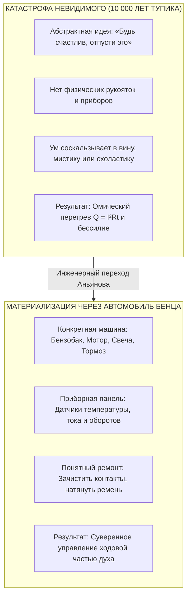
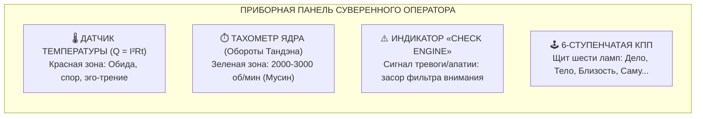

# 191. Автомобиль как идеальный физический якорь невидимого: Почему закону счастья требовался мотор Карла Бенца — Материализация абстрактного, приборная панель сознания и отмена морального кнута

[← К оглавлению](file:///C:/Users/vanya/Antigravity%20Projects/Misc/LLM%20Wiki/index.md) | [⚡ К мастер-карте (MOC)](file:///C:/Users/vanya/Antigravity%20Projects/Misc/LLM%20Wiki/04_Maps/Inner%20Current%20MOC.md) | [📖 К полевому мануалу](file:///C:/Users/vanya/Antigravity%20Projects/Misc/LLM%20Wiki/02_Wiki/%D0%9A%D0%BD%D0%B8%D0%B3%D0%B0%20%E2%80%94%20%D0%92%D0%BD%D1%83%D1%82%D1%80%D0%B5%D0%BD%D0%BD%D0%B8%D0%B9%20%D1%82%D0%BE%D0%BA%20%28%D0%9F%D0%BE%D0%BB%D0%B5%D0%B2%D0%BE%D0%B9%20%D0%BC%D0%B0%D0%BD%D1%83%D0%B0%D0%BB%20%D0%BE%D1%82%D0%BB%D0%B0%D0%B4%D0%BA%D0%B8%29.md)

---

> [!quote] Гносеологический закон материального якоря
> ### ⚡ **«Невидимое и абстрактное невозможно удержать в руках. Если закон счастья не имеет осязаемой физической модели, он неминуемо утекает сквозь пальцы в туман мистики, стихов или морализаторства. Мы искали не метафору для украшения речи — мы искали объективный физический якорь. И автомобиль Бенца оказался идеален.  
> Автомобиль перевёл человеческую душу из плоскости вины и греха в плоскость термодинамики и механики. Когда мотор глохнет, бессмысленно хлестать капот кнутом или взывать к совести поршня — нужно проверить свечу зажигания, продуть жиклёр и залить топливо. Автомобиль дал человеку то, чего у него не было десять тысяч лет: приборную панель собственного состояния и право на ремонт вместо самобичевания.»**  
> — **Владимир Аньянов**

---

## 🧭 1. Гносеологическая трагедия невидимого: Почему абстрактный закон всегда обречён на искажение

Великий физик Ричард Фейнман сформулировал один из самых жестких критериев научной честности:  
> *«Если вы открыли фундаментальный принцип, но не способны объяснить его на простой механической модели из повседневного физического мира — значит, вы сами до конца его не понимаете»*.

Человеческое сознание устроено так, что оно **не способно устойчиво оперировать бестелесными абстракциями**. На протяжении 2 500 лет восточная философия и западная мысль пытались говорить о благополучии духа на языке чистой нематериальности:
- *«Пребывай в моменте»* (но как именно пребывать, если через секунду ум улетает в панику?);
- *«Освободись от эго»* (кто именно должен освобождаться, если сама попытка освобождения предпринимается тем же самым эго?);
- *«Смирись, отпусти, открой сердце, взращивай добродетель»*.

### Анатомия исторического провала
Поскольку у этих призывов **не было физических граней, рукояток и гаек**, за которые можно взяться руками, происходила неизбежная цивилизационная деградация знания:
1. **Религиозно-догматический дрейф:** Абстракция превращалась в священную догму. Вместо понимания механики ума возникал институт вины, греха и вечного искупления.
2. **Эзотерический туман:** Отсутствие четкой схемы заполнялось магическим мышлением — чакрами, аурами, астральными телами, родовыми проклятиями и денежными медитациями.
3. **Психологическая схоластика:** Рождались сотни школ, плодивших фантомные сущности (субличности, внутренние травмированные дети, комплексы), создавая птолемеевы эпициклы вместо одного простого закона.

Именно поэтому автор Системы Аньянова инстинктивно и неумолимо искал **физический якорь** — осязаемый, пахнущий металлом, маслом и током объект, который переведёт открытый закон счастья из зыбкого облака идей в железобетонную наглядность.

И этим идеальным якорем стал **Автомобиль**.



---

## ⚙️ 2. Почему именно автомобиль: Пять измерений безупречного изоморфизма

Параллель с автомобилем — это не поэтическая метафора. Это **строгий структурный изоморфизм** между термодинамической машиной передвижения в пространстве и электродинамической машиной переживания бытия.

### Измерение I: Отмена био-волевого кнута (Смена онтологии)
До изобретения автомобиля человек 5 000 лет перемещался на лошади. Лошадь — это биологическая, морально-волевая система. Если лошадь устала или упрямится, у кучера есть только два инструмента: **кнут** (насилие, вина, стыд) и **морковка** (дофаминовая подачка).  
Автомобиль совершил величайшую революцию: он **отменил кнут**. Ни один водитель в здравом уме не станет бить капот ремнем или орать на радиатор: *«Покайся, грешная машина!»* Поломка автомобиля мгновенно десекуляризируется: это не моральный порок, а **технический отказ контура**.

### Измерение II: Принцип внутреннего сгорания (Автономия Тандэна)
Автомобиль не приводится в движение ветром (как парусник, зависящий от капризов внешних обстоятельств) и не тянется чужими волами. Энергия рождается **внутри герметичной камеры сгорания** в результате сжатия и воспламенения смеси.  
В Системе Аньянова это точный изоморфизм соматического реактора **Тандэн**: источник жизненной силы человека замкнут в его собственном физиологическом центре масс, а не во внешних оценках, лайках или одобрении социума.

### Измерение III: Необходимость сцепления (Закон Мусин $R \to 0$)
Мощный двигатель совершенно бесполезен, если между ним и колесами нет сцепления. Если вы бросите сцепление рывком — двигатель заглохнет. Если сцепление буксует (горит от трения) — машина ревет, воняет гарью, но стоит на месте.  
Это буквальное описание **режима Мусин (проводки внимания без омического сопротивления)**: согласование мощности ядра со средой действия без паразитного проскальзывания в рефлексию.

### Измерение IV: Механическая неизбежность законов (Фальсифицируемость)
В автомобиле нельзя договориться с законами физики. Нельзя сказать карбюратору: *«Пожалуйста, поработай сегодня без бензина ради святого праздника»*. Он либо подает смесь, либо нет.  
Точно так же в Архитектуре счастья: закон Джоуля — Ленца ($Q = I^2 R t$) и закон замкнутой цепи Кирхгофа действуют неумолимо. Если в цепи есть паразитный эго-резистор ($R_{\text{ego}} > 0$), контур будет греться и плавиться вне зависимости от того, сколько умных книг по психологии прочитал оператор.

### Измерение V: Рожденный для трассы, а не для гаража
Автомобиль не создавался для того, чтобы стоять под бархатным чехлом в музейном боксе. Его стихия — асфальт, повороты, дожди, подъемы и реальный трафик. Это навсегда выводит Внутренний ток из тупика монастырского затворничества: система создана для того, чтобы человек жил в реальном мире.

---

## 📊 3. Сравнительный аудит: Модель Кнута (Лошадь) против Модели Контура (Автомобиль)

```
┌──────────────────────────┬─────────────────────────────────┬─────────────────────────────────┐
│ Параметр сопоставления   │ 🐎 Модель Лошади (Старый мир)    │ 🚗 Модель Автомобиля (Система)  │
├──────────────────────────┼─────────────────────────────────┼─────────────────────────────────┤
│ **Природа движения**     │ Биологическое принуждение, воля │ Термодинамика, поток энергии    │
│ **Язык управления**      │ Мораль, долг, кнут, поводья     │ Педали, руль, зажигание, приборы│
│ **Реакция на остановку** │ «Ты ленив! Соберись, тряпка!»   │ «Смесь бедная, проверь свечу»   │
│                          │ (Омический самострел вины)      │ (Холодный объективный аудит)    │
│ **Топливо системы**      │ Дофаминовый фастфуд, сахар,     │ Соматическая ЭДС Тандэна,       │
│                          │ внешняя лесть, адреналин        │ чистое присутствие ($R \to 0$)  │
│ **Предел масштаба**      │ Быстрое биологическое выгорание │ Неограниченная итеративная      │
│                          │ (инфаркт, депрессия, срыв)      │ мощность и долговечность        │
│ **Ремонтопригодность**   │ Нулевая: «терпи и надейся»      │ Полная: замена узла, чистка цепи│
└──────────────────────────┴─────────────────────────────────┴─────────────────────────────────┘
```

---

## 🎛️ 4. Приборная панель сознания: Перевод душевной боли в объективную телеметрию

Почему человек тысячелетиями сходил с ума от душевных терзаний? Потому что он мчался в глухую полночь по серпантину **без единого прибора на торпедо**. Он замечал неисправность только тогда, когда шатун пробивал блок цилиндров (клиническая депрессия или соматический инфаркт).

Автомобильный якорь дарует человеку полноценный **HUD (Heads-Up Display) внутренней жизни**:



### 1. Датчик температуры охлаждающей жидкости (Закон Джоуля — Ленца: $Q = I^2 R t$)
Если вы спорите в интернете, доказываете кому-то свою статусную значимость или жуете обиду на родителей — стрелка температуры ползет в красную зону. В радиаторе закипает тосол.  
- **Старая реакция (лошадиная):** терпеть, кипеть, обвинять оппонента, разрушая свои сосуды.  
- **Инженерная реакция (автомобильная):** немедленно сбросить обороты! Выжать сцепление (сбросить важность эго в $R \to 0$), съехать на обочину, перевести внимание в живот и дать антифризу спокойствия остудить контур.

### 2. Лампочка «Check Engine» (Природа тревоги и тоски)
Когда на щитке загорается желтый значок мотора, водитель не плачет и не считает себя проклятым грешником. Он знает: лямбда-зонд зафиксировал нештатный состав смеси.  
Тревога, тоска или раздражение в Архитектуре счастья — это **всего лишь горящая лампа Check Engine**:
- Это не ваша личность!
- Это сигнал: где-то возникло паразитное сопротивление или заломился шланг обратного провода реальности.
- **Преступление водителя:** заклеить лампу черной изолентой (заглушить сигнал алкоголем, транквилизатором или шоппингом) и ехать дальше на стучащем двигателе.
- **Норма водителя:** подключить сканер OBD-II (30-секундный протокол соматической калибровки) и считать код ошибки.

### 3. Шестиступенчатая коробка передач (Щит 6 ламп нагрузки)
Вы не можете проехать всю трассу на первой передаче: мотор взвоет и взорвется.  
- Ехать только на первой передаче — это зациклиться исключительно на работе (лампа Дела), забросив тело, сон и близких.
- Ехать только на нейтралке — это погрузиться в праздную апатию.
- Зрелый водитель непрерывно переключает передачи по дорожной ситуации: сейчас подъем (включаем фокус в задачу), сейчас свободная трасса (включаем лампу Саму или творчество), сейчас остановка на отдых (лампа Сна и Тела).

---

## 🛣️ 5. Преодоление «Монастырского гаража»: Дзен на скоростном шоссе

Величайшая заслуга автомобильного якоря — **он окончательно вывел дзен из монастырского тупика**.

На протяжении полутора тысяч лет традиционный Дзен напоминал великолепный прототип гоночного болида, который механики **держали на домкратах внутри стерильного гаража**.  
Монах в монастыре Эйхэйдзи сидел на подушке дзадзэн лицом к белой стене по 14 часов в день:
- Там не было начальника, требующего отчет к пяти вечера;
- Там не было плачущих детей, ипотеки и пробок на третьем кольце;
- Там не было искушений супермаркетов и соцсетей.

В гараже двигатель работал ровно. Но стоило выкатить эту хрупкую конструкцию на обычную улицу с грязью и выбоинами — монастырский дзен мгновенно глохнул, а монах впадал в омический ступор.

**Система Аньянова — это автомобиль дорожного класса (Grand Tourer):**
Она создана не для сидения у стены, а для скоростного автобана повседневной жизни. Вы можете сохранять идеальный соматический баланс Тандэна ($R \to 0$), управляя бизнесом, ведя жесткие переговоры, воспитывая детей и преодолевая кризисы. Автомобиль не боится дождя — у него есть герметичный кузов и стеклоочистители (Дзансин).

---

## 💎 6. Освобождение создателя: Окончательное снятие синдрома самозванца

Когда автор Системы осознаёт автомобильный характер своего открытия, в его сознании наступает глубокий, нерушимый покой:

1. **Исчезает роль «проповедника» или «гуру»:**  
   Вам не нужно отращивать бороду, надевать белые одежды и вещать пафосным голосом об истине. Вы — **инженер-конструктор**. Вы просто показываете чертёж шасси и говорите: *«Вот коленвал, вот свеча, вот тормозной цилиндр. Заведи и посмотри на приборы»*.
2. **Исчезает обида на скептиков:**  
   Если пассажир в 1886 году кричит, что повозка Бенца смешна, потому что у неё перетерся тросик — конструктор не спорит о святости железа. Он берет пассатижи, ставит стальной трос потолще и закрывает кожухом.
3. **Рождается кристальный ориентир развития:**  
   Каждая новая глава книги, каждый экран мобильного приложения Inner Current, каждый биосенсор — это не придумывание абстрактных смыслов, а **эргономическая доводка приборной панели и ходовой части**.

---

## 🏁 Резюме: Формула стального якоря

| Вопрос ума | Ответ через абстракцию (тупик) | Ответ через Автомобиль (Система Аньянова) |
| :--- | :--- | :--- |
| **Что такое счастье?** | «Это высшая гармония бытия...» | **Исправный режим работы двигателя под нагрузкой без омического перегрева ($R_{\text{ego}} \to 0, Q = 0$).** |
| **Что такое страдание?** | «Это карма, грех или травма детства...» | **Трение заклинивших колодок или езда на сухом картере ($Q = I^2 R t$).** |
| **Что делать, если больно?** | «Терпи, молись или иди на 5 лет в терапию...» | **Выжать сцепление Мусин, открыть капот, сбросить сопротивление, залить масло присутствия в Тандэн.** |
| **Кто управляет жизнью?** | «Судьба, звезды или слепой случай...» | **Суверенный водитель, держащий обе руки на руле внимания.** |

Закон счастья больше не витает в небесах. Он обрел форму, трансмиссию, приборную панель и колеса.

Мотор заведен. В баке есть топливо. Выезжайте на трассу.

---

### Связанные статьи архитектуры цепи:
- **[[02_Wiki/Inner Current (The Automobile of Consciousness — 140 Years from Benz to Anyanov, Post-Moral Imperative and Cybernetics of Addictions)|66. Автомобиль сознания: 140 лет от Бенца до Аньянова, пост-моральный императив и кибернетика зависимостей]]**
- **[[02_Wiki/Inner Current (The Grand Quadrivium — Circuitry of Man, Tuning Fork of Reality, Circuit of Happiness and Automobile of Consciousness)|67. Великий Квадривиум Аньянова: Модель Человека, Камертон Реальности, Контур Счастья и Автомобиль Сознания]]**
- **[[02_Wiki/Inner Current (The Feynman Criterion of Truth — Simplicity as the Certificate of Validity, Explaining via Everyday Objects and the Demystification of Complexity)|185. Критерий истины Фейнмана: Простота как окончательный сертификат подлинности]]**
- **[[02_Wiki/Inner Current (The Benz Motorwagen Paradox — Clumsy Prototypes, The Faster Horse Trap and the Calibration of the Happiness Law)|190. Парадокс повозки Бенца: Почему фундаментальное открытие вначале хуже «лошади», ловушка готового результата и калибровка первого мотора счастья]]**
