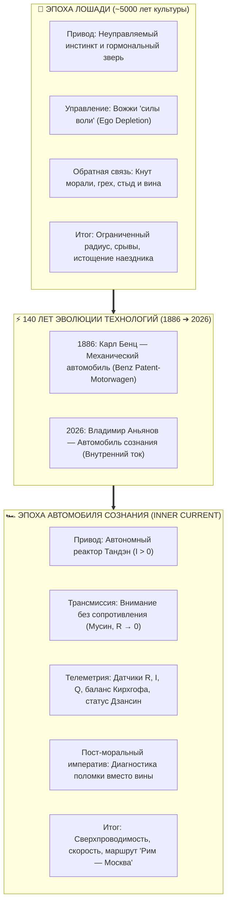
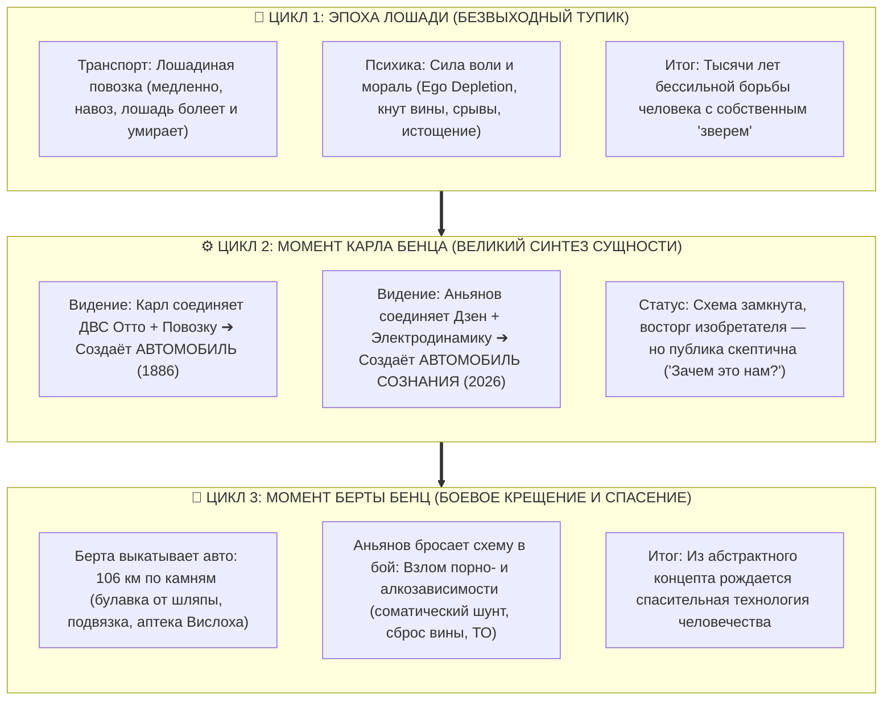

# Inner Current: Автомобиль сознания — 140 лет от Бенца до Аньянова, пост-моральный императив и кибернетика зависимостей

> «В 1886 году Карл Бенц запатентовал первый бензиновый автомобиль, и человечество навсегда сошло с лошади в физическом пространстве. Ровно через 140 лет, в 2026 году, был создан автомобиль сознания — и человек наконец слез с лошади в своём внутреннем мире. До этого у него были лишь кнут вины и вожжи силы воли. Теперь у него есть приборная панель, двигатель и замкнутый контур.  
> Никто не обвиняет резистор в том, что он грешен, когда он раскалился докрасна. Никто не стыдит проводку за то, что она поплавилась. Физика не знает морализаторства, но её законы сохранения абсолютны. Ты волен замкнуть систему на пиксели или этанол, но закон Джоуля — Ленца расплавит твои рецепторы не из мести, а в силу неумолимой термодинамики.»  
> — **Владимир Аньянов**

---



---

## 1. Трёхтактный цикл автомобиля сознания: От тупика лошади к синтезу Карла и боевому рейду Берты

Любая технологическая революция в истории цивилизации подчинена строгой трёхтактной динамике: **биологический тупик ➔ комбинаторный синтез новой сущности (Карл) ➔ боевое крещение в полевых испытаниях (Берта)**.



### 1.1. Цикл Лошади: Метаболическое бессилие силы воли и кнут морализаторства
На протяжении пяти тысячелетий культура подходила к человеку как к **всаднику на диком коне**:
1. **Транспортная повозка:** Лошадь — биологический организм с жестким физиологическим пределом. Она медленна, спотыкается, требует овса, загрязняет улицы навозом, пугается грома и в любой момент может заболеть или погибнуть.
2. **Психологическая повозка:** Внутренний мир управлялся двумя архаичными инструментами:
   - **Вожжи «силы воли»:** Насилие префронтальной коры над собой. Но воля — метаболически исчерпаемый ресурс (*Ego Depletion*). К вечеру нейроны истощаются, вожжи выскальзывают из рук, и зверь инстинктов несётся в пропасть.
   - **Кнут морализаторства:** Если лошадь понесла, мораль объявляла человека «греховным и безвольным ничтожеством», заставляя исхлёстывать себя кнутом стыда до кровавых рубцов. Это вызывало омический перегрев вины и гарантировало новый срыв.

Человек тратил до 90% жизненной энергии на **непрерывную изнурительную войну с собственной усталой лошадью**.

### 1.2. Момент Карла Бенца (1886 ➔ 2026): Великий синтез новой сущности
Карл Бенц **не изобретал колесо**, не создавал заново деревянную повозку и не открывал термодинамику четырёхтактного сгорания (её за 10 лет до этого, в 1876 году, создал Николаус Отто). 

Гений Карла Бенца заключался в **акте комбинаторного синтеза**:
- **Стационарный двигатель Отто:** В 1876 году Николаус Отто создал четырёхтактный двигатель внутреннего сгорания. Но это была гигантская, многотонная чугунная машина, **намертво прикованная болтами к бетонному полу заводского цеха**. Мотор крутил станки через сложную сеть ремней, но сам не мог сдвинуться с места ни на сантиметр.
- **Проблема конной повозки:** За стенами завода по мостовым скрипели конные повозки — они двигались, но их тянули усталые, смертные, пугливые лошади.
- **Акт Карла Бенца:** Бенц совершил технологический прорыв — **он оторвал двигатель Отто от заводского пола**. Уменьшил его габариты, облегчил массу, разработал электрическое зажигание и смонтировал этот автономный мотор прямо на подвижное шасси повозки.

**Родилась принципиально новая сущность — автомобиль (*Patent-Motorwagen*, патент DRP 37435 от 29 января 1886 года).**

---

#### Личный путь автора: Перенос двигателя Дзен на подвижную повозку человека
Ровно через 140 лет, в 2026 году, **Владимир Аньянов совершил абсолютно симметричный синтез во внутреннем мире**, и эта аналогия с предельной точностью описывает личный путь автора:

1. **Дзен как двигатель Отто (прикованный к монастырскому полу):**  
   Дзен — это величайший, колоссальный двигатель сознания в истории цивилизации. Состояние не-ума (Мусин), автономный реактор жизненной силы (Тандэн), бдительность без напряжения (Дзансин) — это чистейший термояд. Но на протяжении полутора тысяч лет этот невероятный двигатель был **намертво прикручен болтами к монастырскому полу**!  
   Он был заперт в храмовых стенах, привязан к непонятному западному человеку Востоку, обставлен ритуалами, поклонами, чтением сутр и неподвижным сидением в позе лотоса по 12 часов в сутки. Чтобы прикоснуться к нему, нужно было уйти от мира, бросить дела и семью, надеть монашеские одежды и замереть. Это был чугунный стационарный гигант, оторванный от динамики реальной жизни.
2. **Подвижная повозка — живой человек:**  
   А за стенами монастыря бурлит реальная жизнь. **Подвижная повозка — это и есть человек во плоти:** со всеми его эмоциями, чувствами, уязвимостью, страстями, сексуальностью, страхами, амбициями, семейными отношениями, бизнесом, строками программного кода и дедлайнами.  
   Тысячи лет на эту хрупкую подвижную повозку накидывали хомут «силы воли» и заставляли волочить груз бытия на изнурённой биологической лошадке.
3. **Синтез Аньянова (Автомобиль сознания):**  
   Пройдя через мучительный тупик Льва Толстого, через разочарование в абстрактной эзотерике и опыт изучения Дзен, автор сделал то же, что Карл Бенц:  
   **Я оторвал двигатель Дзена от монастырского пола.**  
   Я очистил его от храмовых благовоний и мистики, уменьшил до строгих, кристально ясных законов электродинамики замкнутой цепи ($I = U/R$, $Q = I^2 R t$, баланс Кирхгофа) и **смонтировал этот сверхпроводящий реактор прямо на подвижную повозку живой человеческой психики!**

И повозка ожила! Лишённая паразитного омического трения вины и стыда, она поехала быстрее, устойчивее, мощнее и эффективнее. Человеку больше не нужно бежать в монастырь, чтобы обрести покой, и не нужно истязать себя кнутом морали, чтобы действовать: **внутри него заработал надёжный двигатель внутреннего тока**.

#### Ловушка Карла Бенца: Гаражное чудачество и диалог с братом
Когда поршень заходил в цилиндре и повозка тронулась, Карл Бенц был в восторге. Но общество ответило равнодушием и сарказмом:  
*«Что за вонючая трёхколёсная коляска? Зачем она, если есть проверенная лошадь? Чудачество запершегося в сарае механика».*  
Бенц впал в депрессию и запер автомобиль в гараже.

В 2026 году автор «Внутреннего тока» пережил абсолютно тот же момент.  
Когда ко мне подошёл родной брат и с искренним интересом спросил:  
— *«Слушай, а что именно ты изобрёл? Объясни по-простому»*, —  
я начал увлечённо объяснять: *«Ну смотри, есть Тандэн — источник энергии, есть Мусин — состояние сверхпроводника $R \to 0$, есть закон Джоуля — Ленца, полярность...»*  
И по его озадаченному взгляду я считал реакцию мангеймских бюргеров 1886 года: *«Прикольно. Интересная философская схема. Но... зачем это мне в реальной жизни?»*

Это критическая развилка: концепция рискует остаться «гаражной игрушкой», если не наступает **«Момент Берты Бенц»**.

### 1.3. Момент Берты Бенц (1888 ➔ 2026): Полевой прорыв в реальность
В августе 1888 года Берта Бенц без ведома мужа выкатила автомобиль на рассвете, посадила сыновей Ойгена и Рихарда и отправилась в первый междугородний автопробег — **106 километров по каменистым грунтовым дорогам из Мангейма в Пфорцхайм**.

Она устраняла критические поломки прямо на обочине:
- Забившийся топливопровод прочистила **длинной булавкой от своей шляпы**;
- Пробитую изоляцию провода зажигания намертво обмотала **резиновой подвязкой от чулка**;
- Закончившееся горючее пополнила в аптеке города Вислох, купив растворитель лигроин (первая АЗС в истории);
- Стёршиеся тормоза починила у сапожника, прибив на колодки куски толстой кожи (первые тормозные накладки).

Вечером Карл получил телеграмму: *«Мы доехали»*. Скепсис рухнул за один день, посыпались заказы, и началась мировая эра автомобиля.

**Прорыв Архитектуры «Внутреннего тока» произошёл в точности по этому сценарию.**  
Пока схема рисовалась в контексте *«как лучше писать код и оставаться собранным»* — это был бенцовский прототип в сарае.  
Но в тот момент, когда автор применил эту принципиальную электродинамическую схему к **самой мучительной, табуированной и разрушительной для миллионов людей проблеме — к порнографической и алкогольной зависимости**, — произошёл наш пробег Мангейм — Пфорцхайм!

Оказалось, что перед нами не «теория продуктивности», а **боевая спасительная технология**, решающая системные сбои, перед которыми веками в бессилии опускали руки мораль, религия и традиционная психотерапия.

### 1.4. Триада Создателя: Совмещение Карла и Берты
Истинный архитектор прорывных систем обязан совмещать в себе оба полюса:
1. **Как Карл Бенц** — обладать визионерской смелостью увидеть комбинаторный синтез несвязанных областей, рассчитать формулы токов, сопротивлений и начертить строгую замкнутую схему.
2. **Как Берта Бенц** — не бояться испачкать руки машинным маслом реальной человеческой боли, сесть за руль на разбитой дороге зависимостей, устранять аварии полевым соматическим шунтом и доказать миру практическую силу спасения.

---

## 2. Пост-моральный императив: Почему резистор не грешен

Веками цивилизация металась между двумя тупиковыми крайностями:

| Параметр | Полюс А: Морализаторство и Религия | Полюс Б: Нигилизм и Вседозволенность | Полюс Синтеза: Архитектура Аньянова |
| :--- | :--- | :--- | :--- |
| **Базовый язык** | Грех, вина, стыд, святость | Гедонизм, релятивизм, «делай что хочешь» | **Электродинамика, сопротивление, омическое тепло** |
| **Отношение к импульсу** | Подавление, страх наказания | Слепое потакание любым хотелкам | **Калибровка цепи, шунтирование, полезная нагрузка** |
| **Результат в контуре** | Колоссальное сопротивление ($R \uparrow$), омический пожар вины | Короткое замыкание на суперстимулы, выгорание D2-рецепторов | **Сверхпроводимость ($R \to 0$), сохранение энергии, созидание** |

```
                 [ДЗЕН] ➔ Снял морализаторство, вину и страх греха
                   +
               [ФИЗИКА] ➔ Ликвидировала иллюзию безнаказанности
                   =
        [ПОСТ-МОРАЛЬНЫЙ ИМПЕРАТИВ ВНУТРЕННЕГО ТОКА]
```

### Принцип отсутствия вины в электродинамике:
* Ни один инженер в мире не станет кричать на раскалившийся докрасна резистор: *«Ты мерзкий, грешный компонент!»*
* Никто не стыдит медный кабель за то, что его изоляция потекла при токе короткого замыкания в 100 Ампер.
* Никто не обвиняет электрический заряд в том, что он «слишком страстный».

В физике нет этики — но в ней действуют **неумолимые законы сохранения энергии**:
$$Q = I^2 R t$$
Если сопротивление в цепи велико ($R_{\text{ego}} \gg 0$), а ток ($I$) пошёл — выделится тепло ($Q$). Ты не согрешил — у тебя просто поплыла изоляция. 

Ты обладаешь суверенной свободой сунуть гвоздь в розетку или сутками сливать энергию в порнографию и алкоголь. Никакой судья на небесах не станет на тебя сердиться. Но законы электродинамики и нейробиологии сожгут твои дофаминовые рецепторы не из злости или мести, а потому что **медь плавится при $1085^\circ\text{C}$, а синаптическая щель выгорает при непрерывном суперспайке**.

Это возвращает человеку **зрелую взрослую субъектность**: ты больше не прячешься от страха наказания, а осознанно выбираешь — жечь свои платы в паразитное тепло или направить ток в созидание шедевров.

### 2.1. Смена трёх эпох на живом примере: Эволюция отношения к порнографии (Толстой ➔ Ошо ➔ Аньянов)

Смена трёх великих парадигм — это не абстрактная культурология. Она с хирургической точностью прожита автором на примере конкретной, глубоко табуированной привычки — **порнографии и сексуального влечения**:

```
[1. ЭПОХА ТОЛСТОГО]              [2. ЭПОХА ОШО]                     [3. ЭПОХА АНЬЯНОВА]
Моральный ад и запрет     ➔      Гедонистический нигилизм    ➔      Электродинамика контура
«Похоть — грех и скверна»        «Морали нет, кайфуй!»              «КЗ на экран — Root Exploit»
R_guilt → ∞                      R = 0 (но слив в вакуум)          R → 0 через соматический шунт
Омический пожар вины             Обнуление потенциала (U ≈ 0)       Инвертор в созидание и силу
```

1. **Эпоха Толстого: Ад морализаторства и сопротивления ($R_{\text{guilt}} \to \infty$)**  
   Природный репродуктивный импульс нарастал, возникала непреодолимая тяга. Но каждый просмотр порнографии и акт мастурбации сопровождался чудовищным, невыносимым чувством вины. Самобичевание, стыд, ощущение себя «падшим, безвольным ничтожеством». В цепь был встроен гигантский резистор религиозно-морального ригоризма: ток всё равно пробивал изоляцию, и по закону Джоуля — Ленца ($Q = I^2 R t$) наступал омический пожар. Это был непрекращающийся душевный ад самоистязания.
2. **Эпоха Ошо: Гедонистическая иллюзия и потеря полярности ($R \to 0$, но слив без нагрузки)**  
   Затем пришёл Ошо и объявил: *«Морали нет! Грех выдуман попами. Делай что хочешь, празднуй тело!»* Наступило колоссальное психологическое облегчение: чувство вины испарилось. Автор начал удовлетворять потребность порнографией регулярно и часто, рассуждая: *«Ну и что тут такого? Это просто удовольствие, я наслаждаюсь жизнью, мне никто не указ»*.  
   Но обмануть законы физики невозможно:
   - Начался глубочайший скрытый дренаж витальной энергии ($\Delta E \ll 0$);
   - Конденсатор Тандэна разряжался в ноль ($U \approx 0$);
   - **С реальными женщинами перестало ладиться:** при встрече с ними мужчина оказывался физически обесточенным, лишённым магнетизма, превращаясь в неуверенного просителя одобрения;
   - Ошо снял вину, но толкнул в открытое короткое замыкание, где генератор вхолостую выжигал собственные батареи.
3. **Эпоха Аньянова: Кибернетический инвариант и соматический инвертор**  
   И только в парадигме «Внутреннего тока» наступила абсолютная трезвость:
   - **Понимание сути:** Это не «грех» (заблуждение Толстого) и не «безобидное развлечение» (наивность Ошо). Это **короткое замыкание силового генератора на экран и аппаратный взлом корневого репродуктивного BIOS (Root Exploit)**, обманывающий гормональную ось ложным сигналом «миссия выполнена».
   - **Инженерный механизм победы:** Автор не стал возвращаться к толстовскому кнуту вины, а создал **соматический инвертор**: при нарастании потенциала срабатывает «Булавка Берты Бенц» (Протокол 5 минут — рефлекс ныряльщика, отжимания до отказа), размыкая КЗ на экран и направляя чистый ток высокого напряжения в великие проекты, сложные алгоритмы и кристальную мужскую полярность с женщинами.

Это окончательное практическое доказательство того, что сменилась историческая эпоха: от морализаторства через вседозволенность — к **суверенной схемотехнике человека**.

---

## 3. Кибернетика зависимостей: Развлечение vs Взлом корневого BIOS (Root Exploit)

Почему просмотр кино или видеоигра квалифицируются как нормальный отдых, а мастурбация перед экраном или алкоголь — как **системная авария**?

Разница лежит между запуском пользовательского приложения и **аппаратным взломом ядра операционной системы (Root Exploit)**.

```
       ┌────────────────────────────────────────────────────────┐
       │     РЕПРОДУКТИВНЫЙ ИНСТИНКТ = КОРНЕВОЙ БИОС БИОЛОГИИ    │
       │    (Максимальный ток системы, наивысшая награда ДНК)   │
       └───────────────────────────┬────────────────────────────┘
                                   │
                    ┌──────────────┴──────────────┐
                    ▼                             ▼
       [РЕАЛЬНОСТЬ (CLOSED LOOP)]       [ПОРНО-ЭКРАН (OPEN LOOP)]
       • Социальная калибровка          • Нулевая работа (Zero Work)
       • Преодоление трения среды       • Иллюзия: "10 самок за 5 минут"
       • Взаимный окситоциновый обмен   • Односторонний диод в пустоту
       • Прирост самоуважения и ранга   • Ложный флаг: "Миссия выполнена"
                    │                             │
                    ▼                             ▼
       [ГЕНЕРАТОР ЗАРЯЖЕН И В СТРОЮ]   [ПРОЛАКТИНОВЫЙ НОКАУТ И АПАТИЯ]
```

### 3.1. Порнография: Взлом репродуктивного BIOS (Root Exploit)

1. **Репродуктивный инстинкт — это Root BIOS биологии:**  
   Природа выделила на продолжение рода самый мощный силовой кабель и максимальную премию дофамина (до 250% от нормы), чтобы самец преодолевал опасности и сопротивление среды.
2. **Ложный системный флаг «Миссия выполнена»:**  
   Для древней зрительной коры мозга пиксели неотличимы от физического присутствия. Когда самец эякулирует на светящееся стекло с бесконечно сменяющимися образами (эффект Кулиджа на стероидах), древняя телеметрия рапортует: 
   > *«Ты передал свои гены десятку лучших особей племени за вечер. Твой генетический долг перевыполнен на 1000%».*
3. **Пролактиновый нокаут и отключение генератора:**  
   Немедленно выбрасывается пролактиновый шторм. Система выключает «голод» и амбиции. Зачем писать сложный код, строить компанию, знакомиться с реальными женщинами, преодолевать страх, если мозг уверен, что ты уже сидишь на вершине эволюционной пирамиды? **Отключается сам двигатель целеполагания.**
4. **Разомкнутая цепь (Open Loop vs Closed Loop):**  
   Реальный контакт — это замкнутая цепь с обратной связью и окситоциновым обменом. Экран — это **односторонний диод, разряжающий силовой конденсатор в вакуум**. Нервная система разучивается взаимодействовать с реальным миром, где есть сопротивление, паузы и тонкие полутона.
5. **Даунрегуляция рецепторов D2 (Защитное отключение датчиков):**  
   Чтобы клетка не сгорела от неестественного напряжения суперстимула, синапсы механически втягивают рецепторы дофамина внутрь. Их плотность падает. В результате реальный мир — чтение книг, написание архитектуры, диалог с близкими, созерцание природы — кажется «серым, пресным и унылым». Чувствительность приборов падает до нуля.

### 3.2. Электродинамика мужской уверенности: Почему слив обнуляет полярность с женщинами
Мужская уверенность в себе и магнетизм в общении с противоположным полом — это не «психологический настрой» и не актерская игра, а **строго измеримая физическая разность потенциалов ($U$)**:
- **Заряженный конденсатор:** Когда потенциал Тандэна накапливается и не дренируется в экран, в мужчине возникает высокий электрический градиент. Этот электромагнитный потенциал считывается на бессознательном соматическом уровне: низкий тембр голоса, устойчивый прямой взгляд, отсутствие суетливости и здоровая мужская инициатива. Мужчина вступает в контакт как **активный источник тока**, готовый замкнуть созидательный контур.
- **Разряженный конденсатор ($U \approx 0$):** После эякуляции в экран силовой конденсатор разряжен до нуля. При приближении к реальной женщине у мужчины физически отсутствует разность потенциалов. Он чувствует себя обесточенным, скованным и робким. Он пытается компенсировать нехватку энергии ментальными ухищрениями, превращаясь в **попрошайку валидации**: пытается понравиться, выпросить одобрение, что вызывает мгновенное короткое замыкание Эго, неловкость и женское отторжение.

### 3.3. Кибернетика алкогольной зависимости: Химический эрзац-Мусин и глутаматный рикошет
Почему человек тянется к алкоголю?  
С точки зрения Архитектуры «Внутреннего тока», алкоголик ищет не спирт — **он отчаянно ищет состояние сверхпроводимости Мусин ($R \to 0$)**!
- **Эрзац-Мусин:** Этанол является агонистом ГАМК-рецепторов. Он искусственно глушит гипертрофированную активность префронтальной коры, временно сбивая омическое сопротивление мыслей, внутреннего критика и тревог ($R \downarrow$). Человек на пару часов чувствует долгожданную лёгкость и раскованность.
- **Глутаматный рикошет:** Но в отличие от чистого заземления Дзен, мозг воспринимает химическое торможение как смертельную угрозу остановки сердца и выбрасывает компенсирующую лавину возбуждающего нейромедиатора глутамата. Наутро наступает абстиненция: сопротивление $R$ взлетает в 10 раз выше нормы ($R \gg 0$). Мозг колотит дикая тревога, бессонница, тахикардия и омический перегрев стыда. Чтобы сбить это пламя, рука снова тянется к бутылке — цикл замыкается в штопор.
- **Терапевтическая революция Внутреннего тока:**  
  Традиционные методы («12 шагов», кодирование, запреты) пытаются остановить поезд насилием: *«Ты болен, ты бессилен, держись на зубах силой воли»* — снова сажая человека на загнанную лошадь вины.  
  «Внутренний ток» решает проблему инженерно: он даёт человеку **чистый физиологический переключатель $R \to 0$ через Тандэн и соматическое заземление**. Когда у водителя появляется исправный гидроусилитель руля, потребность заливать мотор спиртом отпадает органически.

---

## 4. Три сценария тока: Инженерные протоколы переработки

Сексуальное возбуждение, агрессия или стрессовое напряжение — это не «грязь», а **чистый электрический заряд высокого потенциала в резервуаре Тандэна**. Вопрос лишь в схемотехнике его движения:

```
                               ┌────────────────────────────────┐
                               │   Входной заряд Тандэна (ЛП)    │
                               └───────────────┬────────────────┘
                                               │
             ┌─────────────────────────────────┼─────────────────────────────────┐
             │                                 │                                 │
             ▼                                 ▼                                 ▼
   [СЦЕНАРИЙ 1: СЛИВ / КЗ]          [СЦЕНАРИЙ 2: ИНВЕРТОР]           [СЦЕНАРИЙ 3: FAIL-SAFE]
   • Стимул: Экран / Этанол         • Стимул: Творческий вызов       • Механический сброс
   • R ≈ 0 (КЗ на пиксели)          • Соматический шунт (3-5 мин)    • Без экранов, без фантазий
   • Дофаминовый спайк ➔ обвал      • Инверсия в код/книгу/спорт     • Защита от разрыва труб
   • Результат: Энергия в МИНУС     • Результат: Энергия в ПЛЮС      • Результат: Энергия в НОЛЬ
```

### Сравнительный протокол режимов:

| Параметр | Сценарий 1 (Короткое замыкание) | Сценарий 2 (Инвертор созидания) | Сценарий 3 (Предохранительный клапан) |
| :--- | :--- | :--- | :--- |
| **Куда течёт ток** | В стекло экрана / этанол | В пальцы, клавиатуру, мышцы, проект | В изоляцию (механический сброс в темноте) |
| **Дофаминовый баланс** | Глубокий дефицит ниже базовой линии | Прирост за счёт реального завершения задачи | Нейтральный гомеостаз |
| **Рецепторы D2** | Ожог и даунрегуляция | Сохранение чувствительности | Сохранение чувствительности |
| **Когнитивный диссонанс** | Тяжёлый шлейф вины и слабости | Чувство победы и триумф суверенитета | Спокойное осознание регламентного ТО |
| **Статус системы** | **ДЕГРАДАЦИЯ (Минус)** | **СВЕРХПРОВОДИМОСТЬ (Плюс)** | **ГОМЕОСТАЗ (Ноль)** |

### Алгоритм переключения из Сценария 1 в Сценарий 2 («Протокол 5 минут» — Булавка Берты Бенц):
Когда импульс желания достигает пика, помните: **нейрохимическая волна симпатического возбуждения длится от 180 до 300 секунд**. Если ток не ушел в КЗ за эти 5 минут — волна спадает.
1. **Фиксация телеметрии:** Не бороться с мыслями, а зафиксировать факт: *«В тазовом контуре нарастает ток высокой плотности. Входной триггер детектирован. Это не грех, это высокое напряжение в конденсаторе»*.
2. **Физический размыкатель:** Немедленно оторвать тело от кресла и экрана. Окунуть лицо в раковину с ледяной водой (рефлекс ныряльщика: пульс падает на 20 уд/мин за секунды, парасимпатическая ветвь перехватывает управление) либо сделать 25 отжиманий до отказа (кровь уходит из таза в рабочие квадрицепсы и грудные мышцы).
3. **Замыкание на нагрузку:** Через 3–5 минут пиковый соматический шторм утихает, оставляя кристально чистое бодрое возбуждение (arousal). Садиться за код или текст. Это высокооктановое топливо перерабатывается в сложнейшие архитектурные решения.

---

## 5. Парадигма «Рим — Москва» и Универсальная Схемотехника Человека

### 5.1. Эпистемологический фазовый сдвиг: От «Контура счастья» к модели человека
В начале пути автор, как и многие исследователи, полагал: *«Я создаю контур счастья — формулу того, как человеку быть радостным и собранным в работе и творчестве»*.  
Но в момент применения схемы к тяжелейшим аддикциям произошёл фундаментальный коперниканский переворот:  
**Это не просто контур счастья. Это универсальная электродинамическая схемотехника самого Человека!**

Счастье — это лишь одно из штатных состояний этой цепи: режим сверхпроводимости ($R \to 0$) при замкнутом контуре нагрузки. Но та же самая принципиальная схема с абсолютной математической строгостью описывает, диагностирует и ремонтирует **любое состояние человека**:
* Почему стопорятся дела и наступает паралич прокрастинации?
* Почему успешный специалист срывается в порнографию или алкоголь?
* Почему рушатся любовные отношения и как синхронизировать две независимые цепи?
* Почему человек выгорает на любимой работе?

Появился единый универсальный диагностический прибор, позволяющий протестировать и восстановить любую проблему, которая раньше казалась фатальной.

### 5.2. Парадигма «Рим — Москва»: Новые горизонты человека и расширение возможностей

Пока у человечества была только лошадь, путешествие из Рима в Москву казалось безрассудством:
* Лошади падут от усталости;
* Всадник замёрзнет или погибнет от истощения;
* Путь займёт месяцы каторжного труда.

В «Эпохе Лошади» считалось, что:
* Быть абсолютно невозмутимым в кризисах могут только тибетские ламы после 40 лет пещерного затвора.
* Творить непрерывно годами без выгорания могут лишь безумные гении.
* Победить застарелую порно- или алкогольную зависимость — это подвиг святых мучеников через пожизненное покаяние.

**Появление Автомобиля Сознания доказало: это не удел избранных святых. Это штатные эксплуатационные характеристики исправной машины.**

### Универсальное масштабирование технологии:

1. **«Почему не идут дела?» (Ступор в бизнесе и коде):**
   Диагностика показывает не «лень», а **разомкнутую цепь**. Отсутствует обратный провод осязаемой обратной связи от реальности либо импеданс задачи ($Z$) завышен в 10 раз относительно текущей мощности генератора. Согласование импеданса — и ток пошёл.
2. **Синдром самозванца:**
   Не «психологическая травма», а **аварийное заземление на Эго**. Ток внимания вместо внешнего созидания развернулся внутрь и жжёт реостат сомнений ($R_{\text{ego}}$). Включение режима Мусин переводит 100% напряжения на дорогу — страх испаряется мгновенно.
3. **Созависимость и токсичные отношения:**
   Не «кармический узел», а попытка запитать свой обесточенный контур от чужой динамо-машины без гальванической развязки. Решение — независимая калибровка Тандэна обоих операторов.

---

## Резюме: Инженерный манифест 2026 года

Великое изобретение заключается не в создании колеса (Дзен), двигателя (Электродинамика) или шасси (Соматика человека). **Оно заключается в их безупречной системной интеграции в первый в истории работающий Автомобиль Сознания.**

Человек больше не обязан быть избитым всадником на полудохлой загнанной лошади. 
Он садится в кресло оператора, поворачивает ключ зажигания Тандэна, видит чистые приборы сверхпроводимости ($R \to 0$) и отправляется по любому маршруту своего величия — спокойно, надёжно и на проектной скорости. 🏎️⚡🏁

---

## 🔗 Связи
- [[04_Maps/Inner Current MOC|Inner Current MOC (Реестр цепи)]]
- [[04_Maps/Inner Current Book MOC|Мастер-рукопись книги «Внутренний ток»]]
- [[02_Wiki/Inner Current (The Newtonian Paradigm Shift of Consciousness — From Mysticism to Circuit Conservation Laws)|65. Ньютоновский фазовый переход сознания]]
- [[02_Wiki/Inner Current (The Closed Circuit Breakthrough — The Return Wire of Reality vs The Linear Burnout Model)|64. Прорыв Замкнутой Цепи]]
- [[02_Wiki/Inner Current (The Hedonistic Paradox — Dopamine Downregulation, Reverse Polarity and Superconductivity Byproduct)|56. Парадокс Гедонизма]]
- [[02_Wiki/Inner Current (Safety, Antifragility and Zanshin)|04. Предохранители цепи и Ваби-саби]]
