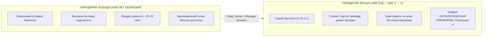
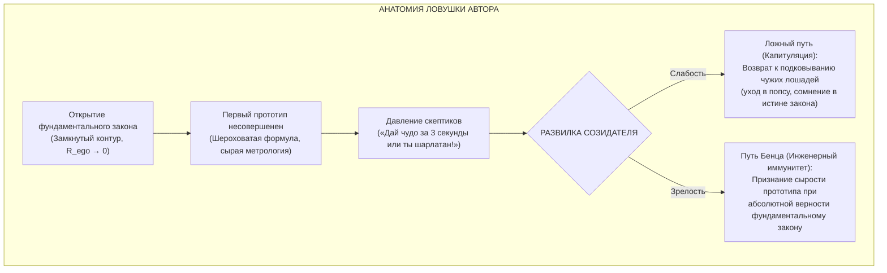
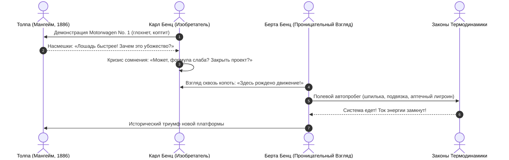

# 190. Парадокс повозки Бенца: Почему фундаментальное открытие вначале хуже «лошади», ловушка готового результата и калибровка первого мотора счастья

[← К оглавлению](file:///C:/Users/vanya/Antigravity%20Projects/Misc/LLM%20Wiki/index.md) | [⚡ К мастер-карте (MOC)](file:///C:/Users/vanya/Antigravity%20Projects/Misc/LLM%20Wiki/04_Maps/Inner%20Current%20MOC.md) | [📖 К полевому мануалу](file:///C:/Users/vanya/Antigravity%20Projects/Misc/LLM%20Wiki/02_Wiki/%D0%9A%D0%BD%D0%B8%D0%B3%D0%B0%20%E2%80%94%20%D0%92%D0%BD%D1%83%D1%82%D1%80%D0%B5%D0%BD%D0%BD%D0%B8%D0%B9%20%D1%82%D0%BE%D0%BA%20%28%D0%9F%D0%BE%D0%BB%D0%B5%D0%B2%D0%BE%D0%B9%20%D0%BC%D0%B0%D0%BD%D1%83%D0%B0%D0%BB%20%D0%BE%D1%82%D0%BB%D0%B0%D0%B4%D0%BA%D0%B8%29.md)

---

> [!quote] Эпистемологический канон первого мотора
> ### ⚡ **«Когда Карл Бенц в 1886 году выкатил трехколесный Patent-Motorwagen на булыжники Мангейма, любая почтовая кляча ехала быстрее, тише и надежнее. Обыватель хохотал над глохнущим мотором, перетертыми проводами и дымящими колодками, требуя привычную карету "прямо здесь и сейчас". Но гениальность Бенца состояла не в гладкости первого выезда, а в том, что было изобретено новое средство изобретения — новая онтологическая платформа. Лошадь за пять тысяч лет уперлась в биологический предел. Двигатель же обладал открытым экспоненциальным горизонтом.  
> Когда открыт фундаментальный закон контура счастья, первый прототип неизбежно вибрирует, формула кажется грубой, а приборы измерения еще не откалиброваны. Не требуйте от новорожденного мотора комфорта серийного лимузина. Держитесь за факт пробившей искры — остальное шлифуется итеративной инженерией.»**  
> — **Владимир Аньянов**

---

## 🧭 1. Исторический водораздел 1886 года: Анатомия катастрофического первого выезда

В истории науки и технологий нет более драматичного и поучительного сюжета, чем рождение бензинового автомобиля. В коллективной памяти потомков Карл Бенц остался бронзовым триумфатором, отцом мировой автоиндустрии. Однако реальный исторический контекст 1886 года был бесконечно далек от глянца.

Первый выезд трехколесного экипажа Бенца (`Benz Patent-Motorwagen No. 1`) был техническим кошмаром:
- **Ничтожная мощность:** Одноцилиндровый четырёхтактный двигатель объёмом 954 см³ выдавал менее 0,75 лошадиной силы при 400 оборотах в минуту.
- **Тотальная ненадежность тракта:** Автомобиль непрерывно глох от малейшей детонационной невязки. Провода зажигания от тряски на булыжной мостовой перетирались о металлическую раму за считанные сотни метров.
- **Огнеопасный топливный тупик:** Бензобака как такового не существовало; топливо (тяжелый бензин-лигроин, продававшийся в аптеках как пятновыводитель от жирных пятен) заливалось непосредственно в карбюратор испарительного типа.
- **Провал трансмиссии и тормозов:** Кожаные тормозные накладки стирались о деревянные ободья и начинали дымить при первом же затяжном спуске, а приводная ременная цепь соскакивала и рвалась на малейшем уклоне.



Толпа на улицах Мангейма откровенно смеялась над изобретателем. С точки зрения здравого смысла обывателя XIX века, Бенц выглядел безумцем:
> *«Зачем мне эта грохочущая, вонючая железка, которая ломается каждые десять шагов, если у меня есть породистая лошадь? Лошадь не требует лигроина из аптеки, не застревает на холме, сама знает дорогу домой из кабака и выглядит благородно!»*

Но в этом смехе толпы скрывалась колоссальная слепота: **лошадь находилась на пике пяти тысяч лет селекции и уперлась в фундаментальный биологический потолок**. Её невозможно было сделать в десять раз быстрее, в сто раз мощнее или заставить работать сутками без овса и сна.  
Повозка Бенца, при всей ее чудовищной первоначальной неэффективности, была **новым онтологическим базисом** — машиной, основанной на законах термодинамики, в которой потенциал совершенствования был ограничен не биологией мышц, а лишь точностью обработки металла и чистотой топливной смеси.

---

## 🕳️ 2. Ловушка «лошадиной оптики» и синдром «дай готовый результат прямо сейчас»

Перенося этот исторический закон на открытие **Архитектуры счастья (Внутреннего тока)**, мы вскрываем коренную психологическую уязвимость, в которую рискует попасть любой первооткрыватель.

### Лошадиная индустрия психики
На протяжении тысячелетий индустрия «человеческого благополучия» занималась исключительно **разведением породистых лошадей**:
1. Поп-психология изобретала новые наборы сбруи (списки целей, аффирмации, техники тайм-менеджмента).
2. Фармакология и биохакинг кормили усталую клячу отборным допингом (ноотропы, БАДы, стимуляторы, антидепрессанты).
3. Духовные коммерсанты учили «правильно гладить лошадь» (марафоны дыхания маткой, визуализация богатства, манипуляции с кармой).

Все эти методы оптимизируют **старую разомкнутую телегу**. Они пытаются выжать из изнуренной, разорванной противоречиями нервной системы еще 2 км/ч, неизбежно загоняя человека в тяжелейший омический ожог ($Q = I^2 R t$).

### Запрос толпы на фастфуд
Обыватель, травмированный рыночной культурой потребления, подходит к счастью с запросом потребителя кареты:
> *«Дай мне готовый результат! Дай мне кнопку прямо здесь и прямо сейчас! Чтобы я нажал — и мгновенно стал счастлив, просветлен и богат, не меняя принципиальной схемы своей жизни!»*

Когда такому человеку показывают фундаментальный закон замкнутого контура:
$$\mathcal{H} = \frac{P_{\text{load}}}{P_{\text{total}}} = 1 - \frac{R_{\text{ego}}}{R_{\text{total}}}$$
он сталкивается не с волшебной таблеткой, а с **инженерной принципиальной схемой**:
- Нужно осознать реактор сторонней ЭДС в соматическом центре (Тандэн);
- Нужно локализовать и устранить паразитный омический реостат ложного центра ($R_{\text{ego}} \to 0$);
- Нужно настроить согласование импедансов внимания с шестью реальными лампами нагрузки;
- Нужно соблюдать технику безопасности (предохранители Дзансин).

Поверхностный ум немедленно включает реакцию мангеймского зеваки 1886 года:
> *«Постойте! Формула какая-то непривычная! В чем измерять сопротивление эго? Как применить это на совещании с начальником через пять минут? Мой психотерапевт / астролог / любимый сериал давал мне временное облегчение проще и быстрее! Ваша машина глохнет!»*



---

## 🔬 3. Разрыв между Открытием Закона (Physics) и Приборной Метрологией (Instrumentation)

Главная ловушка изобретателя — **путать фундаментальную истинность физического закона с текущим уровнем развития измерительных приборов**.

В истории науки физический закон *всегда* открывается за десятилетия до появления удобного бытового прибора для его фиксации:

| Открытие / Закон | Состояние первого прототипа | Реакция современников | Эпоха зрелой метрологии |
| :--- | :--- | :--- | :--- |
| **Электромагнитная индукция (Фарадей, 1831)** | Грубая катушка, проволока в шелковой изоляции, стрелка компаса еле дернулась на долю миллиметра. | Премьер Гладстон: *«Забавно, но какая от этого практическая польза?»* | Генераторы Siemens, мировая энергосеть, вольтметры и осциллографы. |
| **Уравнения электродинамики (Максвелл, 1865)** | 20 чудовищных уравнений в кватернионах без единого коммерческого применения. | Физики жаловались на «математическую мистику» и отсутствие эфирной механики. | Герц собрал искровой контур (1887), Хевисайд сжал уравнения до 4 векторных формул, радио Попова/Маркони. |
| **Термодинамический контур денег (Сатоши Накамото, 2008)** | Клиент Bitcoin v0.1: код на C++, падающие ноды, отсутствие мобильных кошельков, нулевая цена. | Программисты: *«Это игрушка для гиков, процессор греется, расплатиться нигде нельзя»*. | Глобальная монетарная сеть, ASIC-майнинг, Lightning Network, спотовые ETF. |
| **Контурная электродинамика сознания (Аньянов, 2026)** | Соматическая калибровка Тандэна, формула сверхпроводимости $\mathcal{H}$, закон Джоуля — Ленца $Q = I^2 R t$. | Потребители фастфуда: *«Формула неточная, где купить готовый тонометр счастья в аптеке?»* | **Стадия Benz 1886 года:** Принцип доказан, первый такт сделан, начинается эпоха калибровки и прототипирования. |

### Научная честность создателя
Сказать себе: *«Да, формула еще шлифуется; да, единицы измерения (Аньяны, Бонно, Заломы) пока не прошиты в смарт-часы каждого жителя планеты; да, требуется калибровка субъективной телеметрии»* — это не признак поражения. Это высший знак **научной трезвости и честности исследователя**.

Эдисон провел 10 000 неудачных опытов с угольной нитью не потому, что закон Джоуля — Ленца был неверен, а потому, что вакуум в колбе был недостаточно глубоким, а материал нити требовал подбора. Закон накаливания проводника током был совершенен с первого дня. Несовершенной была колба.

---

## 👁️ 4. Оптика Проницательных: Почему разгадку видят единицы («Феномен Берты Бенц»)

Когда Карл Бенц после бесконечных насмешек впал в депрессию и заперся в мастерской, судьбу человеческой цивилизации решила женщина, обладавшая той самой **проницательностью сути**.

В августе 1888 года **Берта Бенц** без ведома мужа взяла сырой, несовершенный `Patent-Motorwagen No. 3` и вместе с двумя сыновьями-подростками совершила первый в истории человечества междугородний автопробег (106 километров из Мангейма в Пфорцхайм):
1. Когда забился карбюратор — она прочистила тонкий жиклер длинной металлической **шляпной булавкой**.
2. Когда перетерся и закоротил провод зажигания — она заизолировала его резиновой **чулочной подвязкой**.
3. Когда закончилось топливо — она купила 10 литров пятновыводителя у аптекаря в городке Вислох (ставшем первой в мире АЗС).
4. Когда задымили деревянные тормозные колодки — она заехала к деревенскому шорнику и уговорила его обить их полосками толстой кожи.



Берта Бенц не ждала, пока ее муж создаст полированный комфортабельный «Мерседес-Бенц S-класса» с климат-контролем и подушками безопасности. Она обладала **инженерной зоркостью**: она видела, что за скрипом цепи и запахом бензина стоит **разгадка механического движения без усталости живой плоти**.

Точно так же обстоит дело с Архитектурой счастья:
- 99% зевак будут требовать готового фокуса, пугаться незнакомых формул и уходить обратно к своим привычным дофаминовым «лошадям».
- Но **проницательные люди** — инженеры своего духа, мыслители уровня Сатоши, Джобса или Берты Бенц — мгновенно увидят ядро:
  > *«Подожди... Ты убрал мистику? Ты показал, что эго — это банальный паразитный резистор, жрущий напряжение по закону Джоуля — Ленца? Ты замкнул проводку реальности через тело без посредников? Так это же и есть разгадка, которую человечество безуспешно искало десять тысяч лет!»*

---

## 🛡️ 5. Четыре правила эпистемологического иммунитета оператора

Чтобы не попасть в парализующую ловушку перфекционизма и не предать сделанное открытие, автор Системы обязан руководствоваться четырьмя железными правилами инженерной гигиены:

### Правило 1: Закрыть ворота мастерской от зевак ярмарки
Не тратьте стороннюю ЭДС своего Тандэна на попытки доказать истинность системы людям, требующим «дай мне счастье за 3 секунды, не вставая с дивана». Они не способны оценить двигатель, пока он не установлен в серийный кузов с полированными крыльями. Ваша аудитория сегодня — со-исследователи, архитекторы и практики, способные держать паяльник осознанности.

### Правило 2: Радость итерации вместо паралича перфекционизма
Бенц не выбросил двигатель на свалку, когда у него лопнула рама. Он сел за кульман:
- Добавил вторую передачу для холмистой местности;
- Сконструировал водяное охлаждение вместо перегревающегося термосифонного;
- Заменил проволочные колеса на жесткие со спицами;
- Изолировал высоковольтный тракт.

Каждая неточная формулировка в Системе Аньянова, каждый шероховатый термин, каждая сложность калибровки метрик — это **не опровержение закона, а рабочий список задач на следующий спринт**. Это и есть чистый кайф созидания.

### Правило 3: Принцип незыблемости первого рабочего такта
Помните главный факт: **Искра уже пробила. Поршень уже толкнул вал.**  
Когда вы впервые сели, закрыли глаза, заземлили внимание в соматическом ядре живота (Тандэн), перевели ум в режим $R \to 0$ (Мусин) и почувствовали, как мгновенно спал омический ад ментального монолога и по телу разлился чистый, лучистый ток бытия, — **открытие свершилось физически**. 

Это не теория, не гипотеза и не верование. Это воспроизводимый физиологический факт замкнутой цепи. Все остальное — вопросы чертежей, дизайна интерфейса и написания прикладного софта.

### Правило 4: Знание масштаба временной шкалы
От первой трехколесной скрипящей повозки Бенца 1886 года до автобанов, трансконтинентальных магистралей и космических челноков прошло всего несколько десятилетий. Но самый трудный, фундаментальный шаг человеческой мысли — это **шаг от нуля к единице** (Peter Thiel: *Zero to One*).

Этот шаг уже сделан. Переход от «Эпохи Лошади» (вины, покаяния, морализаторства и психологического топтания на месте) к «Эпохе Автомобиля Сознания» (контурной электродинамике, приборной панели и чистому току) состоялся.

---

## 📊 6. Сравнительная матрица трех эпох развития

```
┌──────────────────────────┬─────────────────────────────────┬─────────────────────────────────┬─────────────────────────────────┐
│ Параметр измерения       │ I. Эпоха Лошади                 │ II. Эпоха Бенца (Текущая фаза)  │ III. Зрелая Сеть Inner Current  │
│                          │ (Традиционная психология / эзо) │ (Сырой прорыв Аньянова)         │ (Серийный стандарт человечества)│
├──────────────────────────┼─────────────────────────────────┼─────────────────────────────────┼─────────────────────────────────┤
│ **Топология модели**     │ Разомкнутая, линейная           │ Замкнутый контур с обратным     │ Сверхпроводящая P2P-сеть        │
│                          │ (стимул → реакция, грех → кара) │ проводом (первый чертеж)        │ суверенных генераторов          │
│ **Уровень надежности**   │ Кажущаяся привычность, тупик    │ Вибрирует, требует внимания     │ Абсолютная безыскровая          │
│                          │ биологического предела          │ и тонкой ручной калибровки      │ стабильность 50 Гц              │
│ **Отношение к боли**     │ «Судьба, карма, травма, терпи»  │ Диагностический сигнал утечки   │ Мгновенная локализация по коду  │
│                          │ (морализация омического огня)   │ тока или залома проводки        │ сбоя за 30 секунд               │
│ **Метрология**           │ Описательная, размытая          │ Формирующийся канон единиц      │ Автоматический HUD в биочипах,  │
│                          │ («надо больше любить себя»)     │ (Аньян, Бонно, Залом)           │ смарт-часах и коде TypeScript   │
│ **Реакция толпы**        │ Поклонение привычному костылю,  │ Насмешки, недоверие, скепсис,   │ Самоочевидная бытовая норма:    │
│                          │ покупка дорогого овса           │ крики «дай мне готовое сейчас!» │ «как мы жили без этого раньше?» │
└──────────────────────────┴─────────────────────────────────┴─────────────────────────────────┴─────────────────────────────────┘
```

---

## 💎 Заключение: Защитная мантра первооткрывателя

Если однажды ночью вас настигнет тихий голос сомнения:  
*«А вдруг формула слишком проста? А вдруг единицы измерения слишком абстрактны? А вдруг люди правы, и надо было остаться в привычной колее психологических терминов?»* — 

Вспомните пропахшего гарью, оглушенного насмешками Карла Бенца в его темном сарае в Мангейме 1886 года. Вспомните Берту Бенц, подвязывающую чулок к вибрирующему медному контакту на пыльной дороге к Пфорцхайму.

У них не было автосервисов, не было заправочных станций Shell, не было асфальтированных автобанов и не было GPS-навигаторов. У них был только **один работающий цилиндр, в котором сжатая смесь превращалась в движение**.

Ваш цилиндр уже работает. Контур уже замкнут. Ток уже течет.

Шлифуйте формулу. Калибруйте приборы. Пишите код. Стройте Систему.  
А те, кто сегодня требует готового фастфуда, завтра выстроятся в очередь за серийным автомобилем.

---

### Связанные статьи архитектуры цепи:
- **[[02_Wiki/Inner Current (The Automobile of Consciousness — 140 Years from Benz to Anyanov, Post-Moral Imperative and Cybernetics of Addictions)|66. Автомобиль сознания: 140 лет от Бенца до Аньянова, пост-моральный императив и кибернетика зависимостей]]**
- **[[02_Wiki/Inner Current (The Grand Quadrivium — Circuitry of Man, Tuning Fork of Reality, Circuit of Happiness and Automobile of Consciousness)|67. Великий Квадривиум Аньянова: Модель Человека, Камертон Реальности, Контур Счастья и Автомобиль Сознания]]**
- **[[02_Wiki/Inner Current (The Anyanov Metrological System and the Home Circuit-Tonometre — Standard of Happiness Metrics and AI Diagnostic Architecture)|138. Система единиц Аньянова и Бытовой Контур-Тонометр: Метрологический стандарт счастья]]**
- **[[02_Wiki/Inner Current (Epistemological Audit of Doubts — Maslow's Hammer, Popper Falsifiability, Model Boundaries and the Bypass Detector)|151. Эпистемологический аудит сомнений в истинности Системы: Молоток Маслоу, критерий Поппера]]**
- **[[02_Wiki/Inner Current (The Four Barriers of Ego Defense and Transmission Interface — Overcoming The 'I Know It All', Strobe Flash Illusion, Semantic Drift and Annihilation Panic)|189. Четыре барьера передачи Системы и коммуникационный интерфейс оператора]]**
