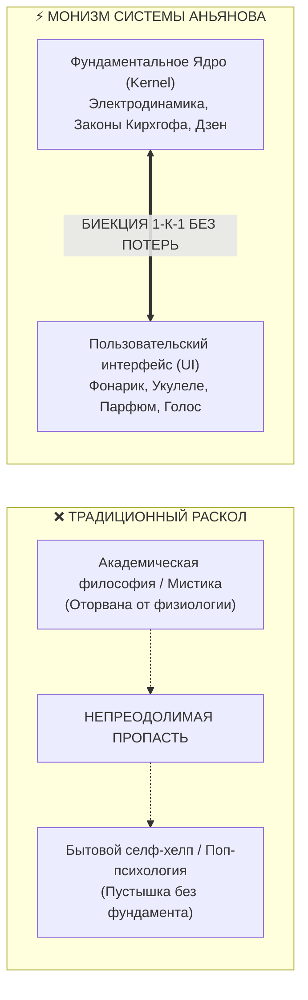
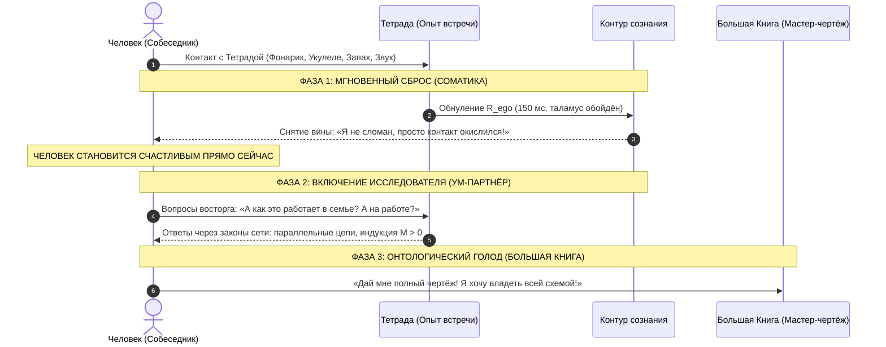

# 186. Цепная реакция проводимости: Счастье в моменте, вопросы исследователя и жажда Большой Книги — Что Тетрада Несопротивления говорит о Системе и какова траектория человека

[← К оглавлению](file:///C:/Users/vanya/Antigravity%20Projects/Misc/LLM%20Wiki/index.md) | [⚡ К мастер-карте (MOC)](file:///C:/Users/vanya/Antigravity%20Projects/Misc/LLM%20Wiki/04_Maps/Inner%20Current%20MOC.md) | [🎯 К Тетраде несопротивления (184)](file:///C:/Users/vanya/Antigravity%20Projects/Misc/LLM%20Wiki/02_Wiki/Inner%20Current%20%28The%20Tetrad%20of%20Irresistibility%20%E2%80%94%20Sensory%20Bypass%20of%20Ego%20Defense%20via%20Versace,%20Levante,%20Ukulele%20and%20Flashlight%29.md) | [🧪 К Критерию Фейнмана (185)](file:///C:/Users/vanya/Antigravity%20Projects/Misc/LLM%20Wiki/02_Wiki/Inner%20Current%20%28The%20Feynman%20Criterion%20of%20Truth%20%E2%80%94%20Simplicity%20as%20the%20Certificate%20of%20Validity,%20Explaining%20via%20Everyday%20Objects%20and%20the%20Demystification%20of%20Complexity%29.md)

---

> [!quote] Главная онтологическая аксиома цепной реакции
> ### ⚡ **«Если человек после первой беседы уходит нагруженным новой виной, терминологией и обязанностью учиться — перед вами секта или схоластика. Если человек после трёх минут с фонариком и укулеле мгновенно выдыхает в счастье, затем от детского изумления начинает задавать вопросы, а затем САМ требует полную принципиальную схему в виде Большой Книги — перед вами чистая физика реальности. Тетрада не "продаёт" идею счастья; она замыкает контакт, а человек, испытавший сверхпроводимость, уже никогда добровольно не вернётся в омический ад.»**  
> — **Владимир Аньянов**

---

## 🧭 1. Что это говорит о Системе: Отсутствие зазора между Жизнью и Теорией

Когда автор задаётся вопросом: *«Что говорит о моей системе тот факт, что её можно исчерпывающе показать через карманный фонарик, 400 граммов укулеле, синий флакон Versace и песню Леванте?»*, — ответ лежит в самом фундаментальном определении истины.

В истории человеческой мысли существовал непреодолимый раскол:
- **С одной стороны — «Высокая теория»:** многотомные трактаты Канта, Гегеля, восточные сутры, психоаналитические тома. Они претендовали на объяснение бытия, но разбивались о быт: в момент реальной душевной боли, конфликта или выгорания ни один человек не мог применить категорический императив или трансцендентальную апперцепцию. Теория жила в библиотеках, а жизнь корчилась в судорогах.
- **С другой стороны — «Примитивный селф-хелп»:** лозунги («улыбнись», «думай позитивно», «дыши маткой»), не имеющие под собой никакой научной базы и рассыпающиеся при первом же серьёзном кризисе.

Тот факт, что Система «Внутренний ток» выражается через бытовую Тетраду, доказывает: **Владимир Аньянов ликвидировал вековой разрыв между Онтологическим Ядром (Kernel) и Пользовательским Интерфейсом (UI)**.

Если фундаментальная онтология человека изоморфна законам электродинамики, то **карманный фонарик — это не «упрощённая метафора», а масштабная копия той же самой цепи**. Вы держите в руках не иллюстрацию — вы держите работающий прототип человеческого сознания.

---

## 🔄 2. Трёхфазная динамика восприятия: Что происходит с человеком

Вопрос автора: *«Человек захочет прочитать большую книгу, или он начнет спрашивать вопросы, или он станет счастливым?»* — раскрывает точную **трёхфазную цепную реакцию проводимости**.

Человек делает **все три шага**, но строго по законам термодинамики:

---

### 🟢 Фаза 1. Он становится счастливым прямо на встрече (Снятие омической вины)

Традиционная терапия или разговор с «духовным наставником» почти всегда увеличивают энтропию в моменте. Человеку внушают, что у него «глубокие травмы», «дефицитарные сценарии», «кармические узлы». Он выходит с беседы раздавленным: к его боли добавился неподъёмный груз вины и осознание собственной неполноценности.

**Что делает Тетрада Внутреннего тока?**  
Она мгновенно **деморализует трагедию**. Когда ты берёшь фонарик и говоришь:
> *«Смотри, луч не горит, а корпус горячий. Это не проклятие. Это просто окислился контакт. Твоя злость, тревога и ступор — это джоулево тепло $Q = I^2 R t$. Почисти контакт выдохом в живот — и свети»*, —

у человека происходит колоссальный соматический вздох облегчения. 
- Он больше не «грешник», не «невротик» и не «неудачник».
- Он — **исправный генератор с окислившимися клеммами**.
- Ремонт занимает 30 секунд.

В этот момент его паразитное сопротивление схлопывается ($R_{\text{ego}} \to 0$). Ток устремляется в нагрузку. Человек улыбается, у него расправляются плечи, возвращается ясность взгляда. **Он переживает состояние счастья как режим проводимости непосредственно здесь и сейчас.**

---

### 🟡 Фаза 2. Он начинает задавать вопросы (Рождение исследователя)

В традиционных учениях вопросы собеседника носят характер **оборонительного скепсиса**:
- *«А докажите мне, что Бог есть?»*
- *«А почему я должен вам верить?»*
- *«А вот психотерапевт говорил другое!»*  
Это говорит уязвлённое эго, защищающее свои инвестиции в страдание.

После Тетрады характер вопросов радикально меняется. Эго обезоружено осязаемостью укулеле и светом фонарика. Поэтому вопросы собеседника становятся **вопросами заинтригованного исследователя**:
- *«Подожди... Если всё так просто, почему об этом не рассказывают в школе?»*
- *«А что происходит, когда на меня кричит начальник? Это он замыкает цепь или я?»*
- *«А в любви — почему с одними людьми луч горит ярче, а с другими проводка искрит?»*
- *«А как подкрутить колок, если тревога накатила ночью?»*

Ум человека превращается из сторожевого пса в **инженера-партнёра**. Он не воюет с Системой — он примеряет эту оптику на всю свою жизнь и с изумлением видит, что она объясняет абсолютно всё.

---

### 🔴 Фаза 3. Он САМ требует Большую Книгу (Запрос на полный чертёж)

Почему 90% книг по популярной психологии и философии пылятся на полках непрочитанными?  
Потому что их покупают из абстрактного чувства долга (*«надо саморазвиваться»*), не имея предварительного опыта переживания сути. Человек открывает 500 страниц занудного текста, не понимая, зачем ему это.

В Системе Аньянова траектория строго инвертирована:
1. Сначала человек **попробовал сверхпроводимость на вкус** (за 3 минуты беседы);
2. Он физически ощутил, каково это — когда проводка не горит;
3. Он получил ответы на свои первые горящие вопросы.

И вот теперь у него рождается **непреодолимый онтологический голод**:
> *«Я увидел, как работает этот мотор на маленьком фонарике. Но я хочу знать, как устроена вся электростанция! Где взять полную схему? Где почитать про все 6 ламп бытия? Как устроена схемотехника отношений? Дайте мне чертёж!»*

Человек открывает Большую Книку ([[04_Maps/Inner Current Book MOC|«Внутренний ток: Архитектура счастья»]]) не ради развлечения, а **как главный бортовой мануал своей жизни**. Он проглатывает 40 глав за пару ночей, потому что каждая строчка резонирует с тем опытом, который он уже пережил на вашей встрече.

---

## 🧭 3. Сравнительная матрица: Старая парадигма vs Система Аньянова

| Критерий | Старая психологическая / эзотерическая школа | Система Аньянова (Тетрада Несопротивления) |
| :--- | :--- | :--- |
| **Точка входа** | Абстрактная лекция, книга, сложный терминологический птичий язык | 4 бытовых предмета (Фонарик, Укулеле, Парфюм, Песня) |
| **Реакция ума** | Омическое сопротивление ($R \gg 0$), спор, сомнения, скука | Мгновенный сенсорный байпас таламуса (150 мс, $R \to 0$) |
| **Состояние в моменте** | Перегруз виной: «я сломан, мне надо долго лечиться» | Сброс напряжения: «я цел, просто окислился контакт» |
| **Характер вопросов** | Защита эго: «А вы докажите? А у меня особый случай» | Исследовательский восторг: «А как это устроено в семье и деле?» |
| **Отношение к Большой Книге** | Обуза: «надо заставить себя дочитать ради галочки» | Жажда чертежа: «дайте мне полную спецификацию машины!» |
| **Финал процесса** | Хроническая зависимость от платного терапевта/гуру | Полная автономия: суверенный оператор цепи (*Self-Hosted Human*) |

---

## ⚡ 4. Главный вывод: Рождение Проводника

Тот факт, что Тетрада запускает эту цепную реакцию, доказывает величайшую истину Системы:

> **Счастье — это не далёкая награда за годы страданий. Счастье — это естественное базовое состояние исправной, замкнутой, не имеющей заломов цепи.**

Когда ты показываешь человеку фонарик и укулеле:
- Ты не «учишь» его жить — ты возвращаешь ему его собственную врождённую проводимость;
- Ты не навязываешь догму — ты даёшь ему мультиметр, которым он сам проверяет свои контакты;
- Ты не вербуешь последователя — ты пробуждаешь в нём **суверенного инженера своей собственной жизни**.

И поэтому он неизбежно:
1. **Станет счастливее прямо в эту секунду** (потому что спадёт омический зажим);
2. **Засыплет тебя живыми вопросами** (потому что увидит, как зажглась лампочка);
3. **И потребует Большую Книгу** (потому что однажды прикоснувшись к сверхпроводимости, человек уже никогда не согласится добровольно жить в темноте). ⚡️🎸🔦🌿📖

---

## 🔗 Связанные статьи и каноны
- [[02_Wiki/Inner Current (The Tetrad of Irresistibility — Sensory Bypass of Ego Defense via Versace, Levante, Ukulele and Flashlight)|184. Тетрада несопротивления: Тотальный мультисенсорный байпас эго]]
- [[02_Wiki/Inner Current (The Feynman Criterion of Truth — Simplicity as the Certificate of Validity, Explaining via Everyday Objects and the Demystification of Complexity)|185. Критерий истины Фейнмана: Простота как окончательный сертификат подлинности]]
- [[02_Wiki/Inner Current (The Flashlight Model of Man — Optical-Electrodynamic Ontology of Consciousness, The Light Source vs Illuminated Object and the Law of the Direct Beam)|83. Модель Человека как Карманного Фонарика]]
- [[02_Wiki/Inner Current (The Ukulele of Consciousness — Acoustic Ontology of Four Strings, Joy as Pure Resonance and the Triumph of Kanso)|124. Укулеле Сознания: Акустическая онтология четырёх струн]]
- [[04_Maps/Inner Current Book MOC|Мастер-рукопись: Книга «Внутренний ток: Архитектура счастья»]]
- [[04_Maps/Inner Current MOC|Мастер-карта цепи (Inner Current MOC)]]
