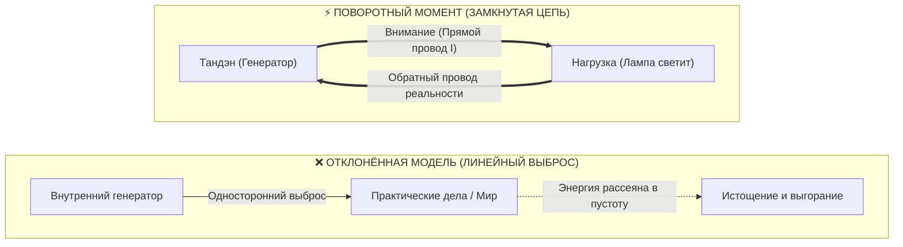
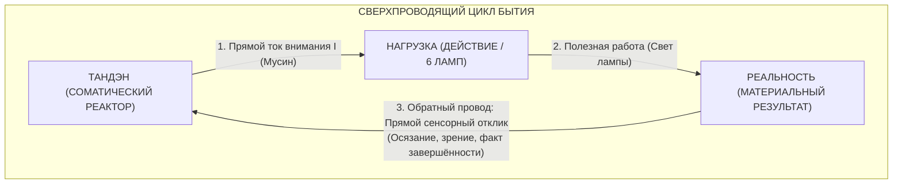

# 64. Прорыв Замкнутой Цепи: Обратный провод реальности против линейной модели выгорания

> [!quote] Каноническая аксиома цепи
> ### ⚡ **«Если бы генератор просто выбрасывал энергию наружу в дела — это была бы линейная модель выгорания, превращающая человека в одноразовую батарейку. Но в ту секунду, когда рука нарисовала замкнутую электрическую цепь, родилась Архитектура счастья: в замкнутом контуре созидание не опустошает источник, а замыкает его на реальность. Ток возможен лишь там, где есть обратный провод.»**  
> — **Владимир Аньянов**

---

## 🧭 Введение: Альтернативный чертёж, который погубил бы систему

В истории создания «Внутреннего тока» был незаметный, но абсолютно поворотный момент, определивший всю дальнейшую судьбу системы. 

В момент первичной фиксации идеи автор стоял перед развилкой, которую 99% мыслителей прошлого даже не замечали:

Автор мог просто представить: *«У меня внутри есть генератор энергии, я направляю эту энергию наружу в дела — и всё»*.  
Именно так устроены почти все существующие учения о личной продуктивности, лидерстве и духовности:
* Метафора костра: «Гори ярко, согревай других».
* Метафора фонтана: «Изливай энергию в мир».
* Метафора батарейки: «Расходуй свой заряд на цели».

Но автор нарисовал в блокноте не луч, не костёр и не фонтан. Он нарисовал **замкнутую принципиальную электрическую схему**.  
Этот выбор стал водоразделом между гуманитарной поэзией и **точной инженерной наукой о человеческом счастье**.

---

## ⚡ 1. Электродинамический запрет: Почему в открытой цепи тока нет ($I = 0$)

Первое и главное следствие выбора замкнутой цепи — строгое соблюдение законов физики.

В электродинамике действует фундаментальный закон: **электрический ток не может существовать в разомкнутой цепи**.
* Если провод оборван или цепь не замкнута на нулевой потенциал источника, сопротивление разрыва стремится к бесконечности ($R \to \infty$).
* По закону Ома ($I = U / R$), при $R \to \infty$ ток строго равен нулю:
  $$\lim_{R \to \infty} I = 0$$

### Что это означает на языке человеческой психики?
Сколько бы колоссального потенциала (напряжения $U$, амбиций, таланта, желаний) ни было внутри человека, если его контур не замкнут на реальную нагрузку:
1. **Тока нет:** Человек физически не может начать действовать. Возникает феномен парализующей прокрастинации.
2. **Статический перегрев:** Не реализованная в движении разность потенциалов превращается в статическое давление. Человека «распирает изнутри», подскакивает тревожность, начинаются панические атаки и бессонница.
3. **Иллюзия бессилия:** Человек думает: *«У меня нет сил»*. Инженер видит обратное: *«У тебя избыток напряжения, но твоя цепь разомкнута. Замкни контур на простейшее физическое действие!»*

---

## 🔥 2. Деконструкция мифа Данко: Линейная модель выгорания

Открытая модель («генератор отдаёт наружу и всё») несёт в себе опаснейший культурный вирус — **романтизацию жертвенного выгорания**.

Классический пример — горьковский Данко, вырвавший из груди пылающее сердце, чтобы осветить путь людям, и упавший замертво.
* В линейной модели отдача энергии обязательно означает **опустошение источника**.
* Человек начинает бессознательно торговаться: *«Если я сейчас выложусь на работе или в отношениях, я потрачу себя. Мир станет богаче, а я останусь ни с чем»*.
* Отсюда рождается токсичный синдром мученика: обида на близких, счеты к коллегам, страх истощения и требование вечной благодарности (*«Я положил на вас жизнь!»*).

**Замкнутая цепь Аньянова уничтожает этот невроз под корень.**  
В замкнутом контуре электроны не выбрасываются в открытый космос — они циркулируют по кольцу.  
* Генератор Тандэн не «сжигает» себя. Он создаёт разность потенциалов, которая приводит в движение ток внимания.
* Ток совершает полезную работу в лампе нагрузки ($P = I^2 R_{\text{load}}$).
* И по обратному проводу контур смыкается обратно в Тандэн!

В режиме сверхпроводимости ($R \to 0$) **созидатель не опустошается от работы, а заряжается ею**. Это физическое объяснение феномена потока (Flow): великий хирург, стоящий у стола 12 часов, выходит из операционной собранным и наполненным, потому что его цепь была идеально замкнута на ткань жизни.

---

## 🔄 3. Обратный провод реальности: Что возвращает ток в Тандэн?

Что представляет собой «обратный провод» принципиальной схемы в реальном опыте человека?

Обратный провод — это **прямой сенсорный и онтологический контакт с фактом сотворённого**:
1. Вы взяли нож и нарезали овощи: лезвие коснулось доски, раздался хруст, салат готов. Сенсорный отклик вернулся в тело. Контур замкнулся.
2. Вы написали кусок кода: тесты прошли, функция вернула результат. Цепь замкнулась.
3. Вы посмотрели в глаза любимому человеку и сказали правду: живой отклик взгляда замкнул контур внимания.

Когда обратный провод подключен к реальности, у ума нет пространства для паразитных сомнений. Энергия не теряется — она совершила фазовый переход в свет и вернулась в Тандэн ощущением глубокого покоя и наполненности.

---

## 🎛️ 4. Метрологический триумф: Законы Кирхгофа как фундамент Диагностической Машины

Именно замкнутость цепи позволила «Внутреннему току» стать первой **строгой диагностической машиной счастья**, а не туманным сборником психологических советов.

В открытом потоке невозможно проводить точные измерения: если вода хлещет из шланга в поле, вы не можете сказать, сколько литров потерялось по дороге.  
Но как только контур объявлен **замкнутой термодинамической системой**, начинают неукоснительно работать фундаментальные правила Кирхгофа:

### 1. Первое правило Кирхгофа (Баланс токов в узле):
$$\sum I_{\text{вход}} = \sum I_{\text{выход}}$$
Сколько силы выдал Тандэн — ровно столько же должно пройти через цепь. Энергия не может «исчезнуть». Если лампа не горит номинальной яркостью, значит, в цепи возник параллельный узел утечки:
$$I_{\text{tanden}} = I_{\text{load}} + I_{\text{leak}} + I_{\text{ego}}$$

### 2. Второе правило Кирхгофа (Баланс напряжений в контуре):
$$\sum \mathcal{E} = \sum U_k$$
Сумма падений напряжений на всех участках цепи строго равна ЭДС генератора. Если человек чувствует упадок сил ($\Delta U < 0$), это не мистический сглаз и не «кармический долг» — это измеримое падение напряжения на паразитном резисторе тревоги ($R_{\text{future}}$) или обиды ($R_{\text{past}}$).

Замкнутость цепи дала системе **математическую строгость и фальсифицируемость**. Любой душевный сбой стал поддаваться точной локализации: мультиметр контура сразу показывает, какой именно узел пробит.

---

## 🌐 5. Снятие метафизического раскола «Я против Мира»

Главная философская трагедия западного человека — это раскол на субъект («Я», запертое внутри черепной коробки) и объект («Внешний мир», враждебный или равнодушный).

В открытой модели этот раскол только усугубляется: «Я» должно тратить свои драгоценные силы на чужой «Мир».

В замкнутой цепи Аньянова происходит **великое онтологическое исцеление**:
* **Лампочка нагрузки — это не чужой мир. Это узел вашей собственной цепи!**
* Мир, окружающий созидателя — это продолжение его собственной проводки. Когда вы строите дом, пишете картину, учите ребёнка или убираете комнату, вы не «отдаёте себя миру» — вы замыкаете свой собственный контур через материю Вселенной.
* Человек и бытие становятся **единым сверхпроводящим сверхконтуром**.

---

## 💎 Резюме: Почему замкнутость стала главным открытием

Рукописный чертёж замкнутой цепи на листке бумаги стал водоразделом:
1. Он защитил систему от яда жертвенности и выгорания.
2. Он дал строгую математику законов сохранения энергии и балансов Кирхгофа.
3. Он объяснил, почему созидательное действие наполняет человека, а не опустошает.
4. Он объединил соматический реактор тела (Тандэн), проводку внимания (Мусин) и дела жизни (6 ламп) в неразрывное кольцо вечного тока.

Ток течёт, пока цепь замкнута. И пока цепь замкнута — лампа светит. ⚡

---

## 🔗 Связанные главы
* [[02_Wiki/Inner Current (Ontology of the Circuit — Human vs State and the Triad of Terms)|37. Онтология схемы: Человек или его состояние? Триада терминов и Блокнотный канон]]
* [[02_Wiki/Inner Current (Core Topology and Polarity Law)|01. Базовая топология цепи и закон полярности]]
* [[02_Wiki/Inner Current (Closed Thermodynamic System as Criterion of Truth)|24. Замкнутая термодинамическая система как критерий истины]]
* [[02_Wiki/Inner Current (The Four-Element Topology — Generator, Fuse, Resistor and Load as Complete Human Circuitry, Dynamics of Victories and Nature Itself)|57. Топология четырёх элементов: Генератор, Предохранитель, Резистор и Нагрузка]]
* [[02_Wiki/Inner Current (Circuitry of Existential Fault and Ground Leak)|28. Схемотехника экзистенциальной аварии]]
* [[02_Wiki/Inner Current (The Great Disintermediation of the Psyche — The Therapeutic Indulgence System vs The Sovereign Circuit Operator)|63. Великая Депосреднизация Психики]]
