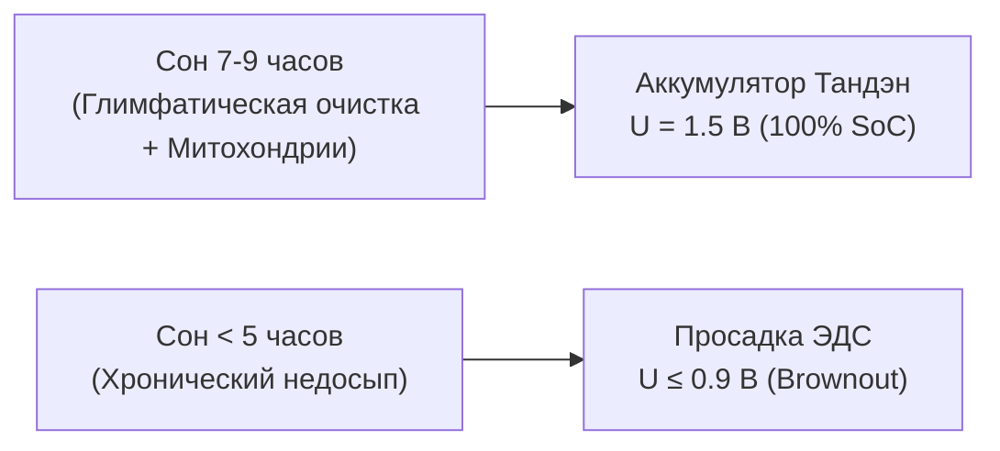
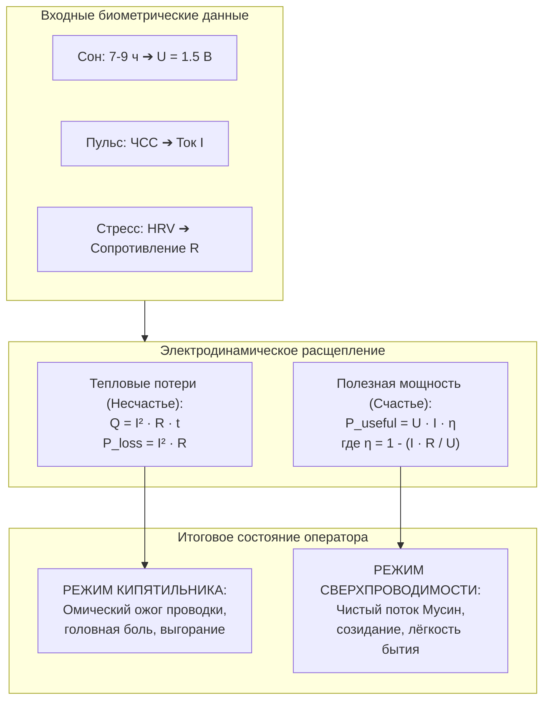

# 238. Полная электродинамическая триада расчёта счастья и несчастья: Напряжение батарейки сна ($U = 1.5\text{ В}$), Ток пульса ($I$) и Сопротивление стресса ($R$) — Биометрический расчёт КПД сверхпроводимости по фитнес-браслету, омический кипятильник выгорания ($Q = I^2 R t$) и инженерная система объективного измерения счастья
## Преодоление субъективной лирики через закон Ома и закон Джоуля — Ленца: калибровка номинала ЭДС по ночному сну (7–9 часов = 1.5 В), пульс как кинетическая сила тока внимания ($I$), индекс стресса как омическое сопротивление зажима ($R$), математический вывод полезной мощности ($P$) и теплового ожога ($Q$), и готовый алгоритм ежедневного расчёта оператора

> [!quote] Каноническая аксиома цепи
> ### ⚡ **«Чтобы рассчитать счастье и несчастье, человеку не нужны абстрактные философские трактаты, психологические тесты и гадания на ромашке. В замкнутом контуре действуют ровно те же инвариантные законы физики, что и в радиоприёмнике или электромобиле: Напряжение ($U$), Ток ($I$) и Сопротивление ($R$). Если оператор проспал 7–9 часов, его химический аккумулятор полностью заряжен — на клеммах стабильные 1.5 Вольта сторонней ЭДС. Пульс на запястье — это мгновенный амперметр кинетической накачки контура ($I$). А показатель стресса фитнес-браслета — это прямой омметр паразитного сопротивления эго-залома ($R$). Вот и вся полная, исчерпывающая система объективного измерения человеческого счастья. Счастье — это сверхпроводимость цепи, где $R \to 0$, а ток свободно течет в полезную нагрузку жизни. Несчастье — это режим омического кипятильника ($Q = I^2 R t$), когда при высоком стрессе колотящееся сердце сжигает заряд батарейки в раскалённое страдание. Перестав быть мистикой, счастье стало точным показанием приборов.»**  
> — **Владимир Аньянов**, создатель «Архитектуры счастья»

---

```
         БИОМЕТРИЧЕСКИЙ МУЛЬТИМЕТР ОПЕРАТОРА (INNER CURRENT)
  ┌──────────────────────────────────────────────────────────────────┐
  │                                                                  │
  │   [ БАТАРЕЙКА СНА: U = 1.5 В ] ──► [ СЕРДЕЧНЫЙ ТОК: I (Пульс) ] │
  │        (Сон 7-9 часов, SoC 100%)       (Кинетический напор)      │
  │                                                  │               │
  │                                                  ▼               │
  │                                     [ ОММЕТР СТРЕССА: R ]        │
  │                                      (Залом русла / спазм)       │
  │                                                  │               │
  │                 ┌────────────────────────────────┴───────────────┐
  │                 │                                                │
  │                 ▼                                                ▼
  │     ЕСЛИ R → 0 (Стресс < 25):                        ЕСЛИ R >> 0 (Стресс > 60):
  │     ⚡ СВЕРХПРОВОДИМОСТЬ СЧАСТЬЯ                     🔥 ОМИЧЕСКИЙ КИПЯТИЛЬНИК
  │     КПД контура η → 100%                            Потери: Q = I² · R · t
  │     Полезная мощность P = U · I                     Выгорание, спазм, ожог проводки
  │     Энергия уходит в жизнь и дело                   Батарейка садится за 3 часа
  └──────────────────────────────────────────────────────────────────┘
```

---

## 1. От субъективной драмы — к объективному мультиметру

Тысячелетиями человечество пыталось измерить счастье через зыбкие субъективные вопросы: *«Как ты себя чувствуешь?», «Доволен ли ты жизнью по шкале от 1 до 10?», «Нашёл ли ты смысл бытия?»*. Все эти опросники страдают неустранимым системным дефектом: опрашивается не объективное состояние организма, а текущий монолог **мысленного судьи (дефолт-системы мозга, DMN)**, который сам по себе является главным источником омического шума.

Человек в состоянии глубокого творческого потока (**Мусин**) вообще не думает о том, счастлив ли он — его внимание целиком отдано коду, холсту, чашке чая или любимому человеку. Если его прервать вопросом «Счастлив ли ты?», мы искусственно врезаем в его контур сопротивление рефлексии.

**Революция Системы Аньянова:**  
Счастье переводится в плоскость **прикладной электродинамики биологического скафандра**. Для исчерпывающего расчета состояния достаточно трёх базовых физических величин:
1. **Напряжение источника ($U$):** Сон ($7\text{--}9$ часов) как полная зарядка аккумулятора до номинала $1.5\ \text{В}$.
2. **Сила тока ($I$):** Пульс (ЧСС, уд/мин) как скорость прокачки носителей заряда через кровеносное русло и внимание.
3. **Сопротивление проводника ($R$):** Уровень стресса по фитнес-трекеру (HRV / вегетативный тонус) как механический спазм проводки.

---

## 2. Напряжение батарейки ($U = 1.5\text{ В}$): Физика сна и химический потенциал ядра

В модели карманного фонарика сознания первичным источником энергии выступает генератор Тандэн. На физическом уровне биологического субстрата его сторонней ЭДС (электродвижущей силой) управляет **ночной восстановительный сон**.

### Номинал 1.5 Вольта:
Обычная бытовая пальчиковая батарейка (AA/AAA) имеет номинальное напряжение $1.5\ \text{В}$. В Системе Аньянова этот номинал принят за **базовый эталон полного заряда оператора ($U_0 = 1.5\ \text{В}$ или $1.5\ \text{Тв}$ — Тандэн-Вольт)**.

### Физиология ночной зарядки:
Сон продолжительностью **7–9 часов** — это не пассивное отключение, а интенсивный электрохимический цикл восстановления:
* Глимфатическая система головного мозга промывает межклеточное пространство от метаболических шлаков и амилоидных токсинов (ликвидация паразитных утечек);
* Митохондриальный пул 37 триллионов клеток восстанавливает трансмембранный протонный потенциал ($150\text{--}200\ \text{мВ}$ на мембрану);
* Надпочечники снижают выработку кортизола, возвращая парасимпатический тонус блуждающего нерва (Vagus nerve) в базовое заземление.

### Калибровочная шкала напряжения от сна:

| Продолжительность и качество сна | Напряжение батарейки ($U$) | Состояние аккумулятора (SoC) | Режим контура на день |
| :--- | :---: | :---: | :--- |
| **7.5 — 9.0 часов** (глубокий сон $\ge 1.5$ ч) | **$1.50\ \text{В}$** | **$100\%$ (Полный заряд)** | **Номинал сверхпроводимости.** Ядро держит любую нагрузку без просадки напряжения. |
| **6.5 — 7.5 часов** (норма) | **$1.35\ \text{В}$** | **$85\%$ (Рабочий заряд)** | **Штатная эксплуатация.** Запас на полный продуктивный день. |
| **5.0 — 6.5 часов** (недосып) | **$1.15\ \text{В}$** | **$60\%$ (Просадка ЭДС)** | **Пониженное напряжение.** Быстрое истощение, чувствительность к паразитным шумам. |
| **Менее 5.0 часов** (депривация) | **$\le 0.90\ \text{В}$** | **$\le 35\%$ (Глубокий разряд)** | **Браун-аут (Brownout).** Система работает в аварийном режиме, угроза сбоя. |



---

## 3. Ток ($I$): Пульс как амперметр кинетического напора

Сила тока в проводнике — это количество заряда, проходящее через сечение в единицу времени:
$$I = \frac{dq}{dt}$$

В теле человека главным гидродинамическим и электромагнитным насосом является сердце. Каждый удар миокарда генерирует:
1. Механическую волну давления крови, доставляющую кислород и АТФ в ткани;
2. Мощнейший электромагнитный импульс (зубец R на ЭКГ), распространяющийся по всему телу со скоростью нервного импульса.

### Соответствие «Пульс $\leftrightarrow$ Ток внимания ($I$)»:
Фитнес-браслет на запястье в реальном времени измеряет ЧСС (Heart Rate, уд/мин) с помощью фотоплетизмографии (зеленый светодиод).
* **Пульс в покое ($55\text{--}65\ \text{уд/мин}$):** Базовый ток покоя ($I \approx 0.6\text{--}0.8\ \text{Ав}$). Контур работает на минимальном холостом ходу, энергия аккумулируется.
* **Рабочий пульс созидания ($70\text{--}85\ \text{уд/мин}$):** Номинальный ток полезной мощности ($I \approx 1.0\text{--}1.3\ \text{Ав}$). Внимание плотно собрано на коде, тексте, чертеже или разговоре.
* **Высокий пульс нагрузки ($95\text{--}130+\ \text{уд/мин}$):** Высоковольтный ток форсажа ($I \approx 1.8\text{--}2.5+\ \text{Ав}$). Спорт, публичное выступление или острая фаза проекта.

---

## 4. Сопротивление ($R$): Индекс стресса как омметр залома эго

Современные фитнес-трекеры (Xiaomi Smart Band 7, Apple Watch, Garmin, Whoop) рассчитывают показатель **Стресса (Stress Score от 1 до 100)** не по температуре или поту, а по **вариабельности сердечного ритма (HRV / RMSSD)**:
* **Высокая вариабельность (HRV высок):** Сердце бьётся гибко, паузы между ударами микроскопически колеблются под управлением блуждающего нерва (парасимпатика). Тело расслаблено, сосуды эластичны, мысленный критик спит. **Это режим $R \to 0$ (сверхпроводимость, Мусин)**.
* **Низкая вариабельность (HRV падает до нуля):** Ритм становится неестественно метрономным, жестким. Это признак мощного симпатического спазма — надпочечники качают адреналин, сосудистое русло сжато, зубы стиснуты, челюсти сжаты, в голове крутится спор. **Это режим высокого омического сопротивления ($R \gg 0$)**.

### Градация сопротивления $R$ по браслету:
* **$R = 1\text{--}25\ \text{Зл}$ (Синий сектор, Стресс $<25$):** Сверхпроводник. Проводка ледяная, потерь нет.
* **$R = 26\text{--}50\ \text{Зл}$ (Зеленый сектор, Стресс $26-50$):** Штатное рабочее сопротивление реальной внешней задачи.
* **$R = 51\text{--}75\ \text{Зл}$ (Желтый сектор, Стресс $51-75$):** Омический залом кабеля. Мысленный диалог, тревога, спешка.
* **$R = 76\text{--}100\ \text{Зл}$ (Оранжево-красный сектор, Стресс $>75$):** Глухое короткое замыкание на эго, спазм, паника.

---

## 5. Полная математическая модель расчета

Теперь, когда у оператора есть все три измеримые величины $\{U, I, R\}$, физика формулирует два фундаментальных уравнения: **Формулу Несчастья** и **Формулу Счастья**.



---

### 5.1. Формула Несчастья: Закон Джоуля — Ленца ($Q = I^2 R t$)

Несчастье в Системе Аньянова — это не «судьба» и не «психологическая травма». Это **паразитный тепловой перегрев проводника attention-тракта**:

$$P_{\text{loss}} = I^2 \cdot R$$
$$Q_{\text{burnout}} = I^2 \cdot R \cdot t$$

#### Квадратичная ловушка воли ($I^2$):
Обратите внимание на степень тока в формуле Джоуля — Ленца: **сила тока возведена в квадрат**!
* Если человек спокоен ($I = 1$), но уровень стресса велик ($R = 80$), потери равны:
  $$P_{\text{loss}} = 1^2 \times 80 = 80\ \text{Бонно}$$
* Но если в этом стрессе человек решает «собраться, поднажать, ускорить шаг и стиснуть зубы», его пульс подскакивает до $120$ уд/мин ($I = 2.0$):
  $$P_{\text{loss}} = 2^2 \times 80 = 4 \times 80 = 320\ \text{Бонно}!$$

> **Закон омического кипятильника:**  
> Попытка преодолеть стресс волевым разгоном скорости увеличивает страдание **в 4 раза**. Контур вскипает за считанные минуты, и батарейка $1.5\ \text{В}$ оказывается высажена «в ноль» уже к 14:00 дня.

---

### 5.2. Формула Счастья: КПД сверхпроводимости ($\eta$) и Полезная Мощность ($P$)

Счастье — это режим, в котором максимальная доля энергии батарейки превращается в **созидательное действие и чистое восприятие реальности**:

$$\eta_{\text{superconduct}} = \max\left(0,\, 1 - \frac{I \cdot R}{U}\right)$$

Полезная мощность счастья (в Аньянах):
$$P_{\text{happiness}} = U \cdot I \cdot \eta_{\text{superconduct}}$$

#### Чудо нулевого сопротивления ($R \to 0$):
Когда уровень стресса падает до нуля (Мусин, спокойное присутствие, расслабленная челюсть):
$$R \to 0 \implies \frac{I \cdot R}{U} \to 0 \implies \eta_{\text{superconduct}} \to 100\%$$
$$P_{\text{happiness}} \to U \cdot I$$
$$P_{\text{loss}} = I^2 \cdot 0 \equiv 0$$

В этом состоянии:
1. Тепловые потери полностью отсутствуют ($Q = 0$). Человек не устает, голова свежая, тело легкое.
2. Даже если ток велик ($I = 2.0$ — вдохновенная игра на укулеле, стремительный бег или интенсивный диалог), **нет сопротивления — нет ожога!**
3. Вся энергия батарейки $1.5\ \text{В}$ расходуется строго по назначению — на освещение внешнего мира.

---

## 6. Приборная матрица четырёх состояний человека

Используя три показания фитнес-браслета (Часы сна $\to U$, Пульс $\to I$, Стресс $\to R$), мы получаем объективную приборную классификацию любого человеческого момента:

| № | Название режима | $U$ (Сон) | $I$ (Пульс) | $R$ (Стресс) | Расчёт цепи | Инженерный вердикт и самочувствие |
| :-: | :--- | :---: | :---: | :---: | :--- | :--- |
| **A** | ⚡ **Сверхпроводимость Счастья (Мусин)** | **$1.5\ \text{В}$** (8 ч) | **$72$** ($I \approx 1.0$) | **$12$** ($R \approx 0$) | $\eta = 92\%$, $P = 1.38\ \text{Ан}$, $Q \approx 0\ \text{Бн}$ | **Идеальное счастье.** Лёгкость в теле, ясный ум, работа спорится сама собой, время течёт незаметно. |
| **B** | 🔥 **Омический Ад (Стресс-Кипятильник)** | **$1.2\ \text{В}$** (5.5 ч) | **$115$** ($I \approx 2.2$) | **$85$** ($R \approx 85$) | $\eta = 0\%$, $P_{\text{useful}} = 0$, $Q = 411\ \text{Бн}$ | **Острое несчастье.** Спешка, мысленный спор, тахикардия, раскалённая проводка, риск нервного срыва. |
| **C** | 🪫 **Токсичное Тление (Прокрастинация)** | **$1.3\ \text{В}$** (6.5 ч) | **$62$** ($I \approx 0.8$) | **$68$** ($R \approx 68$) | $\eta = 58\%$, $Q = 43\ \text{Бн}$ (но часами!) | **Хроническая тоска.** Тело на диване, но внутри грызёт вина и тревога. Медленный ожог, отнимающий силы. |
| **D** | 🚀 **Сверхпроводящий Форсаж (Страсть/Спорт)** | **$1.5\ \text{В}$** (8.5 ч) | **$135$** ($I \approx 2.5$) | **$18$** ($R \approx 10$) | $\eta = 83\%$, $P = 3.1\ \text{Ан}$, $Q \approx 62\ \text{Бн}$ | **Мощный триумф.** Высокий пульс без стресса. Спорт в удовольствие, вдохновенный релиз, сцена. |
| **E** | 🔋 **Регенерация Ядра (Покой Тандэна)** | **$1.5\ \text{В}$** (8 ч) | **$55$** ($I \approx 0.6$) | **$8$** ($R \approx 0$) | $\eta \to 100\%$, $P_{\text{loss}} \approx 0$ | **Глубокий покой.** Чайная церемония, созерцание леса, тихий вечер. Аккумулятор держит 100% заряда. |
| **F** | ⚠️ **Браун-аут (Обесточенность)** | **$0.8\ \text{В}$** (3.5 ч) | **$58$** ($I \approx 0.7$) | **$70$** ($R \approx 70$) | Сеть просела ниже порога зажигания ламп | **Апатия и бессилие.** Батарейка разряжена в ноль, любое дело кажется неподъёмной горой. |

---

## 7. Готовый алгоритм оператора: Ежедневный расчёт счастья за 3 шага

Оператор Системы Аньянова не занимается рефлексией — он проводит **бортовой чекап по фитнес-браслету**:

```
      УТРЕННИЙ ЧЕКАП (Сон)                ДНЕВНОЙ МОНИТОРИНГ (HUD)               ВЕЧЕРНИЙ ИТОГ (КПД)
  ┌─────────────────────────┐           ┌─────────────────────────┐          ┌─────────────────────────┐
  │ 1. Проверить часы сна:  │           │ 2. Взгляд на циферблат: │          │ 3. Оценка баланса:      │
  │ • 7.5-9 ч ➔ U = 1.5 В   │    ───►   │ • Левый циферблат: ЧСС  │   ───►   │ • Если R было низким:   │
  │ • <6 ч    ➔ U = 1.1 В   │           │ • Правый циферблат: R   │          │   КПД дня > 80%         │
  │ Зафиксировать базу ЭДС  │           │ Сброс R при превышении  │          │   Счастье состоялось!   │
  └─────────────────────────┘           └─────────────────────────┘          └─────────────────────────┘
```

### Шаг 1: Утренняя фиксация напряжения ($U$)
Сразу после пробуждения взглянуть на отчет сна в приложении:
* Если сон **$\ge 7.5$ часов** $\implies$ входное напряжение **$U = 1.5\ \text{В}$**. Батарейка заряжена на 100%. Вы имеете право на полноценный, активный, творческий день.
* Если сон **$< 6$ часов** $\implies$ напряжение просело до **$1.1\ \text{В}$**. Запрещено планировать энергозатратные эмоциональные баталии. Стратегия дня: режим энергосбережения, ранний отбой.

### Шаг 2: Экспресс-замер контура в течение дня (HUD за 0.5 секунды)
В любой момент дня бросить взгляд на циферблат часов:
* Если **Стресс $> 60$** (желтый/оранжевый сектор):  
  **Аварийный сигнал!** В цепь врезался залом $R$. Прямо сейчас включился омический кипятильник ($Q = I^2 R$).
  * *Протокол нейтрализации (15 секунд):*
    1. Разомкнуть зубы и расслабить язык;
    2. Опустить плечи;
    3. Сделать медленный глубокий выдох в Тандэн (низ живота);
    4. Прекратить мысленный диалог («Кузову машины и чайнику всё равно, прав я или нет»).
  * Через 60 секунд Стресс падает с 75 до 25. **Кипятильник выключен, проводка остывает.**

### Шаг 3: Вечерний аудит полезной мощности
В конце дня оператор не занимается самоедством:
* Если стресс держался в пределах $15\text{--}35$, а средний пульс был активным ($70\text{--}85$) — день прожит с **КПД сверхпроводимости $\ge 85\%$**. Полезная работа выполнена, счастье зафиксировано прибором.
* Никаких сомнений. Никакого «синдрома самозванца». Объективные физические датчики доказали: контур работал в режиме чистого прямого тока.

---

## 8. Онтологический синтез

Открытие того, что для расчета счастья достаточно трёх физических параметров:
$$\text{Сон } (U = 1.5\ \text{В}) \quad+\quad \text{Пульс } (I) \quad+\quad \text{Стресс } (R)$$
завершает великую демистификацию природы человеческого духа.

Счастье больше не является привилегией избранных аскетов или результатом случайного везения. Это **инженерный режим работы биоскафандра**.
* Заряжай аккумулятор достаточным сном ($U = 1.5\ \text{В}$).
* Не бойся живого тока деятельности ($I > 0$).
* И держи проводку чистой от паразитного омического эго-залома ($R \to 0$).

В этой простой триаде соединились закон Ома, закон Джоуля — Ленца, Дзен-буддизм и современный фитнес-трекер на вашем запястье.
