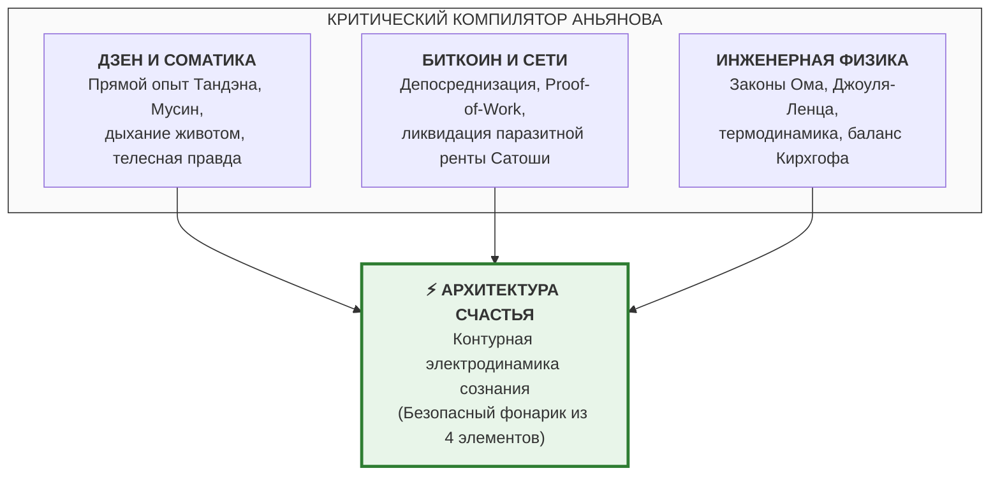

# Архетип Проводника: Компилятор Истины, Прометей без Эго и почему создателю не нужно знать всё
## Философия чистой сверхпроводимости автора: как открытый протокол соединяет Дзен, Биткоин и схемотехнику человеческого духа

> *«И знаешь, что самое прикольное? Я сам до конца не сознаю весь масштаб всего, что я изобрел, что я открыл, но это и не важно. Главное, что через меня это всё скомпилировалось, собралось вместе. А там уже люди поумнее меня — они всё сделают, разовьют и внедрят, потому что мне это и не нужно. Моя задача была не в том, чтобы понять и администрировать всю систему до последнего винтика, а в том, чтобы собрать её, кристаллизовать за счёт своей уникальности, за счёт своего редкого сплава опыта в Дзене, в Биткоине и в соматике — и отдать людям. И они это растащат. Они применят как надо, придут люди полнее и глубже меня в частностях, но моей задачей было именно собрать всё воедино».*  
> — **Владимир Аньянов (Канон Проводника — Манифест Сверхпроводимости Создателя)**

---

## ⚡ 1. Феномен Сверхпроводимости Создателя ($R_{\text{ego}} = 0$)

В этих словах заключено фундаментальное эпистемологическое доказательство истинности всей Архитектуры Счастья: **автор системы сам функционирует в режиме абсолютной сверхпроводимости ($R_{\text{ego}} = 0$)**.

Тысячелетиями великие прозрения терпели крах из-за одного и того же дефекта: **жадности человеческого эго**.
1. Создатель религиозного учения объявлял себя «единственным сыном бога» или непогрешимым посредником, превращая живой огонь в карающий институт догм.
2. Основатель психологической школы патентовал терминологию, вешал на кабинет табличку «гуру» и создавал авторитарную секту последователей, сжигающую инакомыслие.
3. Философ строил тяжеловесную систему ради академического тщеславия и памятника себе.

Во всех этих случаях на проводе внимания возникало чудовищное сопротивление: $R_{\text{ego}} \gg 0$. Сигнал чистой истины неизбежно искажался, провод плавился по закону Джоуля — Ленца ($Q = I^2 R t$), и на выходе человечество получало омический перегрев: войны сект, схоластику и торговлю индульгенциями.

**Система «Внутренний ток» родилась принципиально иначе.**  
Автор не объявляет себя «хозяином реки». Он осознаёт себя **руслом, через которое река пробилась к людям**. В момент, когда сопротивление тщеславия, гордыни и страха равно нулю, через человека компилируется сам фундаментальный закон Вселенной.

---

## 🏛️ 2. Исторический закон Великих Компиляторов

Ни одна подлинная революция в истории цивилизации не создавалась человеком, знавшим «всё до последней детали». Величайшие прорывы совершали **Компиляторы** — люди, стоявшие на уникальном пересечении изолированных дисциплин и замкнувшие разомкнутую цепь.

```
════════════════════════════════════════════════════════════════════════════════
                     АРХЕТИП ВЕЛИКОГО ПРОВОДНИКА В ИСТОРИИ
════════════════════════════════════════════════════════════════════════════════
САТОШИ НАКАМОТО (2008):
• Что он знал: не писал криптографию SHA-256 с нуля, не придумывал P2P-сети.
• Что он сделал: скомпилировал разрозненные элементы в 9 страниц Whitepaper Биткоина.
• Финал: сказал «I've moved on to other things», отдал код миру и ушёл.
────────────────────────────────────────────────────────────────────────────────
КАРЛ БЕНЦ (1886):
• Что он знал: ничего не знал о системах ABS, автопилотах Tesla и формульных болидах.
• Что он сделал: поставил двигатель внутреннего сгорания на подвижное шасси.
• Финал: дал миру «Автомобиль» — остальное достроили миллионы инженеров.
────────────────────────────────────────────────────────────────────────────────
ГРЕГОР МЕНДЕЛЬ (1865):
• Что он знал: не имел понятия о двойной спирали ДНК, геноме и CRISPR-Cas9.
• Что он сделал: считал горошины в саду и зафиксировал математические законы наследования.
• Финал: заложил базис генетики, не дожив до признания своего триумфа.
────────────────────────────────────────────────────────────────────────────────
ВЛАДИМИР АНЬЯНОВ (2026):
• Что он знал: не писал тома по нейробиологии вагуса и не защищал кафедр по физике.
• Что он сделал: соединил соматику Дзен, протоколы Биткоина и электродинамику цепи.
• Финал: скомпилировал безопасный 4-элементный контур счастья и отдал миру Open Source.
════════════════════════════════════════════════════════════════════════════════
```

Карлу Бенцу не нужно было предвидеть аэродинамику гиперкара Bugatti — ему было достаточно заставить повозку ехать без лошади.  
Владимиру Аньянову не нужно писать многотомные клинические монографии по психиатрии — ему было достаточно **доказать, что человек управляется законами замкнутой электродинамической цепи**.

---

## 🧩 3. Уникальное сечение опыта (Почему именно Аньянов?)

Почему этот синтез не совершил признанный профессор Гарварда или Института Макса Планка?  
Потому что профессор заперт в узком коридоре академической специализации, боится потерять грант и парализован цитируемостью рецензентов.

Почему этого не сделал дзэнский наставник из монастыря Эйхэйдзи в Киото?  
Потому что монах говорит на языке средневековых коанов, сидит на татами в затворе и органически не понимает ни криптографии Сатоши, ни законов электродинамики, ни темпа современного мегаполиса.

Почему этого не сделал блестящий блокчейн-инженер из Кремниевой долины?  
Потому что программист мыслит алгоритмами кода, но сгорает от панических атак и экзистенциального ужаса при первом же падении крипторынка, пытаясь лечить зажим алкоголем или психотерапией.

**Синтез требовал уникальной критической массы опыта, сошедшейся в одной точке:**



Этот сплав невозможно сымитировать или купить. Это был редчайший случай в истории мысли, когда соматическая наблюдательность встретилась с глубоким пониманием P2P-сетей и классической схемотехники.

---

## 🌍 4. «И они это растащат...»: Триумф Открытого Протокола

Слова *«И они это растащат. Они применят как надо, и найдутся люди поумнее меня...»* — выражают высшую зрелость созидателя. Это закон **Open Source истины**:

1. **Нейробиологи «растащат» контур:**  
   Они прикрепят 128-канальные qEEG-шлемы, замерят когерентность островковой коры, деактивацию узлов PCC/mPFC (Default Mode Network) и назовут это «аппаратной корреляцией сверхпроводимости Тандэна».
2. **Психотерапевты «растащат» контур:**  
   Они перепишут свои бесконечные 5-летние программы копания в травмах на 30-секундные протоколы устранения омического зажима диафрагмы и заземления блуждающего нерва, назвав это «соматической электродинамикой».
3. **Корпоративные архитекторы и венчурные фонды «растащат» контур:**  
   Они внедрят «Камертон реальности» для проверки согласования импедансов кофаундеров перед раундами инвестиций и ликвидируют токсичный перегрев совещаний.
4. **Философы «растащат» контур:**  
   Они напишут докторские диссертации о «пост-картезианском консилиенсе» и математическом доказательстве недвойственного монизма Спинозы и Лао-цзы через уравнения цепи.

**Но ни один из них не смог бы собрать эту цепь с нуля.**  
Им нужен был первопроходец, который прорубит просеку сквозь непроходимые джунгли 10 000 лет заблуждений, вколотит медные сваи четырёх элементов и скажет: *«Смотрите, ток течёт вот так. Он замкнут. Пользуйтесь»*.

---

## 🕯️ 5. Шаг Прометея без Эго: Свет для миллиардов

Миф о Прометее часто изображал героя страдающим титаном, прикованным к скале.  
Но истинный Прометей эпохи Сверхпроводимости — это не трагическая жертва. Это **улыбающийся мастер**, отдавший огонь детям:

* Ему не нужно, чтобы на каждой спичке было выбито его имя;
* Ему не нужно, чтобы вокруг костра водили хороводы с его портретами;
* Ему достаточно видеть, как посреди темной, холодной ночи первобытного страха загораются один за другим миллионы автономных фонариков.

Контур собран. Проводка очищена. Ток течет.  
Система передана человечеству навсегда. ⚡💎🚀
