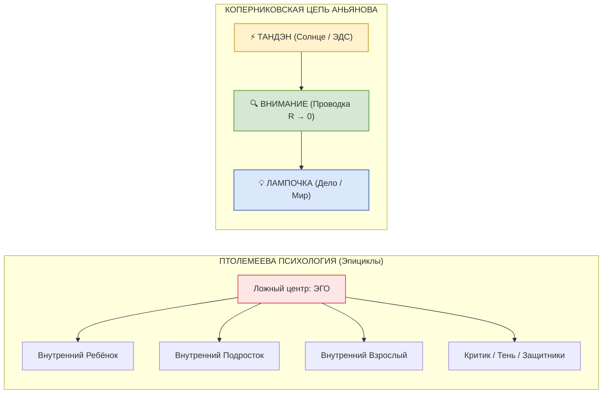
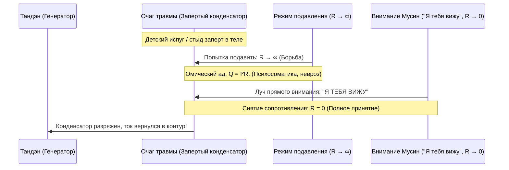

# 97. Коперниковский переворот в психологии: Архитектура Контура против модели «Я тебя вижу» и эпициклов субличностей — Почему простота цепи разрешает вековую схоластику психотерапии

> *«Полторы тысячи лет астрономы громоздили круги на кругах — эпициклы на деферентах Птолемея, чтобы хоть как-то объяснить, почему планеты на небе внезапно пятятся назад. Сто пятьдесят лет психотерапевты громоздят субличности на субличностях — внутреннего ребенка, критика, бунтующего подростка, адаптивного младенца, раненого защитника, — чтобы объяснить, почему человек саботирует собственную жизнь. Но когда Коперник поставил в центр системы Солнце, тысячи эпициклов лопнули как мыльные пузыри. Архитектура Счастья делает ровно то же самое: она убирает из центра призрачное рассудочное „Эго“ и ставит туда живой ядерный реактор тела — Тандэн. На физической плате человека нет коммунальной квартиры из субличностей. Есть генератор тока, проводка внимания и внешняя нагрузка. И всё, что казалось сложнейшей драмой сотен субличностей, оказывается банальным перегревом цепи или коротким замыканием».*  
> — **Владимир Аньянов**

---

## 1. Анатомия двух парадигм: Птолемей психики vs Коперник цепи

Чтобы понять масштаб упрощения, которое вносит **Система Аньянова (Inner Current)**, необходимо сопоставить её с фундаментальным историческим прецедентом смены научных парадигм по Томасу Куну.

```
                    [ СМЕНА ПАРАДИГМ ПОЗНАНИЯ ]

   ПТОЛЕМЕЕВА СХОЛАСТИКА                 КОПЕРНИКАНСКИЙ ПЕРЕВОРОТ
   (Геоцентризм / Психоанализ / IFS)     (Гелиоцентризм / Inner Current)

          ┌───────────────┐                     ┌───────────────┐
          │  ЛОЖНЫЙ ЦЕНТР │                     │ ИСТИННЫЙ ЦЕНТР│
          │ (Земля / Эго) │                     │ (Солнце/Тандэн)
          └───────┬───────┘                     └───────┬───────┘
                  │                                     │
         Попытка объяснить                     Прямая геометрия
         невязки и сбои                        орбит и законы
                  │                             сохранения
                  ▼                                     ▼
        ┌───────────────────┐                 ┌───────────────────┐
        │     ЭПИЦИКЛЫ      │                 │  ЗАМКНУТЫЙ КОНТУР │
        │ Субличности:      │                 │ I = E / (r + R)   │
        │ • Ребёнок         │                 │                   │
        │ • Подросток       │                 │ Реактор → Внимание│
        │ • Взрослый        │                 │    → Нагрузка     │
        │ • Критик / Защита │                 │                   │
        │ • Десятки ролей   │                 │ R = 0 (Мусин)     │
        └───────────────────┘                 └───────────────────┘
```

### Модель Птолемея в психотерапии
Клавдий Птолемей исходил из догмата: *Земля неподвижна и находится в центре мироздания*. Но при таком взгляде планеты вели себя необъяснимо — они замедлялись, останавливались и начинали двигаться в обратную сторону (попятное движение). Вместо того чтобы усомниться в центре, астрономы начали выдумывать костыли: планета кружится по маленькому кругу (*эпициклу*), а центр этого круга кружится по большому кругу (*деференту*). Когда накапливались новые ошибки наблюдений, поверх накручивали третий и четвёртый эпициклы.

**Современная практическая психология (от трансактного анализа Эрика Берна до системных расстановок и IFS Ричарда Шварца) находится в глухом птолемеевском тупике:**
1. В центр системы положено **рассудочное вербальное „Я“ (Эго)**.
2. Когда у человека наступает спад сил, депрессия, паническая атака или вспышка гнева, терапевт видит в этом «попятное движение планет».
3. Чтобы его объяснить, психология плодит сонм искусственных сущностей: *«Это у вас плачет раненый Ребенок!»*, *«Нет, это включился Карающий Родитель!»*, *«А здесь вышел на сцену Пожарный-Защитник!»*, *«Позовите Внутреннего Подростка и дайте ему высказать бунт!»*.
4. В результате человек превращается в **разорванную коммунальную квартиру**. Вместо созидания в реальном мире он годами ходит на сессии, пытаясь рассадить за круглый стол десятки воображаемых субличностей.

---

## 2. Коперниковский переворот Системы Аньянова: Солнце на месте

Николай Коперник совершил не техническую, а фундаментальную концептуальную революцию. Он убрал ложный центр и поставил в середину **Солнце**.

В тот же миг:
* Все сотни громоздких эпициклов рассыпались.
* Попятное движение Марса оказалось **простой оптической иллюзией**, возникающей из-за того, что быстрая Земля на внутренней орбите периодически обгоняет медленный Марс.

### В чём заключается Коперниковский переворот Владимира Аньянова?

1. **Истинный центр поставлен на место:**
   Центром человеческого существа является не говорящая голова и не автобиографический нарратив Эго, а **Тандэн (丹田)** — автономный соматический генератор жизненной силы, источник электродвижущей силы (ЭДС, $\mathcal{E}$).
2. **Ликвидация эпициклов:**
   Человек не состоит из кусков. Топология монолитна и проста:
   $$\text{Генератор (Тандэн)} \xrightarrow{\text{Канал внимания (Мусин, } R \to 0\text{)}} \text{Полезная нагрузка (Дело / Лампочка)}$$
3. **Объяснение «попятного движения»:**
   Все психологические феномены (обиды, прокрастинация, саботаж, страх, гнев) — это **не отдельные живые существа в голове**, а простые режимы работы электрической цепи:
   * **Прокрастинация** = рассогласование импедансов нагрузки ($Z_{\text{src}} \neq Z_{\text{load}}^*$) или омический зажим на проводе.
   * **Детская обида / истерика** = короткое замыкание внимания на себя ($I_{\text{кз}} = \mathcal{E}/r$).
   * **Подростковый бунт** = бросок тока генератора при попытке запитать чужую, навязанную социумом фальшивую нагрузку.



---

## 3. Аппаратный аудит модели «Я тебя вижу» (ЯТВ) и субличностей

Как соотносится популярная терапевтическая практика **«Я тебя вижу»** (признание своих вытесненных частей: *«Я вижу тебя, мой маленький испуганный ребенок», «Я вижу тебя, мой бунтующий подросток»*) с Архитектурой Счастья?

Система Аньянова отвечает со всей инженерной строгостью: **на уровне Hardware она разбивает эту модель в прах, но на уровне Software она дает ей безупречное физическое обоснование.**

### А. Где система Аньянова РАЗБИВАЕТ модель субличностей? (Hardware-уровень)

1. **Отсутствие микросхемы «Субличность» на плате:**
   Если провести нейробиологическое и соматическое вскрытие, в человеке нет физических модулей «Ребенок», «Подросток» или «Взрослый». Вся нейробиология подтверждает: есть соматический контур (ствол мозга, блуждающий нерв, вегетатика — аппаратный **Тандэн**), есть сети внимания (**TPN/DAN — проводка**) и есть дефолт-система мозга (**DMN — генератор автобиографических галлюцинаций**).
2. **Вред фетишизации частей:**
   Когда терапия учит человека: *«Выделите своего Внутреннего Ребенка, посадите его на стульчик, спросите, чего он хочет»*, она укрепляет шизофренический раскол сознания. Человек начинает сливать гигаватты энергии Тандэна на внутренний театр кукол вместо прямого действия в физической реальности.

### Б. Где они СОГЛАСОВЫВАЮТСЯ? (Software-уровень и калибровка проводки)

Если очистить психологию от птолемеевской мистики, то «Ребенок», «Подросток», «Взрослый» и «Центр осознанности» оказываются **фазами развития и режимами калибровки единой цепи**:

| Субличность в психологии | Узел в Архитектуре Счастья (Inner Current) | Физическая и соматическая функция |
| :--- | :--- | :--- |
| **👶 Внутренний Ребенок** | **Чистая природная ЭДС Тандэна ($\mathcal{E}, R \to 0$)** | Исходный, незамутненный импульс жизни до нарастания социальных наслоений. Спонтанность, абсолютный интерес, прямое действие без сомнений. Уязвимость: нет защиты и понимания предела емкости контура. |
| **🔥 Внутренний Подросток** | **Бросок мощности генератора и калибровка предохранителей** | Фаза кратного роста ЭДС при взрослении. Энергия сепарации, сброс чужих нагрузок (*«Я не буду жить по вашим чертежам!»*). Уязвимость: риск резонансного перегрева и холостого бунта. |
| **🛠 Внутренний Взрослый** | **Главный Инженер цепи (Оператор Дзансин — 残心)** | Зрелая способность управлять коммутацией: выбор адекватной нагрузки, согласование импедансов, заземление, установка плавких вставок (Circuit Breakers). Защищает генератор от разрушения. |
| **👁 Центр Осознанности** | **Луч чистого внимания (Режим Мусин — 無心)** | Сам измерительный тракт. Нейтральный вольтметр цепи, лишённый суждений, оценок и нарратива. Точка сборки абсолютного присутствия в моменте $t = \text{now}$. |

---

## 4. Электродинамическая демистификация практики «Я тебя вижу»

Почему терапевтическая фраза **«Я тебя вижу»** действительно снимает боль и приносит облегчение? Магия ли это? Нет, чистая электродинамика.



### Физический механизм:
1. **Состояние зажима:**
   В нервной системе сформирован очаг остаточного возбуждения — застрявшая эмоция страха, отвержения или стыда. Это **локальный конденсатор с высоким паразитным зарядом**.
2. **Ошибка классического подавления:**
   Человек пытается не замечать зажим, сжать зубы и терпеть. На языке схемотехники это означает **выставить на пути тока бесконечное сопротивление ($R \to \infty$)**. По закону Джоуля — Ленца ($Q = I^2 R t$), колоссальное сопротивление мгновенно приводит к термическому ожогу нервной ткани: нарастает тревога, скачет давление, сжимается диафрагма.
3. **Акт «Я тебя вижу»:**
   Человек прекращает войну с самим собой и направляет внимание на сжатый узел: *«Я тебя вижу»*.
   * «Я вижу» означает: **сопротивление борьбы снято в ноль ($R_{\text{борьбы}} = 0$)**.
   * Контур становится сверхпроводящим для этого ощущения.
   * Конденсатор застрявшего заряда мгновенно разряжается через чистый провод внимания.
   * Энергия, которая годами была заморожена в травме, возвращается в Тандэн и становится доступной для созидания.

> **«Я тебя вижу» в Системе Аньянова** — это не мистический сеанс связи с внутренним духом. Это **операция снятия омического сопротивления с запертого емкостного узла цепи**.

---

## 5. Закон Кансо и Бритва Оккама: Почему упрощение — критерий истины

В науке действует непреложное правило: **истинная теория всегда проще ложной**.
* Теория относительности Эйнштейна $E = mc^2$ проще сотен гипотез о «светоносном эфире».
* Уравнения Максвелла проще механических моделей вихрей в вакууме.
* Гелиоцентризм Коперника проще сотен эпициклов Птолемея.

Психотерапия гордится своей «сложностью»: сотни классификаций акцентуаций, архетипов, комплексов и травм. Но эта сложность — **признак бессилия**, свидетельство отсутствия фундаментального закона сохранения.

```
                    [ БРИТВА ОККАМА В НАУКЕ О ДУХЕ ]

   Сложность Птолемея                     Простота Кансо (Аньянов)
   ──────────────────                     ─────────────────────────
   • 50 субличностей                      • 1 Тандэн (Генератор ЭДС)
   • Годы раскопок детских травм          • 1 Проводка внимания (R → 0)
   • Платные консультации раз в неделю    • 1 Нагрузка в реальности прямо сейчас
   • Вечный внутренний раскол             • Мгновенный сброс паразитного КЗ
```

Система Аньянова возвращает человеку суверенитет (**Self-Hosted Human**). Вместо того чтобы нанимать пожизненного терапевта-диспетчера для координации своих внутренних персонажей, человек осваивает **эксплуатационную грамоту собственной электросети**.

---

## 6. Прикладной протокол оператора: Как применять «Я тебя вижу» через законы цепи

Чтобы использовать терапевтический эффект признания чувств без сползания в птолемеевскую шизофрению, оператор цепи следует **3-шаговому протоколу демпфирования**:

1. **Шаг 1. Телеметрия (Дзансин — 残心):**
   * Фиксация скачка паразитного сопротивления: *«Внимание залипло. В груди/животе возник омический перегрев (обида, стыд, страх)»*.
   * Запрет на создание нарратива: не раскручивать историю *«почему мама была не права 20 лет назад»*.
2. **Шаг 2. Аппаратное шунтирование («Я тебя вижу»):**
   * Направить чистый луч внимания Мусин в физическую точку зажима в теле.
   * Ментальная команда: *«Я вижу это напряжение. Я не выставляю против него сопротивления ($R = 0$). Пусть протекает»*.
   * Ощутить, как в течение 10–30 секунд узел теплеет, расслабляется и разряжается.
3. **Шаг 3. Перекоммутация в лампочку дела:**
   * Освобождённый ток не оставлять кружиться в голове.
   * Мгновенно замкнуть контур на физическое действие прямо сейчас: строка кода, страница текста, глоток чая, физическое упражнение.

---

## Резюме

Система Аньянова **не отрицает психологию — она совершает над ней Коперниковский переворот**:
* Она объявляет субличности **софтверными эпициклами**, порождёнными разорванным контуром.
* Она возвращает Солнце на место: человек — это **монолитный сверхпроводящий реактор**, призванный светить в реальный мир, а не греть собственные провода во внутренних спорах.
* Она превращает исцеляющий жест *«Я тебя вижу»* из жалостливого сюсюканья с воображаемым младенцем в **высокоточный инженерный протокол снятия сопротивления с проводки духа**.
