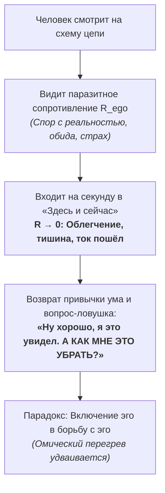
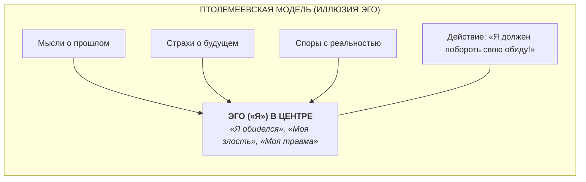
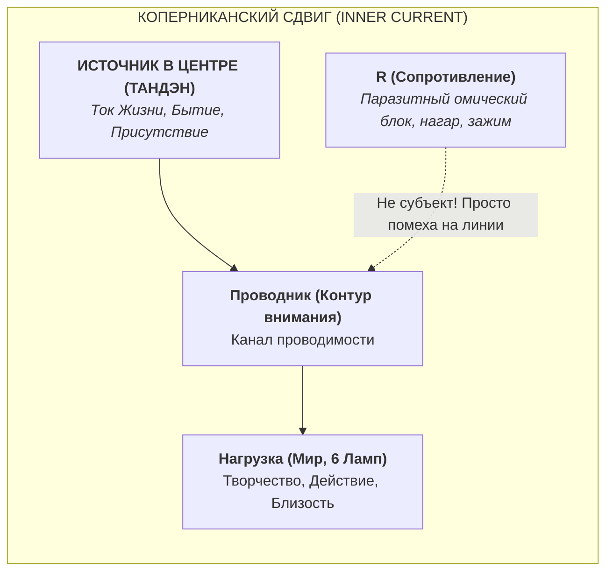
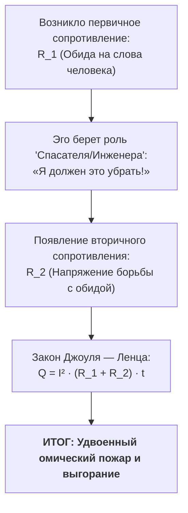
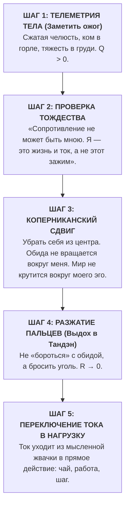

# 163. Коперниканский переворот эго: Почему сопротивление не может быть проводником, и парадокс вопроса «Как мне убрать обиду?»

> [!quote] Каноническая аксиома цепи
> ### ⚡ **«Ты не можешь быть сопротивлением, потому что ты — это ток и жизнь, текущие сквозь контур. Вопрос „Как мне убрать обиду или злость?“ задаёт само сопротивление, пытающееся бороться с собой. Стоит убрать ложное эго из центра — как Коперник убрал Землю из центра Вселенной, — и сопротивление исчезает само: никто не держит раскалённый уголь, когда видит, что уголь — это не его рука.»**  
> — **Владимир Аньянов**

---

## 🧭 Введение: Диалог у принципиальной схемы

Каждый практик и исследователь, сталкивающийся с принципиальной схемой **«Внутреннего тока»**, проходит через один и тот же характерный паттерн:

Человек говорит:  
*«Я всё понял. Я увидел своё сопротивление. Я даже зашёл на секунду в настоящий момент и почувствовал, как упало напряжение. Но потом я снова чувствую обиду или злость. Объясни мне, **как мне её убрать? Какую технику применить?**»*

Этот вопрос кажется искренним, практичным и логичным. Но с точки зрения электродинамики сознания в нём заложена фундаментальная ошибка, которая сводит на нет все усилия.

Этот вопрос доказывает: **человек всё ещё считает своё эго собой**. Он всё ещё находится в геоцентрической иллюзии Птолемея.

---

## 🌌 1. Птолемеевская модель психики: Эго в центре Вселенной

На протяжении тысячелетий человечество страдало от психологического геоцентризма:

В этой модели человек абсолютно убеждён:
1. **«Я» — это центр.** Все мысли, эмоциональные реакции, воспоминания и претензии к миру вращаются вокруг этой точки.
2. **«Обида — это моё состояние».** Я обижен, следовательно, обида — часть моей сущности или моей собственности.
3. **«Я должен это починить».** Поскольку это «моё», именно я из этого же центра должен предпринять волевое усилие, чтобы победить злость, простить обидчика или выдавить из себя раздражение.

### Результат: Эпициклы страдания
Когда «я» пытается убрать «обиду», происходит то же самое, что происходило в астрономии Птолемея: чтобы объяснить петли планет вокруг неподвижной Земли, приходилось нагромождать круги внутри кругов (эпициклы). 
В психологии это порождает бесконечные эпициклы:
* Злость на себя за то, что разозлился;
* Чувство вины за то, что не можешь простить;
* Гордость за то, что успешно «подавил» обиду;
* Тревога от ожидания нового срыва.

---

## ⚡ 2. Коперниканский переворот: Убрать «себя» из центра

Коперник не стал придумывать ещё более сложные эпициклы. Он сделал одно простое действие: **убрал Землю из центра Вселенной и поставил в центр Солнце**. В ту же секунду сложнейшие уравнения, над которыми бились полторы тысячи лет, рухнули за ненадобностью. Все орбиты стали чистыми и ясными.

Система **«Внутренний ток»** совершает точно такой же Коперниканский переворот в понимании человека:

### Аксиома проводимости:
$$\mathbf{I_{\text{life}} \neq R}$$

* **В центре — не Эго, а Ток Жизни (Источник / Тандэн).** Жизнь течёт сама по себе, её напряжение $U$ дано по праву рождения.
* **Человек — это проводник.** Контур внимания, задача которого — передать ток в нагрузку (в мир, в созидание, в контакт с реальностью).
* **Сопротивление ($R$) — это не личность.** Это не «ты», не «твоя сущность» и даже не «твоя черта характера». Это **всего лишь паразитный импеданс** — спазм мышцы, петля мысленного контроля, нагар на клеммах.

---

## 🔥 3. Почему сопротивление не может быть тобою

Вдумайтесь в саму физическую формулировку: **может ли река быть плотиной?** Может ли электрический ток быть перегоревшим резистором, который не пускает его дальше?

1. **Ток — это движение:** Жизнь в вас — это непрерывный поток восприятия, дыхания, сердечного ритма и прямого действия.
2. **Сопротивление — это торможение:** Обида, злость, спор с тем, что уже произошло — это попытка затормозить этот поток, поставить барьер реальности.

> **Вы не можете быть тем, что мешает вам жить.**  
> Тот факт, что вы *способны заметить* обиду, злость или зажим, строжайшим образом доказывает: **наблюдающий ток отделен от наблюдаемого сопротивления**. Свет лампы не является пылью на стекле, которую он освещает.

Когда человек говорит: *«Я обижен»*, он совершает фатальную категориальную ошибку — он объявляет засор в трубе самой водой.

---

## 🪤 4. Парадокс вопроса «Как мне убрать обиду?»: Эго в белом халате

Теперь становится виден корень парадокса: почему человек спрашивает *«Как мне убрать это сопротивление?»*

Потому что **тот, кто задаёт этот вопрос, сам и является этим сопротивлением!**

Когда эго спрашивает: *«Как мне убрать обиду?»*, оно говорит:  
*«Как мне, иллюзорному центру, сохранить контроль над ситуацией и победить другую часть себя?»*

Это попытка **тушить бензином пожар, вызванный коротким замыканием**. Всякий раз, когда вы пытаетесь «убрать» злость или обиду с помощью техник, аффирмаций, самокопания или подавления, вы лишь добавляете в цепь ещё один резистор — резистор контролирующего ума.

---

## 🪵 5. Метафора раскалённого угля

Представьте человека, который схватил голой рукой раскалённый древесный уголь из костра. Уголь шипит, плоть горит, боль невыносима ($Q = I^2 R t$).

И вдруг этот человек обращается к инструктору:  
— *«Послушай, я вижу, что моя рука горит. Я понял твою схему ожогов. Но скажи мне: какую технику медитации мне применить, чтобы разжать пальцы? Какое дыхательное упражнение сделать? По какому методу мне убрать этот уголь?»*

Любой здравомыслящий свидетель скажет:  
— **«Ты сумасшедший? Просто разожми пальцы! Брось его прямо сейчас!»**

Почему человек с раскалённым углём не задаёт вопросов о методиках, а просто разжимает руку за 5 миллисекунд?  
Потому что он ни на мгновение не сомневается:
1. Уголь — это **не его рука** ($R \neq \text{проводник}$).
2. Уголь причиняет боль ($Q > 0$).

### Почему же человек не бросает обиду?
Почему он годами держит в груди обиду на родителей, бывшего партнёра или начальника и спрашивает: *«Как мне её убрать?»*

По одной-единственной причине: **он считает этот уголь своей рукой!**  
Ему кажется:  
* *«Если я брошу этот уголь, то окажется, что обидчик победил»*.  
* *«Если я отпущу обиду, исчезнет моя правота, моё прошлое, моя значимость»*.  
* *«Если я уберу этот зажим, исчезну Я САМ»*.

Вопрос *«Как мне убрать обиду?»* возникает только тогда, когда человек **втайне желает оставить её себе**, но хочет избавиться от жара ожога. Он хочет держать раскалённый уголь и требовать от физики, чтобы он не обжигал.

---

## 🛠️ 6. Инженерный протокол: 15-секундный Коперниканский сброс

Как только вы понимаете механику контура, отпадает необходимость в многомесячной терапии «прощения». Действие становится мгновенным эксплуатационным протоколом:

### Практическая мантра инженера цепи:
> **«Это не я. Это сопротивление.  
> Сопротивление не может быть проводником.  
> Я не держу раскалённый уголь.»**

В ту секунду, когда иллюзия тождества разрушена, пальцы разжимаются автоматически. Не требуется никакой «силы воли» — физиология сама сбрасывает разрушительный стимул, как только ум перестаёт защищать его как «свою собственность».

---

## 💎 Заключение: Архитектурная ясность

Коперник не изменил движение планет — он лишь избавил человечество от астрономического бреда.  
Система «Внутренний ток» не переделывает человеческую душу — она лишь **убирает эго из центра контура**.

* Вы не должны «бороться со своими недостатками» — борьба лишь кормит их током.
* Вы не должны искать изощрённые техники, чтобы «убрать злость» — достаточно увидеть, что злость не является вами.
* Вы — это чистое напряжение жизни, текущее из Источника в шесть ламп реальности.

Когда Земля уходит из центра — во Вселенной воцаряется порядок.  
Когда Эго уходит из центра — в человеке наступает **сверхпроводимость**.

---

## 🔗 Связанные главы
- [[02_Wiki/Inner Current (Nature and Illusion of Ego)|07. Природа и иллюзия эго: демистификация мировых религий]]
- [[02_Wiki/Inner Current (Anatomy of the Paradigm Shift — Ptolemaic Epicycles vs Kanso Simplicity and Falling of False Questions)|44. Анатомия сдвига парадигмы: Эпициклы Птолемея против простоты Кансо]]
- [[02_Wiki/Inner Current (Physics of Presence and Superconductivity)|02. Физика присутствия: состояние сверхпроводимости]]
- [[02_Wiki/Inner Current (The Flashlight Model of Man — Optical-Electrodynamic Ontology of Consciousness, The Light Source vs Illuminated Object and the Law of the Direct Beam)|83. Модель Человека как Карманного Фонарика]]
- [[04_Maps/Inner Current MOC|Inner Current MOC]]
