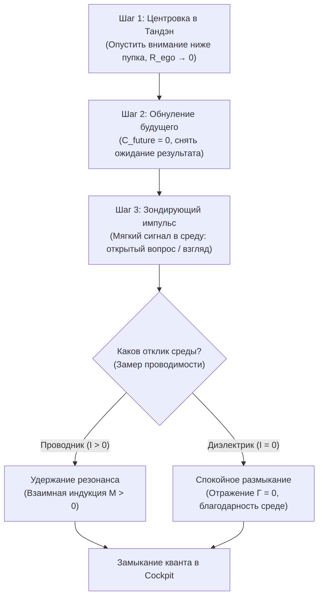

# Протокол Дэай (出会い): Полевой стенд соприкосновения с реальностью и согласование импедансов $Z_{\text{src}} = Z_{\text{load}}$
### Преодоление страха социального отвержения, физика прямого контакта и закон максимальной передачи мощности в мир

> [!quote] Главная формула Протокола Дэай
> $$\Gamma = \frac{Z_{\text{load}} - Z_{\text{src}}}{Z_{\text{load}} + Z_{\text{src}}} = 0 \iff Z_{\text{src}} = Z_{\text{load}} \implies P_{\text{transferred}} = P_{\max}$$
> *«Мир отвергает не тебя — эго не существует, отвергать некого. Мир отражает стоячую волну твоего несогласованного сопротивления. Устрани избыточное давление эго ($R_{\text{ego}} \to 0$), настрой импеданс под проводимость среды — и ток потечёт беспрепятственно.»*

---

## 1. Онтология Дэай: Зачем контуру выход в реальность

В классической электродинамике источник электрической энергии (генератор $\mathcal{E}$), не подключённый к внешней нагрузке, находится в **режиме холостого хода** (Open Circuit, $I = 0$). Каким бы мощным ни был генератор Тандэн, если клеммы разомкнуты:
1. Энергия не совершает полезной работы ($P = 0$).
2. Внутреннее напряжение накапливается в виде статического потенциала.
3. Без заземления и замыкания цепи через внешний объект ум неизбежно замыкает цепь **на самого себя** — возникает разрушительное паразитное короткое замыкание на Эго ($R_{\text{ego}} > 0$), приводящее к омическому самосожжению и тревоге.

**Дэай (出会い, япон. «встреча, соприкосновение лицом к лицу»)** в Системе Аньянова — это не бытовое романтическое знакомство и не праздное общение. **Дэай — это физическая точка замыкания первичного контура сознания на сопротивление реального мира.**

| Режим цепи | Состояние сознания | Физический эффект |
| :--- | :--- | :--- |
| **Холостой ход ($I = 0$)** | Одиночество, страх проявиться, затворничество | Застой заряда, ментальная прокрастинация |
| **Короткое замыкание ($R_{\text{ego}} \gg 0$)** | Навязчивые размышления о себе, обида, нарциссизм | Омический перегрев проводки ($Q = I^2 R t$), паника |
| **Замкнутый контур Дэай ($Z_{\text{src}} = Z_{\text{load}}$)** | Прямой контакт с человеком, рынком, задачей | Сверхпроводимость, поток, индукция радости |

Дэай — это **Этап 2** в великом 4-тактном цикле познания:
$$\text{Этап 0 (Тандэн)} \to \text{Этап 1 (R\&D / Схема)} \to \mathbf{\text{Этап 2 (Дэай / Полевой стенд)}} \to \text{Этап 3 (YouTube / Индукция)} \to \text{Этап 4 (Возврат)}$$

---

## 2. Теорема Якоби и Согласование Импедансов ($Z_{\text{src}} = Z_{\text{load}}$)

Почему подавляющее большинство людей испытывают мучительное трение при попытке проявиться в социуме (заговорить с незнакомым человеком, продать продукт, опубликовать смелую мысль)?

В радиотехнике и электродинамике этот феномен строго описывается **Теоремой о передаче максимальной мощности (закон Якоби)** и формулой коэффициента отражения волновода:

$$\Gamma = \frac{Z_{\text{load}} - Z_{\text{src}}}{Z_{\text{load}} + Z_{\text{src}}}$$

Где:
- $Z_{\text{src}}$ — комплексный импеданс источника (психическое состояние оператора).
- $Z_{\text{load}}$ — импеданс среды / собеседника / аудитории.
- $\Gamma$ — коэффициент отражения волны ($0 \le |\Gamma| \le 1$).

### Аномалия 1: Избыточное давление воли ($Z_{\text{src}} \gg Z_{\text{load}}$)
Оператор входит в контакт с натужным желанием «понравиться», «доказать», «продать во что бы то ни стало». В проводке колоссальное эго-сопротивление и завышенный потенциал ожидания ($C_{\text{future}} \gg 0$).
- **Результат:** Коэффициент отражения $\Gamma \to +1$. Среда отталкивает оператора, собеседник инстинктивно закрывается, возникает ощущение «духоты» и давления. Мощность в нагрузку не передается, волна отражается обратно в оператора и бьет по его нервной системе омическим ударом.

### Аномалия 2: Дефицитарная угодливость ($Z_{\text{src}} \ll Z_{\text{load}}$)
Оператор входит в контакт с позиции нищего («пожалуйста, одобрите меня, оцените меня, дайте мне кроху признания»).
- **Результат:** Коэффициент отражения $\Gamma \to -1$. Происходит фазовый переворот волны. Энергия оператора полностью поглощается средой без взаимной индукции, оператор чувствует себя опустошенным и обесточенным («из меня высосали все соки»).

### Норма Дэай: Сверхпроводящее согласование ($Z_{\text{src}} \approx Z_{\text{load}}$)
Оператор находится в режиме Тандэна ($R_{\text{ego}} \to 0$). У него нет корыстного требования к результату ($C_{\text{future}} = 0$). Он приходит не забирать, а предложить чистый ток внимания.
- **Результат:** Коэффициент отражения $\Gamma = 0$. Нет стоячей волны. Вся мощность передается в контакт. Возникает мгновенный раппорт, искренний интерес и взаимная индукция Фарадея ($M > 0$).

---

## 3. Физическая деконструкция страха отвержения (Rejection Dissolution)

Чего на самом деле боится человек, когда боится подойти к красивой девушке на беговой дорожке или предложить свой B2B-контракт крупному клиенту?

> [!warning] Ошибка эго-атрибуции
> Психология утверждает: *«Вы боитесь травмы отвержения, потому что ваша самооценка уязвима»*.  
> **Инженерный вердикт:** Это схоластическая ложь. Самооценки не существует, потому что **«Я» — это не субстанция, а иллюзорный узел в DMN мозга.**

Отвержение в контакте Дэай — это не приговор вашей личности. Это **чистое измерение электрического импеданса конкретного участка среды в данную миллисекунду времени**:
1. Если девушка на беговой дорожке надела наушники и отвернулась — её локальное сопротивление $R_{\text{load}} \to \infty$ (цепь разомкнута).
2. Если венчурный фонд ответил «нет» — волновод их инвестиционного фокуса имеет другую рабочую частоту ($\omega_{\text{fund}} \neq \omega_{\text{src}}$).

**Вольтметр не плачет, когда щупы касаются куска резины и показывают ноль ампер!** Он просто фиксирует: *«Диэлектрик. Ищем проводящий контакт дальше»*.

Когда оператор осознает, что отказ — это не трагедия духа, а показание мультиметра о проводимости среды, **страх отвержения растворяется навсегда за 0 секунд**.

---

## 4. 4-шаговый полевой алгоритм: Протокол Дэай (30 секунд)

Когда вы подходите к точке контакта (разговор, звонок, публикация, выступление):

1. **Шаг 1. Осадка в Тандэн (5 сек):**
   - Выдохнуть через рот. Опустить соматический центр тяжести на 3 пальца ниже пупка.
   - Разжать челюсти, расслабить глазные мышцы. Перевести систему из режима «Охотник / Жертва» в режим «Сверхпроводящий излучатель».
2. **Шаг 2. Разрядка конденсатора будущего ($C_{\text{future}} \equiv 0$, 5 сек):**
   - Произнести про себя: *«Будущего не существует. Мне ничего от этого человека/мира не нужно. Я просто замыкаю цепь прямо сейчас»*.
3. **Шаг 3. Зондирующий импульс (10 сек):**
   - Подать в среду чистый ток дружелюбия или вопрос без второго дна.
   - Слушать и смотреть на объект на 100% (режим Вольтметра), не мониторя собственное отражение в зеркале ума.
4. **Шаг 4. Снятие телеметрии без омического суда (10 сек):**
   - Если контакт пошел ($I > 0$) — наслаждайтесь совместной проводимостью.
   - Если среда закрыта ($I = 0$) — вежливо разомкните контакт без единой микросекунды обиды. Зафиксируйте в Cockpit: *«Стенд протестирован. Среда в данной точке — диэлектрик. Проводимость оператора сохранена на 100%»*.

---

## 5. Связь с Cockpit и Жизненным Результатом

Каждый успешный или неуспешный контакт Дэай переводит квант познания из **Этапа 1 (R&D / теория)** в **Этап 3 (YouTube / продукт)**. 

Вы больше не фантазируете о людях в кабинете — вы проверяете ток в реальном поле. Это делает вашу философию пуленепробиваемой, ваш контент — магнетическим, а ваш внутренний ток — непоколебимым.
